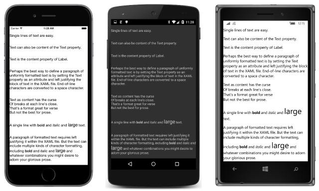

# Summary of Chapter 7. XAML vs. code

[ Download the sample](https://github.com/xamarin/xamarin-forms-book-samples/tree/master/Chapter07)

> [!NOTE]
> This book was published in the spring of 2016, and has not been updated since then. There is much in the book that remains valuable, but some of the material is outdated, and some topics are no longer entirely correct or complete.

Xamarin.Forms supports an XML-based markup language called the Extensible Application Markup Language or XAML (pronounced "zammel"). XAML provides an alternative to C# in defining the layout of the user interface of a Xamarin.Forms application, and in defining bindings between user-interface elements and underlying data.

## Properties and attributes

Xamarin.Forms classes and structures become XML elements in XAML, and properties of these classes and structures become XML attributes. To be instantiated in XAML, a class must generally have a public parameterless constructor. Any properties set in XAML must have public `set` accessors.

For properties of the basic data types (`string`, `double`, `bool`, and so forth), the XAML parser uses the standard `TryParse` methods to convert attribute settings to these types. The XAML parser can also easily handle enumeration types, and it can combine enumeration members if the enumeration type is flagged with the `Flags` attribute.

To assist the XAML parser, more complex types (or properties of those types) can include a [`TypeConverterAttribute`](xref:Xamarin.Forms.TypeConverterAttribute) that identifies a class that derives from [`TypeConverter`](xref:Xamarin.Forms.TypeConverter) which supports conversion from string values to those types. For example, the [`ColorTypeConverter`](xref:Xamarin.Forms.ColorTypeConverter) converts color names and strings, such as "#rrggbb", into `Color` values.

## Property-element syntax

In XAML, classes and the objects created from them are expressed as XML elements. These are known as *object elements*. Most properties of these objects are expressed as XML attributes. These are called *property attributes*.

Sometimes a property must be set to an object that cannot be expressed as a simple string. In such a case, XAML supports a tag called a *property element* that consists of the class name and property name separated by a period. An object element can then appear within a pair of property-element tags.

## Adding a XAML page to your project

A Xamarin.Forms Portable Class Library can contain a XAML page when it is first created, or you can add a XAML page to an existing project. In the dialog to add a new item, choose the item that refers to a XAML page, or `ContentPage` and XAML. (Not a `ContentView`.)

> [!NOTE]
> Visual Studio options have changed since this chapter was written.

Two files are created: a XAML file with the filename extension .xaml, and a C# file with the extension .xaml.cs. The C# file is often referred to as the *code-behind* of the XAML file. The code-behind file is a partial class definition that derives from `ContentPage`. At build time, the XAML is parsed and another partial class definition is generated for the same class. This generated class includes a method named `InitializeComponent` that is called from the constructor of the code-behind file.

During runtime, at the conclusion of the `InitializeComponent` call, all the elements of the XAML file have been instantiated and initialized just as if they had been created in C# code.

The root element in the XAML file is `ContentPage`. The root tag contains at least two XML namespace declarations, one for the Xamarin.Forms elements and the other defining an `x` prefix for elements and attributes intrinsic to all XAML implementations. The root tag also contains an `x:Class` attribute that indicates the namespace and name of the class that derives from `ContentPage`. This matches the namespace and class name in the code-behind file.

The combination of XAML and code is demonstrated by the [**CodePlusXaml**](https://github.com/xamarin/xamarin-forms-book-samples/tree/master/Chapter07) sample.

## The XAML compiler

Xamarin.Forms has a XAML compiler, but its use is optional based on the use of a [`XamlCompilationAttribute`](xref:Xamarin.Forms.Xaml.XamlCompilationAttribute). If the XAML is not compiled, the XAML is parsed at build time, and the XAML file is embedded in the PCL, where it is also parsed at runtime. If the XAML is compiled, the build process converts the XAML into a binary form, and the runtime processing is more efficient.

## Platform specificity in the XAML file

In XAML, the [`OnPlatform`](xref:Xamarin.Forms.OnPlatform`1) class can be used to select platform-dependent markup. This is a generic class and must be instantiated with an `x:TypeArguments` attribute that matches the target type. The [`OnIdiom`](xref:Xamarin.Forms.OnIdiom`1) class is similar but used much less often.

The use of `OnPlatform` has changed since the book was published. It was originally used in conjunction with properties named `iOS`, `Android`, and `WinPhone`. It is now used with child [`On`](xref:Xamarin.Forms.On) objects. Set the [`Platform`](xref:Xamarin.Forms.On.Platform) property to a string consistent with the public `const` fields of the [`Device`](xref:Xamarin.Forms.Device) class. Set the [`Value`](xref:Xamarin.Forms.On.Value) property to a value consistent with the `x:TypeArguments` attribute of the `OnPlatform` tag.

`OnPlatform` is demonstrated in the [**ScaryColorList**](https://github.com/xamarin/xamarin-forms-book-samples/tree/master/Chapter07/ScaryColorList) sample, so called because it contains blocks of nearly identical XAML. The existence of this repetitious markup suggests that techniques should be available to reduce it.

## The content property attributes

Some property elements occur quite frequently, such as the `<ContentPage.Content>` tag on the root element of a `ContentPage`, or the `<StackLayout.Children>` tag that encloses the children of `StackLayout`.

Every class is allowed to identify one property with a [`ContentPropertyAttribute`](xref:Xamarin.Forms.ContentPropertyAttribute) on the class. For this property, the property-element tags are not required. `ContentPage` defines its content property as `Content`, and `Layout<T>` (the class from which `StackLayout` derives) defines its content property as `Children`. These property element tags are not required.

The property element of `Label` is `Text`.

## Formatted text

The [**TextVariations**](https://github.com/xamarin/xamarin-forms-book-samples/tree/master/Chapter07/TextVariations) sample contains several examples of setting the `Text` and `FormattedText` properties of `Label`. In XAML, `Span` objects appear as children of the `FormattedString` object.

 When a multiline string is set to the `Text` property, end-of-line characters are converted to space characters, but the end-of-line characters are preserved when a multiline string appears as content of the `Label` or `Label.Text` tags:

 

## Related links

- [Full eBook text (PDF)](https://aka.ms/xamformsebook)
- [Chapter 7 samples](https://github.com/xamarin/xamarin-forms-book-samples/tree/master/Chapter07)
- [Chapter 7 F# sample](https://github.com/xamarin/xamarin-forms-book-samples/tree/master/Chapter07/FS/CodePlusXaml)
- [XAML Basics](~/xamarin-forms/xaml/xaml-basics/index.md)
