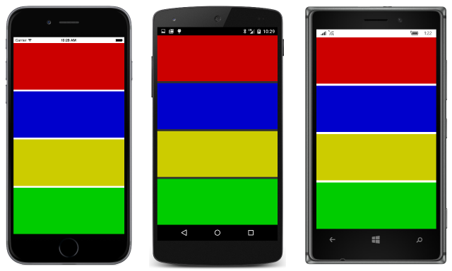

# Summary of Chapter 8. Code and XAML in harmony

[ Download the sample](https://github.com/xamarin/xamarin-forms-book-samples/tree/master/Chapter08)

> [!NOTE]
> This book was published in the spring of 2016, and has not been updated since then. There is much in the book that remains valuable, but some of the material is outdated, and some topics are no longer entirely correct or complete.

This chapter explores XAML more deeply, and particularly how code and XAML interact.

## Passing arguments

In the general case, a class instantiated in XAML must have a public parameterless constructor; the resultant object is initialized through property settings. However, there are two other ways that objects can be instantiated and initialized.

Although these are general-purpose techniques, they are mostly used in connection with MVVM View Models.

### Constructors with arguments

The [**ParameteredConstructorDemo**](https://github.com/xamarin/xamarin-forms-book-samples/tree/master/Chapter08/ParameteredConstructorDemo) sample demonstrates how to use the `x:Arguments` tag to specify constructor arguments. These arguments must be delimited by element tags indicating the type of the argument. For the basic .NET data types, the following tags are available:

- `x:Object`
- `x:Boolean`
- `x:Byte`
- `x:Int16`
- `x:Int32`
- `x:Int64`
- `x:Single`
- `x:Double`
- `x:Decimal`
- `x:Char`
- `x:String`
- `x:TimeSpan`
- `x:Array`
- `x:DateTime`

### Can I call methods from XAML?

The [**FactoryMethodDemo**](https://github.com/xamarin/xamarin-forms-book-samples/tree/master/Chapter08/FactoryMethodDemo) sample demonstrates how to use the `x:FactoryMethod` element to specify a factory method that is invoked to create an object. Such a factory method must be public and static, and it must create an object of the type in which it is defined. (For example the [`Color.FromRgb`](xref:Xamarin.Forms.Color.FromRgb(System.Double,System.Double,System.Double)) method qualifies because it is public and static and returns a value of type `Color`.) The arguments to the factory method are specified within `x:Arguments` tags.

## The x:Name attribute

The `x:Name` attribute allows an object instantiated in XAML to be given a name. The rules for these names are the same as for C# variable names. Following the return of the `InitializeComponent` call in the constructor, the code-behind file can refer to these names to access the corresponding XAML element. The names are actually converted by the XAML parser into private fields in the generated partial class.

The [**XamlClock**](https://github.com/xamarin/xamarin-forms-book-samples/tree/master/Chapter08/XamlClock) sample demonstrates the use of `x:Name` to allow the code-behind file to keep two `Label` elements defined in XAML updated with the current date and time.

The same name cannot be used for multiple elements on the same page. This is a particular problem if you use `OnPlatform` to create parallel named objects for each platform. The [**PlatformSpecificLabele**](https://github.com/xamarin/xamarin-forms-book-samples/tree/master/Chapter08/PlatformSpecificLabels) sample demonstrates a better way to do something like that.

## Custom XAML-based views

There are several ways to avoid repetition of markup in XAML. One common technique is to create a new XAML-based class that derives from [`ContentView`](xref:Xamarin.Forms.ContentView). This technique is demonstrated in the [**ColorViewList**](https://github.com/xamarin/xamarin-forms-book-samples/tree/master/Chapter08/ColorViewList) sample. The `ColorView` class derives from `ContentView` to display a particular color and its name, while the `ColorViewListPage` class derives from `ContentPage` as usual and explicitly creates 17 instances of `ColorView`.

Accessing the `ColorView` class in XAML requires another XML namespace declaration, commonly named `local` for classes in the same assembly.

## Events and handlers

Events can be assigned to event handlers in XAML, but the event handler itself must be implemented in the code-behind file. The [**XamlKeypad**](https://github.com/xamarin/xamarin-forms-book-samples/tree/master/Chapter08/XamlKeypad) demonstrates how to build a keypad user interface in XAML and how to implement the `Clicked` handlers in the code-behind file.

## Tap gestures

Any `View` object can obtain touch input and generate events from that input. The `View` class defines a [`GestureRecognizers`](xref:Xamarin.Forms.View.GestureRecognizers) collection property that can contain one or more instances of classes that derive from [`GestureRecognizer`](xref:Xamarin.Forms.GestureRecognizer).

The [`TapGestureRecognizer`](xref:Xamarin.Forms.TapGestureRecognizer) generates [`Tapped`](xref:Xamarin.Forms.TapGestureRecognizer.Tapped) events. The [**MonkeyTap**](https://github.com/xamarin/xamarin-forms-book-samples/tree/master/Chapter08/MonkeyTap) program demonstrates how to attach `TapGestureRecognizer` objects to four `BoxView` elements to create an imitation game:

But the **MonkeyTap** program really needs sound. (See [the next chapter](chapter09.md).)

## Related links

- [Full eBook text (PDF)](https://aka.ms/xamformsebook)
- [Chapter 8 samples](https://github.com/xamarin/xamarin-forms-book-samples/tree/master/Chapter08)
- [Chapter 8 F# sample](https://github.com/xamarin/xamarin-forms-book-samples/tree/master/Chapter08/FS/XamlKeypad)
- [Passing Arguments in XAML](~/xamarin-forms/xaml/passing-arguments.md)
