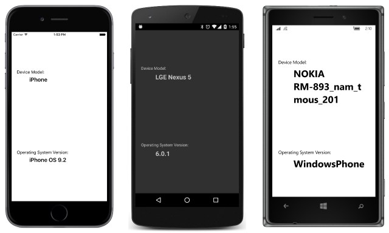

# Summary of Chapter 9. Platform-specific API calls

[ Download the sample](https://github.com/xamarin/xamarin-forms-book-samples/tree/master/Chapter09)

> [!NOTE]
> This book was published in the spring of 2016, and has not been updated since then. There is much in the book that remains valuable, but some of the material is outdated, and some topics are no longer entirely correct or complete.

It is sometimes necessary to run some code that varies by platform. This chapter explores the techniques.

## Preprocessing in the Shared Asset Project

A Xamarin.Forms Shared Asset Project can execute different code for each platform using the C# preprocessor directives `#if`, `#elif`, and `endif`. This is demonstrated in [**PlatInfoSap1**](https://github.com/xamarin/xamarin-forms-book-samples/tree/master/Chapter09/PlatInfoSap1):

However, the resultant code can be ugly and difficult to read.

## Parallel classes in the Shared Asset Project

A more structured approach to executing platform-specific code in the SAP is demonstrated in the [**PlatInfoSap2**](https://github.com/xamarin/xamarin-forms-book-samples/tree/master/Chapter09/PlatInfoSap2) sample. Each of the platform projects contains an identically named class and methods, but implemented for that particular platform. The SAP then simply instantiates the class and calls the method.

## DependencyService and the Portable Class Library

> [!NOTE]
> Portable Class Libraries have been replaced by .NET Standard libraries. All the sample code from the book has been converted to use .NET standard libraries.

A library cannot normally access classes in application projects. This restriction seems to prevent the technique shown in **PlatInfoSap2** from being used in a library. However, Xamarin.Forms contains a class named [`DependencyService`](xref:Xamarin.Forms.DependencyService) that uses .NET reflection to access public classes in the application project from the library.

The library must define an `interface` with the members it needs to use in each platform. Then, each of the platforms contains an implementation of that interface. The class that implements the interface must be identified with a [DependencyAttribute](xref:Xamarin.Forms.DependencyAttribute) on the assembly level.

The library then uses the generic [`Get`](xref:Xamarin.Forms.DependencyService.Get*) method of `DependencyService` to obtain an instance of the platform class that implements the interface.

This is demonstrated in the [**DisplayPlatformInfo**](https://github.com/xamarin/xamarin-forms-book-samples/tree/master/Chapter09/DisplayPlatformInfo) sample.

## Platform-specific sound generation

The [**MonkeyTapWithSound**](https://github.com/xamarin/xamarin-forms-book-samples/tree/master/Chapter09/MonkeyTapWithSound) sample adds beeps to the **MonkeyTap** program by accessing sound-generation facilities in each platform.

## Related links

- [Full eBook text (PDF)](https://aka.ms/xamformsebook)
- [Chapter 9 samples](https://github.com/xamarin/xamarin-forms-book-samples/tree/master/Chapter09)
- [Dependency Service](~/xamarin-forms/app-fundamentals/dependency-service/index.md)
