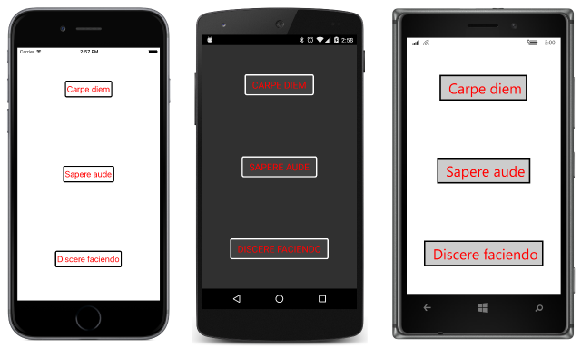

# Summary of Chapter 10. XAML markup extensions

[ Download the sample](https://github.com/xamarin/xamarin-forms-book-samples/tree/master/Chapter10)

> [!NOTE]
> This book was published in the spring of 2016, and has not been updated since then. There is much in the book that remains valuable, but some of the material is outdated, and some topics are no longer entirely correct or complete.

Normally, the XAML parser converts any string set as an attribute value to the type of the property based on standard conversions for the basic .NET data types, or a [`TypeConverter`](xref:Xamarin.Forms.TypeConverter) derivative attached to the property or its type with a [`TypeConverterAttribute`](xref:Xamarin.Forms.TypeConverterAttribute).

But it's sometimes convenient to set an attribute from a different source, for example, an item in a dictionary, or the value of a static property or field, or from a calculation of some sort.

This is the job of a *XAML markup extension*. Despite the name, XAML markup extensions are *not* an extension to XML. XAML is always legal XML.

## The code infrastructure

A XAML markup extension is a class that implements the [`IMarkupExtension`](xref:Xamarin.Forms.Xaml.IMarkupExtension) interface. Such a class often has the word `Extension` at the end of its name but usually appears in XAML without that suffix.

The following XAML markup extensions are supported by all implementations of XAML:

- `x:Static` supported by [`StaticExtension`](xref:Xamarin.Forms.Xaml.StaticExtension)
- `x:Reference` supported by [`ReferenceExtension`](xref:Xamarin.Forms.Xaml.ReferenceExtension)
- `x:Type` supported by [`TypeExtension`](xref:Xamarin.Forms.Xaml.TypeExtension)
- `x:Null` supported by [`NullExtension`](xref:Xamarin.Forms.Xaml.NullExtension)
- `x:Array` supported by [`ArrayExtension`](xref:Xamarin.Forms.Xaml.ArrayExtension)

These four XAML markup extensions are supported by many implementations of XAML, including Xamarin.Forms:

- `StaticResource` supported by [`StaticResourceExtension`](xref:Xamarin.Forms.Xaml.StaticResourceExtension)
- `DynamicResource` supported by [`DynamicResourceExtension`](xref:Xamarin.Forms.Xaml.DynamicResourceExtension)
- `Binding` supported by [`BindingExtension`](xref:Xamarin.Forms.Xaml.BindingExtension)&mdash;discussed in [Chapter 16. Data binding](chapter16.md)
- `TemplateBinding` supported by [`TemplateBindingExtension`](xref:Xamarin.Forms.Xaml.TemplateBindingExtension)&mdash;not covered in the book

An additional XAML markup extension is included in Xamarin.Forms in connection with [`RelativeLayout`](xref:Xamarin.Forms.RelativeLayout):

- [`ConstraintExpression`](xref:Xamarin.Forms.ConstraintExpression)&mdash;not covered in the book

## Accessing static members

Use the [`x:Static`](xref:Xamarin.Forms.Xaml.StaticExtension) element to set an attribute to the value of a public static property, field, or enumeration member. Set the [`Member`](xref:Xamarin.Forms.Xaml.StaticExtension.Member) property to the static member. It's usually easier to specify `x:Static` and the member name in curly braces. The name of the `Member` property does not need to be included, just the member itself. This common syntax is shown in the [**SharedStatics**](https://github.com/xamarin/xamarin-forms-book-samples/tree/master/Chapter10/SharedStatics) sample. The static fields themselves are defined in the [`AppConstants`](https://github.com/xamarin/xamarin-forms-book-samples/blob/master/Chapter10/SharedStatics/SharedStatics/SharedStatics/AppConstants.cs) class. This technique allows you to establish constants used through a program.

With an additional XML namespace declaration, you can reference public static properties, fields, or enumeration members defined in the .NET framework, as demonstrated in the [**SystemStatics**](https://github.com/xamarin/xamarin-forms-book-samples/tree/master/Chapter10/SystemStatics) sample.

## Resource dictionaries

The `VisualElement` class defines a property named [`Resources`](xref:Xamarin.Forms.VisualElement.Resources) that you can set to an object of type [`ResourceDictionary`](xref:Xamarin.Forms.ResourceDictionary). Within XAML, you can store items in this dictionary and identify them with the `x:Key` attribute. The items stored in the resource dictionary are shared among all references to the item.

### StaticResource for most purposes

In most cases you'll use the [`StaticResource`](xref:Xamarin.Forms.Xaml.StaticResourceExtension) markup extension to reference an item from the resource dictionary, as demonstrated by the [**ResourceSharing**](https://github.com/xamarin/xamarin-forms-book-samples/tree/master/Chapter10/ResourceSharing) sample. You can use a `StaticResourceExtension` element or `StaticResource` within curly braces:

Do not confuse the `x:Static` markup extension and the `StaticResource` markup extension.

### A tree of dictionaries

When the XAML parser encounters a `StaticResource`, it begins searching up the visual tree for a matching key, and then looks in the `ResourceDictionary` in the application's `App` class. This allows items in a resource dictionary deeper in the visual tree to override a resource dictionary higher in the visual tree. This is demonstrated in the [**ResourceTrees**](https://github.com/xamarin/xamarin-forms-book-samples/tree/master/Chapter10/ResourceTrees) sample.

### DynamicResource for special purposes

The `StaticResource` markup extension causes an item to be retrieved from the dictionary when a visual tree is built during the `InitializeComponent` call. An alternative to `StaticResource` is [`DynamicResource`](xref:Xamarin.Forms.Xaml.DynamicResourceExtension), which maintains a link to the dictionary key and updates the target when the item referenced by the key changes.

The difference between `StaticResource` and `DynamicResource` is demonstrated in the [**DynamicVsStatic**](https://github.com/xamarin/xamarin-forms-book-samples/tree/master/Chapter10/DynamicVsStatic) sample.

A property set by `DynamicResource` must be backed by a bindable property as discussed in [Chapter 11, The bindable infrastructure](chapter11.md).

## Lesser-used markup extensions

Use the [`x:Null`](xref:Xamarin.Forms.Xaml.NullExtension) markup extension to set a property to `null`.

Use the [`x:Type`](xref:Xamarin.Forms.Xaml.TypeExtension) markup extension to set a property to a .NET `Type` object.

Use [`x:Array`](xref:Xamarin.Forms.Xaml.ArrayExtension) to define an array. Specify the type of the array members by setting the [`Type`] property to an `x:Type` markup extension.

## A custom markup extension

You can create your own XAML markup extensions by writing a class that implements the [`IMarkupExtension`](xref:Xamarin.Forms.Xaml.IMarkupExtension) interface with a [`ProvideValue`](xref:Xamarin.Forms.Xaml.IMarkupExtension.ProvideValue(System.IServiceProvider)) method.

The [`HslColorExtension`](https://github.com/xamarin/xamarin-forms-book-samples/blob/master/Libraries/Xamarin.FormsBook.Toolkit/Xamarin.FormsBook.Toolkit/HslColorExtension.cs) class satisfies those requirement. It creates a value of type `Color` based on values of properties named `H`, `S`, `L`, and `A`. This class is the first item in a Xamarin.Forms library named [**Xamarin.FormsBook.Toolkit**](https://github.com/xamarin/xamarin-forms-book-samples/tree/master/Libraries/Xamarin.FormsBook.Toolkit) that is built up and used over the course of this book.

The [**CustomExtensionDemo**](https://github.com/xamarin/xamarin-forms-book-samples/tree/master/Chapter10/CustomExtensionDemo) sample demonstrates how to reference this library and use the custom markup extension.

## Related links

- [Full eBook text (PDF)](https://aka.ms/xamformsebook)
- [Chapter 10 samples](https://github.com/xamarin/xamarin-forms-book-samples/tree/master/Chapter10)
- [XAML Markup Extensions](~/xamarin-forms/xaml/markup-extensions/index.md)
