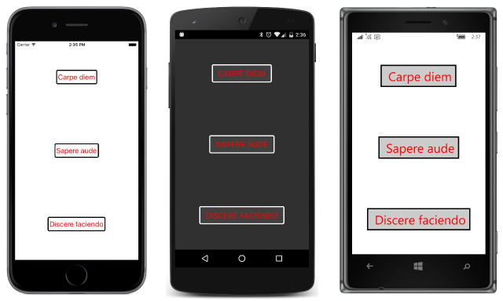

# Summary of Chapter 12. Styles

[ Download the sample](https://github.com/xamarin/xamarin-forms-book-samples/tree/master/Chapter12)

> [!NOTE]
> This book was published in the spring of 2016, and has not been updated since then. There is much in the book that remains valuable, but some of the material is outdated, and some topics are no longer entirely correct or complete.

In Xamarin.Forms, styles allow multiple views to share a collection of property settings. This reduces markup and enables maintaining consistent visual themes.

Styles are almost always defined and consumed in markup. An object of type [`Style`](xref:Xamarin.Forms.Style) is instantiated in a resource dictionary and then set to the [`Style`](xref:Xamarin.Forms.NavigableElement.Style) property of a visual element using a `StaticResource` or `DynamicResource` markup extension.

## The basic Style

A `Style` requires that its  [`TargetType`](xref:Xamarin.Forms.Style.TargetType) be set to the type of the visual object it applies to. When a `Style` is instantiated in a resource dictionary (as is common) it also requires an `x:Key` attribute.

The `Style` has a content property of type [`Setters`](xref:Xamarin.Forms.Style.Setters), which is a collection of [`Setter`](xref:Xamarin.Forms.Setter) objects. Each `Setter` associates a [`Property`](xref:Xamarin.Forms.Setter.Property) with a [`Value`](xref:Xamarin.Forms.Setter.Value).

In XAML the `Property` setting is the name of a CLR property (such as the `Text` property of `Button`) but the styled property must be backed by a bindable property. Also, the property must be defined in the class indicated by the `TargetType` setting, or inherited by that class.

You can specify the `Value` setting using the property element `<Setter.Value>`. This lets you set `Value` to an object that can't be expressed in a text string, or to an `OnPlatform` object, or to an object instantiated using `x:Arguments` or `x:FactoryMethod`. The `Value` property can also be set with a `StaticResource` expression to another item in the dictionary.

The [**BasicStyle**](https://github.com/xamarin/xamarin-forms-book-samples/tree/master/Chapter12/BasicStyle) program demonstrates the basic syntax and shows how to reference the `Style` with a `StaticResource` markup extension:

The `Style` object and any object created in the `Style` object as a `Value` setting are shared among all views referencing that `Style`. The `Style` cannot contain anything that cannot be shared, such as a `View` derivative.

Event handlers cannot be set in a `Style`. The `GestureRecognizers` property cannot be set in a `Style` because it is not backed by a bindable property.

## Styles in code

Although it's not common, you can instantiate and initialize `Style` objects in code. This is demonstrated by the [**BasicStyleCode**](https://github.com/xamarin/xamarin-forms-book-samples/tree/master/Chapter12/BasicStyleCode) sample.

## Style inheritance

`Style` has a [`BasedOn`](xref:Xamarin.Forms.Style.BasedOn) property that you can set to a `StaticResource` markup extension referencing another style. This allows styles to inherit from previous styles, and add or replace property settings. The [**StyleInheritance**](https://github.com/xamarin/xamarin-forms-book-samples/tree/master/Chapter12/StyleInheritance) sample demonstrates this.

If `Style2` is based on `Style1`, the `TargetType` of `Style2` must be the same as `Style1` or derived from `Style1`. The resource dictionary in which `Style1` is stored must be the same resource dictionary as `Style2` or a resource dictionary higher in the visual tree.

## Implicit styles

If a `Style` in a resource dictionary does not have an `x:Key` attribute setting, it is assigned a dictionary key automatically, and the `Style` object becomes an *implicit style*. A view without a `Style` setting and whose type matches the `TargetType` exactly will find that style, as the [**ImplicitStyle**](https://github.com/xamarin/xamarin-forms-book-samples/tree/master/Chapter12/ImplicitStyle) sample demonstrates.

An implicit style can derive from a `Style` with an `x:Key` setting but not the other way around. You cannot explicitly reference an implicit style.

You can implement three types of hierarchy with styles and `BasedOn`:

- From styles defined on the `Application` and `Page` down to styles defined on layouts lower in the visual tree.
- From styles defined for base classes such as `VisualElement` and `View` to styles defined for specific classes.
- From styles with explicit dictionary keys to implicit styles.

These hierarchies are demonstrated in the [**StyleHierarchy**](https://github.com/xamarin/xamarin-forms-book-samples/tree/master/Chapter12/StyleHierarchy) sample.

## Dynamic styles

A style in a resource dictionary can be referenced by `DynamicResource` rather than `StaticResource`. This makes the style a *dynamic style*. If that style is replaced in the resource dictionary by another style with the same key, the views referencing that style with `DynamicResource` automatically change. Also, the absence of a dictionary entry with the specified key will cause `StaticResource` to raise an exception but not `DynamicResource`.

You can use this technique to dynamically change styling or themes as the
[**DynamicStyles**](https://github.com/xamarin/xamarin-forms-book-samples/tree/master/Chapter12/DynamicStyles) sample demonstrates.

However, you cannot set the `BasedOn` property to a `DynamicResource` makeup extension because `BasedOn` isn't backed by a bindable property. To derive a style dynamically, do not set `BasedOn`. Instead, set the [`BaseResourceKey`](xref:Xamarin.Forms.Style.BaseResourceKey) property to the dictionary key of the style you want to derive from. The [**DynamicStylesInheritance**](https://github.com/xamarin/xamarin-forms-book-samples/tree/master/Chapter12/DynaStylesInh) sample demonstrates this technique.

## Device styles

The [`Device.Styles`](xref:Xamarin.Forms.Device.Styles) nested class defines twelve static read-only fields for six styles with a `TargetType` of `Label` that you can use for common types of text usages.

Six of these fields are of type `Style` that you can set directly to a `Style` property in code:

- [`BodyStyle`](xref:Xamarin.Forms.Device.Styles.BodyStyle)
- [`TitleStyle`](xref:Xamarin.Forms.Device.Styles.TitleStyle)
- [`SubtitleStyle`](xref:Xamarin.Forms.Device.Styles.SubtitleStyle)
- [`CaptionStyle`](xref:Xamarin.Forms.Device.Styles.CaptionStyle)
- [`ListItemTextStyle`](xref:Xamarin.Forms.Device.Styles.ListItemTextStyle)
- [`ListItemDetailTextStyle`](xref:Xamarin.Forms.Device.Styles.ListItemDetailTextStyle)

The other six fields are of type `string` and can be used as dictionary keys for dynamic styles:

- [`BodyStyleKey`](xref:Xamarin.Forms.Device.Styles.BodyStyleKey) equal to "BodyStyle"
- [`TitleStyleKey`](xref:Xamarin.Forms.Device.Styles.TitleStyleKey) equal to "TitleStyle"
- [`SubtitleStyleKey`](xref:Xamarin.Forms.Device.Styles.SubtitleStyleKey) equal to "SubtitleStyle"
- [`CaptionStyleKey`](xref:Xamarin.Forms.Device.Styles.CaptionStyleKey) equal to "CaptionStyle"
- [`ListItemTextStyleKey`](xref:Xamarin.Forms.Device.Styles.ListItemTextStyleKey) equal to "ListItemTextStyle"
- [`ListItemDetailTextStyleKey`](xref:Xamarin.Forms.Device.Styles.ListItemDetailTextStyleKey) equal to "ListItemDetailTextStyle"

These styles are illustrated by the [**DeviceStylesList**](https://github.com/xamarin/xamarin-forms-book-samples/tree/master/Chapter12/DeviceStylesList) sample.

## Related links

- [Full eBook text (PDF)](https://aka.ms/xamformsebook)
- [Chapter 12 samples](https://github.com/xamarin/xamarin-forms-book-samples/tree/master/Chapter12)
- [Styles](~/xamarin-forms/user-interface/styles/index.md)
