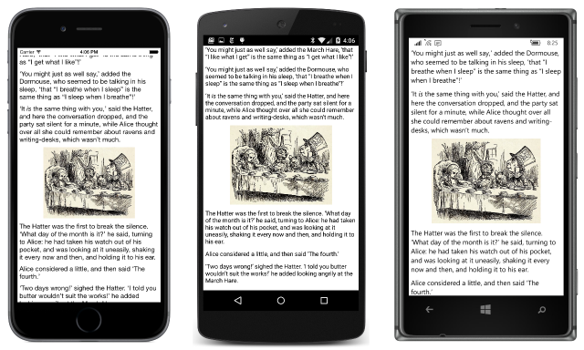

# Summary of Chapter 13. Bitmaps

[ Download the sample](https://github.com/xamarin/xamarin-forms-book-samples/tree/master/Chapter13)

> [!NOTE]
> This book was published in the spring of 2016, and has not been updated since then. There is much in the book that remains valuable, but some of the material is outdated, and some topics are no longer entirely correct or complete.

The Xamarin.Forms [`Image`](xref:Xamarin.Forms.Image) element displays a bitmap. All the Xamarin.Forms platforms support the JPEG, PNG, GIF, and BMP file formats.

Bitmaps in Xamarin.Forms come from four places:

- Over the web as specified by a URL
- Embedded as a resource in the shared library
- Embedded as a resource in the platform application projects
- From anywhere that can be referenced by a .NET `Stream` object, including `MemoryStream`

Bitmap resources in the shared library are platform-independent, while bitmap resources in the platform projects are platform-specific.

> [!NOTE]
> The text of the book makes references to Portable Class Libraries, which have been replaced by .NET Standard libraries. All the sample code from the book has been converted to use .NET standard libraries.

The bitmap is specified by setting the [`Source`](xref:Xamarin.Forms.Image.Source) property of `Image` to an object of type [`ImageSource`](xref:Xamarin.Forms.ImageSource), an abstract class with three derivatives:

- [`UriImageSource`](xref:Xamarin.Forms.UriImageSource) for accessing a bitmap over the web based on a `Uri` object set to its [`Uri`](xref:Xamarin.Forms.UriImageSource.Uri) property
- [`FileImageSource`](xref:Xamarin.Forms.FileImageSource) for accessing a bitmap stored in a platform application project based on a folder and file path set to its [`File`](xref:Xamarin.Forms.FileImageSource.File) property
- [`StreamImageSource`](xref:Xamarin.Forms.StreamImageSource) for loading a bitmap using a .NET `Stream` object specified by returning a `Stream` from a `Func` set to its [`Stream`](xref:Xamarin.Forms.StreamImageSource.Stream) property

Alternatively (and more commonly) you can use the following static methods of the `ImageSource` class, all of which return `ImageSource` objects:

- [`ImageSource.FromUri`](xref:Xamarin.Forms.ImageSource.FromUri(System.Uri)) for accessing a bitmap over the web based on a `Uri` object
- [`ImageSource.FromResource`](xref:Xamarin.Forms.ImageSource.FromResource*) for accessing a bitmap stored as an embedded resource in the application PCL; [`ImageSource.FromResource`](xref:Xamarin.Forms.ImageSource.FromResource(System.String,System.Type)) or [`ImageSource.FromResource`](xref:Xamarin.Forms.ImageSource.FromResource(System.String,System.Reflection.Assembly)) to access a bitmap in another source assembly
- [`ImageSource.FromFile`](xref:Xamarin.Forms.ImageSource.FromFile(System.String)) for accessing a bitmap from a platform application project
- [`ImageSource.FromStream`](xref:Xamarin.Forms.ImageSource.FromStream(System.Func{System.IO.Stream})) for loading a bitmap based on a `Stream` object

There is no class equivalent of the `Image.FromResource` methods. The `UriImageSource` class is useful if you need to control caching. The `FileImageSource` class is useful in XAML. `StreamImageSource` is useful for the asynchronous loading of `Stream` objects, whereas `ImageSource.FromStream` is synchronous.

## Platform-independent Bitmaps

The [**WebBitmapCode**](https://github.com/xamarin/xamarin-forms-book-samples/tree/master/Chapter13/WebBitmapCode) project loads a bitmap over the web using `ImageSource.FromUri`. The `Image` element is set to the `Content` property of the `ContentPage`, so it is constrained to the size of the page. Regardless of the bitmap's size, a constrained `Image` element is stretched to the size of its container, and the bitmap is displayed in its maximum size within the `Image` element while maintaining the bitmap's aspect ratio. Areas of the `Image` beyond the bitmap can be colored with [`BackgroundColor`](xref:Xamarin.Forms.VisualElement.BackgroundColor).

The [**WebBitmapXaml**](https://github.com/xamarin/xamarin-forms-book-samples/tree/master/Chapter13/WebBitmapXaml) sample is similar but simply sets the `Source` property to the URL. The conversion is handled by the [`ImageSourceConverter`](xref:Xamarin.Forms.ImageSourceConverter) class.

### Fit and fill

You can control how the bitmap is stretched by setting the [`Aspect`](xref:Xamarin.Forms.Image.Aspect) property of the `Image` to one of the following members of the [`Aspect`](xref:Xamarin.Forms.Aspect) enumeration:

- [`AspectFit`](xref:Xamarin.Forms.Aspect.AspectFit): respects aspect ratio (default)
- [`Fill`](xref:Xamarin.Forms.Aspect.Fill): fills area, does not respect aspect ratio
- [`AspectFill`](xref:Xamarin.Forms.Aspect.AspectFill): fills area but respects aspect ratio, accomplished by cropping part of the bitmap

### Embedded resources

You can add a bitmap file to a PCL, or to a folder in the PCL. Give it a **Build Action** of **EmbeddedResource**. The [**ResourceBitmapCode**](https://github.com/xamarin/xamarin-forms-book-samples/tree/master/Chapter13/ResourceBitmapCode) sample demonstrates how to use `ImageSource.FromResource` to load the file. The resource name passed to the method consists of the assembly name, followed by a dot, followed by the optional folder name and a dot, followed by the filename.

The program sets the `VerticalOptions` and `HorizontalOptions` properties of the `Image` to `LayoutOptions.Center`, which makes the `Image` element unconstrained. The `Image` and the bitmap are the same size:

- On iOS and Android, the `Image` is the pixel size of the bitmap. There is a one-to-one mapping between bitmap pixels and screen pixels.
- On Universal Windows Platform, the `Image` is the pixel size of the bitmap in device-independent units. On most devices, each bitmap pixel occupies multiple screen pixels.

The [**StackedBitmap**](https://github.com/xamarin/xamarin-forms-book-samples/tree/master/Chapter13/StackedBitmap) sample puts an `Image` in a vertical `StackLayout` in XAML. A markup extension named  [`ImageResourceExtension`](https://github.com/xamarin/xamarin-forms-book-samples/blob/master/Chapter13/StackedBitmap/StackedBitmap/StackedBitmap/ImageResourceExtension.cs) helps to reference the embedded resource in XAML. This class only loads resources from the assembly in which it's located, so it can't be placed in a library.

### More on sizing

It's often desirable to size bitmaps consistently among all the platforms.
Experimenting with **StackedBitmap**, you can set a `WidthRequest` on the `Image` element in a vertical `StackLayout` to make the size consistent among the platforms, but you can only reduce the size using this technique.

You can also set the `HeightRequest` to make the image sizes consistent on the platforms, but the constrained width of the bitmap will limit the versatility of this technique. For an image in a vertical `StackLayout`, `HeightRequest` should be avoided.

The best approach is to begin with a bitmap wider than the phone width in device-independent units and set `WidthRequest` to a desired width in device-independent units. This is demonstrated in the [**DeviceIndBitmapSize**](https://github.com/xamarin/xamarin-forms-book-samples/tree/master/Chapter13/DeviceIndBitmapSize) sample.

The [**MadTeaParty**](https://github.com/xamarin/xamarin-forms-book-samples/tree/master/Chapter13/MadTeaParty) displays Chapter 7 of Lewis Carroll's *Alice's Adventures in Wonderland* with the original illustrations by John Tenniel:

### Browsing and waiting

The [**ImageBrowser**](https://github.com/xamarin/xamarin-forms-book-samples/tree/master/Chapter13/ImageBrowser) sample allows the user to browse through stock images stored on the Xamarin web site. It uses the .NET [`WebRequest`](xref:System.Net.WebRequest) class to download a JSON file with the list of bitmaps.

> [!NOTE]
> Xamarin.Forms programs should use [`HttpClient`](xref:System.Net.Http.HttpClient) rather than [`WebRequest`](xref:System.Net.WebRequest) for accessing files over the internet.

The program uses an [`ActivityIndicator`](xref:Xamarin.Forms.ActivityIndicator) to indicate that something's going on. As each bitmap is loading, the read-only [`IsLoading`](xref:Xamarin.Forms.Image.IsLoading) property of `Image` is `true`. The `IsLoading` property is backed by a bindable property, so a `PropertyChanged` event is fired when that property changes. The program attaches a handler to this event, and uses the current setting of `IsLoaded` to set the [`IsRunning`](xref:Xamarin.Forms.ActivityIndicator.IsRunning) property of the `ActivityIndicator`.

## Streaming bitmaps

The `ImageSource.FromStream` method creates an `ImageSource` based on a .NET `Stream`. The method must be passed a `Func` object that returns a `Stream` object.

### Accessing the streams

The [**BitmapStreams**](https://github.com/xamarin/xamarin-forms-book-samples/tree/master/Chapter13/BitmapStreams) sample demonstrates how to use the `ImaageSource.FromStream` method to load a bitmap stored as an embedded resource, and to load a bitmap across the web.

### Generating bitmaps at run time

All the Xamarin.Forms platforms support the uncompressed BMP file format, which is easy to construct in code and then store in a `MemoryStream`. This technique allows algorithmically creating bitmaps at runtime, as implemented in the [`BmpMaker`](https://github.com/xamarin/xamarin-forms-book-samples/blob/master/Libraries/Xamarin.FormsBook.Toolkit/Xamarin.FormsBook.Toolkit/BmpMaker.cs) class in the **Xamrin.FormsBook.Toolkit** library.

The "Do It Yourself" [**DiyGradientBitmap**](https://github.com/xamarin/xamarin-forms-book-samples/tree/master/Chapter13/DiyGradientBitmap) sample demonstrates the use of `BmpMaker` to create a bitmap with a gradient image.

## Platform-specific bitmaps

All the Xamarin.Forms platforms allow storing bitmaps in the platform application assemblies. When retrieved by a Xamarin.Forms application, these platform bitmaps are of type [`FileImageSource`](xref:Xamarin.Forms.FileImageSource). You use them for:

- the [`Icon`](xref:Xamarin.Forms.MenuItem.Icon) property of [`MenuItem`](xref:Xamarin.Forms.MenuItem)
- the [`Icon`](xref:Xamarin.Forms.MenuItem.Icon) property of [`ToolbarItem`](xref:Xamarin.Forms.ToolbarItem)
- the [`Image`](xref:Xamarin.Forms.Button) property of `Button`

The platform assemblies already contain bitmaps for icons and splash screens:

- In the iOS project, in the **Resources** folder
- In the Android project, in subfolders of the **Resources** folder
- In the Windows projects, in the **Assets** folder (although the Windows platforms do not restrict bitmaps to that folder)

The [**PlatformBitmaps**](https://github.com/xamarin/xamarin-forms-book-samples/tree/master/Chapter13/PlatformBitmaps) sample uses code to display an icon from the platform application projects.

### Bitmap resolutions

All the platforms allow storing multiple versions of bitmap images for different device resolutions. At runtime, the proper version is loaded based on the device resolution of the screen.

On iOS, these bitmaps are differentiated by a suffix on the filename:

- No suffix for 160 DPI devices (1 pixel to the device-independent unit)
- '@2x' suffix for 320 DPI devices (2 pixels to the DIU)
- '@3x' suffix for 480 DPI devices (3 pixels to the DIU)

A bitmap intended to be displayed as one-inch square would exist in three versions:

- MyImage.jpg at 160 pixels square
- MyImage@2x.jpg at 320 pixels square
- MyImage@3x.jpg at 480 pixels square

The program would refer to this bitmap as MyImage.jpg, but the proper version is retrieved at runtime based on the resolution of the screen. When unconstrained, the bitmap will always render at 160 device-independent units.

For Android, bitmaps are stored in various subfolders of the **Resources** folder:

- drawable-ldpi (low DPI) for 120 DPI devices (0.75 pixels to the DIU)
- drawable-mdpi (medium) for 160 DPI devices (1 pixel to the DIU)
- drawable-hdpi (high) for 240 DPI devices (1.5 pixels to the DIU)
- drawable-xhdpi (extra high) for 320 DPI devices (2 pixels to the DIU)
- drawable-xxhdpi (extra extra high) for 480 DPI devices (3 pixels to the DIU)
- drawable-xxxhdpi (three extra highs) for 640 DPI devices (4 pixels to the DIU)

For a bitmap intended to be rendered at one square inch, the various versions of the bitmap will have the same name but a different size, and be stored in these folders:

- drawable-ldpi/MyImage.jpg at 120 pixels square
- drawable-mdpi/MyImage.jpg at 160 pixels square
- drawable-hdpi/MyImage.jpg at 240 pixels square
- drawable-xhdpi/MyImage.jpg at 320 pixels square
- drawable-xxhdpi/MyImage.jpg at 480 pixels square
- drawable-xxxhdpi/MyImage.jpg at 640 pixels square

The bitmap will always render at 160 device-independent units. (The standard Xamarin.Forms solution template only includes the hdpi, xhdpi, and xxhdpi folders.)

The UWP project supports a bitmap naming scheme that consists of a scaling factor in pixels per device-independent unit as a percentage, for example:

- MyImage.scale-200.jpg at 320 pixels square

Only some percentages are valid. The sample programs for this book include only images with **scale-200** suffixes, but current Xamarin.Forms solution templates include **scale-100**, **scale-125**, **scale-150**, and **scale-400**.

When adding bitmaps to the platform projects, the **Build Action** should be:

- iOS: **BundleResource**
- Android: **AndroidResource**
- UWP: **Content**

The [**ImageTap**](https://github.com/xamarin/xamarin-forms-book-samples/tree/master/Chapter13/ImageTap) sample creates two button-like objects consisting of `Image` elements with a `TapGestureRecognizer` installed. It is intended that the objects be one-inch square. The `Source` property of `Image` is set using `OnPlatform` and `On` objects to reference potentially different filenames on the platforms. The bitmap images include numbers indicating their pixel size, so you can see which size bitmap is retrieved and rendered.

### Toolbars and their icons

One of the primary uses of platform-specific bitmaps is the Xamarin.Forms toolbar, which is constructed by adding [`ToolbarItem`](xref:Xamarin.Forms.ToolbarItem) objects to the [`ToolbarItems`](xref:Xamarin.Forms.Page.ToolbarItems) collection defined by `Page`. `ToobarItem` derives from [`MenuItem`](xref:Xamarin.Forms.MenuItem) from which it inherits some properties.

The most important `ToolbarItem` properties are:

- [`Text`](xref:Xamarin.Forms.MenuItem.Text) for text that might appear depending on platform and `Order`
- [`Icon`](xref:Xamarin.Forms.MenuItem.Icon) of type `FileImageSource` for the image that might appear depending on platform and `Order`
- [`Order`](xref:Xamarin.Forms.ToolbarItem.Order) of type [`ToolbarItemOrder`](xref:Xamarin.Forms.ToolbarItemOrder), an enumeration with three members, [`Default`](xref:Xamarin.Forms.ToolbarItemOrder.Default), [`Primary`](xref:Xamarin.Forms.ToolbarItemOrder.Primary), and [`Secondary`](xref:Xamarin.Forms.ToolbarItemOrder.Secondary).

The number of `Primary` items should be limited to three or four. You should include a `Text` setting for all items. For most platforms, only the `Primary` items require an `Icon` but Windows 8.1 requires an `Icon` for all items. The icons should be 32 device-independent units square. The `FileImageSource` type indicates that they are platform-specific.

The `ToolbarItem` fires a [`Clicked`](xref:Xamarin.Forms.MenuItem.Clicked) event when tapped, much like a `Button`. `ToolbarItem` also supports [`Command`](xref:Xamarin.Forms.MenuItem.Command) and [`CommandParameter`](xref:Xamarin.Forms.MenuItem.CommandParameter) properties often used in connection with MVVM. (See [Chapter 18, MVVM](chapter18.md)).

Both iOS and Android require that a page that displays a toolbar be a [`NavigationPage`](xref:Xamarin.Forms.NavigationPage) or a page navigated to by a `NavigationPage`. The [**ToolbarDemo**](https://github.com/xamarin/xamarin-forms-book-samples/tree/master/Chapter13/ToolbarDemo) program sets the `MainPage` property of its `App` class to the [`NavigationPage` constructor](xref:Xamarin.Forms.NavigationPage.%23ctor(Xamarin.Forms.Page)) with a `ContentPage` argument, and demonstrates the construction and event handler of a toolbar.

### Button images

You can also use platform-specific bitmaps to set the [`Image`](xref:Xamarin.Forms.Button.Image) property of `Button` to a bitmap of 32 device-independent units square, as demonstrated by the [**ButtonImage**](https://github.com/xamarin/xamarin-forms-book-samples/tree/master/Chapter13/ButtonImage) sample.

> [!NOTE]
> The use of images on buttons has been enhanced. See [Using bitmaps with buttons](~/xamarin-forms/user-interface/button.md#using-bitmaps-with-buttons).

## Related links

- [Full eBook text (PDF)](https://aka.ms/xamformsebook)
- [Chapter 13 samples](https://github.com/xamarin/xamarin-forms-book-samples/tree/master/Chapter13)
- [Working with Images](~/xamarin-forms/user-interface/images.md)
- [Using bitmaps with buttons](~/xamarin-forms/user-interface/button.md#using-bitmaps-with-buttons)
