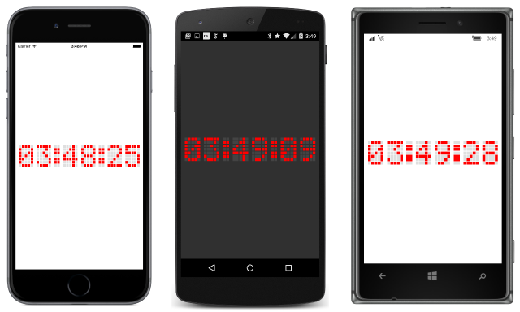

# Summary of Chapter 14. Absolute layout

[ Download the sample](https://github.com/xamarin/xamarin-forms-book-samples/tree/master/Chapter14)

> [!NOTE]
> This book was published in the spring of 2016, and has not been updated since then. There is much in the book that remains valuable, but some of the material is outdated, and some topics are no longer entirely correct or complete.

Like `StackLayout`, [`AbsoluteLayout`](xref:Xamarin.Forms.AbsoluteLayout) derives from `Layout<View>` and inherits a `Children` property. `AbsoluteLayout` implements a layout system that requires the programmer to specify the positions of its children and, optionally, their size. The position is specified by the upper-left corner of the child relative to the upper-left corner of the `AbsoluteLayout` in device-independent units. `AbsoluteLayout` also implements a proportional positioning and sizing feature.

`AbsoluteLayout` should be regarded as a special-purpose layout system to be used only when the programmer can impose a size on the children (for example, `BoxView` elements) or when the element's size doesn't affect the positioning of other children. The `HorizontalOptions` and `VerticalOptions` properties have no effect on children of an `AbsoluteLayout`.

This chapter also introduces the important feature of *attached bindable properties* that allow properties defined in one class (in this case `AbsoluteLayout`) to be attached to another class (a child of the `AbsoluteLayout`).

## AbsoluteLayout in code

You can add a child to the `Children` collection of an `AbsoluteLayout` using the standard [`Add`](xref:System.Collections.Generic.ICollection`1.Add*) method, but `AbsoluteLayout` also provides an extended [`Add`](xref:Xamarin.Forms.AbsoluteLayout.IAbsoluteList`1.Add*) method that lets you specify a [`Rectangle`](xref:Xamarin.Forms.Rectangle). Another [`Add`](xref:Xamarin.Forms.AbsoluteLayout.IAbsoluteList`1.Add*) method requires only a [`Point`](xref:Xamarin.Forms.Point), in which case the child is unconstrained and sizes itself.

You can create a `Rectangle` value with a [constructor](xref:Xamarin.Forms.Rectangle.%23ctor(System.Double,System.Double,System.Double,System.Double)) that requires four values &mdash; the first two indicating the position of the upper-left corner of the child relative to its parent, and the second two indicating the child's size. Or you can use a [constructor](xref:Xamarin.Forms.Rectangle.%23ctor(Xamarin.Forms.Point,Xamarin.Forms.Size)) that requires a `Point` and a [`Size`](xref:Xamarin.Forms.Size) value.

These `Add` methods are demonstrated in [**AbsoluteDemo**](https://github.com/xamarin/xamarin-forms-book-samples/tree/master/Chapter14/AbsoluteDemo), which positions `BoxView` elements using `Rectangle` values, and a `Label` element using just a `Point` value.

The [**ChessboardFixed**](https://github.com/xamarin/xamarin-forms-book-samples/tree/master/Chapter14/ChessboardFixed) sample uses 32 `BoxView` elements to create the chessboard pattern. The program gives the `BoxView` elements a hard-coded size of 35 units square. The `AbsoluteLayout` has its `HorizontalOptions` and `VerticalOptions` set to `LayoutOptions.Center`, which causes the `AbsoluteLayout` to have a total size of 280 units square.

## Attached bindable properties

It is also possible to set the position and, optionally, the size of a child of an `AbsoluteLayout` after it has been added to the `Children` collection using the static method [`AbsoluteLayout.SetLayoutBounds`](xref:Xamarin.Forms.AbsoluteLayout.SetLayoutBounds(Xamarin.Forms.BindableObject,Xamarin.Forms.Rectangle)). The first argument is the child; the second is a `Rectangle` object. You can specify that the child sizes itself horizontally and/or vertically by setting width and height values to the  [`AbsoluteLayout.AutoSize`](xref:Xamarin.Forms.AbsoluteLayout.AutoSize) constant.

The [**ChessboardDynamic**](https://github.com/xamarin/xamarin-forms-book-samples/tree/master/Chapter14/ChessboardDynamic) sample puts the `AbsoluteLayout` in a `ContentView` with a `SizeChanged` handler to call `AbsoluteLayout.SetLayoutBounds` on all the children to make them as large as possible.  

The attached bindable property that `AbsoluteLayout` defines is the static read-only field of type `BindableProperty` named [`AbsoluteLayout.LayoutBoundsProperty`](xref:Xamarin.Forms.AbsoluteLayout.LayoutBoundsProperty). The static `AbsoluteLayout.SetLayoutBounds` method is implemented by calling `SetValue` on the child with the `AbsoluteLayout.LayoutBoundsProperty`. The child contains a dictionary in which the attached bindable property and its value are stored. During layout, the `AbsoluteLayout` can obtain that value by calling [`AbsoluteLayout.GetLayoutBounds`](xref:Xamarin.Forms.AbsoluteLayout.GetLayoutBounds(Xamarin.Forms.BindableObject)), which is implemented with a `GetValue` call.

## Proportional sizing and positioning

`AbsoluteLayout` implements a proportional sizing and positioning feature. The class defines a second attached bindable property, [`LayoutFlagsProperty`](xref:Xamarin.Forms.AbsoluteLayout.LayoutFlagsProperty), with the related static methods [`AbsoluteLayout.SetLayoutFlags`](xref:Xamarin.Forms.AbsoluteLayout.SetLayoutFlags(Xamarin.Forms.BindableObject,Xamarin.Forms.AbsoluteLayoutFlags)) and [`AbsoluteLayout.GetLayoutFlags`](xref:Xamarin.Forms.AbsoluteLayout.GetLayoutFlags(Xamarin.Forms.BindableObject)).

The argument to `AbsoluteLayout.SetLayoutFlags` and the return value of `AbsoluteLayout.GetLayoutFlags` is a value of type [`AbsoluteLayoutFlags`](xref:Xamarin.Forms.AbsoluteLayoutFlags), an enumeration with the following members:

- [`None`](xref:Xamarin.Forms.AbsoluteLayoutFlags.None) (equal to 0)
- [`XProportional`](xref:Xamarin.Forms.AbsoluteLayoutFlags.XProportional) (1)
- [`YProportional`](xref:Xamarin.Forms.AbsoluteLayoutFlags.YProportional) (2)
- [`PositionProportional`](xref:Xamarin.Forms.AbsoluteLayoutFlags.PositionProportional) (3)
- [`WidthProportional`](xref:Xamarin.Forms.AbsoluteLayoutFlags.WidthProportional) (4)
- [`HeightProportional`](xref:Xamarin.Forms.AbsoluteLayoutFlags.HeightProportional) (8)
- [`SizeProportional`](xref:Xamarin.Forms.AbsoluteLayoutFlags.SizeProportional) (12)
- [`All`](xref:Xamarin.Forms.AbsoluteLayoutFlags.All) (\xFFFFFFFF)

You can combine these with the C# bitwise OR operator.

With these flags set, certain properties of the `Rectangle` layout bounds structure used to position and size the child are interpreted proportionally.

When the `WidthProportional` flag is set, a `Width` value of 1 means that the child is the same width as the `AbsoluteLayout`. A similar approach is used for the height.

The proportional positioning takes the size into account. When the `XProportional` flag is set, the `X` property of the `Rectangle` layout bounds is proportional. A value of 0 means that the child's left edge is positioned at the left edge of the `AbsoluteLayout`, but a position of 1 means that the child's right edge is positioned at the right edge of the `AbsoluteLayout`, not beyond the right edge of the `AbsoluteLayout` as you might expect. An `X` property of 0.5 centers the child horizontally in the `AbsoluteLayout`.

The [**ChessboardProportional**](https://github.com/xamarin/xamarin-forms-book-samples/tree/master/Chapter14/ChessboardProportional) sample demonstrates the use of proportional sizing and positioning.

## Working with proportional coordinates

Sometimes, it's easier to think of proportional positioning differently than how it's implemented in the `AbsoluteLayout`. You might prefer to work with proportional coordinates where an `X` property of 1 positions the child's left edge (rather than the right edge) against the right edge of the `AbsoluteLayout`.

This alternative positioning scheme can be called "fractional child coordinates." You can convert from fractional child coordinates to the layout bounds required for `AbsoluteLayout` using the following formulas:

layoutBounds.X = (fractionalChildCoordinate.X / (1 - layoutBounds.Width))

layoutBounds.Y = (fractionalChildCoordinate.Y / (1 - layoutBounds.Height))

The [**ProportionalCoordinateCalc**](https://github.com/xamarin/xamarin-forms-book-samples/tree/master/Chapter14/PropCoordCalc) sample demonstrates this.

## AbsoluteLayout and XAML

You can use an `AbsoluteLayout` in XAML and set the attached bindable properties on the children of an `AbsoluteLayout` using attribute values of `AbsoluteLayout.LayoutBounds` and `AbsoluteLayout.LayoutFlags`. This is demonstrated in the [**AbsoluteXamlDemo**](https://github.com/xamarin/xamarin-forms-book-samples/tree/master/Chapter14/AbsoluteXamlDemo) and the [**ChessboardXaml**](https://github.com/xamarin/xamarin-forms-book-samples/tree/master/Chapter14/ChessboardXaml) samples. The latter program contains 32 `BoxView` elements but uses an implicit `Style` that includes the `AbsoluteLayout.LayoutFlags` property to keep the markup down to a minimum.

An attribute in XAML that consists of a class name, a dot, and a property name is *always* an attached bindable property.

## Overlays

You can use `AbsoluteLayout` to construct an *overlay*, which covers the page with other controls, perhaps to protect the user from interacting with the normal controls on the page.

The [**SimpleOverlay**](https://github.com/xamarin/xamarin-forms-book-samples/tree/master/Chapter14/SimpleOverlay) sample demonstrates this technique, and also demonstrates the [`ProgressBar`](xref:Xamarin.Forms.ProgressBar), which displays the extent to which a program has completed a task.

## Some fun

The [**DotMatrixClock**](https://github.com/xamarin/xamarin-forms-book-samples/tree/master/Chapter14/DotMatrixClock) sample displays the current time with a simulated 5x7 dot matrix display. Each dot is a `BoxView` (there are 228 of them) sized and positioned on the `AbsoluteLayout`.

The [**BouncingText**](https://github.com/xamarin/xamarin-forms-book-samples/tree/master/Chapter14/BouncingText) program animates two `Label` objects to bounce horizontally and vertically across the screen.

## Related links

- [Full eBook text (PDF)](https://aka.ms/xamformsebook)
- [Chapter 14 samples](https://github.com/xamarin/xamarin-forms-book-samples/tree/master/Chapter14)
- [AbsoluteLayout](~/xamarin-forms/user-interface/layouts/absolutelayout.md)
- [Attached Properties](~/xamarin-forms/xaml/attached-properties.md)
