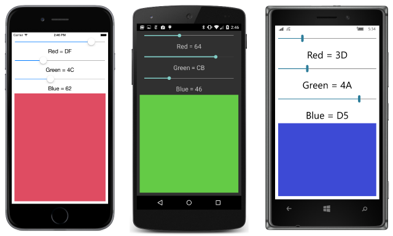

# Summary of Chapter 15. The interactive interface

[ Download the sample](https://github.com/xamarin/xamarin-forms-book-samples/tree/master/Chapter15)

> [!NOTE]
> This book was published in the spring of 2016, and has not been updated since then. There is much in the book that remains valuable, but some of the material is outdated, and some topics are no longer entirely correct or complete.

This chapter explores eight `View` derivatives that allow interaction with the user.

## View overview

Xamarin.Forms contains 20 instantiable classes that derive from `View` but not `Layout`. Six of these have been covered in previous chapters:

- `Label`: [**Chapter 2. Anatomy of an app**](chapter02.md)
- `BoxView`: [**Chapter 3. Scrolling the stack**](chapter03.md)
- `Button`: [**Chapter 6. Button clicks**](chapter06.md)
- `Image`: [**Chapter 13. Bitmaps**](chapter13.md)
- `ActivityIndicator`: [**Chapter 13. Bitmaps**](chapter13.md)
- `ProgressBar`: [**Chapter 14. AbsoluteLayout**](chapter14.md)

The eight views in this chapter effectively allow the user to interact with basic .NET data types:

|Data type|Views|
|--- |--- |
|`Double`|[`Slider`](xref:Xamarin.Forms.Slider), [`Stepper`](xref:Xamarin.Forms.Stepper)|
|`Boolean`|[`Switch`](xref:Xamarin.Forms.Switch)|
|`String`|[`Entry`](xref:Xamarin.Forms.Entry), [`Editor`](xref:Xamarin.Forms.Editor), [`SearchBar`](xref:Xamarin.Forms.SearchBar)|
|`DateTime`|[`DatePicker`](xref:Xamarin.Forms.DatePicker), [`TimePicker`](xref:Xamarin.Forms.TimePicker)|

You can think of these views as visual interactive representations of the underlying data types. This concept is explored more in the next chapter, [**Chapter 16. Data binding**](chapter16.md).

The remaining six views are covered in the following chapters:

- `WebView`: [**Chapter 16. Data binding**](chapter16.md)
- `Picker`: [**Chapter 19. Collection views**](chapter19.md)
- `ListView`: [**Chapter 19. Collection views**](chapter19.md)
- `TableView`: [**Chapter 19. Collection views**](chapter19.md)
- `Map`: [**Chapter 28. Location and Maps**](chapter28.md)
- `OpenGLView`: Not covered in this book (and no support for Windows platforms)

## Slider and stepper

Both [`Slider`](xref:Xamarin.Forms.Slider) and [`Stepper`](xref:Xamarin.Forms.Stepper) allow the user to choose a numeric value from a range. The `Slider` is a continuous range while the `Stepper` involves discrete values.

### Slider basics

The [`Slider`](xref:Xamarin.Forms.Slider) is a horizontal bar representing a range of values from a minimum on the left to a maximum on the right. It defines three public properties:

- [`Value`](xref:Xamarin.Forms.Slider.Value) of type `double`, default value of 0
- [`Minimum`](xref:Xamarin.Forms.Slider.Minimum) of type `double`, default value of 0
- [`Maximum`](xref:Xamarin.Forms.Slider.Maximum) of type `double`, default value of 1

The bindable properties that back these properties ensure that they are consistent:

- For all three properties, the [`coerceValue`](xref:Xamarin.Forms.BindableProperty.CoerceValueDelegate) method specified for the bindable property ensures that `Value` is between `Minimum` and `Maximum`.
- The [`validateValue`](xref:Xamarin.Forms.BindableProperty.ValidateValueDelegate) method on `MinimumProperty` returns `false` if `Minimum` is being set to a value greater than or equal to `Maximum`, and similar for `MaximumProperty`. Returning `false` from the `validateValue` method causes an `ArgumentException` to be raised.

`Slider` fires the [`ValueChanged`](xref:Xamarin.Forms.Slider.ValueChanged) event with a [`ValueChangedEventArgs`](xref:Xamarin.Forms.ValueChangedEventArgs) argument when the `Value` property changes, either programmatically or when the user manipulates the `Slider`.

The [**SliderDemo**](https://github.com/xamarin/xamarin-forms-book-samples/tree/master/Chapter15/SliderDemo) sample demonstrates the simple use of the `Slider`.

### Common pitfalls

Both in code and in XAML, the `Minimum` and `Maximum` properties are set in the order that you specify. Be sure to initialize these properties so that `Maximum` is always greater than `Minimum`. Otherwise an exception will be raised.

Initializing the `Slider` properties can cause the `Value` property to change and the `ValueChanged` event to be fired. You should ensure that the `Slider` event handler doesn't access views that haven't yet been created during page initialization.

The `ValueChanged` event doesn't fire during `Slider` initialization unless the `Value` property changes. You can call the `ValueChanged` handler directly from code.

### Slider color selection

The [**RgbSliders**](https://github.com/xamarin/xamarin-forms-book-samples/tree/master/Chapter15/RgbSliders) program contains three `Slider` elements that allow you to interactively select a color by specifying its RGB values:

The [**TextFade**](https://github.com/xamarin/xamarin-forms-book-samples/tree/master/Chapter15/TextFade) sample uses two `Slider` elements to move two `Label` elements across an `AbsoluteLayout` and fade one into the other.

### The Stepper difference

The [`Stepper`](xref:Xamarin.Forms.Stepper) defines the same properties and events as `Slider` but the `Maximum` property is initialized to 100 and `Stepper` defines a fourth property:

- [`Increment`](xref:Xamarin.Forms.Stepper.Increment) of type `double`, initialized to 1

Visually, the `Stepper` consists of two buttons labeled **&ndash;** and **+**. Pressing **&ndash;** decreases `Value` by `Increment` to a minimum of `Minimum`. Pressing **+** increases `Value` by `Increment` to a maximum of `Maximum`.

This is demonstrated by the [**StepperDemo**](https://github.com/xamarin/xamarin-forms-book-samples/tree/master/Chapter15/StepperDemo) sample.

## Switch and CheckBox

The [`Switch`](xref:Xamarin.Forms.Switch) allows the user to specify a Boolean value.

### Switch basics

Visually, the `Switch` consists of a toggle that can be turned off and on. The class defines one property:

- [`IsToggled`](xref:Xamarin.Forms.Switch.IsToggled) of type `bool`

`Switch` defines one event:

- [`Toggled`](xref:Xamarin.Forms.Switch.Toggled) accompanied by a [`ToggledEventArgs`](xref:Xamarin.Forms.ToggledEventArgs) object, fired when the `IsToggled` property changes.

The [**SwitchDemo**](https://github.com/xamarin/xamarin-forms-book-samples/tree/master/Chapter15/SwitchDemo) program demonstrates the `Switch`.

### A traditional CheckBox

Some developers might prefer a more traditional `CheckBox` to the `Switch`. The [**Xamarin.FormsBook.Toolkit**](https://github.com/xamarin/xamarin-forms-book-samples/tree/master/Libraries/Xamarin.FormsBook.Toolkit) library contains a `CheckBox` class that derives from `ContentView`. `CheckBox` is implemented by the [CheckBox.xaml](https://github.com/xamarin/xamarin-forms-book-samples/blob/master/Libraries/Xamarin.FormsBook.Toolkit/Xamarin.FormsBook.Toolkit/CheckBox.xaml) and [CheckBox.xaml.cs](https://github.com/xamarin/xamarin-forms-book-samples/blob/master/Libraries/Xamarin.FormsBook.Toolkit/Xamarin.FormsBook.Toolkit/CheckBox.xaml.cs) files. `CheckBox` defines three properties (`Text`, `FontSize`, and `IsChecked`) and a `CheckedChanged` event.

The [**CheckBoxDemo**](https://github.com/xamarin/xamarin-forms-book-samples/tree/master/Chapter15/CheckBoxDemo) sample demonstrates this `CheckBox`.

## Typing text

Xamarin.Forms defines three views that let the user enter and edit text:

- [`Entry`](xref:Xamarin.Forms.Entry) for a single line of text
- [`Editor`](xref:Xamarin.Forms.Editor) for multiple lines of text
- [`SearchBar`](xref:Xamarin.Forms.SearchBar) for a single line of text for search purposes.

`Entry` and `Editor` derive from [`InputView`](xref:Xamarin.Forms.InputView), which derives from `View`. `SearchBar` derives directly from `View`.

### Keyboard and focus

On phones and tablets without physical keyboards, the `Entry`, `Editor`, and `SearchBar` elements all cause a virtual keyboard to pop up. The presence of this keyboard on the screen is related to input focus. A view must have both its [`IsVisible`](xref:Xamarin.Forms.VisualElement.IsVisible) and [`IsEnabled`](xref:Xamarin.Forms.VisualElement.IsEnabled) properties set to `true` to get input focus.

Two methods, one read-only property, and two events are involved with input focus. These are all defined by `VisualElement`:

- The [`Focus`](xref:Xamarin.Forms.VisualElement.Focus) method attempts to set input focus to an element and returns `true` if successful
- The [`Unfocus`](xref:Xamarin.Forms.VisualElement.Unfocus) method removes input focus from an element
- The [`IsFocused`](xref:Xamarin.Forms.VisualElement.IsFocused) read-only property indicates if the element has input focus
- The [`Focused`](xref:Xamarin.Forms.VisualElement.Focused) event indicates when an element gets input focus
- The [`Unfocused`](xref:Xamarin.Forms.VisualElement.Unfocused) event indicates when an element loses input focus

### Choosing the Keyboard

The [`InputView`](xref:Xamarin.Forms.InputView) class from which `Entry` and `Editor` derive defines only one property:

- [`Keyboard`](xref:Xamarin.Forms.InputView.Keyboard) of type [`Keyboard`](xref:Xamarin.Forms.Keyboard)

This indicates the type of keyboard that is displayed. Some keyboards are optimized for URIs or numbers.

The `Keyboard` class allows defining a keyboard with a static [`Keyboard.Create`](xref:Xamarin.Forms.Keyboard.Create(Xamarin.Forms.KeyboardFlags)) method with an argument of type [`KeyboardFlags`](xref:Xamarin.Forms.KeyboardFlags), an enumeration with the following bit flags:

- `None` set to 0
- [`CapitalizeSentence`](xref:Xamarin.Forms.KeyboardFlags.CapitalizeSentence) set to 1
- [`Spellcheck`](xref:Xamarin.Forms.KeyboardFlags.Spellcheck) set to 2
- [`Suggestions`](xref:Xamarin.Forms.KeyboardFlags.Suggestions) set to 4
- [`All`](xref:Xamarin.Forms.KeyboardFlags.All) set to \xFFFFFFFF

When using the multiline [`Editor`](xref:Xamarin.Forms.Editor) when a paragraph or more of text is expected, calling `Keyboard.Create` is a good approach to selecting a keyboard. For the single-line [`Entry`](xref:Xamarin.Forms.Entry), the following static read-only properties of `Keyboard` are useful:

- [`Default`](xref:Xamarin.Forms.Keyboard.Default)
- [`Text`](xref:Xamarin.Forms.Keyboard.Text)
- [`Chat`](xref:Xamarin.Forms.Keyboard.Chat)
- [`Url`](xref:Xamarin.Forms.Keyboard.Url)
- [`Email`](xref:Xamarin.Forms.Keyboard.Email)
- [`Telephone`](xref:Xamarin.Forms.Keyboard.Telephone)
- [`Numeric`](xref:Xamarin.Forms.Keyboard.Numeric) for positive numbers with or without a decimal point.

The [`KeyboardTypeConverter`](xref:Xamarin.Forms.KeyboardTypeConverter) allows specifying these properties in XAML as demonstrated by the [**EntryKeyboards**](https://github.com/xamarin/xamarin-forms-book-samples/tree/master/Chapter15/EntryKeyboards) program.

### Entry properties and events

The single-line [`Entry`](xref:Xamarin.Forms.Entry) defines the following properties:

- [`Text`](xref:Xamarin.Forms.InputView.Text) of type `string`, the text that appears in the `Entry`
- [`TextColor`](xref:Xamarin.Forms.InputView.TextColor) of type `Color`
- [`FontFamily`](xref:Xamarin.Forms.Entry.FontFamily) of type `string`
- [`FontSize`](xref:Xamarin.Forms.Entry.FontSize) of type `double`
- [`FontAttributes`](xref:Xamarin.Forms.Entry.FontAttributes) of type `FontAttributes`
- [`IsPassword`](xref:Xamarin.Forms.Entry.IsPassword) of type `bool`, which causes characters to be masked
- [`Placeholder`](xref:Xamarin.Forms.InputView.Placeholder) of type `string`, for dimly colored text that appears in the `Entry` before anything is typed
- [`PlaceholderColor`](xref:Xamarin.Forms.InputView.PlaceholderColor) of type `Color`

The `Entry` also defines two events:

- [`TextChanged`](xref:Xamarin.Forms.InputView.TextChanged) with a [`TextChangedEventArgs`](xref:Xamarin.Forms.TextChangedEventArgs) object, fired whenever the `Text` property changes
- [`Completed`](xref:Xamarin.Forms.Entry.Completed), fired when the user is finished and the keyboard is dismissed. The user indicates completion in a platform-specific manner

The [**QuadraticEquations**](https://github.com/xamarin/xamarin-forms-book-samples/tree/master/Chapter15/QuadaticEquations) sample demonstrates these two events.

### The Editor difference

The multiline [`Editor`](xref:Xamarin.Forms.Editor) defines the same `Text` and `Font` properties as `Entry` but not the other properties. `Editor` also defines the same two properties as `Entry`.

[**JustNotes**](https://github.com/xamarin/xamarin-forms-book-samples/tree/master/Chapter15/JustNotes) is a free-form notes-taking program that saves and restores the contents of the `Editor`.

### The SearchBar

The [`SearchBar`](xref:Xamarin.Forms.SearchBar) does not derive from `InputView`, so it does not have a `Keyboard` property. But it does have all the `Text`, `Font`, and `Placeholder` properties that `Entry` defines. In addition, `SearchBar` defines three additional properties:

- [`CancelButtonColor`](xref:Xamarin.Forms.SearchBar.CancelButtonColor) of type `Color`
- [`SearchCommand`](xref:Xamarin.Forms.SearchBar.SearchCommand) of type [`ICommand`](xref:System.Windows.Input.ICommand) for use with data-bindings and MVVM
- [`SearchCommandParameter`](xref:Xamarin.Forms.SearchBar.SearchCommandParameter) of type `Object`, for use with `SearchCommand`

The platform-specific cancel button erases the text. The `SearchBar` also has a platform-specific search button. Pressing either of those buttons raises one of the two events that `SearchBar` defines:

- [`TextChanged`](xref:Xamarin.Forms.InputView.TextChanged) accompanied by a [`TextChangedEventArgs`](xref:Xamarin.Forms.TextChangedEventArgs) object
- [`SearchButtonPressed`](xref:Xamarin.Forms.SearchBar.SearchButtonPressed)

The [**SearchBarDemo**](https://github.com/xamarin/xamarin-forms-book-samples/tree/master/Chapter15/SearchBarDemo) sample demonstrates the `SearchBar`.

## Date and time selection

The [`DatePicker`](xref:Xamarin.Forms.DatePicker) and [`TimePicker`](xref:Xamarin.Forms.TimePicker) views implement platform-specific controls that allow the user to specify a date or time.

### The DatePicker

[`DatePicker`](xref:Xamarin.Forms.DatePicker) defines four properties:

- [`MinimumDate`](xref:Xamarin.Forms.DatePicker.MinimumDate) of type `DateTime`, initialized to January 1, 1900
- [`MaximumDate`](xref:Xamarin.Forms.DatePicker.MaximumDate) of type `DateTime`, initialized to December 31, 2100
- [`Date`](xref:Xamarin.Forms.DatePicker.Date) of type `DateTime`, initialized to `DateTime.Today`
- [`Format`](xref:Xamarin.Forms.DatePicker.Format) of type `string`, the .NET formatting string initialized to "d", the short date pattern, resulting in a date display like "7/20/1969" in the US.

You can set the `DateTime` properties in XAML by expressing the properties as property elements and using the culture-invariant short-date format ("7/20/1969").   

The [**DaysBetweenDates**](https://github.com/xamarin/xamarin-forms-book-samples/tree/master/Chapter15/DaysBetweenDates) sample calculates the number of days between two dates selected by the user.

### The TimePicker (or is it a TimeSpanPicker?)

[`TimePicker`](xref:Xamarin.Forms.TimePicker) defines two properties and no events:

- [`Time`](xref:Xamarin.Forms.TimePicker.Time) is of type `TimeSpan` rather than `DateTime`, indicating the time elapsed since midnight
- [`Format`](xref:Xamarin.Forms.TimePicker.Format) of type `string`, the .NET formatting string initialized to "t", the short time pattern, resulting in a time display like "1:45 PM" in the US.

The [**SetTimer**](https://github.com/xamarin/xamarin-forms-book-samples/tree/master/Chapter15/SetTimer) program demonstrates how to use the `TimePicker` to specify a time for a timer. The program only works if you keep it in the foreground.

**SetTimer** also demonstrates using the [`DisplayAlert`](xref:Xamarin.Forms.Page.DisplayAlert(System.String,System.String,System.String)) method of `Page` to display an alert box.

## Related links

- [Full eBook text (PDF)](https://aka.ms/xamformsebook)
- [Chapter 15 samples](https://github.com/xamarin/xamarin-forms-book-samples/tree/master/Chapter15)
- [Slider](~/xamarin-forms/user-interface/slider.md)
- [Entry](~/xamarin-forms/user-interface/text/entry.md)
- [Editor](~/xamarin-forms/user-interface/text/editor.md)
- [DatePicker](~/xamarin-forms/user-interface/datepicker.md)
