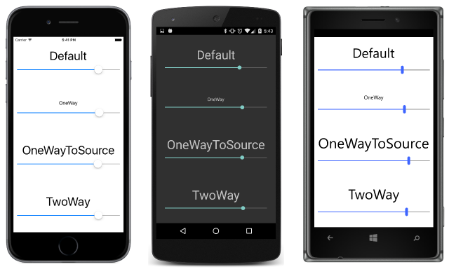

# Summary of Chapter 16. Data binding

[ Download the sample](https://github.com/xamarin/xamarin-forms-book-samples/tree/master/Chapter16)

> [!NOTE]
> This book was published in the spring of 2016, and has not been updated since then. There is much in the book that remains valuable, but some of the material is outdated, and some topics are no longer entirely correct or complete.

Programmers often find themselves writing event handlers that detect when a property of one object has changed, and use that to change the value of a property in another object. This process can be automated with the technique of *data binding*. Data bindings are usually defined in XAML and become part of the definition of the user interface.

Very often, these data bindings connect user-interface objects to underlying data. This is a technique that is explored more in [**Chapter 18. MVVM**](chapter18.md). However, data bindings can also connect two or more user-interface elements. Most of the early examples of data binding in this chapter demonstrate this technique.

## Binding basics

Several properties, methods, and classes are involved in data binding:

- The [`Binding`](xref:Xamarin.Forms.Binding) class derives from [`BindingBase`](xref:Xamarin.Forms.BindingBase) and encapsulates many characteristics of a data binding
- The [`BindingContext`](xref:Xamarin.Forms.BindableObject.BindingContext) property is defined by the [`BindableObject`](xref:Xamarin.Forms.BindableObject) class
- The [`SetBinding`](xref:Xamarin.Forms.BindableObject.SetBinding(Xamarin.Forms.BindableProperty,Xamarin.Forms.BindingBase)) method is also defined by the [`BindableObject`](xref:Xamarin.Forms.BindableObject) class
- The [`BindableObjectExtensions`](xref:Xamarin.Forms.BindableObjectExtensions) class defines three additional `SetBinding` methods

The following two classes support XAML markup extensions for bindings:

- [`BindingExtension`](xref:Xamarin.Forms.Xaml.BindingExtension) supports the `Binding` markup extension
- [`ReferenceExtension`](xref:Xamarin.Forms.Xaml.ReferenceExtension) supports the `x:Reference` markup extension

Two interfaces are involved in data binding:

- [`INotifyPropertyChanged`](xref:System.ComponentModel.INotifyPropertyChanged) in the `System.ComponentModel` namespace is for implementing notification when a property changes
- [`IValueConverter`](xref:Xamarin.Forms.IValueConverter) is used to define small classes that convert values from one type to another in data bindings

A data binding connects two properties of the same object, or (more commonly) two different objects. These two properties are referred to as the *source* and the *target*. Generally, a change in the source property causes a change to occur in the target property, but sometimes the direction is reversed. Regardless:

- the *target* property must be backed by a [`BindableProperty`](xref:Xamarin.Forms.BindableProperty)
- the *source* property generally is a member of a class that implements [`INotifyPropertyChanged`](xref:System.ComponentModel.INotifyPropertyChanged)

A class that implements `INotifyPropertyChanged` fires a [`PropertyChanged`](xref:System.ComponentModel.INotifyPropertyChanged.PropertyChanged) event when a property changes value. `BindableObject` implements `INotifyPropertyChanged` and automatically fires a `PropertyChanged` event when a property backed by a `BindableProperty` changes values, but you can write your own classes that implement `INotifyPropertyChanged` without deriving from `BindableObject`.

## Code and XAML

The [**OpacityBindingCode**](https://github.com/xamarin/xamarin-forms-book-samples/tree/master/Chapter16/OpacityBindingCode) sample demonstrates how to set a data binding in code:

- The source is the `Value` property of a `Slider`
- The target is the `Opacity` property of a `Label`

The two objects are connected by setting the `BindingContext` of the `Label` object to the `Slider` object. The two properties are connected by calling a [`SetBinding`](xref:Xamarin.Forms.BindableObjectExtensions.SetBinding*) extension method on the `Label` referencing the `OpacityProperty` bindable property and the `Value` property of the `Slider` expressed as a string.

Manipulating the `Slider` then causes the `Label` to fade in and out of view.

The [**OpacityBindingXaml**](https://github.com/xamarin/xamarin-forms-book-samples/tree/master/Chapter16/OpacityBindingXaml) is the same program with the data binding set in XAML. The `BindingContext` of the `Label` is set to an `x:Reference` markup extension referencing the `Slider`, and the `Opacity` property of the `Label` is set to the `Binding` markup extension with its [`Path`](xref:Xamarin.Forms.Binding.Path) property referencing the `Value` property of the `Slider`.

## Source and BindingContext

The [**BindingSourceCode**](https://github.com/xamarin/xamarin-forms-book-samples/tree/master/Chapter16/BindingSourceCode) sample shows an alternative approach in code. A `Binding` object is created by setting the [`Source`](xref:Xamarin.Forms.Binding.Source) property to the `Slider` object and the [`Path`](xref:Xamarin.Forms.Binding.Path) property to "Value". The [`SetBinding`](xref:Xamarin.Forms.BindableObject.SetBinding(Xamarin.Forms.BindableProperty,Xamarin.Forms.BindingBase)) method of `BindableObject` is then called on the `Label` object.

The [`Binding` constructor](xref:Xamarin.Forms.Binding.%23ctor(System.String,Xamarin.Forms.BindingMode,Xamarin.Forms.IValueConverter,System.Object,System.String,System.Object)) could also have been used to define the `Binding` object.

The [**BindingSourceXaml**](https://github.com/xamarin/xamarin-forms-book-samples/tree/master/Chapter16/BindingSourceXaml) sample shows the comparable technique in XAML. The `Opacity` property of the `Label` is set to a `Binding` markup extension with [`Path`](xref:Xamarin.Forms.Binding.Path) set to the `Value` property and [`Source`](xref:Xamarin.Forms.Binding.Source) set to an embedded `x:Reference` markup extension.

In summary, there are two ways to reference the binding source object:

- Through the `BindingContext` property of the target
- Through the `Source` property of the `Binding` object itself

If both are specified, the second takes precedence. The advantage of the `BindingContext` is that it is propagated through the visual tree. This is *very* handy if multiple target properties are bound to the same source object.

The [**WebViewDemo**](https://github.com/xamarin/xamarin-forms-book-samples/tree/master/Chapter16/WebViewDemo) program demonstrates this technique with the [`WebView`](xref:Xamarin.Forms.WebView) element. Two `Button` elements for navigating backwards and forwards inherit a `BindingContext` from their parent that references the `WebView`. The `IsEnabled` properties of the two buttons then have simple `Binding` markup extensions that target the button `IsEnabled` properties based on the settings of the [`CanGoBack`](xref:Xamarin.Forms.WebView.CanGoBack) and [`CanGoForward`](xref:Xamarin.Forms.WebView.CanGoForward) read-only properties of the `WebView`.

## The binding mode

Set the [`Mode`](xref:Xamarin.Forms.BindingBase.Mode) property of `Binding` to a member of the [`BindingMode`](xref:Xamarin.Forms.BindingMode) enumeration:

- [`OneWay`](xref:Xamarin.Forms.BindingMode.OneWay) so that changes in the source property affect the target
- [`OneWayToSource`](xref:Xamarin.Forms.BindingMode.OneWayToSource) so that changes in the target property affect the source
- [`TwoWay`](xref:Xamarin.Forms.BindingMode.TwoWay) so that changes in the source and target affect each other
- [`Default`](xref:Xamarin.Forms.BindingMode.Default) to use the [`DefaultBindingMode`](xref:Xamarin.Forms.BindableProperty.DefaultBindingMode) specified when the target `BindableProperty` was created. If none was specified, the default is `OneWay` for normal bindable properties, and `OneWayToSource` for read-only bindable properties.

> [!NOTE]
> The `BindingMode` enumeration now also includes `OnTime` for applying a binding only when the binding context changes and not when the source property changes.

Properties that are likely to be the targets of data bindings in MVVM scenarios generally have a `DefaultBindingMode` of `TwoWay`. These are:

- `Value` property of `Slider` and `Stepper`
- `IsToggled` property of `Switch`
- `Text` property of `Entry`, `Editor`, and `SearchBar`
- `Date` property of `DatePicker`
- `Time` property of `TimePicker`

The [**BindingModes**](https://github.com/xamarin/xamarin-forms-book-samples/tree/master/Chapter16/BindingModes) sample demonstrates the four binding modes with a data binding where the target is the `FontSize` property of a `Label` and the source is the `Value` property of a `Slider`. This allows each `Slider` to control the font size of the corresponding `Label`. But the `Slider` elements are not initialized because the `DefaultBindingMode` of the `FontSize` property is `OneWay`.

The [**ReverseBinding**](https://github.com/xamarin/xamarin-forms-book-samples/tree/master/Chapter16/ReverseBinding) sample sets the bindings on the `Value` property of the `Slider` referencing the `FontSize` property of each `Label`. This appears to be backwards, but it works better in initialzing the `Slider` elements because the `Value` property of the `Slider` has a `DefaultBindingMode` of `TwoWay`.

This is analogous to how bindings are defined in MVVM, and you'll use this type of binding frequently.

## String formatting

When the target property is of type `string`, you can use the [`StringFormat`](xref:Xamarin.Forms.BindingBase.StringFormat) property defined by `BindingBase` to convert the source to a `string`. Set the `StringFormat` property to a .NET formatting string that you would use with the static [`String.Format`](xref:System.String.Format(System.String,System.Object)) format to display the object. When using this formatting string within a markup extension, surround it with single quotation marks so the curly braces won't be mistaken for an embedded markup extension.

The [**ShowViewValues**](https://github.com/xamarin/xamarin-forms-book-samples/tree/master/Chapter16/ShowViewValues) sample demonstrates how to use `StringFormat` in XAML.

The [**WhatSizeBindings**](https://github.com/xamarin/xamarin-forms-book-samples/tree/master/Chapter16/WhatSizeBindings) sample demonstrates displaying the size of the page with bindings to the `Width` and `Height` properties of the `ContentPage`.

## Why is it called "Path"?

The [`Path`](xref:Xamarin.Forms.Binding.Path) property of `Binding` is so called because it can be a series of properties and indexers separated by periods. The [**BindingPathDemos**](https://github.com/xamarin/xamarin-forms-book-samples/tree/master/Chapter16/BindingPathDemos) sample shows several examples.

## Binding value converters

When the source and target properties of a binding are different types, you can convert between the types using a binding converter. This is a class that implements the [`IValueConverter`](xref:Xamarin.Forms.IValueConverter) interface and contains two methods: [`Convert`](xref:Xamarin.Forms.IValueConverter.Convert(System.Object,System.Type,System.Object,System.Globalization.CultureInfo)) to convert the source to the target, and [`ConvertBack`](xref:Xamarin.Forms.IValueConverter.ConvertBack(System.Object,System.Type,System.Object,System.Globalization.CultureInfo)) to convert the target to the source.

The [`IntToBoolConverter`](https://github.com/xamarin/xamarin-forms-book-samples/blob/master/Libraries/Xamarin.FormsBook.Toolkit/Xamarin.FormsBook.Toolkit/IntToBoolConverter.cs) class in the [**Xamarin.FormsBook.Toolkit**](https://github.com/xamarin/xamarin-forms-book-samples/tree/master/Libraries/Xamarin.FormsBook.Toolkit) library is an example for converting an `int` to a `bool`. It is demonstrated by the [**ButtonEnabler**](https://github.com/xamarin/xamarin-forms-book-samples/tree/master/Chapter16/ButtonEnabler) sample, which only enables the `Button` if at least one character has been typed into an `Entry`.

The [`BoolToStringConverter`](https://github.com/xamarin/xamarin-forms-book-samples/blob/master/Libraries/Xamarin.FormsBook.Toolkit/Xamarin.FormsBook.Toolkit/BoolToStringConverter.cs) class converts a `bool` to a `string` and defines two properties to specify what text should be returned for `false` and `true` values.
The [`BoolToColorConverter`](https://github.com/xamarin/xamarin-forms-book-samples/blob/master/Libraries/Xamarin.FormsBook.Toolkit/Xamarin.FormsBook.Toolkit/BoolToColorConverter.cs) is similar. The [**SwitchText**](https://github.com/xamarin/xamarin-forms-book-samples/tree/master/Chapter16/SwitchText) sample demonstrates using these two converters to display different texts in different colors based on a `Switch` setting.

The generic [`BoolToObjectConverter`](https://github.com/xamarin/xamarin-forms-book-samples/blob/master/Libraries/Xamarin.FormsBook.Toolkit/Xamarin.FormsBook.Toolkit/BoolToObjectConverter.cs) can replace the `BoolToStringConverter` and `BoolToColorConverter` and serve as a generalized `bool`-to-object converter of any type.

## Bindings and custom views

You can simplify custom controls using data bindings. The [`NewCheckBox.cs`](https://github.com/xamarin/xamarin-forms-book-samples/blob/master/Libraries/Xamarin.FormsBook.Toolkit/Xamarin.FormsBook.Toolkit/NewCheckBox.xaml.cs) code file defines `Text`, `TextColor`, `FontSize`, `FontAttributes`, and `IsChecked` properties, but has no logic at all for the visuals of the control.
Instead the [`NewCheckBox.cs.xaml`](https://github.com/xamarin/xamarin-forms-book-samples/blob/master/Libraries/Xamarin.FormsBook.Toolkit/Xamarin.FormsBook.Toolkit/NewCheckBox.xaml) file contains all the markup for the control's visuals through data bindings on the `Label` elements based on the properties defined in the code-behind file.

The [**NewCheckBoxDemo**](https://github.com/xamarin/xamarin-forms-book-samples/tree/master/Chapter16/NewCheckBoxDemo) sample demonstrates the `NewCheckBox` custom control.

## Related links

- [Full eBook text (PDF)](https://aka.ms/xamformsebook)
- [Chapter 16 samples](https://github.com/xamarin/xamarin-forms-book-samples/tree/master/Chapter16)
- [Data Binding](~/xamarin-forms/app-fundamentals/data-binding/index.md)
