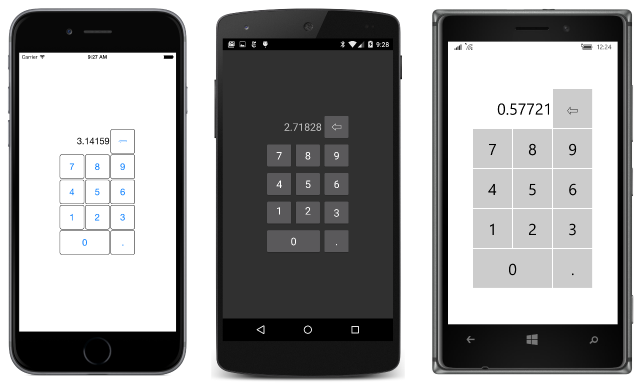

# Summary of Chapter 17. Mastering the Grid

[ Download the sample](https://github.com/xamarin/xamarin-forms-book-samples/tree/master/Chapter17)

> [!NOTE]
> This book was published in the spring of 2016, and has not been updated since then. There is much in the book that remains valuable, but some of the material is outdated, and some topics are no longer entirely correct or complete.

The [`Grid`](xref:Xamarin.Forms.Grid) is a powerful layout mechanism that arranges its children into rows and columns of cells. Unlike the similar HTML `table` element, the `Grid` is solely for purposes of layout rather than presentation.

## The basic Grid

`Grid` derives from [`Layout<View>`](xref:Xamarin.Forms.Layout`1), which defines a [`Children`](xref:Xamarin.Forms.Layout`1.Children) property that `Grid` inherits. You can fill this collection in either XAML or code.

### The Grid in XAML

The definition of a `Grid` in XAML generally begins with filling the [`RowDefinitions`](xref:Xamarin.Forms.Grid.RowDefinitions) and [`ColumnDefinitions`](xref:Xamarin.Forms.Grid.ColumnDefinitions) collections of the `Grid` with [`RowDefinition`](xref:Xamarin.Forms.RowDefinition) and [`ColumnDefinition`](xref:Xamarin.Forms.ColumnDefinition) objects. This is how you establish the number of rows and columns of the `Grid`, and their properties.

`RowDefinition` has a [`Height`](xref:Xamarin.Forms.RowDefinition.Height) property and `ColumnDefinition` has a [`Width`](xref:Xamarin.Forms.ColumnDefinition.Width) property, both of type [`GridLength`](xref:Xamarin.Forms.GridLength), a structure.

In XAML, the [`GridLengthTypeConverter`](xref:Xamarin.Forms.GridLengthTypeConverter) converts simple text strings into `GridLength` values. Behind the scenes, the [`GridLength` constructor](xref:Xamarin.Forms.GridLength.%23ctor(System.Double,Xamarin.Forms.GridUnitType)) creates the `GridLength` value based on a number and a value of type [`GridUnitType`](xref:Xamarin.Forms.GridUnitType), an enumeration with three members:

- [`Absolute`](xref:Xamarin.Forms.GridUnitType.Absolute) &mdash; the width or height is specified in device-independent units (a number in XAML)
- [`Auto`](xref:Xamarin.Forms.GridUnitType.Auto) &mdash; the height or width is autosized based on cell contents ("Auto" in XAML)
- [`Star`](xref:Xamarin.Forms.GridUnitType.Star) &mdash; leftover height or width is allocated proportionally (a number with "\*", called *star*, in XAML)

Each child of the `Grid` must also be assigned a row and column (either explicitly or implicitly). Row spans and column spans are optional. These are all specified using attached bindable properties &mdash; properties that are defined by the `Grid` but set on children of the `Grid`. `Grid` defines four static attached bindable properties:

- [`RowProperty`](xref:Xamarin.Forms.Grid.RowProperty) &mdash; the zero-based row; default is 0
- [`ColumnProperty`](xref:Xamarin.Forms.Grid.ColumnProperty) &mdash; the zero-based column; default is 0
- [`RowSpanProperty`](xref:Xamarin.Forms.Grid.RowSpanProperty) &mdash; the number of rows the child spans; default is 1
- [`ColumnSpanProperty`](xref:Xamarin.Forms.Grid.ColumnSpanProperty) &mdash; the number of columns the child spans; default is 1

In code, a program can use eight static methods to set and get these values:

- [`Grid.SetRow`](xref:Xamarin.Forms.Grid.SetRow(Xamarin.Forms.BindableObject,System.Int32)) and [`Grid.GetRow`](xref:Xamarin.Forms.Grid.GetRow(Xamarin.Forms.BindableObject))
- [`Grid.SetColumn`](xref:Xamarin.Forms.Grid.SetColumn(Xamarin.Forms.BindableObject,System.Int32)) and [`Grid.GetColumn`](xref:Xamarin.Forms.Grid.GetColumn(Xamarin.Forms.BindableObject))
- [`Grid.SetRowSpan`](xref:Xamarin.Forms.Grid.SetRowSpan(Xamarin.Forms.BindableObject,System.Int32)) and [`Grid.GetRowSpan`](xref:Xamarin.Forms.Grid.GetRowSpan(Xamarin.Forms.BindableObject))
- [`Grid.SetColumnSpan`](xref:Xamarin.Forms.Grid.SetColumnSpan(Xamarin.Forms.BindableObject,System.Int32)) and [`Grid.GetColumnSpan`](xref:Xamarin.Forms.Grid.GetColumnSpan(Xamarin.Forms.BindableObject))

In XAML you use the following attributes for setting these values:

- `Grid.Row`
- `Grid.Column`
- `Grid.RowSpan`
- `Grid.ColumnSpan`

The [**SimpleGridDemo**](https://github.com/xamarin/xamarin-forms-book-samples/tree/master/Chapter17/SimpleGridDemo) sample demonstrates creating and initializing a `Grid` in XAML.

The `Grid` inherits the [`Padding`](xref:Xamarin.Forms.Layout.Padding) property from `Layout` and defines two additional properties that provide spacing between the rows and columns:

- [`RowSpacing`](xref:Xamarin.Forms.Grid.RowSpacing) has a default value of 6
- [`ColumnSpacing`](xref:Xamarin.Forms.Grid.ColumnSpacing) has a default value of 6

The `RowDefinitions` and `ColumnDefinitions` collections aren't strictly required. If absent, the `Grid` creates rows and columns for the `Grid` children and gives them all a default `GridLength` of "\*" (star).

### The Grid in code

The [**GridCodeDemo**](https://github.com/xamarin/xamarin-forms-book-samples/tree/master/Chapter17/GridCodeDemo) sample demonstrates how to create and populate a `Grid` in code. You can set the attached properties for each child directly, or indirectly by calling additional `Add` methods such as [`Add`](xref:Xamarin.Forms.Grid.IGridList`1.Add*) defined by the [Grid.IGridList\<T\>](xref:Xamarin.Forms.Grid.IGridList`1) interface.

### The Grid bar chart

The [**GridBarChart**](https://github.com/xamarin/xamarin-forms-book-samples/tree/master/Chapter17/GridBarChart) sample shows how to add multiple `BoxView` elements to a `Grid` using the bulk [`AddHorizontal`](xref:Xamarin.Forms.Grid.IGridList`1.AddHorizontal*) method. By default, these `BoxView` elements have equal width. The height of each `BoxView` can then be controlled to resemble a bar chart.

The `Grid` in the **GridBarChart** sample shares an `AbsoluteLayout` parent with an initially invisible `Frame`. The program also sets a `TapGestureRecognizer` on each `BoxView` to use the `Frame` to display information about the tapped bar.

### Alignment in the Grid

The [**GridAlignment**](https://github.com/xamarin/xamarin-forms-book-samples/tree/master/Chapter17/GridAlignment) sample demonstrates how to use the `VerticalOptions` and `HorizontalOptions` properties to align children in a `Grid` cell.

The [**SpacingButtons**](https://github.com/xamarin/xamarin-forms-book-samples/tree/master/Chapter17/SpacingButtons) sample equally spaces `Button` elements centered in `Grid` cells.

### Cell dividers and borders

The `Grid` does not include a feature that draws cell dividers or borders. However, you can make your own.

The [**GridCellDividers**](https://github.com/xamarin/xamarin-forms-book-samples/tree/master/Chapter17/GridCellDividers) demonstrates how to define additional rows and column specifically for thin `BoxView` elements to mimic dividing lines.

The [**GridCellBorders**](https://github.com/xamarin/xamarin-forms-book-samples/tree/master/Chapter17/GridCellBorders) program does not create any additional cells but instead aligns `BoxView` elements in each cell to mimic a cell border.

## Almost real-life Grid examples

The [**KeypadGrid**](https://github.com/xamarin/xamarin-forms-book-samples/tree/master/Chapter17/KeypadGrid) sample uses a `Grid` to display a keypad:

### Responding to orientation changes

The `Grid` can help structure a program to respond to orientation changes. The
[**GridRgbSliders**](https://github.com/xamarin/xamarin-forms-book-samples/tree/master/Chapter17/GridRgbSliders) sample demonstrates a technique that moves an element between a second row of a portrait-oriented phone and the second column of a landscape-oriented phone.

The program initializes `Slider` elements to a range of 0 to 255, and uses data bindings to display the value of the sliders in hexadecimal. Because the `Slider` values are floating point, and the .NET formatting string for hexadecimal only works with integers, a [`DoubleToIntConvert`](https://github.com/xamarin/xamarin-forms-book-samples/blob/master/Libraries/Xamarin.FormsBook.Toolkit/Xamarin.FormsBook.Toolkit/DoubleToIntConverter.cs) class in the [**Xamarin.FormsBook.Toolkit**](https://github.com/xamarin/xamarin-forms-book-samples/tree/master/Libraries/Xamarin.FormsBook.Toolkit) library helps out.

## Related links

- [Full eBook text (PDF)](https://aka.ms/xamformsebook)
- [Chapter 17 samples](https://github.com/xamarin/xamarin-forms-book-samples/tree/master/Chapter17)
- [Grid](~/xamarin-forms/user-interface/layouts/grid.md)
