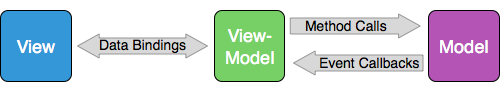
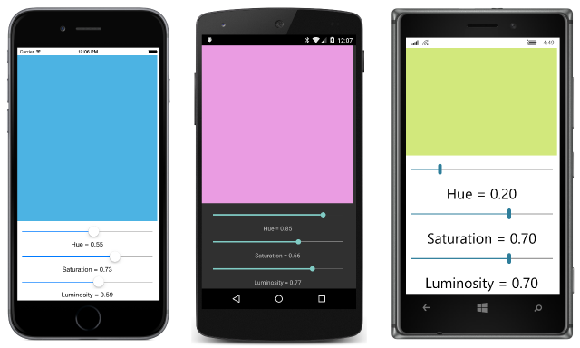

# Summary of Chapter 18. MVVM

[ Download the sample](https://github.com/xamarin/xamarin-forms-book-samples/tree/master/Chapter18)

> [!NOTE]
> This book was published in the spring of 2016, and has not been updated since then. There is much in the book that remains valuable, but some of the material is outdated, and some topics are no longer entirely correct or complete.

One of the best ways to architect an application is by separating the user interface from the underlying code, which is sometimes called the *business logic*. Several techniques exist, but the one that is tailored for XAML-based environments is known as Model-View-ViewModel or MVVM.

## MVVM interrelationships

An MVVM application has three layers:

- The Model provides underlying data, sometimes through files or web accesses
- The View is the user interface or presentation layer, generally implemented in XAML
- The ViewModel connects the Model and the View

The Model is ignorant of the ViewModel and the ViewModel is ignorant of the View. These three layers generally connect to each other using the following mechanisms:

In many smaller programs (and even larger ones), often the Model is absent or its functionality is integrated into the ViewModel.

## ViewModels and data binding

To engage in data bindings, a ViewModel must be capable of notifying the View when a property of the ViewModel has changed. The ViewModel does this by implementing the [`INotifyPropertyChanged`](xref:System.ComponentModel.INotifyPropertyChanged) interface in the `System.ComponentModel` namespace. This is part of .NET rather than Xamarin.Forms. (Generally ViewModels attempt to maintain platform independence.)

The `INotifyPropertyChanged` interface declares a single event named [`PropertyChanged`](xref:System.ComponentModel.INotifyPropertyChanged) that indicates the property that has changed.

### A ViewModel clock

The [`DateTimeViewModel`](https://github.com/xamarin/xamarin-forms-book-samples/blob/master/Libraries/Xamarin.FormsBook.Toolkit/Xamarin.FormsBook.Toolkit/DateTimeViewModel.cs) in the [**Xamarin.FormsBook.Toolkit**](https://github.com/xamarin/xamarin-forms-book-samples/tree/master/Libraries/Xamarin.FormsBook.Toolkit/Xamarin.FormsBook.Toolkit) library defines a property of type `DateTime` that changes based on a timer. The class implements `INotifyPropertyChanged` and fires the `PropertyChanged` event whenever the `DateTime` property changes.

The [**MvvmClock**](https://github.com/xamarin/xamarin-forms-book-samples/tree/master/Chapter18/MvvmClock) sample instantiates this ViewModel and uses data bindings to the ViewModel to display updated date and time information.

### Interactive properties in a ViewModel

Properties in a ViewModel can be more interactive, as demonstrated by the [`SimpleMultiplierViewModel`](https://github.com/xamarin/xamarin-forms-book-samples/blob/master/Chapter18/SimpleMultiplier/SimpleMultiplier/SimpleMultiplier/SimpleMultiplierViewModel.cs) class, which is part of the
[**SimpleMultiplier**](https://github.com/xamarin/xamarin-forms-book-samples/tree/master/Chapter18/SimpleMultiplier) sample. The data bindings provide multiplicand and multiplier values from two `Slider` elements and display the product with a `Label`. However, you can make extensive changes to this user interface in XAML with no consequent changes to the ViewModel or the code-behind file.

### A Color ViewModel

The
[`ColorViewModel`](https://github.com/xamarin/xamarin-forms-book-samples/blob/master/Libraries/Xamarin.FormsBook.Toolkit/Xamarin.FormsBook.Toolkit/ColorViewModel.cs) in the [**Xamarin.FormsBook.Toolkit**](https://github.com/xamarin/xamarin-forms-book-samples/tree/master/Libraries/Xamarin.FormsBook.Toolkit/Xamarin.FormsBook.Toolkit) library integrates the RGB and HSL color models. It is demonstrated in the [**HslSliders**](https://github.com/xamarin/xamarin-forms-book-samples/tree/master/Chapter18/HslSliders) sample:

### Streamlining the ViewModel

The code in ViewModels can be streamlined by defining an `OnPropertyChanged` method using the [`CallerMemberName`](xref:System.Runtime.CompilerServices.CallerMemberNameAttribute) attribute, which obtains the calling property name automatically. The [`ViewModelBase`](https://github.com/xamarin/xamarin-forms-book-samples/blob/master/Libraries/Xamarin.FormsBook.Toolkit/Xamarin.FormsBook.Toolkit/ViewModelBase.cs) class in the [**Xamarin.FormsBook.Toolkit**](https://github.com/xamarin/xamarin-forms-book-samples/tree/master/Libraries/Xamarin.FormsBook.Toolkit/Xamarin.FormsBook.Toolkit) library does this and provides a base class for ViewModels.

## The Command interface

MVVM works with data bindings, and data bindings work with properties, so MVVM seems to be deficient when it comes to handling a `Clicked` event of a `Button` or a `Tapped` event of a `TapGestureRecognizer`. To allow ViewModels to handle such events, Xamarin.Forms supports the *command interface*.

The command interface manifests itself in the `Button` with two public properties:

- [`Command`](xref:Xamarin.Forms.Button.Command) of type [`ICommand`](xref:System.Windows.Input.ICommand) (defined in the `System.Windows.Input` namespace)
- [`CommandParameter`](xref:Xamarin.Forms.Button.CommandParameter) of type `Object`

To support the command interface, a ViewModel must define a property of type `ICommand` that is then data bound to the `Command` property of the `Button`. The `ICommand` interface declares two methods and one event:

- An [`Execute`](xref:System.Windows.Input.ICommand.Execute(System.Object)) method with an argument of type `object`
- A [`CanExecute`](xref:System.Windows.Input.ICommand.CanExecute(System.Object)) method with an argument of type `object` that returns `bool`
- A [`CanExecuteChanged`](xref:System.Windows.Input.ICommand.CanExecuteChanged) event

Internally, a ViewModel sets each property of type `ICommand` to an instance of a class that implements the `ICommand` interface. Through the data binding, the `Button` initially calls the `CanExecute` method, and disables itself if the method returns `false`. It also sets a handler for the `CanExecuteChanged` event and calls `CanExecute` whenever that event is fired. If the `Button` is enabled, it calls the `Execute` method whenever the `Button` is clicked.

You might have some ViewModels that predate Xamarin.Forms, and these might already support the command interface. For new ViewModels intended to be used only with Xamarin.Forms, Xamarin.Forms supplies a [`Command`](xref:Xamarin.Forms.Command) class and a [`Command<T>`](xref:Xamarin.Forms.Command`1) class that implement the `ICommand` interface. The generic type is the type of the argument to the `Execute` and `CanExecute` methods.

### Simple method executions

The [**PowersOfThree**](https://github.com/xamarin/xamarin-forms-book-samples/tree/master/Chapter18/PowersOfThree) sample demonstrates how to use the command interface in a ViewModel. The [`PowersViewModel`](https://github.com/xamarin/xamarin-forms-book-samples/blob/master/Chapter18/PowersOfThree/PowersOfThree/PowersOfThree/PowersViewModel.cs) class defines two properties of type `ICommand` and also defines two private properties that it passes to the simplest [`Command` constructor](xref:Xamarin.Forms.Command.%23ctor(System.Action)). The program contains data bindings from this ViewModel to the `Command` properties of two `Button` elements.

The `Button` elements can be easily replaced with `TapGestureRecognizer` objects in XAML with no code changes.

### A calculator, almost

The [**AddingMachine**](https://github.com/xamarin/xamarin-forms-book-samples/tree/master/Chapter18/AddingMachine) sample makes use of both the `Execute` and `CanExecute` methods of `ICommand`. It uses an [`AdderViewModel`](https://github.com/xamarin/xamarin-forms-book-samples/blob/master/Libraries/Xamarin.FormsBook.Toolkit/Xamarin.FormsBook.Toolkit/AdderViewModel.cs) class in the [**Xamarin.FormsBook.Toolkit**](https://github.com/xamarin/xamarin-forms-book-samples/blob/master/Libraries/Xamarin.FormsBook.Toolkit/Xamarin.FormsBook.Toolkit/AdderViewModel.cs) library. The ViewModel contains six properties of type `ICommand`. These are initialized from the [`Command` constructor](xref:Xamarin.Forms.Command.%23ctor(System.Action)) and [`Command` constructor](xref:Xamarin.Forms.Command.%23ctor(System.Action,System.Func{System.Boolean})) of `Command` and the [`Command<T>` constructor](/dotnet/api/xamarin.forms.command.-ctor?view=xamarin-forms#Xamarin_Forms_Command__ctor_System_Action_System_Object__System_Func_System_Object_System_Boolean__&preserve-view=true) of `Command<T>`. The numeric keys of the adding machine are all bound to the property that is initialized with `Command<T>`, and a `string` argument to `Execute` and `CanExecute` identifies the particular key.

## ViewModels and the application lifecycle

The `AdderViewModel` used in the **AddingMachine** sample also defines two methods named `SaveState` and `RestoreState`. These methods are called from the application when it goes to sleep and when it starts up again.

## Related links

- [Full eBook text (PDF)](https://aka.ms/xamformsebook)
- [Chapter 18 samples](https://github.com/xamarin/xamarin-forms-book-samples/tree/master/Chapter18)
- [Enterprise Application Patterns using Xamarin.Forms eBook](~/xamarin-forms/enterprise-application-patterns/index.md)
