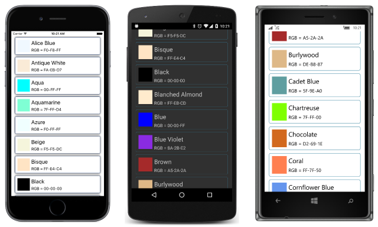
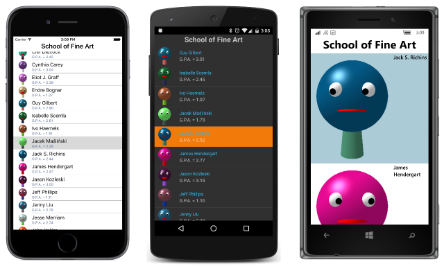

# Summary of Chapter 19. Collection views

[ Download the sample](https://github.com/xamarin/xamarin-forms-book-samples/tree/master/Chapter19)

> [!NOTE]
> This book was published in the spring of 2016, and has not been updated since then. There is much in the book that remains valuable, but some of the material is outdated, and some topics are no longer entirely correct or complete.

Xamarin.Forms defines three views that maintain collections and display their elements:

- [`Picker`](xref:Xamarin.Forms.Picker) is a relatively short list of string items that allows the user to choose one
- [`ListView`](xref:Xamarin.Forms.ListView) is often a long list of items usually of the same type and formatting, also allowing the user to choose one
- [`TableView`](xref:Xamarin.Forms.TableView) is a collection of *cells* (usually of various types and appearances) to display data or manage user input

It is common for MVVM applications to use the `ListView` to display a selectable collection of objects.

## Program options with Picker

The [`Picker`](xref:Xamarin.Forms.Picker) is a good choice when you need to allow the user to choose an option from among a relatively short list of `string` items.

### The Picker and event handling

The [**PickerDemo**](https://github.com/xamarin/xamarin-forms-book-samples/tree/master/Chapter19/PickerDemo) sample demonstrates how to use XAML to set the `Picker` [`Title`](xref:Xamarin.Forms.Picker.Title) property and add `string` items to the [`Items`](xref:Xamarin.Forms.Picker.Items) collection. When the user selects the `Picker`, it displays the items in the `Items` collection in a platform-dependent manner.

The [`SelectedIndexChanged`](xref:Xamarin.Forms.Picker.SelectedIndexChanged) event indicates when the user has selected an item. The zero-based [`SelectedIndex`](xref:Xamarin.Forms.Picker.SelectedIndex) property then indicates the selected item. If no item is selected, `SelectedIndex` equals &ndash;1.

You can also use `SelectedIndex` to initialize the selected item, but it must be set after the `Items` collection is filled. In XAML, this means that you'll probably use a property element to set `SelectedIndex`.

### Data binding the Picker

The `SelectedIndex` property is backed by a bindable property but `Items` is not, so using data binding with a `Picker` is difficult. One solution is to use the `Picker` in combination with an [`ObjectToIndexConverter`](https://github.com/xamarin/xamarin-forms-book-samples/blob/master/Libraries/Xamarin.FormsBook.Toolkit/Xamarin.FormsBook.Toolkit/ObjectToIndexConverter.cs) such as the one in the [**Xamarin.FormsBook.Toolkit**](https://github.com/xamarin/xamarin-forms-book-samples/tree/master/Libraries/Xamarin.FormsBook.Toolkit) library. The [**PickerBinding**](https://github.com/xamarin/xamarin-forms-book-samples/tree/master/Chapter19/PickerBinding) demonstrates how this works.

> [!NOTE]
> The Xamarin.Forms `Picker` now includes `ItemsSource` and `SelectedItem` properties that support data binding. See [Picker](~/xamarin-forms/user-interface/picker/index.md).

## Rendering data with ListView

The [`ListView`](xref:Xamarin.Forms.ListView) is the only class that derives from [`ItemsView<TVisual>`](xref:Xamarin.Forms.ItemsView`1) from which it inherits the [`ItemsSource`](xref:Xamarin.Forms.ItemsView`1.ItemsSource) and [`ItemTemplate`](xref:Xamarin.Forms.ItemsView`1.ItemTemplate) properties.

`ItemsSource` is of type `IEnumerable` but it is `null` by default and must be explicitly initialized or (more commonly) set to a collection through a data binding. The items in this collection can be of any type.

`ListView` defines a [`SelectedItem`](xref:Xamarin.Forms.ListView.SelectedItem) property that is either set to one of the items in the `ItemsSource` collection or `null` if no item is selected. `ListView` fires the [`ItemSelected`](xref:Xamarin.Forms.ListView.ItemSelected) event when a new item is selected.

### Collections and selections

The [**ListViewList**](https://github.com/xamarin/xamarin-forms-book-samples/tree/master/Chapter19/ListViewList) sample fills a `ListView` with 17 `Color` values in a `List<Color>` collection. The items are selectable but by default they are displayed with their unattractive `ToString` representations. Several examples in this chapter show how to fix that display and make it as attractive as desired.

### The row separator

On iOS and Android displays, a thin line separates the rows. You can control this with the [`SeparatorVisibility`](xref:Xamarin.Forms.ListView.SeparatorVisibility) and [`SeparatorColor`](xref:Xamarin.Forms.ListView.SeparatorColor) properties. `SeparatorVisibility` property is of type [`SeparatorVisibility`](xref:Xamarin.Forms.SeparatorVisibility), an enumeration with two members:

- [`Default`](xref:Xamarin.Forms.SeparatorVisibility.Default), the default setting
- [`None`](xref:Xamarin.Forms.SeparatorVisibility.None)

### Data binding the selected item

The `SelectedItem` property is backed by a bindable property, so it can be either the source or target of a data binding. Its default `BindingMode` is `OneWayToSource`, but generally it is the target of a two-way data binding, particularly in MVVM scenarios. The [**ListViewArray**](https://github.com/xamarin/xamarin-forms-book-samples/tree/master/Chapter19/ListViewArray) sample demonstrates this type of binding.

### The ObservableCollection difference

The [**ListViewLogger**](https://github.com/xamarin/xamarin-forms-book-samples/tree/master/Chapter19/ListViewLogger) sample sets the `ItemsSource` property of a `ListView` to a `List<DateTime>` collection and then progressively adds a new `DateTime` object to the collection every second using a timer.

However, the `ListView` doesn't automatically update itself because the `List<T>` collection doesn't have a notification mechanism to indicate when items are added to or removed from the collection.

A much better class to use in such scenarios is [`ObservableCollection<T>`](xref:System.Collections.ObjectModel.ObservableCollection`1) defined in the `System.Collections.ObjectModel` namespace. This class implements the [`INotifyCollectionChanged`](xref:System.Collections.Specialized.INotifyCollectionChanged) interface and consequently fires a [`CollectionChanged`](xref:System.Collections.ObjectModel.ObservableCollection`1.CollectionChanged) event when items are added to or removed from the collection, or when they are replaced or moved within the collection. When the `ListView` internally detects that a class implementing `INotifyCollectionChanged` has been set to its `ItemsSource` property, it attaches a handler to the `CollectionChanged` event and updates its display when the collection changes.

The
[**ObservableLogger**](https://github.com/xamarin/xamarin-forms-book-samples/tree/master/Chapter19/ObservableLogger) sample demonstrates the use of `ObservableCollection`.

### Templates and cells

By default, a `ListView` displays items in its collection using each item's `ToString` method. A better approach involves defining a template to display the items.

To experiment with this feature, you can use the [`NamedColor`](https://github.com/xamarin/xamarin-forms-book-samples/blob/master/Libraries/Xamarin.FormsBook.Toolkit/Xamarin.FormsBook.Toolkit/NamedColor.cs) class in the  [**Xamarin.FormsBook.Toolkit**](https://github.com/xamarin/xamarin-forms-book-samples/tree/master/Libraries/Xamarin.FormsBook.Toolkit) library. This class defines a static `All` property of type `IList<NamedColor>` that contains 141 `NamedColor` objects corresponding to the public fields of the `Color` structure.

The [**NaiveNamedColorList**](https://github.com/xamarin/xamarin-forms-book-samples/tree/master/Chapter19/NaiveNamedColorList) sample sets the `ItemsSource` of a `ListView` to this `NamedColor.All` property, but only the fully-qualified class names of the `NamedColor` objects are displayed.

`ListView` needs a template to display these items. In code, you can set the [`ItemTemplate`](xref:Xamarin.Forms.ItemsView`1.ItemTemplate) property defined by `ItemsView<TVisual>` to a [`DataTemplate`](xref:Xamarin.Forms.DataTemplate) object using the [`DataTemplate` constructor](xref:Xamarin.Forms.DataTemplate.%23ctor(System.Type)) that references a derivative of the [`Cell`](xref:Xamarin.Forms.Cell) class. `Cell` has five derivatives:

- [`TextCell`](xref:Xamarin.Forms.TextCell) &mdash; contains two `Label` views (conceptually speaking)
- [`ImageCell`](xref:Xamarin.Forms.ImageCell) &mdash; adds an `Image` view to `TextCell`
- [`EntryCell`](xref:Xamarin.Forms.EntryCell) &mdash; contains an `Entry` view with a `Label`
- [`SwitchCell`](xref:Xamarin.Forms.SwitchCell) &mdash; contains a `Switch` with a `Label`
- [`ViewCell`](xref:Xamarin.Forms.ViewCell) &mdash; can be any `View` (likely with children)

Then call [`SetValue`](xref:Xamarin.Forms.DataTemplate.SetValue(Xamarin.Forms.BindableProperty,System.Object)) and [`SetBinding`](xref:Xamarin.Forms.DataTemplate.SetBinding(Xamarin.Forms.BindableProperty,Xamarin.Forms.BindingBase)) on the `DataTemplate` object to associate values with the `Cell` properties, or to set data bindings on the `Cell` properties referencing properties of the items in the `ItemsSource` collection. This is demonstrated in the [**TextCellListCode**](https://github.com/xamarin/xamarin-forms-book-samples/tree/master/Chapter19/TextCellListCode) sample.

As each item is displayed by the `ListView`, a small visual tree is constructed from the template, and data bindings are established between the item and the properties of the elements in this visual tree. You can get an idea of this process by installing handlers for the [`ItemAppearing`](xref:Xamarin.Forms.ListView.ItemAppearing) and [`ItemDisappearing`](xref:Xamarin.Forms.ListView.ItemDisappearing) events of the `ListView`, or by using an alternative [`DataTemplate` constructor](xref:Xamarin.Forms.DataTemplate.%23ctor(System.Func{System.Object})) that uses a function that is called each time an item's visual tree must be created.

The [**TextCellListXaml**](https://github.com/xamarin/xamarin-forms-book-samples/tree/master/Chapter19/TextCellListXaml) shows a functionally identical program entirely in XAML. A `DataTemplate` tag is set to the `ItemTemplate` property of the `ListView`, and then the `TextCell` is set to the `DataTemplate`. Bindings to properties of the items in the collection are set directly on the [`Text`](xref:Xamarin.Forms.TextCell.Text) and [`Detail`](xref:Xamarin.Forms.TextCell.Detail) properties of the `TextCell`.

### Custom cells

In XAML it is possible to set a [`ViewCell`](xref:Xamarin.Forms.ViewCell) to the `DataTemplate` and then define a custom visual tree as the [`View`](xref:Xamarin.Forms.ViewCell.View) property of `ViewCell`. (`View` is the content property of `ViewCell` so the `ViewCell.View` tags aren't required.) The [**CustomNamedColorList**](https://github.com/xamarin/xamarin-forms-book-samples/tree/master/Chapter19/CustomNamedColorList) sample demonstrates this technique:

Getting the sizing right for all the platforms can be tricky. The [`RowHeight`](xref:Xamarin.Forms.ListView.RowHeight) property is useful but in some cases you'll want to resort to the [`HasUnevenRows`](xref:Xamarin.Forms.ListView.HasUnevenRows) property, which is less efficient but forces the `ListView` to size the rows. For iOS and Android, you must use one of these two properties to get proper row sizing.

### Grouping the ListView items

`ListView` supports the grouping of items and navigating among those groups. The `ItemsSource` property must be set to a collection of collections: The object that `ItemsSource` is set to must implement `IEnumerable`, and each item in the collection must also implement `IEnumerable`. Each group should include two properties: a text description of the group and a three-letter abbreviation.

The [`NamedColorGroup`](https://github.com/xamarin/xamarin-forms-book-samples/blob/master/Libraries/Xamarin.FormsBook.Toolkit/Xamarin.FormsBook.Toolkit/NamedColorGroup.cs) class in the [**Xamarin.FormsBook.Toolkit**](https://github.com/xamarin/xamarin-forms-book-samples/tree/master/Libraries/Xamarin.FormsBook.Toolkit) library creates seven groups of `NamedColor` objects. The [**ColorGroupList**](https://github.com/xamarin/xamarin-forms-book-samples/tree/master/Chapter19/ColorGroupList) sample shows how to use these groups with the [`IsGroupingEnabled`](xref:Xamarin.Forms.ListView.IsGroupingEnabled) property of `ListView` set to `true`, and the [`GroupDisplayBinding`](xref:Xamarin.Forms.ListView.GroupDisplayBinding) and [`GroupShortNameBinding`](xref:Xamarin.Forms.ListView.GroupShortNameBinding) properties bound to properties in each group.

### Custom group headers

It's possible to create custom headers for the `ListView` groups by replacing the `GroupDisplayBinding` property with the [`GroupHeaderTemplate`](xref:Xamarin.Forms.ListView.GroupHeaderTemplate) defining a template for the headers.

### ListView and interactivity

Generally an application obtains user interaction with a `ListView` by attaching a handler to the `ItemSelected` or [`ItemTapped`](xref:Xamarin.Forms.ListView.ItemTapped) event, or by setting a data binding on the `SelectedItem` property. But some cell types (`EntryCell` and `SwitchCell`) allow user interaction, and it's also possible to create custom cells that themselves interact with the user. The
[**InteractiveListView**](https://github.com/xamarin/xamarin-forms-book-samples/tree/master/Chapter19/InteractiveListView) creates 100 instances of [`ColorViewModel`](https://github.com/xamarin/xamarin-forms-book-samples/blob/master/Libraries/Xamarin.FormsBook.Toolkit/Xamarin.FormsBook.Toolkit/ColorViewModel.cs) and allows the user to change each color using a trio of `Slider` elements. The program also makes use of the [`ColorToContrastColorConverter`](https://github.com/xamarin/xamarin-forms-book-samples/blob/master/Libraries/Xamarin.FormsBook.Toolkit/Xamarin.FormsBook.Toolkit/ColorToContrastColorConverter.cs) in the [**Xamarin.FormsBook.Toolkit**](https://github.com/xamarin/xamarin-forms-book-samples/tree/master/Libraries/Xamarin.FormsBook.Toolkit).

## ListView and MVVM

`ListView` plays a big role in MVVM scenarios. Whenever an `IEnumerable` collection exists in a ViewModel, it is often bound to a `ListView`. Also, the items in the collection often implement `INotifyPropertyChanged` to bind with properties in a template.

### A collection of ViewModels

To explore this, the [**SchoolOfFineArts**](https://github.com/xamarin/xamarin-forms-book-samples/tree/master/Libraries/SchoolOfFineArt) library creates several classes based on an [XML data file](https://xamarin.github.io/xamarin-forms-book-samples/SchoolOfFineArt/students.xml) and images of fictitious students at this fictitious school.

The [`Student`](https://github.com/xamarin/xamarin-forms-book-samples/blob/master/Libraries/SchoolOfFineArt/SchoolOfFineArt/Student.cs) class derives from [`ViewModelBase`](https://github.com/xamarin/xamarin-forms-book-samples/blob/master/Libraries/SchoolOfFineArt/SchoolOfFineArt/ViewModelBase.cs). The [`StudentBody`](https://github.com/xamarin/xamarin-forms-book-samples/blob/master/Libraries/SchoolOfFineArt/SchoolOfFineArt/StudentBody.cs) class is a collection of `Student` objects and also derives from `ViewModelBase`. The [`SchoolViewModel`](https://github.com/xamarin/xamarin-forms-book-samples/blob/master/Libraries/SchoolOfFineArt/SchoolOfFineArt/SchoolViewModel.cs) downloads the XML file and assembles all the objects.

The [**StudentList**](https://github.com/xamarin/xamarin-forms-book-samples/tree/master/Chapter19/StudentList) program uses an `ImageCell` to display the students and their images in a `ListView`:

The [**ListViewHeader**](https://github.com/xamarin/xamarin-forms-book-samples/tree/master/Chapter19/ListViewHeader) sample adds a [`Header`](xref:Xamarin.Forms.ListView.Header) property but it only shows up on Android.

### Selection and the binding context

The [**SelectedStudentDetail**](https://github.com/xamarin/xamarin-forms-book-samples/tree/master/Chapter19/SelectedStudentDetail) program binds the `BindingContext` of a `StackLayout` to the `SelectedItem` property of the `ListView`. This allows the program to display detailed information about the selected student.

### Context menus

A cell can define a context menu that is implemented in a platform-specific manner. To create this menu, add [`MenuItem`](xref:Xamarin.Forms.MenuItem) objects to the [`ContextActions`](xref:Xamarin.Forms.Cell.ContextActions) property of the `Cell`.

`MenuItem` defines five properties:

- [`Text`](xref:Xamarin.Forms.MenuItem.Text) of type `string`
- [`Icon`](xref:Xamarin.Forms.MenuItem.Icon) of type `FileImageSource`
- [`IsDestructive`](xref:Xamarin.Forms.MenuItem.IsDestructive) of type `bool`
- [`Command`](xref:Xamarin.Forms.MenuItem.Command) of type `ICommand`
- [`CommandParameter`](xref:Xamarin.Forms.MenuItem.CommandParameter) of type `object`

The `Command` and `CommandParameter` properties imply that the ViewModel for each item contains methods to carry out the desired menu commands. In non-MVVM scenarios, `MenuItem` also defines a [`Clicked`](xref:Xamarin.Forms.MenuItem.Clicked) event.

The [**CellContextMenu**](https://github.com/xamarin/xamarin-forms-book-samples/tree/master/Chapter19/CellContextMenu) demonstrates this technique. The `Command` property of each `MenuItem` is bound to a property of type `ICommand` in the `Student` class. Set the `IsDestructive` property to `true` for a `MenuItem` that removes or deletes the selected object.

### Varying the visuals

Sometimes you'll want slight variations in the visuals of the items in the `ListView` based on a property. For example, when a student's grade-point average falls below 2.0, the
[**ColorCodedStudents**](https://github.com/xamarin/xamarin-forms-book-samples/tree/master/Chapter19/ColorCodedStudents) sample displays that student's name in red.
This is accomplished through use of a binding value converter, [`ThresholdToObjectConverter`](https://github.com/xamarin/xamarin-forms-book-samples/blob/master/Libraries/Xamarin.FormsBook.Toolkit/Xamarin.FormsBook.Toolkit/ThresholdToObjectConverter.cs), in the [**Xamarin.FormsBook.Toolkit**](https://github.com/xamarin/xamarin-forms-book-samples/tree/master/Libraries/Xamarin.FormsBook.Toolkit) library.

### Refreshing the content

The `ListView` supports a pull-down gesture for refreshing its data. The program must set the [`IsPullToRefresh`](xref:Xamarin.Forms.ListView.IsPullToRefreshEnabled) property to `true` to enable this. The `ListView` responds to the pull-down gesture by setting its [`IsRefreshing`](xref:Xamarin.Forms.ListView.IsRefreshing) property to `true`, and by raising the [`Refreshing`](xref:Xamarin.Forms.ListView.Refreshing) event and (for MVVM scenarios) calling the `Execute` method of its [`RefreshCommand`](xref:Xamarin.Forms.ListView.RefreshCommand) property.

Code handling the `Refresh` event or the `RefreshCommand` then possibly updates the data displayed by the `ListView` and sets `IsRefreshing` back to `false`.

The [**RssFeed**](https://github.com/xamarin/xamarin-forms-book-samples/tree/master/Chapter19/RssFeed) sample demonstrates using an [`RssFeedViewModel`](https://github.com/xamarin/xamarin-forms-book-samples/blob/master/Chapter19/RssFeed/RssFeed/RssFeed/RssFeedViewModel.cs) that implements `RefreshCommand` and `IsRefreshing` properties for data binding.

## The TableView and its intents

While the `ListView` generally displays multiple instances of the same type, the [`TableView`](xref:Xamarin.Forms.TableView) is generally focused on providing a user interface for multiple properties of various types. Each item is associated with its own [`Cell`](xref:Xamarin.Forms.Cell) derivative for displaying the property or providing a user interface to it.

### Properties and hierarchies

`TableView` defines only four properties:

- [`Intent`](xref:Xamarin.Forms.TableView.Intent) of type [`TableIntent`](xref:Xamarin.Forms.TableIntent), an enumeration
- [`Root`](xref:Xamarin.Forms.TableView.Root) of type [`TableRoot`](xref:Xamarin.Forms.TableRoot), the content property of `TableView`
- [`RowHeight`](xref:Xamarin.Forms.TableView.RowHeight) of type `int`
- [`HasUnevenRows`](xref:Xamarin.Forms.TableView.HasUnevenRows) of type `bool`

The `TableIntent` enumeration indicates how you intend to use the `TableView`:

- [`Data`](xref:Xamarin.Forms.TableIntent.Data)
- [`Form`](xref:Xamarin.Forms.TableIntent.Form)
- [`Settings`](xref:Xamarin.Forms.TableIntent.Settings)
- [`Menu`](xref:Xamarin.Forms.TableIntent.Menu)

These members also suggest some uses for the `TableView`.

Several other classes are involved in defining a table:

- [`TableSectionBase`](xref:Xamarin.Forms.TableSectionBase) is an abstract class that derives from `BindableObject` and defines a [`Title`](xref:Xamarin.Forms.TableSectionBase.Title) property

- [`TableSectionBase<T>`](xref:Xamarin.Forms.TableSectionBase`1) is an abstract class that derives from `TableSectionBase` and implements `IList<T>` and `INotifyCollectionChanged`

- [`TableSection`](xref:Xamarin.Forms.TableSection) derives from `TableSectionBase<Cell>`

- [`TableRoot`](xref:Xamarin.Forms.TableRoot) derives from `TableSectionBase<TableSection>`

In short, `TableView` has a `Root` property that you set to a `TableRoot` object, which is a collection of `TableSection` objects, each of which is a collection of `Cell` objects. A table has multiple sections, and each section has multiple cells. The table itself can have a title, and each section can have a title. Although `TableView` makes use of `Cell` derivatives, it does not make use of `DataTemplate`.

### A prosaic form

The [**EntryForm**](https://github.com/xamarin/xamarin-forms-book-samples/tree/master/Chapter19/EntryForm) sample defines a [`PersonalInformation`](https://github.com/xamarin/xamarin-forms-book-samples/blob/master/Chapter19/EntryForm/EntryForm/EntryForm/PersonalInformation.cs) view model, an instance of which becomes the `BindingContext` of the `TableView`. Each `Cell` derivative in its `TableSection` can then have bindings to properties of the `PersonalInformation` class.

### Custom cells

The [**ConditionalCells**](https://github.com/xamarin/xamarin-forms-book-samples/tree/master/Chapter19/ConditionalCells) sample expands on **EntryForm**. The [`ProgrammerInformation`](https://github.com/xamarin/xamarin-forms-book-samples/blob/master/Chapter19/EntryForm/EntryForm/EntryForm/PersonalInformation.cs) class includes a Boolean property that governs the applicability of two additional properties. For these two additional properties, the program uses a custom `PickerCell` based on a [PickerCell.xaml](https://github.com/xamarin/xamarin-forms-book-samples/blob/master/Libraries/Xamarin.FormsBook.Toolkit/Xamarin.FormsBook.Toolkit/PickerCell.xaml) and [PickerCell.xaml.cs](https://github.com/xamarin/xamarin-forms-book-samples/blob/master/Libraries/Xamarin.FormsBook.Toolkit/Xamarin.FormsBook.Toolkit/PickerCell.xaml.cs) in the [**Xamarin.FormsBook.Toolkit**](https://github.com/xamarin/xamarin-forms-book-samples/tree/master/Libraries/Xamarin.FormsBook.Toolkit) library.

Although the `IsEnabled` properties of the two `PickerCell` elements are bound to the Boolean property in `ProgrammerInformation`, this technique does not seem to work, which prompts the next sample.

### Conditional sections

The [**ConditionalSection**](https://github.com/xamarin/xamarin-forms-book-samples/tree/master/Chapter19/ConditionalSection) sample puts the two items that are conditional on the selection of the Boolean item in a separate `TableSection`. The code-behind file removes this section from the `TableView` or adds it back based on the Boolean property.

### A TableView menu

Another use of a `TableView` is a menu. The [**MenuCommands**](https://github.com/xamarin/xamarin-forms-book-samples/tree/master/Chapter19/MenuCommands) sample demonstrates a menu that lets you move a little `BoxView` around the screen.

## Related links

- [Full eBook text (PDF)](https://aka.ms/xamformsebook)
- [Chapter 19 samples](https://github.com/xamarin/xamarin-forms-book-samples/tree/master/Chapter19)
- [Picker](~/xamarin-forms/user-interface/picker/index.md)
- [ListView](~/xamarin-forms/user-interface/listview/index.md)
- [TableView](~/xamarin-forms/user-interface/tableview.md)
