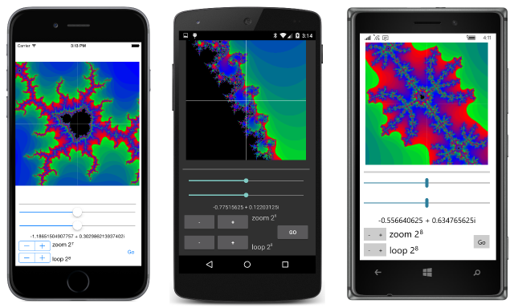

# Summary of Chapter 20. Async and file I/O

[ Download the sample](https://github.com/xamarin/xamarin-forms-book-samples/tree/master/Chapter20)

> [!NOTE]
> This book was published in the spring of 2016, and has not been updated since then. There is much in the book that remains valuable, but some of the material is outdated, and some topics are no longer entirely correct or complete.

A graphical user interface must respond to user-input events sequentially. This implies that all processing of user-input events must occur in a single thread, often called the *main thread* or the *UI thread*.

Users expect graphical user interfaces to be responsive. This means that a program must process user-input events quickly. If that is not possible, then processing must be relegated to secondary threads of execution.

Several sample programs in this book have used the [`WebRequest`](xref:System.Net.WebRequest) class. In this class the [`BeginGetResponse`](xref:System.Net.WebRequest.BeginGetResponse(System.AsyncCallback,System.Object)) method starts a worker thread, which calls a callback function when it is complete. However, that callback function runs in the worker thread, so the program must call [`Device.BeginInvokeOnMainThread`](xref:Xamarin.Forms.Device.BeginInvokeOnMainThread(System.Action)) method to access the user interface.

> [!NOTE]
> Xamarin.Forms programs should use [`HttpClient`](xref:System.Net.Http.HttpClient) rather than [`WebRequest`](xref:System.Net.WebRequest) for accessing files over the internet. `HttpClient` supports asynchronous operations.

A more modern approach to asynchronous processing is available in .NET and C#. This involves the [`Task`](xref:System.Threading.Tasks.Task) and [`Task<TResult>`](xref:System.Threading.Tasks.Task`1) classes, and other types in the [`System.Threading`](xref:System.Threading) and [`System.Threading.Tasks`](xref:System.Threading.Tasks) namespaces, as well as the C# 5.0 `async` and `await` keywords. That's what this chapter focuses on.

## From callbacks to await

The `Page` class itself contains three asynchronous methods to display alert boxes:

- [`DisplayAlert`](xref:Xamarin.Forms.Page.DisplayAlert(System.String,System.String,System.String)) returns a `Task` object
- [`DisplayAlert`](xref:Xamarin.Forms.Page.DisplayAlert(System.String,System.String,System.String,System.String)) returns a `Task<bool>` object
- [`DisplayActionSheet`](xref:Xamarin.Forms.Page.DisplayActionSheet(System.String,System.String,System.String,System.String[])) returns a `Task<string>` object

The `Task` objects indicate that these methods implement the Task-based Asynchronous Pattern, known as TAP. These `Task` objects are returned quickly from the method. The `Task<T>` return values constitute a "promise" that a value of type `TResult` will be available when the task completes. The `Task` return value indicates an asynchronous action that will complete but with no value returned.

In all these cases, the `Task` is complete when the user dismisses the alert box.  

### An alert with callbacks

The [**AlertCallbacks**](https://github.com/xamarin/xamarin-forms-book-samples/tree/master/Chapter20/AlertCallbacks) sample demonstrates how to handle `Task<bool>` return objects and `Device.BeginInvokeOnMainThread` calls using callback methods.

### An alert with lambdas

The [**AlertLambdas**](https://github.com/xamarin/xamarin-forms-book-samples/tree/master/Chapter20/AlertLambdas)
sample demonstrates how to use anonymous lambda functions for handling `Task` and `Device.BeginInvokeOnMainThread` calls.  

### An alert with await

A more straightforward approach involves the `async` and `await` keywords introduced in C# 5. The  [**AlertAwait**](https://github.com/xamarin/xamarin-forms-book-samples/tree/master/Chapter20/AlertAwait)
sample demonstrates their use.

### An alert with nothing

If the asynchronous method returns `Task` rather than `Task<TResult>`, then the program doesn't need to use any of these techniques if it doesn't need to know when the asynchronous task completes. The
[**NothingAlert**](https://github.com/xamarin/xamarin-forms-book-samples/tree/master/Chapter20/NothingAlert)
sample demonstrates this.

### Saving program settings asynchronously

The [**SaveProgramChanges**](https://github.com/xamarin/xamarin-forms-book-samples/tree/master/Chapter20/SaveProgramSettings) sample demonstrates the use of the [`SavePropertiesAsync`](xref:Xamarin.Forms.Application.SavePropertiesAsync) method of `Application` to save program settings as they change without overriding the `OnSleep` method.

### A platform-independent timer

It's possible to use [`Task.Delay`](xref:System.Threading.Tasks.Task.Delay(System.Int32)) to create a platform-independent timer. The
[**TaskDelayClock**](https://github.com/xamarin/xamarin-forms-book-samples/tree/master/Chapter20/TaskDelayClock) sample demonstrates this.

## File input/output

Traditionally, the .NET [`System.IO`](xref:System.IO) namespace has been the source of file I/O support. Although some methods in this namespace support asynchronous operations, most do not. The namespace also supports several simple method calls that perform sophisticated file I/O functions.

### Good news and bad news

All the platforms supported by Xamarin.Forms support application local storage &mdash; storage that is private to the application.

The Xamarin.iOS and Xamarin.Android libraries include a version of .NET that Xamarin has expressly tailored for these two platforms. These include classes from `System.IO` that you can use to perform file I/O with application local storage in these two platforms.

However, if you search for these `System.IO` classes in a Xamarin.Forms PCL, you won't find them. The problem is that Microsoft completely revamped file I/O for the Windows Runtime API. Programs targeting Windows 8.1, Windows Phone 8.1, and the Universal Windows Platform do not use `System.IO` for file I/O.

This means that you'll need to use the [`DependencyService`](xref:Xamarin.Forms.DependencyService) (first discussed in [**Chapter 9. Platform-specific API calls**](chapter09.md) to implement file I/O.

> [!NOTE]
> Portable Class Libaries have been replaced with .NET Standard 2.0 libraries, and .NET Standard 2.0 supports [`System.IO`](xref:System.IO) types for all Xamarin.Forms platforms. It is no longer necessary to use a `DependencyService` for most file I/O tasks. See [File Handling in Xamarin.Forms](~/xamarin-forms/data-cloud/data/files.md) for a more modern approach to file I/O.

### A first shot at cross-platform file I/O

The
[**TextFileTryout**](https://github.com/xamarin/xamarin-forms-book-samples/tree/master/Chapter20/TextFileTryout) sample defines an [`IFileHelper`](https://github.com/xamarin/xamarin-forms-book-samples/blob/master/Chapter20/TextFileTryout/TextFileTryout/TextFileTryout/IFileHelper.cs) interface for file I/O, and implementations of this interface in all the platforms. However, the Windows Runtime implementations don't work with the methods in this interface because the Windows Runtime file I/O methods are asynchronous.

### Accommodating Windows Runtime file I/O

Programs running under the Windows Runtime use classes in the [`Windows.Storage`](/uwp/api/Windows.Storage) and [`Windows.Storage.Streams`](/uwp/api/Windows.Storage.Streams) namespaces for file I/O, including application local storage. Because Microsoft determined that any operation requiring more than 50 milliseconds should be asynchronous to avoid blocking the UI thread, these file I/O methods are mostly asynchronous.

The code demonstrating this new approach will be in a library so that it can be used by other applications.

## Platform-specific libraries

It's advantageous to store reusable code in libraries. This is obviously more difficult when different pieces of the reusable code are for entirely different operating systems.

The [**Xamarin.FormsBook.Platform**](https://github.com/xamarin/xamarin-forms-book-samples/tree/master/Libraries/Xamarin.FormsBook.Platform) solution demonstrates one approach. This solution contains seven different projects:

- [**Xamarin.FormsBook.Platform**](https://github.com/xamarin/xamarin-forms-book-samples/tree/master/Libraries/Xamarin.FormsBook.Platform/Xamarin.FormsBook.Platform), a normal Xamarin.Forms PCL
- [**Xamarin.FormsBook.Platform.iOS**](https://github.com/xamarin/xamarin-forms-book-samples/tree/master/Libraries/Xamarin.FormsBook.Platform/Xamarin.FormsBook.Platform.iOS), an iOS class library
- [**Xamarin.FormsBook.Platform.Android**](https://github.com/xamarin/xamarin-forms-book-samples/tree/master/Libraries/Xamarin.FormsBook.Platform/Xamarin.FormsBook.Platform.Android), an Android class library
- [**Xamarin.FormsBook.Platform.UWP**](https://github.com/xamarin/xamarin-forms-book-samples/tree/master/Libraries/Xamarin.FormsBook.Platform/Xamarin.FormsBook.Platform.UWP), a Universal Windows class library
- [**Xamarin.FormsBook.Platform.WinRT**](https://github.com/xamarin/xamarin-forms-book-samples/tree/master/Libraries/Xamarin.FormsBook.Platform/Xamarin.FormsBook.Platform.WinRT), a shared project for code that is common to all the Windows platforms

All the individual platform projects (with the exception of **Xamarin.FormsBook.Platform.WinRT**) have references to **Xamarin.FormsBook.Platform**. The three Windows projects have a reference to **Xamarin.FormsBook.Platform.WinRT**.

All the projects contain a static `Toolkit.Init` method to ensure that the library is loaded if it's not directly referenced by a project in a Xamarin.Forms application solution.

The **Xamarin.FormsBook.Platform** project contains the new [`IFileHelper`](https://github.com/xamarin/xamarin-forms-book-samples/blob/master/Libraries/Xamarin.FormsBook.Platform/Xamarin.FormsBook.Platform/IFileHelper.cs) interface. All the methods now have names with `Async` suffixes and return `Task` objects.

The **Xamarin.FormsBook.Platform.WinRT** project contains the [`FileHelper`](https://github.com/xamarin/xamarin-forms-book-samples/blob/master/Libraries/Xamarin.FormsBook.Platform/Xamarin.FormsBook.Platform.WinRT/FileHelper.cs) class for the Windows Runtime.

The **Xamarin.FormsBook.Platform.iOS** project contains the [`FileHelper`](https://github.com/xamarin/xamarin-forms-book-samples/blob/master/Libraries/Xamarin.FormsBook.Platform/Xamarin.FormsBook.Platform.iOS/FileHelper.cs) class for iOS. These methods must now be asynchronous. Some of the methods use the asynchronous versions of methods defined in `StreamWriter` and `StreamReader`: [`WriteAsync`](xref:System.IO.StreamWriter.WriteAsync(System.String)) and [`ReadToEndAsync`](xref:System.IO.StreamReader.ReadToEndAsync). Others convert a result to a `Task` object using the [`FromResult`](xref:System.Threading.Tasks.Task.FromResult*) method.

The **Xamarin.FormsBook.Platform.Android** project contains a similar [`FileHelper`](https://github.com/xamarin/xamarin-forms-book-samples/blob/master/Libraries/Xamarin.FormsBook.Platform/Xamarin.FormsBook.Platform.Android/FileHelper.cs) class for Android.

The **Xamarin.FormsBook.Platform** project also contains a [`FileHelper`](https://github.com/xamarin/xamarin-forms-book-samples/blob/master/Libraries/Xamarin.FormsBook.Platform/Xamarin.FormsBook.Platform/FileHelper.cs) class that eases the use of the `DependencyService` object.

To use these libraries, an application solution must include all the projects in the **Xamarin.FormsBook.Platform** solution, and each of the application projects must have a reference to the corresponding library in **Xamarin.FormsBook.Platform**.

The [**TextFileAsync**](https://github.com/xamarin/xamarin-forms-book-samples/tree/master/Chapter20/TextFileAsync) solution demonstrates how to use the **Xamarin.FormsBook.Platform** libraries. Each of the projects has a call to `Toolkit.Init`. The application makes use of the asynchronous file I/O functions.

### Keeping it in the background

Methods in libraries that make calls to multiple asynchronous methods &mdash; such as the `WriteFileAsync` and `ReadFileASync` methods in the Windows Runtime [`FileHelper`](https://github.com/xamarin/xamarin-forms-book-samples/blob/master/Libraries/Xamarin.FormsBook.Platform/Xamarin.FormsBook.Platform.WinRT/FileHelper.cs) class &mdash; can be made somewhat more efficient by using the [`ConfigureAwait`](xref:System.Threading.Tasks.Task`1.ConfigureAwait(System.Boolean)) method to avoid switching back to the user-interface thread.

### Don't block the UI thread!

Sometimes it's tempting to avoid the use of `ContinueWith` or `await` by using the [`Result`](xref:System.Threading.Tasks.Task`1.Result) property on the methods. This should be avoided for it can block the UI thread or even hang the application.

## Your own awaitable methods

You can run some code asynchronously by passing it to one of the [`Task.Run`](xref:System.Threading.Tasks.Task.Run(System.Action)) methods. You can call `Task.Run` within an async method that handles some of the overhead.

The various `Task.Run` patterns are discussed below.

### The basic Mandelbrot set

To draw the Mandelbrot set in real time, the [**Xamarin.Forms.Toolkit**](https://github.com/xamarin/xamarin-forms-book-samples/tree/master/Libraries/Xamarin.FormsBook.Toolkit) library has a [`Complex`](https://github.com/xamarin/xamarin-forms-book-samples/blob/master/Libraries/Xamarin.FormsBook.Toolkit/Xamarin.FormsBook.Toolkit/Complex.cs) structure similar to the one in the `System.Numerics` namespace.

The [**MandelbrotSet**](https://github.com/xamarin/xamarin-forms-book-samples/tree/master/Chapter20/MandelbrotSet) sample has a `CalculateMandeblotAsync` method in its code-behind file that calculates the basic black-and-white Mandelbrot set and uses [`BmpMaker`](https://github.com/xamarin/xamarin-forms-book-samples/blob/master/Libraries/Xamarin.FormsBook.Toolkit/Xamarin.FormsBook.Toolkit/BmpMaker.cs) to put it on a bitmap.

### Marking progress

To report progress from an asynchronous method, you can instantiate a [`Progress<T>`](xref:System.Progress`1) class and define your asynchronous method to have an argument of type [`IProgress<T>`](xref:System.IProgress`1). This is demonstrated in the [**MandelbrotProgress**](https://github.com/xamarin/xamarin-forms-book-samples/tree/master/Chapter20/MandelbrotProgress) sample.

### Cancelling the job

You can also write an asynchronous method to be cancellable. You begin with a class named [`CancellationTokenSource`](xref:System.Threading.CancellationTokenSource). The [`Token`](xref:System.Threading.CancellationTokenSource.Token) property is a value of type [`CancellationToken`](xref:System.Threading.CancellationToken). This is passed to the asynchronous function. A program calls the [`Cancel`](xref:System.Threading.CancellationTokenSource.Cancel) method of `CancellationTokenSource` (generally in response to an action by the user) to cancel the asynchronous function.

The asynchronous method can periodically check the [`IsCancellationRequested`](xref:System.Threading.CancellationToken.IsCancellationRequested) property of `CancellationToken` and exit if the property is `true`, or simply call the [`ThrowIfCancellationRequested`](xref:System.Threading.CancellationToken.ThrowIfCancellationRequested) method, in which case the method ends with an [`OperationCancelledException`](xref:System.OperationCanceledException).

The [**MandelbrotCancellation**](https://github.com/xamarin/xamarin-forms-book-samples/tree/master/Chapter20/MandelbrotCancellation) sample demonstrates the use of a cancellable function.

### An MVVM Mandelbrot

The
[**MandelbrotXF**](https://github.com/xamarin/xamarin-forms-book-samples/tree/master/Chapter20/MandelbrotXF) sample has a more extensive user interface, and it's mostly based on a [`MandelbrotModel`](https://github.com/xamarin/xamarin-forms-book-samples/blob/master/Chapter20/MandelbrotXF/MandelbrotXF/MandelbrotXF/MandelbrotModel.cs) and [`MandelbrotViewModel`](https://github.com/xamarin/xamarin-forms-book-samples/blob/master/Chapter20/MandelbrotXF/MandelbrotXF/MandelbrotXF/MandelbrotViewModel.cs) classes:

## Back to the web

The [`WebRequest`](xref:System.Net.WebRequest) class used in some samples uses an old-fashioned asynchronous protocol called the Asynchronous Programming Model or APM. You can convert such a class to the modern TAP protocol using one of the `FromAsync` methods in the [`TaskFactory`](xref:System.Threading.Tasks.TaskFactory`1) class. The
[**ApmToTap**](https://github.com/xamarin/xamarin-forms-book-samples/tree/master/Chapter20/ApmToTap)
sample demonstrates this.

## Related links

- [Full eBook text (PDF)](https://aka.ms/xamformsebook)
- [Chapter 20 samples](https://github.com/xamarin/xamarin-forms-book-samples/tree/master/Chapter20)
- [Working with Files](~/xamarin-forms/data-cloud/data/files.md)
