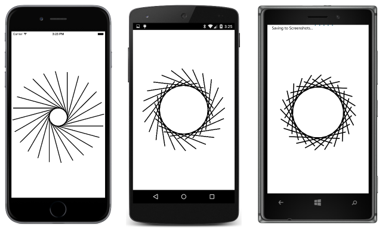
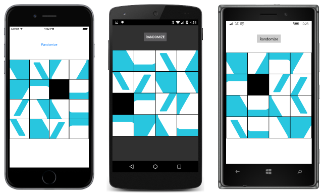

# Summary of Chapter 22. Animation

[ Download the sample](https://github.com/xamarin/xamarin-forms-book-samples/tree/master/Chapter22)

> [!NOTE]
> This book was published in the spring of 2016, and has not been updated since then. There is much in the book that remains valuable, but some of the material is outdated, and some topics are no longer entirely correct or complete.

You've seen that you can create your own animations using the Xamarin.Forms timer or `Task.Delay`, but it is generally easier using the animation facilities provided by Xamarin.Forms. Three classes implement these animations:

- [`ViewExtensions`](xref:Xamarin.Forms.ViewExtensions), the high-level approach
- [`Animation`](xref:Xamarin.Forms.Animation), more versatile but harder
- [`AnimationExtension`](xref:Xamarin.Forms.AnimationExtensions), the most versatile, lowest-level approach

Generally, animations target properties that are backed by bindable properties. This is not a requirement but these are the only properties that dynamically react to changes.

There is no XAML interface for these animations, but you can integrate animations into XAML using techniques discussed in [**Chapter 23. Triggers and Behaviors**](chapter23.md).

## Exploring basic animations

The basic animation functions are extension methods found in the [`ViewExtensions`](xref:Xamarin.Forms.ViewExtensions) class. These methods apply to any object that derives from `VisualElement`. The simplest animations target the transforms properties discussed in [`Chapter 21. Transforms`](chapter21.md).

The [**AnimationTryout**](https://github.com/xamarin/xamarin-forms-book-samples/tree/master/Chapter22/AnimationTryout) demonstrates how the `Clicked` event handler for a `Button` can call the [`RotateTo`](xref:Xamarin.Forms.ViewExtensions.RotateTo(Xamarin.Forms.VisualElement,System.Double,System.UInt32,Xamarin.Forms.Easing)) extension method to spin the button in a circle.

The `RotateTo` method changes the `Rotation` property of the `Button` from 0 to 360 over the course of one-quarter second (by default). If the `Button` is tapped again, however, it does nothing because the `Rotation` property is already 360 degrees.

### Setting the animation duration

The second argument to `RotateTo` is a duration in milliseconds. If set to a large value, tapping the `Button` during an animation starts a new animation beginning at the current angle.

### Relative animations

The `RelRotateTo` method performs a relative rotation by adding a specified value to the existing value. This method allows the `Button` to be tapped multiple times, and each time increases the `Rotation` property by 360 degrees.

### Awaiting animations

All the animation methods in `ViewExtensions` return `Task<bool>` objects. This means that you can define a series of sequential animations using `ContinueWith` or `await`. The `bool` completion return value is `false` if the animation finished without interruption or `true` if it was cancelled by the [`CancelAnimation`](xref:Xamarin.Forms.ViewExtensions.CancelAnimations(Xamarin.Forms.VisualElement)) method, which cancels all animations initiated by the other method in `ViewExtensions` that are set on the same element.

### Composite animations

You can mix awaited and non-awaited animations to create composite animations. These are the  animations in `ViewExtensions` that target the `TranslationX`, `TranslationY`, and `Scale` transform properties:

- [`TranslateTo`](xref:Xamarin.Forms.ViewExtensions.TranslateTo(Xamarin.Forms.VisualElement,System.Double,System.Double,System.UInt32,Xamarin.Forms.Easing))
- [`ScaleTo`](xref:Xamarin.Forms.ViewExtensions.ScaleTo(Xamarin.Forms.VisualElement,System.Double,System.UInt32,Xamarin.Forms.Easing))
- [`RelScaleTo`](xref:Xamarin.Forms.ViewExtensions.RelScaleTo(Xamarin.Forms.VisualElement,System.Double,System.UInt32,Xamarin.Forms.Easing))

Notice that `TranslateTo` potentially affects both the `TranslationX` and `TranslationY` properties.

### Task.WhenAll and Task.WhenAny

It is also possible to manage simultaneous animations using [`Task.WhenAll`](xref:System.Threading.Tasks.Task.WhenAll*), which signals when multiple tasks have all concluded, and [`Task.WhenAny`](xref:System.Threading.Tasks.Task.WhenAny*), which signals when the first of several tasks has concluded.

### Rotation and anchors

When calling the `ScaleTo`, `RelScaleTo`, `RotateTo`, and `RelRotateTo` methods, you can set the [`AnchorX`](xref:Xamarin.Forms.VisualElement.AnchorX) and [`AnchorY`](xref:Xamarin.Forms.VisualElement.AnchorY) properties to indicate the center of scaling and rotation.

The [**CircleButton**](https://github.com/xamarin/xamarin-forms-book-samples/tree/master/Chapter22/CircleButton) demonstrates this technique by revolving a `Button` around the center of the page.

### Easing functions

Generally animations are linear from a start value to an end value. Easing functions can cause animations to speed up or slow down over their course. The last optional argument to the animation methods is of type [`Easing`](xref:Xamarin.Forms.Easing), a class that defines 11 static read-only fields of type `Easing`:

- [`Linear`](xref:Xamarin.Forms.Easing.Linear), the default
- [`SinIn`](xref:Xamarin.Forms.Easing.SinIn), [`SinOut`](xref:Xamarin.Forms.Easing.SinOut), and [`SinInOut`](xref:Xamarin.Forms.Easing.SinInOut)
- [`CubicIn`](xref:Xamarin.Forms.Easing.CubicIn), [`CubicOut`](xref:Xamarin.Forms.Easing.CubicOut), and [`CubicInOut`](xref:Xamarin.Forms.Easing.CubicInOut)
- [`BounceIn`](xref:Xamarin.Forms.Easing.BounceIn) and [`BounceOut`](xref:Xamarin.Forms.Easing.BounceOut)
- [`SpringIn`](xref:Xamarin.Forms.Easing.SpringIn) and [`SpringOut`](xref:Xamarin.Forms.Easing.SpringOut)

The `In` suffix indicates that the effect is at the beginning of the animation, `Out` means at the end, and `InOut` means that it's at the beginning and end of the animation.

The [**BounceButton**](https://github.com/xamarin/xamarin-forms-book-samples/tree/master/Chapter22/BounceButton) sample demonstrates the use of easing functions.

### Your own easing functions

You can also define you own easing functions by passing a [`Func<double, double>`](xref:System.Func`2) to the [`Easing` constructor](xref:Xamarin.Forms.Easing.%23ctor(System.Func{System.Double,System.Double})). `Easing` also defines an implicit conversion from `Func<double, double>` to `Easing`. The argument to the easing function is always in the range of 0 to 1 as the animation proceeds linearly from beginning to end. The function *usually* returns a value in the range of 0 to 1, but could be briefly negative or greater than 1 (as is the case with the `SpringIn` and `SpringOut` functions) or could break the rules if you know what you're doing.

The [**UneasyScale**](https://github.com/xamarin/xamarin-forms-book-samples/tree/master/Chapter22/UneasyScale) sample demonstrates a custom easing function, and [**CustomCubicEase**](https://github.com/xamarin/xamarin-forms-book-samples/tree/master/Chapter22/CustomCubicEase) demonstrates another.

The [**SwingButton**](https://github.com/xamarin/xamarin-forms-book-samples/tree/master/Chapter22/SwingButton) sample also demonstrates a custom easing function, and also a technique of changing the `AnchorX` and `AnchorY` properties within a sequence of rotation animations.

The [**Xamarin.FormsBook.Toolkit**](https://github.com/xamarin/xamarin-forms-book-samples/tree/master/Libraries/Xamarin.FormsBook.Toolkit) library has a [`JiggleButton`](https://github.com/xamarin/xamarin-forms-book-samples/blob/master/Libraries/Xamarin.FormsBook.Toolkit/Xamarin.FormsBook.Toolkit/JiggleButton.cs) class that uses a custom easing function to jiggle a button when it's clicked. The [**JiggleButtonDemo**](https://github.com/xamarin/xamarin-forms-book-samples/tree/master/Chapter22/JiggleButtonDemo) sample demonstrates it.

### Entrance animations

One popular type of animation occurs when a page first appears. Such an animation can be started in the [`OnAppearing`](xref:Xamarin.Forms.Page.OnAppearing) override of the page. For these animations, its best to set up the XAML for how you want the page to appear *after* the animation, and then initialize and animate the layout from code.

The [**FadingEntrance**](https://github.com/xamarin/xamarin-forms-book-samples/tree/master/Chapter22/FadingEntrance) sample uses the [`FadeTo`](xref:Xamarin.Forms.ViewExtensions.FadeTo(Xamarin.Forms.VisualElement,System.Double,System.UInt32,Xamarin.Forms.Easing)) extension method to fade in the contents of the page.

The [**SlidingEntrance**](https://github.com/xamarin/xamarin-forms-book-samples/tree/master/Chapter22/SlidingEntrance) sample uses the [`TranslateTo`](xref:Xamarin.Forms.ViewExtensions.TranslateTo(Xamarin.Forms.VisualElement,System.Double,System.Double,System.UInt32,Xamarin.Forms.Easing)) extension method to slide in the contents of the page from the sides.

The [**SwingingEntrance**](https://github.com/xamarin/xamarin-forms-book-samples/tree/master/Chapter22/SwingingEntrance) sample uses the [`RotateYTo`](xref:Xamarin.Forms.ViewExtensions.RotateYTo(Xamarin.Forms.VisualElement,System.Double,System.UInt32,Xamarin.Forms.Easing)) extension method to animate the `RotationY` property. A [`RotateXTo`](xref:Xamarin.Forms.ViewExtensions.RotateXTo(Xamarin.Forms.VisualElement,System.Double,System.UInt32,Xamarin.Forms.Easing)) method is also available.

### Forever animations

At the other extreme, "forever" animations run until the program is terminated. These are generally intended for demonstration purposes.

The [**FadingTextAnimation**](https://github.com/xamarin/xamarin-forms-book-samples/tree/master/Chapter22/FadingTextAnimation) sample uses [`FadeTo`](xref:Xamarin.Forms.ViewExtensions.FadeTo(Xamarin.Forms.VisualElement,System.Double,System.UInt32,Xamarin.Forms.Easing)) animation to fade two pieces of text in and out.

[**PalindromeAnimation**](https://github.com/xamarin/xamarin-forms-book-samples/tree/master/Chapter22/PalindromeAnimation) displays a palindrome, and then sequentially rotates the individual letters by 180 degrees so they're all upside-down. Then the entire string is flipped 180 degrees to read the same as the original string.

The [**CopterAnimation**](https://github.com/xamarin/xamarin-forms-book-samples/tree/master/Chapter22/CopterAnimation) sample rotates a simple `BoxView` helicopter while revolving it around the center of the screen.

[**RotatingSpokes**](https://github.com/xamarin/xamarin-forms-book-samples/tree/master/Chapter22/RotatingSpokes) revolves `BoxView` spokes around the center of the screen, and then rotates each spoke itself to create interesting patterns:

However, progressively increasing the `Rotation` property of an element might not work in the long term, as the [**RotationBreakdown**](https://github.com/xamarin/xamarin-forms-book-samples/tree/master/Chapter22/RotationBreakdown) sample demonstrates.

The [**SpinningImage**](https://github.com/xamarin/xamarin-forms-book-samples/tree/master/Chapter22/SpinningImage) sample uses [`RotateTo`](xref:Xamarin.Forms.ViewExtensions.RotateTo(Xamarin.Forms.VisualElement,System.Double,System.UInt32,Xamarin.Forms.Easing)), [`RotateXTo`](xref:Xamarin.Forms.ViewExtensions.RotateXTo(Xamarin.Forms.VisualElement,System.Double,System.UInt32,Xamarin.Forms.Easing)), and [`RotateYTo`](xref:Xamarin.Forms.ViewExtensions.RotateYTo(Xamarin.Forms.VisualElement,System.Double,System.UInt32,Xamarin.Forms.Easing)) to make it seem as if a bitmap is rotating in 3D space.

### Animating the bounds property

The only extension method in `ViewExtensions` not yet demonstrated is [`LayoutTo`](xref:Xamarin.Forms.ViewExtensions.LayoutTo(Xamarin.Forms.VisualElement,Xamarin.Forms.Rectangle,System.UInt32,Xamarin.Forms.Easing)), which effectively animates the read-only [`Bounds`](xref:Xamarin.Forms.VisualElement.Bounds) property by calling the [`Layout`](xref:Xamarin.Forms.VisualElement.Layout(Xamarin.Forms.Rectangle)) method. This method is normally called by `Layout` derivatives as will be discussed in [**Chapter 26. CustomLayouts**](chapter26.md).

The `LayoutTo` method should be restricted to special purposes. The [**BouncingBox**](https://github.com/xamarin/xamarin-forms-book-samples/tree/master/Chapter22/BouncingBox) program uses it to compress and expand a `BoxView` as it bounces off the sides of a page.

The [**XamagonXuzzle**](https://github.com/xamarin/xamarin-forms-book-samples/tree/master/Chapter22/XamagonXuzzle) sample uses `LayoutTo` to move tiles in an implementation of the classic 15-16 puzzle that displays a scrambled image rather than numbered tiles:

### Your own awaitable animations

The [**TryAwaitableAnimation**](https://github.com/xamarin/xamarin-forms-book-samples/tree/master/Chapter22/TryAwaitableAnimation) sample creates an awaitable animation. The crucial class that can return a `Task` object from the method and signal when the animation is completed is [`TaskCompletionSource`](xref:System.Threading.Tasks.TaskCompletionSource`1).

## Deeper into animations

The Xamarin.Forms animation system can be a little confusing. In addition to the `Easing` class, the animation system comprises the `ViewExtensions`, `Animation`, and `AnimationExtension` classes.

### ViewExtensions class

You've already seen [`ViewExtensions`](xref:Xamarin.Forms.ViewExtensions). It defines nine methods that return `Task<bool>` and [`CancelAnimations`](xref:Xamarin.Forms.ViewExtensions.CancelAnimations(Xamarin.Forms.VisualElement)). Seven of the nine methods target transform properties. The other two are [`FadeTo`](xref:Xamarin.Forms.ViewExtensions.FadeTo(Xamarin.Forms.VisualElement,System.Double,System.UInt32,Xamarin.Forms.Easing)), which targets the [`Opacity`](xref:Xamarin.Forms.VisualElement.Opacity) property, and [`LayoutTo`](xref:Xamarin.Forms.ViewExtensions.LayoutTo(Xamarin.Forms.VisualElement,Xamarin.Forms.Rectangle,System.UInt32,Xamarin.Forms.Easing)), which calls the [`Layout`](xref:Xamarin.Forms.VisualElement.Layout(Xamarin.Forms.Rectangle)) method.

### Animation class

The [`Animation`](xref:Xamarin.Forms.AnimationExtensions) class has a [constructor](xref:Xamarin.Forms.Animation.%23ctor(System.Action{System.Double},System.Double,System.Double,Xamarin.Forms.Easing,System.Action)) with five arguments to define callback and finished methods, and parameters of the animation.

Child animations can be added with [`Add`](xref:Xamarin.Forms.Animation.Add(System.Double,System.Double,Xamarin.Forms.Animation)), [`Insert`](xref:Xamarin.Forms.Animation.Insert(System.Double,System.Double,Xamarin.Forms.Animation)), [`WithConcurrent`](xref:Xamarin.Forms.Animation.WithConcurrent(Xamarin.Forms.Animation,System.Double,System.Double)), and overload of [`WithConcurrent`](xref:Xamarin.Forms.Animation.WithConcurrent(System.Action{System.Double},System.Double,System.Double,Xamarin.Forms.Easing,System.Double,System.Double)).

The animation object is then started with a call to the [`Commit`](xref:Xamarin.Forms.Animation.Commit(Xamarin.Forms.IAnimatable,System.String,System.UInt32,System.UInt32,Xamarin.Forms.Easing,System.Action{System.Double,System.Boolean},System.Func{System.Boolean})) method.

### AnimationExtensions class

The [`AnimationExtensions`](xref:Xamarin.Forms.AnimationExtensions) class contains mostly extension methods. There are several versions of an `Animate` method and the generic [`Animate`](xref:Xamarin.Forms.AnimationExtensions.Animate*) method is so versatile that it's really the only animation function you need.

## Working with the Animation class

The [**ConcurrentAnimations**](https://github.com/xamarin/xamarin-forms-book-samples/tree/master/Chapter22/ConcurrentAnimations) sample demonstrates the [`Animation`](xref:Xamarin.Forms.Animation) class with several different animations.

### Child animations

The [**ConcurrentAnimations**](https://github.com/xamarin/xamarin-forms-book-samples/tree/master/Chapter22/ConcurrentAnimations) sample also demonstrates child animations, which make use of the (very similar) [`Add`](xref:Xamarin.Forms.Animation.Add(System.Double,System.Double,Xamarin.Forms.Animation)) and [`Insert`](xref:Xamarin.Forms.Animation.Insert(System.Double,System.Double,Xamarin.Forms.Animation)) methods.

### Beyond the high-level animation methods

The [**ConcurrentAnimations**](https://github.com/xamarin/xamarin-forms-book-samples/tree/master/Chapter22/ConcurrentAnimations) sample also demonstrates how to perform animations that go beyond the properties targeted by the `ViewExtensions` methods. In one example, a series of periods get longer; in another example, a `BackgroundColor` property is animated.

### More of your own awaitable methods

The [`TranslateTo`](xref:Xamarin.Forms.ViewExtensions.TranslateTo(Xamarin.Forms.VisualElement,System.Double,System.Double,System.UInt32,Xamarin.Forms.Easing)) method of `ViewExtensions` doesn't work with the [`Easing.SpringOut`](xref:Xamarin.Forms.Easing.SpringOut) function. It stops when the easing output gets above 1.

The [**Xamarin.FormsBook.Toolkit**](https://github.com/xamarin/xamarin-forms-book-samples/tree/master/Libraries/Xamarin.FormsBook.Toolkit) library contains a [`MoreViewExtensions`](https://github.com/xamarin/xamarin-forms-book-samples/blob/master/Libraries/Xamarin.FormsBook.Toolkit/Xamarin.FormsBook.Toolkit/MoreViewExtensions.cs) class with [`TranslateXTo`](https://github.com/xamarin/xamarin-forms-book-samples/blob/master/Libraries/Xamarin.FormsBook.Toolkit/Xamarin.FormsBook.Toolkit/MoreViewExtensions.cs#L12) and [`TranslateYTo`](https://github.com/xamarin/xamarin-forms-book-samples/blob/master/Libraries/Xamarin.FormsBook.Toolkit/Xamarin.FormsBook.Toolkit/MoreViewExtensions.cs#L49) extension methods that don't have this problem, as well as [`CancelTranslateXTo`](https://github.com/xamarin/xamarin-forms-book-samples/blob/master/Libraries/Xamarin.FormsBook.Toolkit/Xamarin.FormsBook.Toolkit/MoreViewExtensions.cs#L44) and [`CancelTranslateYTo`](https://github.com/xamarin/xamarin-forms-book-samples/blob/master/Libraries/Xamarin.FormsBook.Toolkit/Xamarin.FormsBook.Toolkit/MoreViewExtensions.cs#L71) methods for cancelling those animations.

The [**SpringSlidingEntrance**](https://github.com/xamarin/xamarin-forms-book-samples/tree/master/Chapter22/SpringSlidingEntrance) demonstrates the `TranslateXTo` method.

The `MoreExtensions` class also contains a  [`TranslateXYTo`](https://github.com/xamarin/xamarin-forms-book-samples/blob/master/Libraries/Xamarin.FormsBook.Toolkit/Xamarin.FormsBook.Toolkit/MoreViewExtensions.cs#L76) extension method that combines X and Y translation, and a [`CancelTranslateXYTo`](https://github.com/xamarin/xamarin-forms-book-samples/blob/master/Libraries/Xamarin.FormsBook.Toolkit/Xamarin.FormsBook.Toolkit/MoreViewExtensions.cs#L113) method.

### Implementing a Bezier animation

It is also possible to develop an animation that moves an element along the path of a Bezier spline. The [**Xamarin.FormsBook.Toolkit**](https://github.com/xamarin/xamarin-forms-book-samples/tree/master/Libraries/Xamarin.FormsBook.Toolkit) library contains a [`BezierSpline`](https://github.com/xamarin/xamarin-forms-book-samples/blob/master/Libraries/Xamarin.FormsBook.Toolkit/Xamarin.FormsBook.Toolkit/BezierSpline.cs) structure that encapsulates a Bezier spline and a [`BezierTangent`](https://github.com/xamarin/xamarin-forms-book-samples/blob/master/Libraries/Xamarin.FormsBook.Toolkit/Xamarin.FormsBook.Toolkit/BezierTangent.cs) enumeration to control orientation.

The [`MoreViewExtensions`](https://github.com/xamarin/xamarin-forms-book-samples/blob/master/Libraries/Xamarin.FormsBook.Toolkit/Xamarin.FormsBook.Toolkit/MoreViewExtensions.cs) class contains a
[`BezierPathTo`](https://github.com/xamarin/xamarin-forms-book-samples/blob/master/Libraries/Xamarin.FormsBook.Toolkit/Xamarin.FormsBook.Toolkit/MoreViewExtensions.cs#L118) extension method
and a [`CancelBezierPathTo`](https://github.com/xamarin/xamarin-forms-book-samples/blob/master/Libraries/Xamarin.FormsBook.Toolkit/Xamarin.FormsBook.Toolkit/MoreViewExtensions.cs#L161) method.

The [**BezierLoop**](https://github.com/xamarin/xamarin-forms-book-samples/tree/master/Chapter22/BezierLoop) sample demonstrates animating an element along a Beizer path.

## Working with AnimationExtensions

One type of animation missing from the standard collection is a color animation. The problem is that there is no right way to interpolate between two `Color` values. It's possible to interpolate the individual RGB values, but just as valid is interpolating the HSL values.

For this reason, the [`MoreViewExtensions`](https://github.com/xamarin/xamarin-forms-book-samples/blob/master/Libraries/Xamarin.FormsBook.Toolkit/Xamarin.FormsBook.Toolkit/MoreViewExtensions.cs) class in the  [**Xamarin.FormsBook.Toolkit**](https://github.com/xamarin/xamarin-forms-book-samples/tree/master/Libraries/Xamarin.FormsBook.Toolkit) library contains two `Color` animation methods:
[`RgbColorAnimation`](https://github.com/xamarin/xamarin-forms-book-samples/blob/master/Libraries/Xamarin.FormsBook.Toolkit/Xamarin.FormsBook.Toolkit/MoreViewExtensions.cs#L166) and
[`HslColorAnimation`](https://github.com/xamarin/xamarin-forms-book-samples/blob/master/Libraries/Xamarin.FormsBook.Toolkit/Xamarin.FormsBook.Toolkit/MoreViewExtensions.cs#L188). (There are also two cancellation methods:
[`CancelRgbColorAnimation`](https://github.com/xamarin/xamarin-forms-book-samples/blob/master/Libraries/Xamarin.FormsBook.Toolkit/Xamarin.FormsBook.Toolkit/MoreViewExtensions.cs#L183) and
[`CancelHslColorAnimation`](https://github.com/xamarin/xamarin-forms-book-samples/blob/master/Libraries/Xamarin.FormsBook.Toolkit/Xamarin.FormsBook.Toolkit/MoreViewExtensions.cs#L206)).

Both methods make use of [`ColorAnimation`](https://github.com/xamarin/xamarin-forms-book-samples/blob/master/Libraries/Xamarin.FormsBook.Toolkit/Xamarin.FormsBook.Toolkit/MoreViewExtensions.cs#L211), which performs the animation by calling the extensive generic [`Animate`](xref:Xamarin.Forms.AnimationExtensions.Animate*) method in [`AnimationExtensions`](xref:Xamarin.Forms.AnimationExtensions).

The [**ColorAnimations**](https://github.com/xamarin/xamarin-forms-book-samples/tree/master/Chapter22/ColorAnimations) sample demonstrates using these two types of color animations.

## Structuring your animations

It's sometimes useful to express animations in XAML and use them in conjunction with MVVM. This is covered in the next chapter, [**Chapter 23. Triggers and Behaviors**](chapter23.md).

## Related links

- [Full eBook text (PDF)](https://aka.ms/xamformsebook)
- [Chapter 22 samples](https://github.com/xamarin/xamarin-forms-book-samples/tree/master/Chapter22)
- [Animation](~/xamarin-forms/user-interface/animation/index.md)
