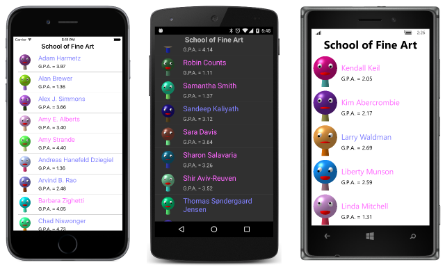
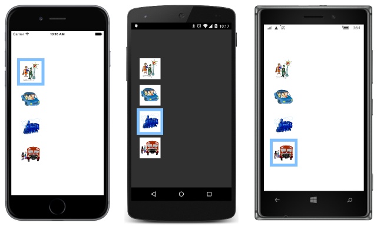

# Summary of Chapter 23. Triggers and behaviors

[ Download the sample](https://github.com/xamarin/xamarin-forms-book-samples/tree/master/Chapter23)

> [!NOTE]
> This book was published in the spring of 2016, and has not been updated since then. There is much in the book that remains valuable, but some of the material is outdated, and some topics are no longer entirely correct or complete.

Triggers and behaviors are similar, in that they are both intended to be used in XAML files to simplify element interactions beyond the use of data bindings, and to extend the functionality of XAML elements. Both triggers and behaviors are almost always used with visual user-interface objects.

To support triggers and behaviors, both `VisualElement` and `Style` support two collection properties:

- [`VisualElement.Triggers`](xref:Xamarin.Forms.VisualElement.Triggers) and [`Style.Triggers`](xref:Xamarin.Forms.Style.Triggers) of type `IList<TriggerBase>`
- [`VisualElement.Behaviors`](xref:Xamarin.Forms.VisualElement.Behaviors) and [`Style.Behaviors`](xref:Xamarin.Forms.Style.Behaviors) of type `IList<Behavior>`

## Triggers

A trigger is a condition (a property change or the firing of an event) that results in a response (another property change or running some code). The `Triggers` property of `VisualElement` and `Style` is of type `IList<TriggersBase>`. [`TriggerBase`](xref:Xamarin.Forms.TriggerBase) is an abstract class from which four sealed classes derive:

- [`Trigger`](xref:Xamarin.Forms.Trigger) for responses based on property changes
- [`EventTrigger`](xref:Xamarin.Forms.EventTrigger) for responses based on event firings
- [`DataTrigger`](xref:Xamarin.Forms.DataTrigger) for responses based on data bindings
- [`MultiTrigger`](xref:Xamarin.Forms.MultiTrigger) for responses based on multiple triggers

The trigger is always set on the element whose property is being changed by the trigger.

### The simplest trigger

The [`Trigger`](xref:Xamarin.Forms.Trigger) class checks for a change of a property value and responds by setting another property of the same element.

`Trigger` defines three properties:

- [`Property`](xref:Xamarin.Forms.Trigger.Property) of type `BindableProperty`
- [`Value`](xref:Xamarin.Forms.Trigger.Value) of type `Object`
- [`Setters`](xref:Xamarin.Forms.Trigger.Setters) of type `IList<SetterBase>`, the content property of `Trigger`

In addition, `Trigger` requires that the following property inherited from `TriggerBase` be set:

- [`TargetType`](xref:Xamarin.Forms.TriggerBase.TargetType) to indicate the type of the element on which the `Trigger` is attached

The `Property` and `Value` comprise the condition, and the `Setters` collection is the response. When the indicated `Property` has the value indicated by `Value`, then the `Setter` objects in the `Setters` collection are applied. When the `Property` has a different value, the setters are removed. `Setter` defines two properties that are the same as the first two properties of `Trigger`:

- [`Property`](xref:Xamarin.Forms.Setter.Property) of type `BindableProperty`
- [`Value`](xref:Xamarin.Forms.Setter.Value) of type `Object`

The [**EntryPop**](https://github.com/xamarin/xamarin-forms-book-samples/tree/master/Chapter23/EntryPop) sample demonstrates how a `Trigger` applied to an `Entry` can increase the size of the `Entry` via the `Scale` property when the `IsFocused` property of the `Entry` is `true`.

Although it's not common,  the `Trigger` can be set in code, as the [**EntryPopCode**](https://github.com/xamarin/xamarin-forms-book-samples/tree/master/Chapter23/EntryPopCode) sample demonstrates.

The [**StyledTriggers**](https://github.com/xamarin/xamarin-forms-book-samples/tree/master/Chapter23/StyledTriggers) sample demonstrates how the `Trigger` can be set in a `Style` to apply to multiple `Entry` elements.

### Trigger actions and animations

It is also possible to run a little code based on a trigger. This code can be an animation that targets a property. One common way is to use an [`EventTrigger`](xref:Xamarin.Forms.EventTrigger), which defines two properties:

- [`Event`](xref:Xamarin.Forms.EventTrigger.Event) of type `string`, the name of an event
- [`Actions`](xref:Xamarin.Forms.EventTrigger.Actions) of type `IList<TriggerAction>`, a list of actions to run in response.

To use this, you need to write a class that derives from [`TriggerAction<T>`](xref:Xamarin.Forms.TriggerAction`1), generally `TriggerAction<VisualElement>`. You can define properties in this class. These are plain CLR properties rather than bindable properties because `TriggerAction` doesn't derive from `BindableObject`. You must override the [`Invoke`](xref:Xamarin.Forms.TriggerAction`1.Invoke*) method that is called when the action is invoked. The argument is the target element.

The [`ScaleAction`](https://github.com/xamarin/xamarin-forms-book-samples/blob/master/Libraries/Xamarin.FormsBook.Toolkit/Xamarin.FormsBook.Toolkit/ScaleAction.cs) class in the [**Xamarin.FormsBook.Toolkit**](https://github.com/xamarin/xamarin-forms-book-samples/tree/master/Libraries/Xamarin.FormsBook.Toolkit) library is an example. It calls the `ScaleTo` property to animate the `Scale` property of an element. Because one of its properties is of type `Easing`, the [`EasingConverter`](https://github.com/xamarin/xamarin-forms-book-samples/blob/master/Libraries/Xamarin.FormsBook.Toolkit/Xamarin.FormsBook.Toolkit/EasingConverter.cs) class lets you use the standard `Easing` static fields in XAML.

The [**EntrySwell**](https://github.com/xamarin/xamarin-forms-book-samples/tree/master/Chapter23/EntrySwell) sample demonstrates how to invoke the `ScaleAction` from `EventTrigger` objects that monitor the `Focused` and `Unfocused` events.

The [**CustomEasingSwell**](https://github.com/xamarin/xamarin-forms-book-samples/tree/master/Chapter23/CustomEasingSwell) sample shows how to define a custom easing function for `ScaleAction` in a code-behind file.

You can also invoke actions using a `Trigger` (as distinguished from `EventTrigger`). This requires that you are aware that `TriggerBase` defines two collections:

- [`EnterActions`](xref:Xamarin.Forms.TriggerBase.EnterActions) of type `IList<TriggerAction>`
- [`ExitActions`](xref:Xamarin.Forms.TriggerBase.ExitActions) of type `IList<TriggerAction>`

The [**EnterExitSwell**](https://github.com/xamarin/xamarin-forms-book-samples/tree/master/Chapter23/EnterExitSwell) sample demonstrates how to use these collections.

### More event triggers

The [`ScaleUpAndDownAction`](https://github.com/xamarin/xamarin-forms-book-samples/blob/master/Libraries/Xamarin.FormsBook.Toolkit/Xamarin.FormsBook.Toolkit/ScaleUpAndDownAction.cs) class in the [**Xamarin.FormsBook.Toolkit**](https://github.com/xamarin/xamarin-forms-book-samples/tree/master/Libraries/Xamarin.FormsBook.Toolkit) library calls `ScaleTo` twice to scale up and down. The
[**ButtonGrowth**](https://github.com/xamarin/xamarin-forms-book-samples/tree/master/Chapter23/ButtonGrowth) sample uses this in a styled `EventTrigger` to provide visual feedback when a `Button` is pressed. This double animation is also possible using two actions in the collection of type [`DelayedScaleAction`](https://github.com/xamarin/xamarin-forms-book-samples/blob/master/Libraries/Xamarin.FormsBook.Toolkit/Xamarin.FormsBook.Toolkit/DelayedScaleAction.cs)

The [`ShiverAction`](https://github.com/xamarin/xamarin-forms-book-samples/blob/master/Libraries/Xamarin.FormsBook.Toolkit/Xamarin.FormsBook.Toolkit/ShiverAction.cs) class in the **Xamarin.FormsBook.Toolkit** library defines a customizable shiver action. The
[**ShiverButtonDemo**](https://github.com/xamarin/xamarin-forms-book-samples/tree/master/Chapter23/ShiverButtonDemo) sample demonstrates it.

The [`NumericValidationAction`](https://github.com/xamarin/xamarin-forms-book-samples/blob/master/Libraries/Xamarin.FormsBook.Toolkit/Xamarin.FormsBook.Toolkit/NumericValidationAction.cs) class in the **Xamarin.FormsBook.Toolkit** library is restricted to `Entry` elements and sets the `TextColor` property to red if the `Text` property is not a `double`. The
[**TriggerEntryValidation**](https://github.com/xamarin/xamarin-forms-book-samples/tree/master/Chapter23/TriggerEntryValidation) sample demonstrates it.

### Data triggers

The [`DataTrigger`](xref:Xamarin.Forms.DataTrigger) is similar to the `Trigger` except that instead of monitoring a property for value changes, it monitors a data binding. This allows a property in one element to affect a property in another element.

`DataTrigger` defines three properties:

- [`Binding`](xref:Xamarin.Forms.DataTrigger.Binding) of type `BindingBase`
- [`Value`](xref:Xamarin.Forms.DataTrigger.Value) of type `Object`
- [`Setters`](xref:Xamarin.Forms.DataTrigger.Setters) of type `IList<SetterBase>`

The [**GenderColors**](https://github.com/xamarin/xamarin-forms-book-samples/tree/master/Chapter23/GenderColors) sample requires the [**SchoolOfFineArt**](https://github.com/xamarin/xamarin-forms-book-samples/tree/master/Libraries/SchoolOfFineArt) library and sets the colors of the names of the students to blue or pink based on the `Sex` property:

The [**ButtonEnabler**](https://github.com/xamarin/xamarin-forms-book-samples/tree/master/Chapter23/ButtonEnabler) sample sets the `IsEnabled` property of an `Entry` to `False` if the `Length` property of the `Text` property of the `Entry` equals 0. Notice that the `Text` property is initialized to an empty string; by default it is `null`, and the `DataTrigger` wouldn't work correctly.

### Combining conditions in the MultiTrigger

The [`MultiTrigger`](xref:Xamarin.Forms.MultiTrigger) is a collection of conditions. When they are all `true`, then setters are applied. The class defines two properties:

- [`Conditions`](xref:Xamarin.Forms.MultiTrigger.Conditions) of type `IList<Condition>`
- [`Setters`](xref:Xamarin.Forms.MultiTrigger.Setters) of type `IList<Setter>`

[`Condition`](xref:Xamarin.Forms.Condition) is an abstract class and has two descendent classes:

- [`PropertyCondition`](xref:Xamarin.Forms.Condition), which has [`Property`](xref:Xamarin.Forms.PropertyCondition.Property) and [`Value`](xref:Xamarin.Forms.PropertyCondition.Value) properties like `Trigger`
- [`BindingCondition`](xref:Xamarin.Forms.BindingCondition), which has [`Binding`](xref:Xamarin.Forms.BindingCondition.Binding) and [`Value`](xref:Xamarin.Forms.BindingCondition.Value) properties like `DataTrigger`

In the [**AndConditions**](https://github.com/xamarin/xamarin-forms-book-samples/tree/master/Chapter23/AndConditions) sample, a `BoxView` is only colored when four `Switch` elements are all turned on.

The [**OrConditions**](https://github.com/xamarin/xamarin-forms-book-samples/tree/master/Chapter23/OrConditions) sample demonstrates how you can make a `BoxView` a color when *any* of four `Switch` elements are turned on. This requires an application of De Morgan's Law and reversing all the logic.

Combining AND and OR logic is not so easy and generally requires invisible `Switch` elements for intermediate results. The
[**XorConditions**](https://github.com/xamarin/xamarin-forms-book-samples/tree/master/Chapter23/XorConditions) sample demonstrates how a `Button` can be enabled if either of two `Entry` elements have some text typed in, but not if they both have some text typed in.

## Behaviors

Anything you can do with a trigger, you can also do with a behavior, but behaviors always require a class that derives from [`Behavior<T>`](xref:Xamarin.Forms.Behavior`1) and overrides the following two methods:

- [`OnAttachedTo`](xref:Xamarin.Forms.Behavior`1.OnAttachedTo*)
- [`OnDetachingFrom`](xref:Xamarin.Forms.Behavior`1.OnDetachingFrom*)

The argument is the element that the behavior is attached to. Generally, the `OnAttachedTo` method attaches some event handlers, and `OnDetachingFrom` detaches them. Because such a class usually saves some state, it generally cannot be shared in a `Style`.

[**BehaviorEntryValidation**](https://github.com/xamarin/xamarin-forms-book-samples/tree/master/Chapter23/BehaviorEntryValidation) sample is similar to **TriggerEntryValidation** except that it uses a behavior &mdash; the [`NumericValidationBehavior`](https://github.com/xamarin/xamarin-forms-book-samples/blob/master/Libraries/Xamarin.FormsBook.Toolkit/Xamarin.FormsBook.Toolkit/NumericValidationBehavior.cs) class in the [**Xamarin.FormsBook.Toolkit**](https://github.com/xamarin/xamarin-forms-book-samples/tree/master/Libraries/Xamarin.FormsBook.Toolkit) library.

### Behaviors with properties

`Behavior<T>` derives from `Behavior`, which derives from `BindableObject`, so bindable properties can be defined on a behavior. These properties can be active in data bindings.

This is demonstrated in the
[**EmailValidationDemo**](https://github.com/xamarin/xamarin-forms-book-samples/tree/master/Chapter23/EmailValidationDemo) program that makes use of the [`ValidEmailBehavior`](https://github.com/xamarin/xamarin-forms-book-samples/blob/master/Libraries/Xamarin.FormsBook.Toolkit/Xamarin.FormsBook.Toolkit/ValidEmailBehavior.cs) class in the  [**Xamarin.FormsBook.Toolkit**](https://github.com/xamarin/xamarin-forms-book-samples/tree/master/Libraries/Xamarin.FormsBook.Toolkit) library. `ValidEmailBehavior` has a read-only bindable property and serves as a source in data bindings.

The [**EmailValidationConv**](https://github.com/xamarin/xamarin-forms-book-samples/tree/master/Chapter23/EmailValidationConv) sample uses this same behavior to display another type of indicator to signal that an email address is valid.

The [**EmailValidationTrigger**](https://github.com/xamarin/xamarin-forms-book-samples/tree/master/Chapter23/EmailValidationTrigger) sample is a variation on the previous sample. ButtonGlide uses a `DataTrigger` in combination with that behavior.

### Toggles and check boxes

It's possible to encapsulate the behavior of a toggle button in a class such as [`ToggleBehavior`](https://github.com/xamarin/xamarin-forms-book-samples/blob/master/Libraries/Xamarin.FormsBook.Toolkit/Xamarin.FormsBook.Toolkit/ToggleBehavior.cs) in the [**Xamarin.FormsBook.Toolkit**](https://github.com/xamarin/xamarin-forms-book-samples/tree/master/Libraries/Xamarin.FormsBook.Toolkit) library, and then define all the visuals for the toggle entirely in XAML.

The [**ToggleLabel**](https://github.com/xamarin/xamarin-forms-book-samples/tree/master/Chapter23/ToggleLabel) sample uses the `ToggleBehavior` with a `DataTrigger` to use a `Label` with two text strings for the toggle.

The [**FormattedTextToggle**](https://github.com/xamarin/xamarin-forms-book-samples/tree/master/Chapter23/FormattedTextToggle) sample extends this concept by switching between two `FormattedString` objects.

The [`ToggleBase`](https://github.com/xamarin/xamarin-forms-book-samples/blob/master/Libraries/Xamarin.FormsBook.Toolkit/Xamarin.FormsBook.Toolkit/ToggleBase.cs) class in the **Xamarin.FormsBook.Toolkit** library derives from `ContentView`, defines an `IsToggled` property, and incorporates a `ToggleBehavior` for the toggle logic. This makes it easier to define the toggle button in XAML, as demonstrated by the [**TraditionalCheckBox**](https://github.com/xamarin/xamarin-forms-book-samples/tree/master/Chapter23/TraditionalCheckBox) sample.

The [**SwitchCloneDemo**](https://github.com/xamarin/xamarin-forms-book-samples/tree/master/Chapter23/SwitchCloneDemo) includes a [`SwitchClone`](https://github.com/xamarin/xamarin-forms-book-samples/blob/master/Chapter23/SwitchCloneDemo/SwitchCloneDemo/SwitchCloneDemo/SwitchClone.cs) class that derives from `ToggleBase` and uses a [`TranslateAction`](https://github.com/xamarin/xamarin-forms-book-samples/blob/master/Libraries/Xamarin.FormsBook.Toolkit/Xamarin.FormsBook.Toolkit/TranslateAction.cs) class to construct a toggle button that resembles the Xamarin.Forms `Switch`.

A [`RotateAction`](https://github.com/xamarin/xamarin-forms-book-samples/blob/master/Libraries/Xamarin.FormsBook.Toolkit/Xamarin.FormsBook.Toolkit/RotateAction.cs) in the **Xamarin.FormsBook.Toolkit** provides an animation used to make an animated lever in the [**LeverToggle**](https://github.com/xamarin/xamarin-forms-book-samples/tree/master/Chapter23/LeverToggle) sample.

### Responding to taps

One drawback of `EventTrigger` is that you can't attach it to a `TapGestureRecognizer` to respond to taps. Getting around that problem is the purpose of [`TapBehavior`](https://github.com/xamarin/xamarin-forms-book-samples/blob/master/Libraries/Xamarin.FormsBook.Toolkit/Xamarin.FormsBook.Toolkit/TapBehavior.cs) in the [**Xamarin.FormsBook.Toolkit**](https://github.com/xamarin/xamarin-forms-book-samples/tree/master/Libraries/Xamarin.FormsBook.Toolkit)

The [**BoxViewTapShiver**](https://github.com/xamarin/xamarin-forms-book-samples/tree/master/Chapter23/BoxViewTapShiver) sample uses `TapBehavior` to use the earlier `ShiverAction` for tapped `BoxView` elements.

The [**ShiverViews**](https://github.com/xamarin/xamarin-forms-book-samples/tree/master/Chapter23/ShiverViews) sample shows how to cut down on the markup by encapsulating a `ShiverView` class.

### Radio buttons

The [**Xamarin.FormsBook.Toolkit**](https://github.com/xamarin/xamarin-forms-book-samples/tree/master/Libraries/Xamarin.FormsBook.Toolkit) library also has a [`RadioBehavior`](https://github.com/xamarin/xamarin-forms-book-samples/blob/master/Libraries/Xamarin.FormsBook.Toolkit/Xamarin.FormsBook.Toolkit/RadioBehavior.cs) class for making radio buttons that are grouped by a `string` group name.

The [**RadioLabels**](https://github.com/xamarin/xamarin-forms-book-samples/tree/master/Chapter23/RadioLabels) program uses text strings for its radio button. The [**RadioStyle**](https://github.com/xamarin/xamarin-forms-book-samples/tree/master/Chapter23/RadioStyle) sample uses a `Style` for the difference in appearance between checked and unchecked buttons. The
[**RadioImages**](https://github.com/xamarin/xamarin-forms-book-samples/tree/master/Chapter23/RadioImages) sample uses boxed images for its radio buttons:

The
[**TraditionalRadios**](https://github.com/xamarin/xamarin-forms-book-samples/tree/master/Chapter23/TraditionalRadios) sample draws traditional appearing radio buttons with a dot inside a circle.

### Fades and orientation

The final sample, [**MultiColorSliders**](https://github.com/xamarin/xamarin-forms-book-samples/tree/master/Chapter23/MultiColorSliders) allows you to switch between three different color-selection views using radio buttons. The three views fade in and out using a [`FadeEnableAction`](https://github.com/xamarin/xamarin-forms-book-samples/blob/master/Libraries/Xamarin.FormsBook.Toolkit/Xamarin.FormsBook.Toolkit/FadeEnableAction.cs) in the [**Xamarin.FormsBook.Toolkit**](https://github.com/xamarin/xamarin-forms-book-samples/tree/master/Libraries/Xamarin.FormsBook.Toolkit) library.

The program also responds to changes in orientation between portrait and landscape using a [`GridOrientationBehavior`](https://github.com/xamarin/xamarin-forms-book-samples/blob/master/Libraries/Xamarin.FormsBook.Toolkit/Xamarin.FormsBook.Toolkit/GridOrientationBehavior.cs) in the **Xamarin.FormsBook.Toolkit** library.

## Related links

- [Full eBook text (PDF)](https://aka.ms/xamformsebook)
- [Chapter 23 samples](https://github.com/xamarin/xamarin-forms-book-samples/tree/master/Chapter23)
- [Working with Triggers](~/xamarin-forms/app-fundamentals/triggers.md)
- [Xamarin.Forms Behaviors](~/xamarin-forms/app-fundamentals/behaviors/creating.md)
