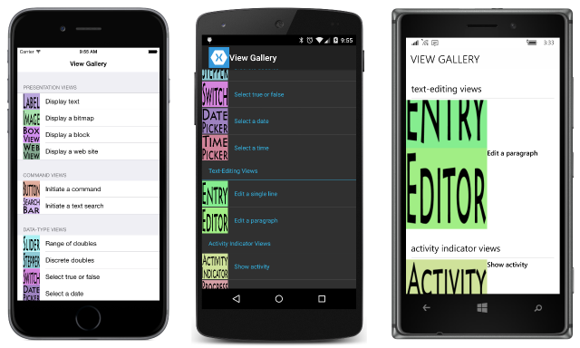

# Summary of Chapter 24. Page navigation

[ Download the sample](https://github.com/xamarin/xamarin-forms-book-samples/tree/master/Chapter24)

> [!NOTE]
> This book was published in the spring of 2016, and has not been updated since then. There is much in the book that remains valuable, but some of the material is outdated, and some topics are no longer entirely correct or complete.

Many applications consist of multiple pages among which the user navigates. The application always has a *main* page or *home* page, and from there the user navigates to other pages, which are maintained in a stack for navigating back. Additional navigation options are covered in [**Chapter 25. Page Varieties**](chapter25.md).

## Modal pages and modeless pages

`VisualElement` defines a [`Navigation`](xref:Xamarin.Forms.NavigableElement.Navigation) property of type [`INavigation`](xref:Xamarin.Forms.INavigation), which includes the following two methods to navigate to a new page:

- [`PushAsync`](xref:Xamarin.Forms.INavigation.PushAsync(Xamarin.Forms.Page))
- [`PushModalAsync`](xref:Xamarin.Forms.INavigation.PushModalAsync(Xamarin.Forms.Page))

Both methods accept a `Page` instance as an argument and return a `Task` object. The following two methods navigate back to the previous page:

- [`PopAsync`](xref:Xamarin.Forms.INavigation.PopAsync)
- [`PopModalAsync`](xref:Xamarin.Forms.INavigation.PopModalAsync)

If the user interface has its own **Back** button (as Android and Windows phones do) then it's not necessary for the application to call these methods.

Although these methods are available from any `VisualElement`, generally they are called from the `Navigation` property of the current `Page` instance.

Applications generally use modal pages when the user is required to supply some information on the page before returning to the previous page. Pages that are not modal are sometimes called modeless or *hierarchical*. Nothing in the page itself distinguishes it as modal or modeless; it's governed instead by the method used to navigate to it. To work across all platforms, a modal page must provide its own user interface for navigating back to the previous page.

The [**ModelessAndModal**](https://github.com/xamarin/xamarin-forms-book-samples/tree/master/Chapter24/ModelessAndModal) sample allows you to explore the difference between modeless and modal pages. Any application that uses page navigation must pass its home page to the [`NavigationPage`](xref:Xamarin.Forms.NavigationPage) constructor, generally in the program's `App` class. One bonus is that you no longer need to set a `Padding` on the page for iOS.

You will discover that for modeless pages, the page's [`Title`](xref:Xamarin.Forms.Page.Title) property is displayed. The iOS, Android, and the Windows tablet and desktop platforms all provide a user-interface element to navigate back to the previous page. Of course, Android, and Windows phone devices have a standard **Back** button to go back.

For modal pages, the page `Title` is not displayed, and no user-interface element is provided to go back to the previous page. Although you can use the Android and Windows phone standard **Back** button to return to the previous page, the modal page on the other platforms must provide its own mechanism to go back.

### Animated page transitions

Alternative versions of the various navigation methods are provided with a second Boolean argument that you set to `true` if you want the page transition to include an animation:

- [PushAsync](xref:Xamarin.Forms.INavigation.PushAsync(Xamarin.Forms.Page,System.Boolean))
- [PushModalAsync](xref:Xamarin.Forms.INavigation.PushModalAsync(Xamarin.Forms.Page,System.Boolean))
- [PopAsync](xref:Xamarin.Forms.INavigation.PopAsync(System.Boolean))
- [PopModalAsync](xref:Xamarin.Forms.INavigation.PopModalAsync(System.Boolean))

However, the standard page-navigation methods include the animation by default, so these are only valuable for navigating to a particular page on startup (as discussed towards the end of this chapter) or when providing your own entrance animation (as discussed in [**Chapter22. Animation**](chapter22.md)).

### Visual and functional variations

`NavigationPage` includes two properties that you can set when you instantiate the class in your `App` method:

- [`BarBackgroundColor`](xref:Xamarin.Forms.NavigationPage.BarBackgroundColor)
- [`BarTextColor`](xref:Xamarin.Forms.NavigationPage.BarTextColor)

`NavigationPage` also includes four attached bindable properties that affect the particular page on which they are set:

- [`SetHasBackButton`](xref:Xamarin.Forms.NavigationPage.SetHasBackButton(Xamarin.Forms.Page,System.Boolean)) and [`GetHasBackButton`](xref:Xamarin.Forms.NavigationPage.GetHasBackButton(Xamarin.Forms.Page))
- [`SetHasNavigationBar`](xref:Xamarin.Forms.NavigationPage.SetHasNavigationBar(Xamarin.Forms.BindableObject,System.Boolean)) and [`GetHasNavigationBar`](xref:Xamarin.Forms.NavigationPage.GetHasNavigationBar(Xamarin.Forms.BindableObject))
- [`SetBackButtonTitle`](xref:Xamarin.Forms.NavigationPage.SetBackButtonTitle(Xamarin.Forms.BindableObject,System.String)) and [`GetBackButtonTitle`](xref:Xamarin.Forms.NavigationPage.GetBackButtonTitle(Xamarin.Forms.BindableObject)) work on iOS only
- [`SetTitleIcon`](xref:Xamarin.Forms.NavigationPage.SetTitleIcon(Xamarin.Forms.BindableObject,Xamarin.Forms.FileImageSource)) and [`GetTitleIcon`](xref:Xamarin.Forms.NavigationPage.GetTitleIcon(Xamarin.Forms.BindableObject)) work on iOS and Android only

### Exploring the mechanics

The page navigation methods are all asynchronous and should be used with `await`. The completion doesn't indicate that page navigation has completed, but only that it's safe to examine the page-navigation stack.

When one page navigates to another, the first page generally gets a call to its [`OnDisappearing`](xref:Xamarin.Forms.Page.OnDisappearing) method, and the second page gets a call to its [`OnAppearing`](xref:Xamarin.Forms.Page.OnAppearing) method. Similarly, when one page returns to another, the first page gets a call to its `OnDisappearing` method, and the second page generally gets a call to its `OnAppearing` method. The order of these calls (and the completion of the asynchronous methods that invokes the navigation) is platform dependent. The use of the word "generally" in the two preceding statements is due to Android modal-page navigation, in which these method calls don't occur.

Also, calls to the `OnAppearing` and `OnDisappearing` methods don't necessarily indicate page navigation.

The `INavigation` interface includes two collection properties that allow you to examine the navigation stack:

- [`NavigationStack`](xref:Xamarin.Forms.INavigation.NavigationStack) of type `IReadOnlyList<Page>` for the modeless stack
- [`ModalStack`](xref:Xamarin.Forms.INavigation.ModalStack) of type `IReadOnlyList<Page>` for the modal stack

It is safest to access these stacks from the `Navigation` property of the `NavigationPage` (which should be the `App` class's [`MainPage`](xref:Xamarin.Forms.Application.MainPage) property). It is only safe to examine these stacks after the asynchronous page-navigation methods have completed. The [`CurrentPage`](xref:Xamarin.Forms.NavigationPage.CurrentPage) property of the `NavigationPage` does not indicate the current page if the current page is a modal page, but indicates instead the last modeless page.

The [**SinglePageNavigation**](https://github.com/xamarin/xamarin-forms-book-samples/tree/master/Chapter24/SinglePageNavigation) sample lets you explore page navigation and the stacks, and the legal types of page navigations:

- A modeless page can navigate to another modeless page or a modal page
- A modal page can navigate only to another modal page

### Enforcing modality

An application uses a modal page when it's necessary to obtain some information from the user. The user should be prohibited from returning to the previous page until that information is provided. On iOS, it's easy to provide a **Back** button and enable it only when the user has finished with the page. But for Android and Windows phone devices, the application should override the [`OnBackButtonPressed`](xref:Xamarin.Forms.Page.OnBackButtonPressed) method and return `true` if program has handled the **Back** button itself, as demonstrated in the [**ModalEnforcement**](https://github.com/xamarin/xamarin-forms-book-samples/tree/master/Chapter24/ModalEnforcement) sample.

The [**MvvmEnforcement**](https://github.com/xamarin/xamarin-forms-book-samples/tree/master/Chapter24/MvvmEnforcement) sample demonstrates how this works in an MVVM scenario.

## Navigation variations

If a particular modal page can be navigated to multiple times, it should retain information so that the user can edit the information rather than typing it all in again. You can handle this by retaining the particular instance of the modal page, but a better approach (particularly on iOS) is preserving the information in a view model.

### Making a navigation menu

The [**ViewGalleryType**](https://github.com/xamarin/xamarin-forms-book-samples/tree/master/Chapter24/ViewGalleryType) sample demonstrates using a `TableView` to list menu items. Each item is associated with a `Type` object for a particular page. When that item is selected, the program instantiates the page and navigates to it.

The [**ViewGalleryInst**](https://github.com/xamarin/xamarin-forms-book-samples/tree/master/Chapter24/ViewGalleryInst) sample is a little different in that the menu contains instances of each page rather than types. This helps retain the information from each page, but all the pages must be instantiated at program startup.

### Manipulating the navigation stack

[**StackManipulation**](https://github.com/xamarin/xamarin-forms-book-samples/tree/master/Chapter24/StackManipulation) demonstrates several functions defined by `INavigation` that let you manipulate the navigation stack in a structured manner:

- [`RemovePage`](xref:Xamarin.Forms.INavigation.RemovePage(Xamarin.Forms.Page))
- [`InsertPageBefore`](xref:Xamarin.Forms.INavigation.InsertPageBefore(Xamarin.Forms.Page,Xamarin.Forms.Page))
- [`PopToRootAsync`](xref:Xamarin.Forms.INavigation.PopToRootAsync) and [`PopToRootAsync`](xref:Xamarin.Forms.INavigation.PopToRootAsync(System.Boolean)) with optional animation

### Dynamic page generation

The [**BuildAPage**](https://github.com/xamarin/xamarin-forms-book-samples/tree/master/Chapter24/BuildAPage) sample demonstrates constructing a page at runtime based on user input.

## Patterns of data transfer

It is often necessary to share data between pages &mdash; to transfer data to a navigated page, and for a page to return data to the page that invoked it. There are several techniques for doing this.

### Constructor arguments

When navigating to a new page, it's possible to instantiate the page class with a constructor argument that allows the page to initialize itself. The
[**SchoolAndStudents**](https://github.com/xamarin/xamarin-forms-book-samples/tree/master/Chapter24/SchoolAndStudents) sample demonstrates this. It's also possible for the navigated page to have its `BindingContext` set by the page that navigates to it.

### Properties and method calls

The remaining data transfer examples explore the problem of passing information between pages when one page navigates to another page and back. In these discussions, the *home* page navigates to the *info* page, and must transfer initialized information to the *info* page. The *info* page obtains additional information from the user and transfers the information to the *home* page.

The *home* page can easily access public methods and properties in the *info* page as soon as it instantiates that page. The *info* page can also access public methods and properties in the *home* page, but choosing a good time for this can be tricky. The [**DateTransfer1**](https://github.com/xamarin/xamarin-forms-book-samples/tree/master/Chapter24/DataTransfer1) sample does this in its `OnDisappearing` override. One drawback is that the *info* page needs to know the type of the *home* page.

### MessagingCenter

The Xamarin.Forms [`MessagingCenter`](xref:Xamarin.Forms.MessagingCenter) class provides another way for two pages to communicate with each other. Messages are identified by a text string and can be accompanied by any object.

A program that wishes to receive messages from a particular type must subscribe to them using [`MessagingCenter.Subscribe`](xref:Xamarin.Forms.MessagingCenter.Subscribe*) and specify a callback function. Later it can unsubscribe by calling [`MessagingCenter.Unsubscribe`](xref:Xamarin.Forms.MessagingCenter.Unsubscribe*). The callback function receives any message sent from the specified type with the specified name sent through the [`Send`](xref:Xamarin.Forms.MessagingCenter.Send*) method.

The [**DateTransfer2**](https://github.com/xamarin/xamarin-forms-book-samples/tree/master/Chapter24/DataTransfer2) program demonstrates how to transfer data using the messaging center, but again this requires that the *info* page know the type of the *home* page.

### Events

The event is a time-honored approach for one class to send information to another class without knowing that class's type. In the [**DateTransfer3**](https://github.com/xamarin/xamarin-forms-book-samples/tree/master/Chapter24/DataTransfer3) sample the *info* class defines an event that it fires when the information is ready. However, there is no convenient place for the *home* page to detach the event handler.

### The App class intermediary

The [**DateTransfer4**](https://github.com/xamarin/xamarin-forms-book-samples/tree/master/Chapter24/DataTransfer4) sample shows how to access properties defined in the `App` class by both the *home* page and the *info* page. This is a good solution, but the next section describes something better.

### Switching to a ViewModel

Using a ViewModel for the information allows the *home* page and the *info* page to share the instance of the information class. This is demonstrated in the
[**DateTransfer5**](https://github.com/xamarin/xamarin-forms-book-samples/tree/master/Chapter24/DataTransfer5) sample.

### Saving and restoring page state

The `App` class intermediary or the ViewModel approach is ideal when the application must save information if the program goes to sleep while the *info* page is active. The
[**DateTransfer6**](https://github.com/xamarin/xamarin-forms-book-samples/tree/master/Chapter24/DataTransfer6) sample demonstrates this.

## Saving and restoring the navigation stack

In the general case, a multipage program that goes to sleep should navigate to the same page when it is restored. This means that such a program should save the contents of the navigation stack. This section shows how to automate this process in a class designed for this purpose. This class also calls the individual pages to allow them to save and restore their page state.

The [**Xamarin.FormsBook.Toolkit**](https://github.com/xamarin/xamarin-forms-book-samples/tree/master/Libraries/Xamarin.FormsBook.Toolkit) library defines an interface named [`IPersistantPage`](https://github.com/xamarin/xamarin-forms-book-samples/blob/master/Libraries/Xamarin.FormsBook.Toolkit/Xamarin.FormsBook.Toolkit/IPersistentPage.cs) that classes can implement to save and restore items in the `Properties` dictionary.

The [`MultiPageRestorableApp`](https://github.com/xamarin/xamarin-forms-book-samples/blob/master/Libraries/Xamarin.FormsBook.Toolkit/Xamarin.FormsBook.Toolkit/MultiPageRestorableApp.cs) class in the **Xamarin.FormsBook.Toolkit** library derives from `Application`. You can then derive your `App` class from `MultiPageRestorableApp` and perform some housekeeping.

The [**StackRestoreDemo**](https://github.com/xamarin/xamarin-forms-book-samples/tree/master/Chapter24/StackRestoreDemo) demonstrates the use of `MultiPageRestorableApp`.

### Something like a real-life app

The [**NoteTaker**](https://github.com/xamarin/xamarin-forms-book-samples/tree/master/Chapter24/NoteTaker) sample also makes use of `MultiPageRestorableApp` and allows for the entering and editing of notes that are saved in the `Properties` dictionary.

## Related links

- [Full eBook text (PDF)](https://aka.ms/xamformsebook)
- [Chapter 24 samples](https://github.com/xamarin/xamarin-forms-book-samples/tree/master/Chapter24)
- [Hierarchical Navigation](~/xamarin-forms/app-fundamentals/navigation/hierarchical.md)
- [Modal Pages](~/xamarin-forms/app-fundamentals/navigation/modal.md)
