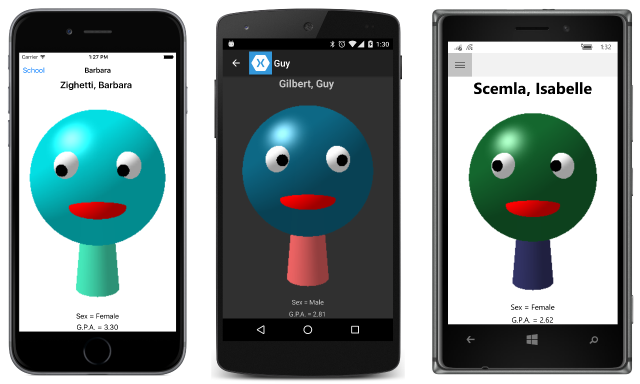
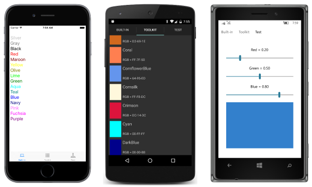

# Summary of Chapter 25. Page varieties

[ Download the sample](https://github.com/xamarin/xamarin-forms-book-samples/tree/master/Chapter25)

> [!NOTE]
> This book was published in the spring of 2016, and has not been updated since then. There is much in the book that remains valuable, but some of the material is outdated, and some topics are no longer entirely correct or complete.

So far you've seen two classes that derive from `Page`: `ContentPage` and `NavigationPage`. This chapter presents two others:

- [`MasterDetailPage`](xref:Xamarin.Forms.MasterDetailPage) manages two pages, a master and a detail
- [`TabbedPage`](xref:Xamarin.Forms.TabbedPage) manages multiple child pages accessed through tabs

These page types provide more sophisticated navigation options than the
`NavagationPage` discussed in [Chapter 24. Page Navigation](~/xamarin-forms/creating-mobile-apps-xamarin-forms/summaries/chapter24.md).

## Master and Detail

The [`MasterDetailPage`](xref:Xamarin.Forms.MasterDetailPage) defines two properties of type `Page`: [`Master`](xref:Xamarin.Forms.MasterDetailPage.Master) and `Detail`. Generally you set each of these properties to a `ContentPage`. The `MasterDetailPage` displays and switches between these two pages.

There are two fundamental ways to switch between these two pages:

- *split* where the master and detail are side by side
- *popover* where the detail page covers or partially covers the master page

There are several variations of the *popover* approach (*slide*, *overlap*, and *swap*), but these are generally platform dependent. You can set the [`MasterDetailBehavior`](xref:Xamarin.Forms.MasterDetailPage.MasterBehavior) property of `MasterDetailPage` to a member of the [`MasterBehavior`](xref:Xamarin.Forms.MasterBehavior) enumeration:

- [`Default`](xref:Xamarin.Forms.MasterBehavior.Default)
- [`Split`](xref:Xamarin.Forms.MasterBehavior.Split)
- [`SplitOnLandscape`](xref:Xamarin.Forms.MasterBehavior.SplitOnLandscape)
- [`SplitOnPortrait`](xref:Xamarin.Forms.MasterBehavior.SplitOnPortrait)
- [`Popover`](xref:Xamarin.Forms.MasterBehavior.Popover)

However, this property has no effect on phones. Phones always have a popover behavior. Only tablets and desktop windows can have a split behavior.

### Exploring the Behaviors

The [**MasterDetailBehaviors**](https://github.com/xamarin/xamarin-forms-book-samples/tree/master/Chapter25/MasterDetailBehaviors) sample allows you to experiment with the default behavior on different devices. The program contains two separate `ContentPage` derivatives for the master and detail (with a `Title` property set on both), and another class that derives from `MasterDetailPage` that combines them. The detail page is enclosed in a `NavigationPage` because the UWP program wouldn't work without it.

The Windows 8.1 and Windows Phone 8.1 platforms require that a bitmap be set to the `Icon` property of the master page.

### Back to School

The
[**SchoolAndDetail**](https://github.com/xamarin/xamarin-forms-book-samples/tree/master/Chapter25/SchoolAndDetail) sample takes a somewhat different approach to constructing the program to display students from the [**SchoolOfFineArt**](https://github.com/xamarin/xamarin-forms-book-samples/tree/master/Libraries/SchoolOfFineArt) library.

The `Master` and `Detail` properties are defined with visual trees in the [SchoolAndDetailPage.xaml](https://github.com/xamarin/xamarin-forms-book-samples/blob/master/Chapter25/SchoolAndDetail/SchoolAndDetail/SchoolAndDetail/SchoolAndDetailPage.xaml) file, which derives from `MasterDetailPage`. This arrangement allows data bindings to be set between the master and detail pages.

That XAML file also sets the `IsPresented` property of `MasterDetailPage` to `True`. This causes the master page to be displayed at startup; by default the detail page is displayed. The [SchoolAndDetailPage.xaml.cs](https://github.com/xamarin/xamarin-forms-book-samples/blob/master/Chapter25/SchoolAndDetail/SchoolAndDetail/SchoolAndDetail/SchoolAndDetailPage.xaml.cs) file sets `IsPresented` to `false` when an item is selected from the `ListView` in the master page. The detail page is then displayed:

### Your own user interface

Although Xamarin.Forms provides a user interface for switching between the master and detail views, you can supply your own. To do so:

- Set the `IsGestureEnabled` property to `false` to disable swiping
- Override the `ShouldShowToolbarButton` method and return `false` to hide the toolbar buttons on Windows 8.1 and Windows Phone 8.1.

You must then provide a means to switch between the master and detail pages, such as demonstrated by the
[**ColorsDetail**](https://github.com/xamarin/xamarin-forms-book-samples/tree/master/Chapter25/ColorsDetails) sample.

The [**MasterDetailTaps**](https://github.com/xamarin/xamarin-forms-book-samples/tree/master/Chapter25/MasterDetailTaps) sample demonstrates another approach using a `TapGestureRecognizer` on the master and detail pages.

## TabbedPage

The [`TabbedPage`](xref:Xamarin.Forms.TabbedPage) is a collection of pages that you can switch among using tabs. It derives from `MultiPage<Page>` and defines no public properties or methods of its own. [`MultiPage<T>`](xref:Xamarin.Forms.MultiPage`1), however, does define a property:

- [`Children`](xref:Xamarin.Forms.MultiPage`1.Children) property of type `IList<T>`

You fill this `Children` collection with page objects.

Another approach allows you to define the `TabbedPage` children much like a `ListView` using these two properties that generate the tabbed pages automatically:

- [`ItemsSource`](xref:Xamarin.Forms.MultiPage`1.ItemsSource) of type `IEnumerable`
- [`ItemTemplate`](xref:Xamarin.Forms.MultiPage`1.ItemTemplate) of type `DataTemplate`

However, this approach does not work well on iOS when the collection contains more than a few items.

`MultiPage<T>` defines two more properties that let you keep track of which page is currently viewed:

- [`CurrentPage`](xref:Xamarin.Forms.MultiPage`1.CurrentPage) of type `T`, referring to the page
- [`SelectedItem`](xref:Xamarin.Forms.MultiPage`1.SelectedItem) of type `Object`, referring to the object in the `ItemsSource` collection

`MultiPage<T>` also defines two events:

- [`PagesChanged`](xref:Xamarin.Forms.MultiPage`1.PagesChanged) when the `ItemsSource` collection changes
- [`CurrentPageChanged`](xref:Xamarin.Forms.MultiPage`1.CurrentPageChanged) when the viewed page changes

### Discrete tab pages

The [**DiscreteTabbedColors**](https://github.com/xamarin/xamarin-forms-book-samples/tree/master/Chapter25/DiscreteTabbedColors) sample consists of three tabbed pages that display colors in three different ways. Each tab is a `ContentPage` derivative, and then the `TabbedPage` derivative [DiscreteTabbedColorsPage.xaml](https://github.com/xamarin/xamarin-forms-book-samples/blob/master/Chapter25/DiscreteTabbedColors/DiscreteTabbedColors/DiscreteTabbedColors/DiscreteTabbedColorsPage.xaml) combines the three pages.

For each page that appears in a `TabbedPage`, the `Title` property is required to specify the text in the tab, and the Apple Store requires that an icon be used as well, so the `Icon` property is set for iOS:

The [**StudentNotes**](https://github.com/xamarin/xamarin-forms-book-samples/tree/master/Chapter25/StudentNotes) sample has a home page that lists all the students. When a student is tapped, this navigates to a `TabbedPage` derivative, [`StudentNotesDataPage`](https://github.com/xamarin/xamarin-forms-book-samples/blob/master/Chapter25/StudentNotes/StudentNotes/StudentNotes/StudentNotesDataPage.xaml), that incorporates three `ContentPage` objects in its visual tree, one of which allows entering some notes for that student.

### Using an ItemTemplate

The [**MultiTabbedColor**](https://github.com/xamarin/xamarin-forms-book-samples/tree/master/Chapter25/MultiTabbedColors) sample uses the [`NamedColor`](https://github.com/xamarin/xamarin-forms-book-samples/blob/master/Libraries/Xamarin.FormsBook.Toolkit/Xamarin.FormsBook.Toolkit/NamedColor.cs) class in the [**Xamarin.FormsBook.Toolkit**](https://github.com/xamarin/xamarin-forms-book-samples/tree/master/Libraries/Xamarin.FormsBook.Toolkit) library. The [MultiTabbedColorsPage.xaml](https://github.com/xamarin/xamarin-forms-book-samples/blob/master/Chapter25/MultiTabbedColors/MultiTabbedColors/MultiTabbedColors/MultiTabbedColorsPage.xaml) file sets the `DataTemplate` property of `TabbedPage` to a visual tree beginning with `ContentPage` that contains bindings to properties of `NamedColor` (including a binding to the `Title` property).

However, this is problematic on iOS. Only a few of the items can be displayed, and there is no good way to give them icons.

## Related links

- [Full eBook text (PDF)](https://aka.ms/xamformsebook)
- [Chapter 25 samples](https://github.com/xamarin/xamarin-forms-book-samples/tree/master/Chapter25)
- [Master-Detail Page](~/xamarin-forms/app-fundamentals/navigation/flyoutpage.md)
- [Tabbed Page](~/xamarin-forms/app-fundamentals/navigation/tabbed-page.md)
