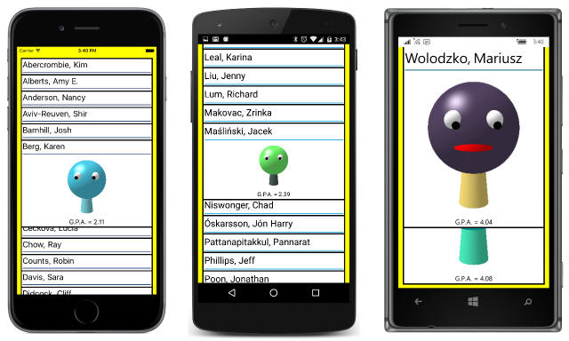

# Summary of Chapter 26. Custom layouts

[ Download the sample](https://github.com/xamarin/xamarin-forms-book-samples/tree/master/Chapter26)

> [!NOTE]
> This book was published in the spring of 2016, and has not been updated since then. There is much in the book that remains valuable, but some of the material is outdated, and some topics are no longer entirely correct or complete.

Xamarin.Forms includes several classes derived from [`Layout<View>`](xref:Xamarin.Forms.Layout`1):

- `StackLayout`,
- `Grid`,
- `AbsoluteLayout`, and
- `RelativeLayout`.

This chapter describes how to create your own classes that derive from `Layout<View>`.

## An overview of layout

There is no centralized system that handles Xamarin.Forms layout. Each element is responsible for determining what its own size should be, and how to render itself within a particular area.

### Parents and children

Every element that has children is responsible for positioning those children within itself. It is the parent that ultimately determines what size its children should be based on the size it has available and the size the child wants to be.

### Sizing and positioning

Layout begins at the top of the visual tree with the page and then proceeds through all the branches. The most important public method in layout is [`Layout`](xref:Xamarin.Forms.VisualElement.Layout(Xamarin.Forms.Rectangle)) defined by `VisualElement`. Every element that is a parent to other elements calls `Layout` for each of its children to give the child a size and postition relative to itself in the form of a [`Rectangle`](xref:Xamarin.Forms.Rectangle) value. These `Layout` calls propagate through the visual tree.

A call to `Layout` is required for an element to appear on the screen, and causes the following read-only properties to be set. They are consistent with the `Rectangle` passed to the method:

- [`Bounds`](xref:Xamarin.Forms.VisualElement.Bounds) of type `Rectangle`
- [`X`](xref:Xamarin.Forms.VisualElement.X) of type `double`
- [`Y`](xref:Xamarin.Forms.VisualElement.Y) of type `double`
- [`Width`](xref:Xamarin.Forms.VisualElement.Width) of type `double`
- [`Height`](xref:Xamarin.Forms.VisualElement.Height) of type `double`

Prior to the `Layout` call, `Height` and `Width` have mock values of &ndash;1.

A call to `Layout` also triggers calls to the following protected methods:

- [`SizeAllocated`](xref:Xamarin.Forms.VisualElement.SizeAllocated(System.Double,System.Double)), which calls
- [`OnSizeAllocated`](xref:Xamarin.Forms.VisualElement.OnSizeAllocated(System.Double,System.Double)), which can be overridden.

Finally, the following event is fired:

- [`SizeChanged`](xref:Xamarin.Forms.VisualElement.SizeChanged)

The `OnSizeAllocated` method is overridden by `Page` and `Layout`, which are the only two classes in Xamarin.Forms that can have children. The overridden method calls

- [`UpdateChildrenLayout`](xref:Xamarin.Forms.Page.UpdateChildrenLayout) for `Page` derivatives and [`UpdateChildrenLayout`](xref:Xamarin.Forms.Layout.UpdateChildrenLayout) for `Layout` derivatives, which calls
- [`LayoutChildren`](xref:Xamarin.Forms.Page.LayoutChildren(System.Double,System.Double,System.Double,System.Double)) for `Page` derivatives and [`LayoutChildren`](xref:Xamarin.Forms.Layout.LayoutChildren(System.Double,System.Double,System.Double,System.Double)) for `Layout` derivatives.

`LayoutChildren` then calls `Layout` for each of the element's children. If at least one child has a new `Bounds` setting, then the following event is fired:

- [`LayoutChanged`](xref:Xamarin.Forms.Page.LayoutChanged) for `Page` derivatives and [`LayoutChanged`](xref:Xamarin.Forms.Layout.LayoutChanged) for `Layout` derivatives

### Constraints and size requests

For `LayoutChildren` to intelligently call `Layout` on all its children, it must know a *preferred* or *desired* size for the children. Therefore the calls to `Layout` for each of the children are generally preceded by calls to

- [`GetSizeRequest`](xref:Xamarin.Forms.VisualElement.GetSizeRequest(System.Double,System.Double))

After the book was published, the `GetSizeRequest` method was deprecated and replaced with

- [`Measure`](xref:Xamarin.Forms.VisualElement.Measure(System.Double,System.Double,Xamarin.Forms.MeasureFlags))

The `Measure` method accommodates the [`Margin`](xref:Xamarin.Forms.View.Margin) property and includes an argument of type [`MeasureFlag`](xref:Xamarin.Forms.MeasureFlags), which has two members:

- [`IncludeMargins`](xref:Xamarin.Forms.MeasureFlags.IncludeMargins)
- [`None`](xref:Xamarin.Forms.MeasureFlags.None) to not include margins

For many elements, `GetSizeRequest` or `Measure` obtains the native size of the element from its renderer. Both methods have parameters for width and height *constraints*. For example, a `Label` will use the width constraint to determine how to wrap multiple lines of text.

Both `GetSizeRequest`and `Measure` return a value of type [`SizeRequest`](xref:Xamarin.Forms.SizeRequest), which has two properties:

- [`Request`](xref:Xamarin.Forms.SizeRequest.Request) of type `Size`
- [`Minimum`](xref:Xamarin.Forms.SizeRequest.Minimum) of type `Size`

Very often these two values are the same, and the `Minimum` value can usually be ignored.

`VisualElement` also defines a protected method similar to `GetSizeRequest` that is called from `GetSizeRequest`:

- [`OnSizeRequest`](xref:Xamarin.Forms.VisualElement.OnSizeRequest(System.Double,System.Double)) returns a `SizeRequest` value

That method is now deprecated and replaced with:

- [`OnMeasure`](xref:Xamarin.Forms.VisualElement.OnMeasure(System.Double,System.Double))

Every class that derives from `Layout` or `Layout<T>` must override `OnSizeRequest` or `OnMeasure`. This is where a layout class determines its own size, which is generally based on the size of its children, which it obtains by calling `GetSizeRequest` or `Measure` on the children. Before and after calling `OnSizeRequest` or `OnMeasure`, `GetSizeRequest` or `Measure` makes adjustments based on the following properties:

- [`WidthRequest`](xref:Xamarin.Forms.VisualElement.WidthRequest)of type `double`, affects the `Request` property of `SizeRequest`
- [`HeightRequest`](xref:Xamarin.Forms.VisualElement.HeightRequest) of type `double`, affects the `Request` property of `SizeRequest`
- [`MinimumWidthRequest`](xref:Xamarin.Forms.VisualElement.MinimumWidthRequest) of type `double`, affects the `Minimum` property of `SizeRequest`
- [`MinimumHeightRequest`](xref:Xamarin.Forms.VisualElement.MinimumHeightRequest) of type `double`, affects the `Minimum` property of `SizeRequest`

### Infinite constraints

The constraint arguments passed to `GetSizeRequest` (or `Measure`) and `OnSizeRequest` (or `OnMeasure`) can be infinite (i.e., values of `Double.PositiveInfinity`). However, the `SizeRequest` returned from these methods cannot contain infinite dimensions.

Infinite constraints indicate that the requested size should reflect the element's natural size. A vertical `StackLayout` calls `GetSizeRequest` (or `Measure`) on its children with an infinite height constraint. A horizontal stack layout calls `GetSizeRequest` (or `Measure`) on its children with an infinite width constraint. An `AbsoluteLayout` calls `GetSizeRequest` (or `Measure`) on its children with infinite width and height constraints.

### Peeking inside the process

The [**ExploreChildSize**](https://github.com/xamarin/xamarin-forms-book-samples/tree/master/Chapter26/ExploreChildSizes) displays constraint and size request information for a simple layout.

## Deriving from Layout\<View>

A custom layout class derives from `Layout<View>`. It has two responsibilities:

- Override `OnMeasure` to call `Measure` on all the layout's children. Return a requested size for the layout itself
- Override `LayoutChildren` to call `Layout` on all the layout's children

The `for` or `foreach` loop in these overrides should skip any child whose `IsVisible` property is set to `false`.

A call to `OnMeasure` is not guaranteed. `OnMeasure` will not be called if the parent of the layout is governing the layout's size (for example, a layout that fills a page). For this reason, `LayoutChildren` cannot rely on child sizes obtained during the `OnMeasure` call. Very often, `LayoutChildren` must itself call `Measure` on the layout's children, or you can implement some kind of size caching logic (to be discussed later).

### An easy example

The [**VerticalStackDemo**](https://github.com/xamarin/xamarin-forms-book-samples/tree/master/Chapter26/VerticalStackDemo) sample contains a simplified [`VerticalStack`](https://github.com/xamarin/xamarin-forms-book-samples/blob/master/Chapter26/VerticalStackDemo/VerticalStackDemo/VerticalStackDemo/VerticalStack.cs) class and a demonstration of its use.

### Vertical and horizontal positioning simplified

One of the jobs that `VerticalStack` must perform occurs during the `LayoutChildren` override. The method uses the child's `HorizontalOptions` property to determine how to position the child within its slot in the `VerticalStack`. You can instead call the static method [`Layout.LayoutChildIntoBoundingRect`](xref:Xamarin.Forms.Layout.LayoutChildIntoBoundingRegion(Xamarin.Forms.VisualElement,Xamarin.Forms.Rectangle)). This method calls `Measure` on the child and uses its `HorizontalOptions` and `VerticalOptions` properties to position the child within the specified rectangle.

### Invalidation

Often a change in an element's property affects how that element appears in layout. The layout must be invalidated to trigger a new layout.

`VisualElement` defines a protected method [`InvalidateMeasure`](xref:Xamarin.Forms.VisualElement.InvalidateMeasure), which is generally called by the property-changed handler of any bindable property whose change affects the element's size. The `InvalidateMeasure` method fires a [`MeasureInvalidated`](xref:Xamarin.Forms.VisualElement.MeasureInvalidated) event.

The `Layout` class defines a similar protected method named [`InvalidateLayout`](xref:Xamarin.Forms.Layout.InvalidateLayout), which a `Layout` derivative should call for any change that affects how it positions and sizes its children.

### Some rules for coding layouts

1. Properties defined by `Layout<T>` derivatives should be backed by bindable properties, and the property-changed handlers should call `InvalidateLayout`.

2. A `Layout<T>` derivative that defines attached bindable properties should override [`OnAdded`](xref:Xamarin.Forms.Layout`1.OnAdded*) to add a property-changed handler to its children and [`OnRemoved`](xref:Xamarin.Forms.Layout`1.OnRemoved*) to remove that handler. The handler should check for changes in these attached bindable properties and respond by calling `InvalidateLayout`.

3. A `Layout<T>` derivative that implements a cache of child sizes should override `InvalidateLayout` and  [`OnChildMeasureInvalidated`](xref:Xamarin.Forms.Layout.OnChildMeasureInvalidated) and clear the cache when these methods are called.

### A layout with properties

The [`WrapLayout`](https://github.com/xamarin/xamarin-forms-book-samples/blob/master/Libraries/Xamarin.FormsBook.Toolkit/Xamarin.FormsBook.Toolkit/WrapLayout.cs) class in the [**Xamarin.FormsBook.Toolkit**](https://github.com/xamarin/xamarin-forms-book-samples/tree/master/Libraries/Xamarin.FormsBook.Toolkit) assumes that all its children are the same size, and wraps the children from one row (or column) to the next. It defines an `Orientation` property like `StackLayout`, and `ColumnSpacing` and `RowSpacing` properties like `Grid`, and it caches child sizes.

The [**PhotoWrap**](https://github.com/xamarin/xamarin-forms-book-samples/tree/master/Chapter26/PhotoWrap) sample puts a `WrapLayout` in a `ScrollView` for displaying stock photos.

### No unconstrained dimensions allowed!

The [`UniformGridLayout`](https://github.com/xamarin/xamarin-forms-book-samples/blob/master/Libraries/Xamarin.FormsBook.Toolkit/Xamarin.FormsBook.Toolkit/UniformGridLayout.cs) in the [**Xamarin.FormsBook.Toolkit**](https://github.com/xamarin/xamarin-forms-book-samples/tree/master/Libraries/Xamarin.FormsBook.Toolkit) library is intended to display all its children within itself. Therefore, it cannot deal with unconstrained dimensions and raises an exception if one is encountered.

The [**PhotoGrid**](https://github.com/xamarin/xamarin-forms-book-samples/tree/master/Chapter26/PhotoGrid) sample demonstrates `UniformGridLayout`:

### Overlapping children

A `Layout<T>` derivative can overlap its children. However, the children are rendered in their order in the `Children` collection, and not the order in which their `Layout` methods are called.

The `Layout` class defines two methods that allow you to move a child within the collection:

- [`LowerChild`](xref:Xamarin.Forms.Layout.LowerChild(Xamarin.Forms.View)) to move a child to the beginning of the collection
- [`RaiseChild`](xref:Xamarin.Forms.Layout.RaiseChild(Xamarin.Forms.View)) to move a child to the end of the collection

For overlapping children, children at the end of the collection visually appear on top of children at the beginning of the collection.

The [`OverlapLayout`](https://github.com/xamarin/xamarin-forms-book-samples/blob/master/Libraries/Xamarin.FormsBook.Toolkit/Xamarin.FormsBook.Toolkit/OverlapLayout.cs) class in the [**Xamarin.FormsBook.Toolkit**](https://github.com/xamarin/xamarin-forms-book-samples/tree/master/Libraries/Xamarin.FormsBook.Toolkit) library defines an attached property to indicate the render order and thus allow one of its children to be displayed on top of the others. The
[**StudentCardFile**](https://github.com/xamarin/xamarin-forms-book-samples/tree/master/Chapter26/StudentCardFile) sample demonstrates this:

### More attached bindable properties

The [`CartesianLayout`](https://github.com/xamarin/xamarin-forms-book-samples/blob/master/Libraries/Xamarin.FormsBook.Toolkit/Xamarin.FormsBook.Toolkit/CartesianLayout.cs) class in the
[**Xamarin.FormsBook.Toolkit**](https://github.com/xamarin/xamarin-forms-book-samples/tree/master/Libraries/Xamarin.FormsBook.Toolkit) library defines attached bindable properties to specify two `Point` values and a thickness value and manipulates `BoxView` elements to resemble lines.

The [**UnitCube**](https://github.com/xamarin/xamarin-forms-book-samples/tree/master/Chapter26/UnitCube) sample uses that to draw a 3D cube.

### Layout and LayoutTo

A `Layout<T>` derivative can call `LayoutTo` rather than `Layout` to animate the layout. The [`AnimatedCartesianLayout`](https://github.com/xamarin/xamarin-forms-book-samples/blob/master/Libraries/Xamarin.FormsBook.Toolkit/Xamarin.FormsBook.Toolkit/AnimatedCartesianLayout.cs) class does this, and the
[**AnimatedUnitCube**](https://github.com/xamarin/xamarin-forms-book-samples/tree/master/Chapter26/AnimatedUnitCube) sample demonstrates it.

## Related links

- [Full eBook text (PDF)](https://aka.ms/xamformsebook)
- [Chapter 26 samples](https://github.com/xamarin/xamarin-forms-book-samples/tree/master/Chapter26)
- [Creating Custom Layouts](~/xamarin-forms/user-interface/layouts/custom.md)
