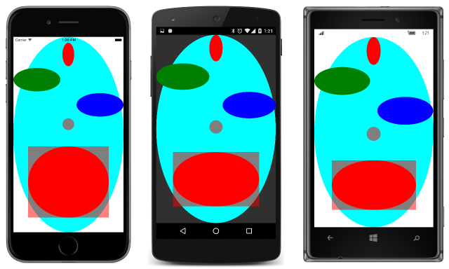

# Summary of Chapter 27. Custom renderers

[ Download the sample](https://github.com/xamarin/xamarin-forms-book-samples/tree/master/Chapter27)

> [!NOTE]
> This book was published in the spring of 2016, and has not been updated since then. There is much in the book that remains valuable, but some of the material is outdated, and some topics are no longer entirely correct or complete.

A Xamarin.Forms element such as `Button` is rendered with a platform-specific button encapsulated in a class named `ButtonRenderer`.  Here is the [iOS version of `ButtonRenderer`](https://github.com/xamarin/Xamarin.Forms/blob/master/Xamarin.Forms.Platform.iOS/Renderers/ButtonRenderer.cs), the [Android version of `ButtonRenderer`](https://github.com/xamarin/Xamarin.Forms/blob/master/Xamarin.Forms.Platform.Android/Renderers/ButtonRenderer.cs), and the [UWP version of `ButtonRenderer`](https://github.com/xamarin/Xamarin.Forms/blob/master/Xamarin.Forms.Platform.UAP/ButtonRenderer.cs).

This chapter discusses how you can write your own renderers to create custom views that map to platform-specific objects.

## The complete class hierarchy

There are four assemblies that contain the Xamarin.Forms platform-specific code.
You can view the source on GitHub using these links:

- [**Xamarin.Forms.Platform**](https://github.com/xamarin/Xamarin.Forms/tree/master/Xamarin.Forms.Platform) (very small)
- [**Xamarin.Forms.Platform.iOS**](https://github.com/xamarin/Xamarin.Forms/tree/master/Xamarin.Forms.Platform.iOS)
- [**Xamarin.Forms.Platform.Android**](https://github.com/xamarin/Xamarin.Forms/tree/master/Xamarin.Forms.Platform.Android)
- [**Xamarin.Forms.Platform.UAP**](https://github.com/xamarin/Xamarin.Forms/tree/master/Xamarin.Forms.Platform.UAP)

> [!NOTE]
> The `WinRT` assemblies mentioned in the book are no longer part of this solution.

The [**PlatformClassHierarchy**](https://github.com/xamarin/xamarin-forms-book-samples/tree/master/Chapter27/PlatformClassHierarchy) sample
displays a class hierarchy for the assemblies that are valid for the executing platform.

You'll notice an important class named `ViewRenderer`. This is the class you derive from when creating a platform-specific renderer. It exists in three different versions, because it's tied to the view system of the target platform:

The iOS [`ViewRenderer<TView, TNativeView>`](https://github.com/xamarin/Xamarin.Forms/blob/master/Xamarin.Forms.Platform.iOS/ViewRenderer.cs#L25) has generic arguments:

- `TView` constrained to [`Xamarin.Forms.View`](xref:Xamarin.Forms.View)
- `TNativeView` constrained to [`UIKit.UIView`](xref:UIKit.UIView)

The Android [`ViewRenderer<TView, TNativeView>`](https://github.com/xamarin/Xamarin.Forms/blob/master/Xamarin.Forms.Platform.Android/ViewRenderer.cs#L17) has generic arguments:

- `TView` constrained to [`Xamarin.Forms.View`](xref:Xamarin.Forms.View)
- `TNativeView` constrained to [`Android.Views.View`](xref:Android.Views.View)

The UWP [`ViewRenderer<TElement, TNativeElement>`](https://github.com/xamarin/Xamarin.Forms/blob/master/Xamarin.Forms.Platform.UAP/ViewRenderer.cs#L6) has differently named generic arguments:

- `TElement` constrained to [`Xamarin.Forms.View`](xref:Xamarin.Forms.View)
- `TNativeElement` constrained to [`Windows.UI.Xaml.FrameworkElement`](/uwp/api/Windows.UI.Xaml.FrameworkElement)

When writing a renderer, you will be deriving a class from `View`, and then writing multiple `ViewRenderer` classes, one for each supported platform. Each platform-specific implementation will reference a native class that derives from the type you specify as the `TNativeView` or `TNativeElement` parameter.

## Hello, custom renderers!

The [**HelloRenderers**](https://github.com/xamarin/xamarin-forms-book-samples/tree/master/Chapter27/HelloRenderers) program references a custom view named `HelloView` in its [`App`](https://github.com/xamarin/xamarin-forms-book-samples/blob/master/Chapter27/HelloRenderers/HelloRenderers/HelloRenderers/App.cs) class.

The [`HelloView`](https://github.com/xamarin/xamarin-forms-book-samples/blob/master/Chapter27/HelloRenderers/HelloRenderers/HelloRenderers/HelloView.cs) class is included in the **HelloRenderers** project and simply derives from `View`.

The [`HelloViewRenderer`](https://github.com/xamarin/xamarin-forms-book-samples/blob/master/Chapter27/HelloRenderers/HelloRenderers/HelloRenderers.iOS/HelloViewRenderer.cs) class in the **HelloRenderers.iOS** project derives from `ViewRenderer<HelloView, UILabel>`. In the `OnElementChanged` override, it creates a native iOS `UILabel` and calls `SetNativeControl`.

The [`HelloViewRenderer`](https://github.com/xamarin/xamarin-forms-book-samples/blob/master/Chapter27/HelloRenderers/HelloRenderers/HelloRenderers.Droid/HelloViewRenderer.cs) class in the **HelloRenderers.Droid** project derives from `ViewRenderer<HelloView, TextView>`. In the `OnElementChanged` override, it creates an Android `TextView` and calls `SetNativeControl`.

The [`HelloViewRenderer`](https://github.com/xamarin/xamarin-forms-book-samples/blob/master/Chapter27/HelloRenderers/HelloRenderers/HelloRenderers.UWP/HelloViewRenderer.cs) class in the **HelloRenderers.UWP** and other Windows projects derives from `ViewRenderer<HelloView, TextBlock>`. In the `OnElementChanged` override, it creates a Windows `TextBlock` and calls `SetNativeControl`.

All the `ViewRenderer` derivatives contain an `ExportRenderer` attribute on the assembly level that associates the `HelloView` class with the particular `HelloViewRenderer` class. This is how Xamarin.Forms locates renderers in the individual platform projects:

## Renderers and properties

The next set of renderers implements ellipse drawing, and is located in the various projects of the [**Xamarin.FormsBook.Platform**](https://github.com/xamarin/xamarin-forms-book-samples/tree/master/Libraries/Xamarin.FormsBook.Platform) solution.

The [`EllipseView`](https://github.com/xamarin/xamarin-forms-book-samples/blob/master/Libraries/Xamarin.FormsBook.Platform/Xamarin.FormsBook.Platform/EllipseView.cs) class is in the **Xamarin.FormsBook.Platform** platform. The class is similar to `BoxView` and defines just a single property: `Color` of type `Color`.

The renderers can transfer property values set on a `View` to the native object by overriding the `OnElementPropertyChanged` method in the renderer. Within this method (and within most of the renderer), two properties are available:

- `Element`, the Xamarin.Forms element
- `Control`, the native view or widget or control object

The types of these properties are determined by the generic parameters to `ViewRenderer`. In this example, `Element` is of type `EllipseView`.

The `OnElementPropertyChanged` override can therefore transfer the `Color` value of the `Element` to the native `Control` object, probably with some kind of conversion. The three renderers are:

- iOS: [`EllipseViewRenderer`](https://github.com/xamarin/xamarin-forms-book-samples/blob/master/Libraries/Xamarin.FormsBook.Platform/Xamarin.FormsBook.Platform.iOS/EllipseViewRenderer.cs), which uses an [`EllipseUIView`](https://github.com/xamarin/xamarin-forms-book-samples/blob/master/Libraries/Xamarin.FormsBook.Platform/Xamarin.FormsBook.Platform.iOS/EllipseUIView.cs) class for the ellipse.
- Android: [`EllipseViewRenderer`](https://github.com/xamarin/xamarin-forms-book-samples/blob/master/Libraries/Xamarin.FormsBook.Platform/Xamarin.FormsBook.Platform.Android/EllipseViewRenderer.cs), which uses an [`EllipseDrawableView`](https://github.com/xamarin/xamarin-forms-book-samples/blob/master/Libraries/Xamarin.FormsBook.Platform/Xamarin.FormsBook.Platform.Android/EllipseDrawableView.cs) class for the ellipse.
- UWP: [`EllipseViewRenderer`](https://github.com/xamarin/xamarin-forms-book-samples/blob/master/Libraries/Xamarin.FormsBook.Platform/Xamarin.FormsBook.Platform.WinRT/EllipseViewRenderer.cs), which can use the native Windows [`Ellipse`](/uwp/api/Windows.UI.Xaml.Shapes.Ellipse) class.

The [**EllipseDemo**](https://github.com/xamarin/xamarin-forms-book-samples/tree/master/Chapter27/EllipseDemo) class displays several of these `EllipseView` objects:

The [**BouncingBall**](https://github.com/xamarin/xamarin-forms-book-samples/tree/master/Chapter27/BouncingBall) bounces an `EllipseView` off the sides of the screen.

## Renderers and events

It is also possible for renderers to indirectly generate events. The [`StepSlider`](https://github.com/xamarin/xamarin-forms-book-samples/blob/master/Libraries/Xamarin.FormsBook.Platform/Xamarin.FormsBook.Platform/StepSlider.cs) class is similar to the normal Xamarin.Forms `Slider` but allows specifying a number of discrete steps between the `Minimum` and `Maximum` values.

The three renderers are:

- iOS: [`StepSliderRenderer`](https://github.com/xamarin/xamarin-forms-book-samples/blob/master/Libraries/Xamarin.FormsBook.Platform/Xamarin.FormsBook.Platform.iOS/StepSliderRenderer.cs)
- Android: [`StepSliderRenderer`](https://github.com/xamarin/xamarin-forms-book-samples/blob/master/Libraries/Xamarin.FormsBook.Platform/Xamarin.FormsBook.Platform.Android/StepSliderRenderer.cs)
- UWP: [`StepSliderRenderer`](https://github.com/xamarin/xamarin-forms-book-samples/blob/master/Libraries/Xamarin.FormsBook.Platform/Xamarin.FormsBook.Platform.WinRT/StepSliderRenderer.cs)

The renderers detect changes to the native control, and then call `SetValueFromRenderer`, which references a bindable property defined in the `StepSlider`, a change to which causes the `StepSlider` to fire a `ValueChanged` event.

The [**StepSliderDemo**](https://github.com/xamarin/xamarin-forms-book-samples/tree/master/Chapter27/StepSliderDemo) sample demonstrates this new slider.

## Related links

- [Full eBook text (PDF)](https://aka.ms/xamformsebook)
- [Chapter 27 samples](https://github.com/xamarin/xamarin-forms-book-samples/tree/master/Chapter27)
- [Custom Renderers](~/xamarin-forms/app-fundamentals/custom-renderer/index.md)
