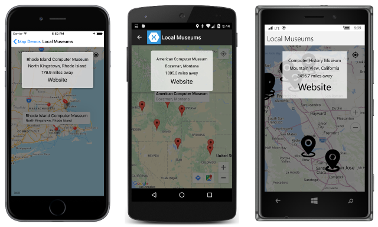

# Summary of Chapter 28. Location and maps

Xamarin.Forms supports a [`Map`](https://developer.xamarin.com/api/type/Xamarin.Forms.Maps.Map/) element that derives from `View`. Because of the special platform requirements involved in using maps, they are implemented in a separate assembly, **Xamarin.Forms.Maps**, and involve a different namespace: `Xamarin.Forms.Maps`.

## The geographic coordinate system

A geographic coordinate system identifies positions on a spherical (or nearly spherical) object like the Earth. A coordinate consists of both a *latitude* and *longitude* expressed in angles.

A great circle called the `equator` is midway between the two poles through which the Earth's axis conceptually extends.

### Parallels and latitude

An angle measured north or south of the equator from the center of the Earth marks lines of equal latitude known as *parallels*. These range from 0 degrees at the equator to 90 degrees at the north and south poles. By convention, latitudes north of the equator are positive values, and those south of the equator are negative values.

### Longitude and meridians

Halves of great circles from the north pole to the south pole are lines of equal longitude, also known as *meridians*. These are relative to the Prime Meridian in Greenwich, England. By convention, longitudes east of the Prime Meridian are positive values from 0 degrees to 180 degrees, and longitudes west of the Prime Meridian are negative values from 0 degrees to &ndash;180 degrees.

### The equirectangular projection

Any flat map of the Earth introduces distortions. If all the lines of latitude and longitude are straight, and if equal differences in latitude and longitude angles correspond to equal distances on the map, the result is an *equirectangular projection*. This map distorts areas closer to the poles because they are horizontally stretched out.

### The Mercator projection

The popular *Mercator projection* attempts to compensate for the horizontal stretching by also stretching these areas vertically. This results in a map where areas near the poles appear much larger than they really are, but any local area conforms quite closely with the actual area.

### Map services and tiles

Map services use a variation of the Mercator projection called `Web Mercator`. The map services deliver bitmap tiles to a client based on location and zoom level.

## Getting the user's location

The Xamarin.Forms `Map` classes do not include a facility to obtain the user's geographic location, but this is often desirable when working with maps, so a dependency service must handle it.

### The location tracker API

The [**Xamarin.FormsBook.Platform**](https://github.com/xamarin/xamarin-forms-book-samples/tree/master/Libraries/Xamarin.FormsBook.Platform) solution contains code for a location tracker API. The [`GeographicLocation`](https://github.com/xamarin/xamarin-forms-book-samples/blob/master/Libraries/Xamarin.FormsBook.Platform/Xamarin.FormsBook.Platform/GeographicLocation.cs) structure encapsulates a latitude and longitude. The [`ILocationTracker`](https://github.com/xamarin/xamarin-forms-book-samples/blob/master/Libraries/Xamarin.FormsBook.Platform/Xamarin.FormsBook.Platform/ILocationTracker.cs) interface defines two methods to start and pause the location tracker, and an event when a new location is available.

#### The iOS location manager

The iOS implementation of `ILocationTracker` is a [`LocationTracker`](https://github.com/xamarin/xamarin-forms-book-samples/blob/master/Libraries/Xamarin.FormsBook.Platform/Xamarin.FormsBook.Platform.iOS/LocationTracker.cs) class that makes use of the iOS [`CLLocationManager`](https://developer.xamarin.com/api/type/CoreLocation.CLLocationManager/).

#### The Android location manager

The Android implementation of `ILocationTracker` is a [`LocationTracker`](https://github.com/xamarin/xamarin-forms-book-samples/blob/master/Libraries/Xamarin.FormsBook.Platform/Xamarin.FormsBook.Platform.Android/LocationTracker.cs) class that makes use of the Android [`LocationManager`](https://developer.xamarin.com/api/type/Android.Locations.LocationManager/) class.

#### The Windows Runtime geo locator

The Windows Runtime implementation of `ILocationTracker` is a [`LocationTracker`](https://github.com/xamarin/xamarin-forms-book-samples/blob/master/Libraries/Xamarin.FormsBook.Platform/Xamarin.FormsBook.Platform.WinRT/LocationTracker.cs) class that makes use of the UWP [`Geolocator`](https://msdn.microsoft.com/library/windows/apps/br225534).

### Display the phone's location

The [**WhereAmI**](https://github.com/xamarin/xamarin-forms-book-samples/tree/master/Chapter28/WhereAmI) sample uses the location tracker to display the phone's location, both in text and on a equirectangular map.

### The required overhead

Some overhead is required for **WhereAmI** to use the location tracker. First, all of the projects in the **WhereAmI** solution must have references to the corresponding projects in **Xamarin.FormsBook.Platform**, and each **WhereAmI** project must call the `Toolkit.Init` method.

Some additional platform-specific overhead, in the form of location permissions, is required.

#### Location permission for iOS

For iOS, the **info.plist** file must include items containing the text of a question asking the user to allow getting that user's location.

#### Location permissions for Android

Android applications that obtain the user's location must have an ACCESS_FILE_LOCATION permission in the AndroidManifest.xml file.

#### Location permissions for the Windows Runtime

A Windows or Windows Phone application must have a `location` device capability marked in the Package.appxmanifest file.

## Working with Xamarin.Forms.Maps

Several requirements are involved in using the `Map` class.

### The NuGet package

The **Xamarin.Forms.Maps** NuGet library must be added to the application solution. The version number should be the same as the **Xamarin.Forms** package currently installed.

### Initializing the Maps package

The application projects must call the `Xamarin.FormsMaps.Init` method after making a call to `Xamarin.Forms.Forms.Init`.

### Enabling map services

Because the `Map` can obtain the user's location, the application must obtain permission for the user in the manner described earlier in this chapter:

#### Enabling iOS maps

An iOS application using `Map` needs two lines in the info.plist file.

#### Enabling Android maps

An authorization key is required for using Google Map services. This key is inserted in the **AndroidManifest.xml** file. In addition, the **AndroidManifest.xml** file requires `manifest` tags involved in obtaining the user's location.

#### Enabling Windows Runtime maps

A Windows Runtime application requires an authorization key for using Bing Maps. This key is passed as an argument to the `Xamarin.FormsMaps.Init` method. The application must also be enabled for location services.

### The unadorned map

The [**MapDemos**](https://github.com/xamarin/xamarin-forms-book-samples/tree/master/Chapter28/MapDemos) sample consists of a [MapsDemoHomePage.xaml](https://github.com/xamarin/xamarin-forms-book-samples/blob/master/Chapter28/MapDemos/MapDemos/MapDemos/MapDemosHomePage.xaml) file and [MapsDemoHomePage.xaml.cs](https://github.com/xamarin/xamarin-forms-book-samples/blob/master/Chapter28/MapDemos/MapDemos/MapDemos/MapDemosHomePage.xaml.cs) code-behind file that allows navigating to various demonstration programs.

The [BasicMapPage.xaml](https://github.com/xamarin/xamarin-forms-book-samples/blob/master/Chapter28/MapDemos/MapDemos/MapDemos/BasicMapPage.xaml) file shows how to display the [`Map`](https://developer.xamarin.com/api/type/Xamarin.Forms.Maps.Map/) view. By default it displays the city of Rome, but the map can be manipulated by the user.

To disable horizontal and vertical scrolling, set the [`HasScrollEnabled`](https://developer.xamarin.com/api/property/Xamarin.Forms.Maps.Map.HasScrollEnabled/) property to `false`. To disable zooming, set [`HasZoomEnabled`](https://developer.xamarin.com/api/property/Xamarin.Forms.Maps.Map.HasZoomEnabled/) to `false`. These properties might not work on all platforms.

### Streets and Terrain

You can display different types of maps by setting the `Map` property [`MapType`](https://developer.xamarin.com/api/property/Xamarin.Forms.Maps.Map.MapType/) of type [`MapType`](https://developer.xamarin.com/api/type/Xamarin.Forms.Maps.MapType/), an enumeration with three members:

- [`Street`](https://developer.xamarin.com/api/field/Xamarin.Forms.Maps.MapType.Street/), the default
- [`Satellite`](https://developer.xamarin.com/api/field/Xamarin.Forms.Maps.MapType.Satellite/)
- [`Hybrid`](https://developer.xamarin.com/api/field/Xamarin.Forms.Maps.MapType.Hybrid/)

The [MapTypesPage.xaml](https://github.com/xamarin/xamarin-forms-book-samples/blob/master/Chapter28/MapDemos/MapDemos/MapDemos/MapTypesPage.xaml) file shows how to use a radio button to select the map type. It makes use of the [`RadioButtonManager`](https://github.com/xamarin/xamarin-forms-book-samples/blob/master/Libraries/Xamarin.FormsBook.Toolkit/Xamarin.FormsBook.Toolkit/RadioButtonManager.cs) class in the [**Xamarin.FormsBook.Toolkit**](https://github.com/xamarin/xamarin-forms-book-samples/tree/master/Libraries/Xamarin.FormsBook.Toolkit) library and a class based on the [MapTypeRadioButton.xaml](https://github.com/xamarin/xamarin-forms-book-samples/blob/master/Chapter28/MapDemos/MapDemos/MapDemos/MapTypeRadioButton.xaml) file.

### Map coordinates

A program can obtain the current area that the `Map` is displaying through the [`VisibleRegion`](https://developer.xamarin.com/api/property/Xamarin.Forms.Maps.Map.VisibleRegion/) property. This property is *not* backed by a bindable property, and there is no notification mechanism to indicate when it has changed, so a program that wishes to monitor the property should probably use a timer for that purpose.

`VisibleRegion` is of type [`MapSpan`](https://developer.xamarin.com/api/type/Xamarin.Forms.Maps.MapSpan/), a class with four read-only properties:

- [`Center`](https://developer.xamarin.com/api/property/Xamarin.Forms.Maps.MapSpan.Center/) of type [`Position`](https://developer.xamarin.com/api/type/Xamarin.Forms.Maps.Position/)
- [`LatitudeDegrees`](https://developer.xamarin.com/api/property/Xamarin.Forms.Maps.MapSpan.LatitudeDegrees/) of type `double`, indicating the height of the displayed area of the map
- [`LongitudeDegrees`](https://developer.xamarin.com/api/property/Xamarin.Forms.Maps.MapSpan.LongitudeDegrees/) of type `double`, indicating the width of the displayed area of the map
- [`Radius`](https://developer.xamarin.com/api/property/Xamarin.Forms.Maps.MapSpan.Radius/) of type [`Distance`](https://developer.xamarin.com/api/type/Xamarin.Forms.Maps.Distance/), indicating the size of the largest circular area visible on the map

`Position` and `Distance` are both structures. `Position` defines two read-only properties set via the [`Position` constructor](https://developer.xamarin.com/api/constructor/Xamarin.Forms.Maps.Position.Position/p/System.Double/System.Double/):

- [`Latitude`](https://developer.xamarin.com/api/property/Xamarin.Forms.Maps.Position.Latitude/)
- [`Longitude`](https://developer.xamarin.com/api/property/Xamarin.Forms.Maps.Position.Longitude/)

`Distance` is intended to provide a unit-independent distance by converting between metric and English units. A `Distance` value can be created in several ways:

- [`Distance` constructor](https://developer.xamarin.com/api/constructor/Xamarin.Forms.Maps.Distance.Distance/p/System.Double/) with a distance in meters
- [`Distance.FromMeters`](https://developer.xamarin.com/api/member/Xamarin.Forms.Maps.Distance.FromMeters/p/System.Double/) static method
- [`Distance.FromKilometers`](https://developer.xamarin.com/api/member/Xamarin.Forms.Maps.Distance.FromKilometers/p/System.Double/) static method
- [`Distance.FromMiles`](https://developer.xamarin.com/api/member/Xamarin.Forms.Maps.Distance.FromMiles/p/System.Double/) static method

The value is available from three properties:

- [`Meters`](https://developer.xamarin.com/api/property/Xamarin.Forms.Maps.Distance.Meters/) of type `double`
- [`Kilometers`](https://developer.xamarin.com/api/property/Xamarin.Forms.Maps.Distance.Kilometers/) of type `double`
- [`Miles`](https://developer.xamarin.com/api/property/Xamarin.Forms.Maps.Distance.Miles/) of type `double`

The [MapCoordinatesPage.xaml](https://github.com/xamarin/xamarin-forms-book-samples/blob/master/Chapter28/MapDemos/MapDemos/MapDemos/MapCoordinatesPage.xaml) file contains several `Label` elements for displaying the `MapSpan` information. The [MapCoordinatesPage.xaml.cs](https://github.com/xamarin/xamarin-forms-book-samples/blob/master/Chapter28/MapDemos/MapDemos/MapDemos/MapCoordinatesPage.xaml.cs) code-behind file uses a timer to keep the information updated as the user manipulates the map.

### Position extensions

A new library for this book named [**Xamarin.FormsBook.Toolkit.Maps**](https://github.com/xamarin/xamarin-forms-book-samples/tree/master/Libraries/Xamarin.FormsBook.Toolkit.Maps) contains map-specific but platform-independent types. The [`PositionExtensions`](https://github.com/xamarin/xamarin-forms-book-samples/blob/master/Libraries/Xamarin.FormsBook.Toolkit.Maps/Xamarin.FormsBook.Toolkit.Maps/PositionExtensions.cs) class has a `ToString` method for `Position`, and a method to calculate the distance between two `Position` values.

### Setting an initial location

You can call the [`MoveToRegion`](https://developer.xamarin.com/api/member/Xamarin.Forms.Maps.Map.MoveToRegion/p/Xamarin.Forms.Maps.MapSpan/) method of `Map` to programmatically set a location and zoom level on the map. The argument is of type `MapSpan`. You can create a `MapSpan` object using either of the following:

- [`MapSpan` constructor](https://developer.xamarin.com/api/constructor/Xamarin.Forms.Maps.MapSpan.MapSpan/p/Xamarin.Forms.Maps.Position/System.Double/System.Double/) with a `Position`, and latitude and longitude span
- [`MapSpan.FromCenterAndRadius`](https://developer.xamarin.com/api/member/Xamarin.Forms.Maps.MapSpan.FromCenterAndRadius/p/Xamarin.Forms.Maps.Position/Xamarin.Forms.Maps.Distance/) with a `Position` and radius

It's also possible to create a new `MapSpan` from an existing one using the methods [`ClampLatitude`](https://developer.xamarin.com/api/member/Xamarin.Forms.Maps.MapSpan.ClampLatitude/p/System.Double/System.Double/) or [`WithZoom`](https://developer.xamarin.com/api/member/Xamarin.Forms.Maps.MapSpan.WithZoom/p/System.Double/).

The [WyomingPage.xaml](https://github.com/xamarin/xamarin-forms-book-samples/blob/master/Chapter28/MapDemos/MapDemos/MapDemos/WyomingPage.xaml) file and [WyomingPage.xaml.cs](https://github.com/xamarin/xamarin-forms-book-samples/blob/master/Chapter28/MapDemos/MapDemos/MapDemos/WyomingPage.xaml.cs) code-behind file demonstrates how to use the `MoveToRegion` method to display the state of Wyoming.

You can alternatively use the [`Map` constructor](https://developer.xamarin.com/api/constructor/Xamarin.Forms.Maps.Map.Map/p/Xamarin.Forms.Maps.MapSpan/) with a `MapSpan` object to initialize the location of the map. The [XamarinHQPage.xaml](https://github.com/xamarin/xamarin-forms-book-samples/blob/master/Chapter28/MapDemos/MapDemos/MapDemos/XamarinHQPage.xaml) file shows how to do this entirely in XAML to display Xamarin's headquarters in San Francisco.

### Dynamic zooming

You can use a `Slider` to dynamically zoom a map. The [RadiusZoomPage.xaml](https://github.com/xamarin/xamarin-forms-book-samples/blob/master/Chapter28/MapDemos/MapDemos/MapDemos/RadiusZoomPage.xaml) file and [RadiusZoomPage.xaml.cs](https://github.com/xamarin/xamarin-forms-book-samples/blob/master/Chapter28/MapDemos/MapDemos/MapDemos/RadiusZoomPage.xaml.cs) code-behind file show how to change the radius of a map based on the `Slider` value.

The [LongitudeZoomPage.xaml](https://github.com/xamarin/xamarin-forms-book-samples/blob/master/Chapter28/MapDemos/MapDemos/MapDemos/LongitudeZoomPage.xaml) file and [LongitudeZoomPage.xaml.cs](https://github.com/xamarin/xamarin-forms-book-samples/blob/master/Chapter28/MapDemos/MapDemos/MapDemos/LongitudeZoomPage.xaml.cs) code-behind file show an alternative approach that works better on Android, but neither approach works well on the Windows platforms.

### The Phone's location

The [`IsShowingUser`](https://developer.xamarin.com/api/property/Xamarin.Forms.Maps.Map.IsShowingUser/) property of `Map` works a little differently on the three platforms as the [ShowLocationPage.xaml](https://github.com/xamarin/xamarin-forms-book-samples/blob/master/Chapter28/MapDemos/MapDemos/MapDemos/ShowLocationPage.xaml) file demonstrates:

- On iOS, a blue dot indicates the phone's location but you must manually navigate there
- On Android, an icon is displayed that when pushed moves the map to the phone's location
- The UWP is similar to iOS but sometimes automatically navigates to the location

The **MapDemos** project attempts to mimic the Android approach by first defining an icon-based button based on the [MyLocationButton.xaml](https://github.com/xamarin/xamarin-forms-book-samples/blob/master/Chapter28/MapDemos/MapDemos/MapDemos/MyLocationButton.xaml) file and [MyLocationButton.xaml.cs](https://github.com/xamarin/xamarin-forms-book-samples/blob/master/Chapter28/MapDemos/MapDemos/MapDemos/MyLocationButton.xaml.cs) code-behind file.

The [GoToLocationPage.xaml](https://github.com/xamarin/xamarin-forms-book-samples/blob/master/Chapter28/MapDemos/MapDemos/MapDemos/GoToLocationPage.xaml) file and [GoToLocationPage.xaml.cs](https://github.com/xamarin/xamarin-forms-book-samples/blob/master/Chapter28/MapDemos/MapDemos/MapDemos/GoToLocationPage.xaml.cs) code-behind file use this button to navigate to the phone's location.

### Pins and science museums

Finally, the `Map` class defines a [`Pins`](https://developer.xamarin.com/api/property/Xamarin.Forms.Maps.Map.Pins/) property of type `IList<Pin>`. The [`Pin`](https://developer.xamarin.com/api/type/Xamarin.Forms.Maps.Pin/) class defines four properties:

- [`Label`](https://developer.xamarin.com/api/property/Xamarin.Forms.Maps.Pin.Label/) of type `string`, a required property
- [`Address`](https://developer.xamarin.com/api/property/Xamarin.Forms.Maps.Pin.Address/) of type `string`, an optional human-readable address
- [`Position`](https://developer.xamarin.com/api/property/Xamarin.Forms.Maps.Pin.Position/) of type `Position`, indicating where the pin is displayed on the map
- [`Type`](https://developer.xamarin.com/api/property/Xamarin.Forms.Maps.Pin.Type/) of type [`PinType`](https://developer.xamarin.com/api/type/Xamarin.Forms.Maps.PinType/), an enumeration, which is not used

The **MapDemos** project contains the file [ScienceMuseums.xml](https://github.com/xamarin/xamarin-forms-book-samples/blob/master/Chapter28/MapDemos/MapDemos/MapDemos/Data/ScienceMuseums.xml), which lists science museums in the United States, and [`Locations`](https://github.com/xamarin/xamarin-forms-book-samples/blob/master/Chapter28/MapDemos/MapDemos/MapDemos/Locations.cs) and [`Site`](https://github.com/xamarin/xamarin-forms-book-samples/blob/master/Chapter28/MapDemos/MapDemos/MapDemos/Site.cs) classes for deserializing this data.

The [ScienceMuseumsPage.xaml](https://github.com/xamarin/xamarin-forms-book-samples/blob/master/Chapter28/MapDemos/MapDemos/MapDemos/ScienceMuseumsPage.xaml) file and [ScienceMuseumsPage.xaml.cs](https://github.com/xamarin/xamarin-forms-book-samples/blob/master/Chapter28/MapDemos/MapDemos/MapDemos/ScienceMuseumsPage.xaml.cs) code-behind file display pins for these science museums in the map. When the user taps a pin, it displays the address and a website for the museum.

### The distance between two points

The [`PositionExtensions`](https://github.com/xamarin/xamarin-forms-book-samples/blob/master/Libraries/Xamarin.FormsBook.Toolkit.Maps/Xamarin.FormsBook.Toolkit.Maps/PositionExtensions.cs) class contains a [`DistanceTo`](https://github.com/xamarin/xamarin-forms-book-samples/blob/master/Libraries/Xamarin.FormsBook.Toolkit.Maps/Xamarin.FormsBook.Toolkit.Maps/PositionExtensions.cs#L88) method with a simplified calculation of the distance between two geographic locations.

This is used in the [LocalMuseumsPage.xaml](https://github.com/xamarin/xamarin-forms-book-samples/blob/master/Chapter28/MapDemos/MapDemos/MapDemos/LocalMuseumsPage.xaml) file and [LocalMuseumsPage.xaml.cs](https://github.com/xamarin/xamarin-forms-book-samples/blob/master/Chapter28/MapDemos/MapDemos/MapDemos/LocalMuseumsPage.xaml.cs) code-behind file to also display the distance to the museum from the user's location:

The program also demonstrates how to dynamically restrict the number of pins based on the location of the map.

## Geocoding and back again

The [**Xamarin.Forms.Maps**](https://developer.xamarin.com/api/namespace/Xamarin.Forms.Maps/) assembly also contains a [`Geocoder`](https://developer.xamarin.com/api/type/Xamarin.Forms.Maps.Geocoder/) class with a
[`GetPositionsForAddressAsync`](https://developer.xamarin.com/api/member/Xamarin.Forms.Maps.Geocoder.GetPositionsForAddressAsync/p/System.String/) method that converts a text address into zero or more possible geographic positions, and another method [`GetAddressesForPositionAsync`](https://developer.xamarin.com/api/member/Xamarin.Forms.Maps.Geocoder.GetAddressesForPositionAsync/p/Xamarin.Forms.Maps.Position/) that converts in the other direction.

The [GeocoderRoundTrip.xaml](https://github.com/xamarin/xamarin-forms-book-samples/blob/master/Chapter28/MapDemos/MapDemos/MapDemos/GeocoderRoundTripPage.xaml) file and [GeocoderRoundTrip.xaml.cs](https://github.com/xamarin/xamarin-forms-book-samples/blob/master/Chapter28/MapDemos/MapDemos/MapDemos/GeocoderRoundTripPage.xaml.cs) code-behind file demonstrate this facility.

## Related Links

- [Chapter 28 full text (PDF)](https://download.xamarin.com/developer/xamarin-forms-book/XamarinFormsBook-Ch28-Aug2016.pdf)
- [Chapter 28 samples](https://github.com/xamarin/xamarin-forms-book-samples/tree/master/Chapter28)
- [Map Control](~/xamarin-forms/user-interface/map.md)
