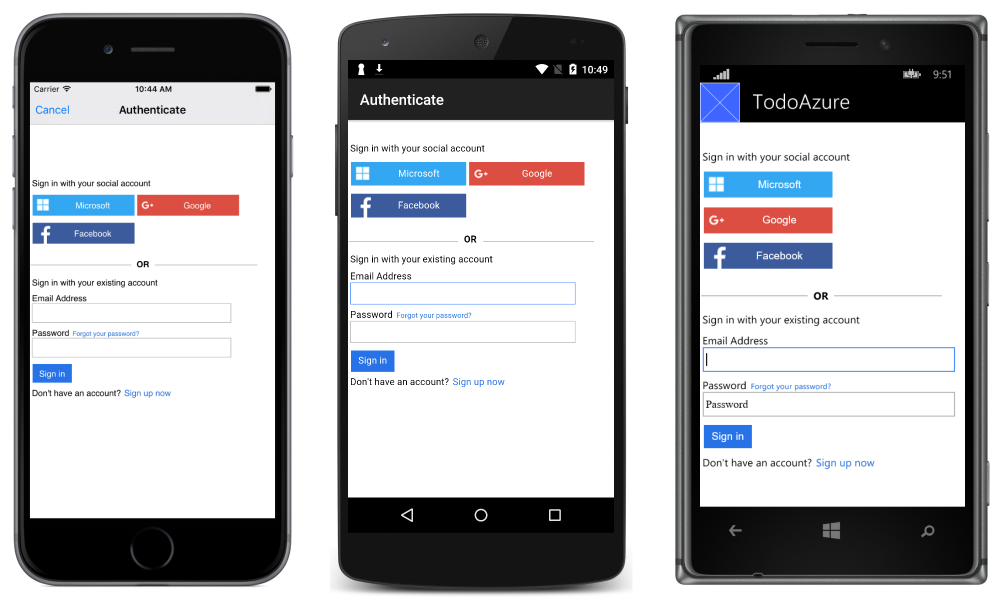
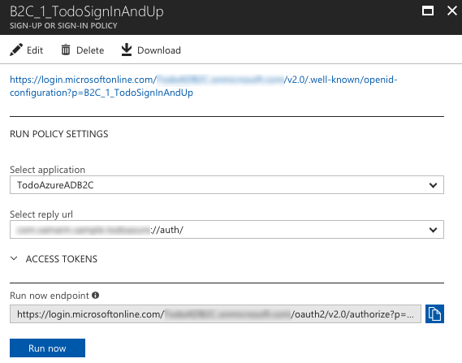
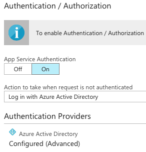
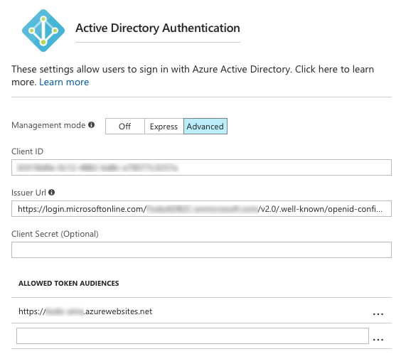
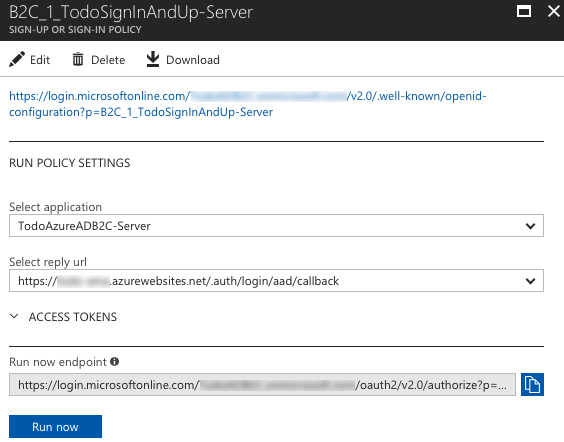
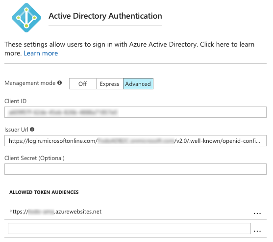

# Integrating Azure Active Directory B2C with Azure Mobile Apps

[ Download the sample](https://developer.xamarin.com/samples/xamarin-forms/WebServices/TodoAzureAuthADB2CClientFlow/)

_Azure Active Directory B2C is a cloud identity management solution for consumer-facing web and mobile applications. This article demonstrates how to use Azure Active Directory B2C to provide authentication and authorization to an Azure Mobile Apps instance with Xamarin.Forms._


> [!NOTE]
> The [Microsoft Authentication Library](https://www.nuget.org/packages/Microsoft.Identity.Client) is still in preview, but is suitable for use in a production environment. However, there may be breaking changes to the API, internal cache format, and other mechanisms of the library, which may impact your application.

## Overview

Azure Mobile Apps allow you to develop applications with scalable backends hosted in Azure App Service, with support for mobile authentication, offline sync, and push notifications. For more information about Azure Mobile Apps, see [Consuming an Azure Mobile App](~/xamarin-forms/data-cloud/consuming/azure.md), and [Authenticating Users with Azure Mobile Apps](~/xamarin-forms/data-cloud/authentication/azure.md).

Azure Active Directory B2C is an identity management service for consumer-facing applications, that allows consumers to sign-in to your application by:

- Using their existing social accounts (Microsoft, Google, Facebook, Amazon, LinkedIn).
- Creating new credentials (email address and password, or username and password). These credentials are referred to as *local* accounts.

For more information about Azure Active Directory B2C, see [Authenticating Users with Azure Active Directory B2C](~/xamarin-forms/data-cloud/authentication/azure-ad-b2c.md).

Azure Active Directory B2C can be used to manage the authentication workflow for an Azure Mobile App. With this approach, the identity management experience is fully defined in the cloud, and can be modified without changing your mobile application code.

There are two authentication workflows that can be adopted when integrating an Azure Active Directory B2C tenant with an Azure Mobile Apps instance:

- [Client-managed](#client_managed) – in this approach the Xamarin.Forms mobile application initiates the authentication process with the Azure Active Directory B2C tenant, and passes the received authentication token to the Azure Mobile Apps instance.
- [Server-managed](#server_managed) – in this approach the Azure Mobile Apps instance uses the Azure Active Directory B2C tenant to initiate the authentication process through a web-based workflow.

In both cases, the authentication experience is provided by the Azure Active Directory B2C tenant. In the sample application, this results in the sign-in screen shown in the following screenshots:



Sign-in with social identity providers, or with a local account, are permitted. While Microsoft, Google, and Facebook are used as social identity providers in this example, other identity providers can also be used.

## Setup

Regardless of the authentication workflow used, the initial process for integrating an Azure Active Directory B2C tenant with an Azure Mobile Apps instance is as follows:

1. Create an Azure Mobile Apps instance. For more information, see [Consuming an Azure Mobile App](~/xamarin-forms/data-cloud/consuming/azure.md).
1. Enable authentication in the Azure Mobile Apps instance and the Xamarin.Forms application. For more information, see [Authenticating Users with Azure Mobile Apps](~/xamarin-forms/data-cloud/authentication/azure.md).
1. Create an Azure Active Directory B2C tenant. For more information, see [Authenticating Users with Azure Active Directory B2C](~/xamarin-forms/data-cloud/authentication/azure-ad-b2c.md).

Note that the Microsoft Authentication Library (MSAL) is required when using a client-managed authentication workflow. MSAL uses the device's web browser to perform authentication. This improves the usability of an application, as users only need to sign-in once per device, improving conversion rates of sign-in and authorization flows in the application. The device browser also provides improved security. After the user completes the authentication process, control will return to the application from the web browser tab. This is achieved by registering a custom URL scheme for the redirect URL that's returned from the authentication process, and then detecting and handling the custom URL once it's sent. For more information about using MSAL to communicate with an Azure Active Directory B2C tenant, see [Authenticating Users with Azure Active Directory B2C](~/xamarin-forms/data-cloud/authentication/azure-ad-b2c.md).

<a name="client_managed" />

## Client-Managed Authentication

In client-managed authentication, a Xamarin.Forms mobile application contacts an Azure Active Directory B2C tenant to initiate an authentication flow. After successful sign-on the Azure Active Directory B2C tenant returns an identity token which is then provided during sign-in to the Azure Mobile Apps instance. This allows the Xamarin.Forms application to perform actions on the Azure Mobile Apps instance that requires authenticated user permissions.

### Azure Active Directory B2C Tenant Configuration

For a client-managed authentication workflow, the Azure Active Directory B2C tenant should be configured as follows:

- Include a native client.
- Set the Custom Redirect URI to a URL scheme that uniquely identifies the mobile application, followed by `://auth/`. For more information about choosing a custom URL scheme, see [Choosing a native app redirect URI](/azure/active-directory-b2c/active-directory-b2c-app-registration#choosing-a-native-app-redirect-uri).

The following screenshot demonstrates this configuration:

[](azure-ad-b2c-mobile-app-images/client-flow-config.png#lightbox "Azure Active Directory B2C Configuration")

The policy used in the Azure Active Directory B2C tenant should also be configured so that the reply URL is set to the same custom URL scheme, followed by `://auth/`. The following screenshot demonstrates this configuration:



### Azure Mobile App Configuration

For a client-managed authentication workflow, the Azure Mobile Apps instance should be configured as follows:

- App Service Authentication should be turned on.
- The action to take when a request is not authenticated should be set to **Log in with Azure Active Directory**.

The following screenshot demonstrates this configuration:



The Azure Mobile Apps instance should also be configured to communicate with the Azure Active Directory B2C tenant. This can be accomplished by enabling **Advanced** mode for the Azure Active Directory authentication provider, with the **Client ID** being the **Application ID** of the Azure Active Directory B2C tenant, and the **Issuer Url** being the metadata endpoint for the Azure Active Directory B2C policy. The following screenshot demonstrates this configuration:



### Signing In

The following code example shows how to initiate a client-managed authentication workflow:

```csharp
public async Task<bool> LoginAsync(bool useSilent = false)
{
    ...
    AuthenticationResult authenticationResult = await ADB2CClient.AcquireTokenAsync(
        Constants.Scopes,
        GetUserByPolicy(ADB2CClient.Users, Constants.PolicySignUpSignIn),
        App.UiParent);

    ...
    var payload = new JObject();
    payload["access_token"] = authenticationResult.IdToken;

    User = await TodoItemManager.DefaultManager.CurrentClient.LoginAsync(
        MobileServiceAuthenticationProvider.WindowsAzureActiveDirectory,
        payload);
    ...
}
```

The Microsoft Authentication Library (MSAL) is used to initiate an authentication workflow with the Azure Active Directory B2C tenant. The `AcquireTokenAsync` method launches the device's web browser and displays authentication options defined in the Azure Active Directory B2C policy that's specified by the policy referenced through the `Constants.Authority` constant. This policy defines the experiences that consumers will go through during sign-up and sign-in, and the claims the application will receive on successful sign-up or sign-in.

The result of the `AcquireTokenAsync` method call is an `AuthenticationResult` instance. If authentication is successful, the `AuthenticationResult` instance will contain an identity token, which will be cached locally. If authentication is unsuccessful, the `AuthenticationResult` instance will contain data that indicates why authentication failed. For information on how to use MSAL to communicate with an Azure Active Directory B2C tenant, see [Authenticating Users with Azure Active Directory B2C](~/xamarin-forms/data-cloud/authentication/azure-ad-b2c.md).

When the `MobileServiceClient.LoginAsync` method is invoked, the Azure Mobile Apps instance receives the identity token wrapped in a `JObject`. The presence of a valid token means that the Azure Mobile Apps instance doesn't need to initiate its own OAuth 2.0 authentication flow. Instead, the `MobileServiceClient.LoginAsync` method returns a `MobileServiceUser` instance that will be stored in the `MobileServiceClient.CurrentUser` property. This property provides `UserId` and `MobileServiceAuthenticationToken` properties. These represent the authenticated user and an authentication token for the user, which can be used until it expires. The authentication token will be included in all requests made to the Azure Mobile Apps instance, allowing the Xamarin.Forms application to perform actions on the Azure Mobile Apps instance that require authenticated user permissions.

### Signing Out

The following code example shows how the client-managed sign-out process is invoked:

```csharp
public async Task<bool> LogoutAsync()
{
    ...
    await TodoItemManager.DefaultManager.CurrentClient.LogoutAsync();

    foreach (var user in ADB2CClient.Users)
    {
        ADB2CClient.Remove(user);
    }
    ...
}
```

The `MobileServiceClient.LogoutAsync` method de-authenticates the user with the Azure Mobile Apps instance, and then all authentication tokens are cleared from the local cache created by MSAL.

<a name="server_managed" />

## Server-Managed Authentication

In server-managed authentication, a Xamarin.Forms application contacts an Azure Mobile Apps instance, which uses the Azure Active Directory B2C tenant to manage the OAuth 2.0 authentication flow by displaying a sign-in page as defined in the B2C policy. Following successful sign-on, the Azure Mobile Apps instance returns a token that allows the Xamarin.Forms application to perform actions on the Azure Mobile Apps instance that require authenticated user permissions.

### Azure Active Directory B2C Tenant Configuration

For a server-managed authentication workflow, the Azure Active Directory B2C tenant should be configured as follows:

- Include a web app/web API, and allow the implicit flow.
- Set the Reply URL to the address of the Azure Mobile App, followed by `/.auth/login/aad/callback`.

The following screenshot demonstrates this configuration:

[](azure-ad-b2c-mobile-app-images/server-flow-config.png#lightbox "Azure Active Directory B2C Configuration")

The policy used in the Azure Active Directory B2C tenant should also be configured so that the Reply URL is set to the address of the Azure Mobile App, followed by `/.auth/login/aad/callback`. The following screenshot demonstrates this configuration:



### Azure Mobile Apps Instance Configuration

For a server-managed authentication workflow, the Azure Mobile Apps instance should be configured as follows:

- App Service Authentication should be turned on.
- The action to take when a request is not authenticated should be set to **Log in with Azure Active Directory**.

The following screenshot demonstrates this configuration:


The Azure Mobile Apps instance should also be configured to communicate with the Azure Active Directory B2C tenant. This can be accomplished by enabling **Advanced** mode for the Azure Active Directory authentication provider, with the **Client ID** being the **Application ID** of the Azure Active Directory B2C tenant, and the **Issuer Url** being the metadata endpoint for the Azure Active Directory B2C policy. The following screenshot demonstrates this configuration:



### Signing In

The following code example shows how to initiate a server-managed authentication workflow:

```csharp
public async Task<bool> AuthenticateAsync()
{
    ...
    MobileServiceUser user = await TodoItemManager.DefaultManager.CurrentClient.LoginAsync(
        UIApplication.SharedApplication.KeyWindow.RootViewController,
        MobileServiceAuthenticationProvider.WindowsAzureActiveDirectory,
        Constants.URLScheme);
    ...
}
```

When the `MobileServiceClient.LoginAsync` method is invoked, the Azure Mobile Apps instance executes the linked Azure Active Directory B2C policy, which initiates the OAuth 2.0 authentication flow. Note that each `AuthenticateAsync` method is platform-specific. However, each `AuthenticateAsync` method uses the `MobileServiceClient.LoginAsync` method and specifies that an Azure Active Directory tenant will be used in the authentication process. For more information, see [Logging in Users](~/xamarin-forms/data-cloud/authentication/azure.md#logging-in).

The `MobileServiceClient.LoginAsync` method returns a `MobileServiceUser` instance that will be stored in the `MobileServiceClient.CurrentUser` property. This property provides `UserId` and `MobileServiceAuthenticationToken` properties. These represent the authenticated user and an authentication token for the user, which can be used until it expires. The authentication token will be included in all requests made to the Azure Mobile Apps instance, allowing the Xamarin.Forms application to perform actions on the Azure Mobile Apps instance that require authenticated user permissions.

### Signing Out

The following code example shows how the server-managed sign-out process is invoked:

```csharp
public async Task<bool> LogoutAsync()
{
    ...
    await TodoItemManager.DefaultManager.CurrentClient.LogoutAsync();
    ...
}
```

The `MobileServiceClient.LogoutAsync` method de-authenticates the user with the Azure Mobile Apps instance. For more information, see [Logging Out Users](~/xamarin-forms/data-cloud/authentication/azure.md#logging-out).

## Summary

This article demonstrated how to use Azure Active Directory B2C to provide authentication and authorization to an Azure Mobile Apps instance with Xamarin.Forms. Azure Active Directory B2C is a cloud identity management solution for consumer-facing web and mobile applications.


## Related Links

- [TodoAzureAuth ServerFlow (sample)](https://developer.xamarin.com/samples/xamarin-forms/WebServices/TodoAzureAuthADB2CServerFlow/)
- [TodoAzureAuth ClientFlow (sample)](https://developer.xamarin.com/samples/xamarin-forms/WebServices/TodoAzureAuthADB2CClientFlow/)
- [Consuming an Azure Mobile App](~/xamarin-forms/data-cloud/consuming/azure.md)
- [Authenticating Users with Azure Mobile Apps](~/xamarin-forms/data-cloud/authentication/azure.md)
- [Authenticating Users with Azure Active Directory B2C](~/xamarin-forms/data-cloud/authentication/azure-ad-b2c.md)
- [Microsoft Authentication Library](https://www.nuget.org/packages/Microsoft.Identity.Client)
