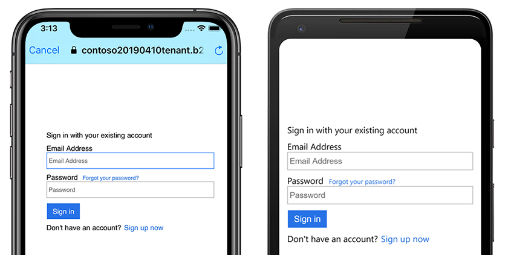

# Authenticate Users with Azure Active Directory B2C

[ Download the sample](/samples/xamarin/xamarin-forms-samples/webservices-azureadb2cauth)

_Azure Active Directory B2C provides cloud identity management for consumer-facing web and mobile applications. This article shows how to use Azure Active Directory B2C to integrate identity management into a mobile application with the Microsoft Authentication Library._

## Overview

Azure Active Directory B2C (ADB2C) is an identity management service for consumer-facing applications. It allows users to sign in to your application using their existing social accounts or custom credentials such as email or username, and password. Custom credential accounts are referred to as _local_ accounts.

The process for integrating the Azure Active Directory B2C identity management service into a mobile application is as follows:

1. Create an Azure Active Directory B2C tenant.
1. Register your mobile application with the Azure Active Directory B2C tenant.
1. Create policies for sign-up and sign-in, and forgot password user flows.
1. Use the Microsoft Authentication Library (MSAL) to start an authentication workflow with your Azure Active Directory B2C tenant.

> [!NOTE]
> If you don't have an [Azure subscription](/azure/guides/developer/azure-developer-guide#understanding-accounts-subscriptions-and-billing), create a [free account](https://aka.ms/azfree-docs-mobileapps) before you begin.

Azure Active Directory B2C supports multiple identity providers including Microsoft, GitHub, Facebook, Twitter and more. For more information on Azure Active Directory B2C capabilities, see [Azure Active Directory B2C Documentation](/azure/active-directory-b2c/).

Microsoft Authentication Library supports multiple application architectures and platforms. For information about MSAL capabilities, see [Microsoft Authentication Library](https://github.com/AzureAD/microsoft-authentication-library-for-dotnet/wiki) on GitHub.

## Configure an Azure Active Directory B2C tenant

To run the sample project, you must create an Azure Active Directory B2C tenant. For more information, see [Create an Azure Active Directory B2C tenant in the Azure portal](/azure/active-directory-b2c/active-directory-b2c-get-started/).

Once you create a tenant, you will need the **tenant name** and **tenant ID** to configure the mobile application. The tenant ID and name are defined by the domain generated when you created your tenant URL. If your generated tenant URL is `https://contoso20190410tenant.onmicrosoft.com/` the **tenant ID** is `contoso20190410tenant.onmicrosoft.com` and the **tenant name** is `contoso20190410tenant`. Find the tenant domain in the Azure portal by clicking the **directory and subscription filter** in the top menu. The following screenshot shows the Azure directory and subscription filter button and the tenant domain:

[](azure-ad-b2c-images/azure-tenant-name.png#lightbox)

In the sample project, edit the **Constants.cs** file to set the `tenantName` and `tenantId` fields. The following code shows how these values should be set if your tenant domain is `https://contoso20190410tenant.onmicrosoft.com/`, replace these values with values from your portal:

```csharp
public static class Constants
{
    static readonly string tenantName = "contoso20190410tenant";
    static readonly string tenantId = "contoso20190410tenant.onmicrosoft.com";
    ...
}
```

## Register your mobile application with Azure Active Directory B2C

A mobile application must be registered with the tenant before it can connect and authenticate users. The registration process assigns a unique **Application ID** to the application, and a **Redirect URL** that directs responses back to the application after authentication. For more information, see [Azure Active Directory B2C: Register your application](/azure/active-directory-b2c/active-directory-b2c-app-registration/). You will need to know the **Application ID** assigned to your application, which is listed after the application name in the properties view. The following screenshot shows where to find the Application ID:

[](azure-ad-b2c-images/azure-application-id.png#lightbox)

Microsoft Authentication Library expects the **Redirect URL** for your application to be your **Application ID** prefixed with the text "msal", and followed by an endpoint called "auth". If your Application ID is "1234abcd", the full URL should be `msal1234abcd://auth`. Make sure that your application has enabled the **Native client** setting and create a **Custom Redirect URI** using your Application ID as shown in the following screenshot:


The URL will be used later in both the Android **ApplicationManifest.xml** and the iOS **Info.plist**.

In the sample project, edit the **Constants.cs** file to set the `clientId` field to your **Application ID**. The following code shows how this value should be set if your Application ID is `1234abcd`:

```csharp
public static class Constants
{
    static readonly string tenantName = "contoso20190410tenant";
    static readonly string tenantId = "contoso20190410tenant.onmicrosoft.com";
    static readonly string clientId = "1234abcd";
    ...
}
```

## Create sign-up and sign-in policies, and forgot password policies

A policy is an experience users go through to complete a task such as creating an account or resetting a password. A policy also specifies the contents of tokens the application receives when the user returns from the experience. You must set up policies for both account sign-up and sign-in, and reset password. Azure has built-in policies that simplify creation of common policies. For more information, see [Azure Active Directory B2C: Built-in policies](/azure/active-directory-b2c/active-directory-b2c-reference-policies/).

When you've completed policy setup, you should have two policies in the **User flows (policies)** view in the Azure portal. The following screenshot demonstrates two configured policies in the Azure portal:


In the sample project, edit the **Constants.cs** file to set the `policySignin` and `policyPassword` fields to reflect the names you chose during policy setup:

```csharp
public static class Constants
{
    static readonly string tenantName = "contoso20190410tenant";
    static readonly string tenantId = "contoso20190410tenant.onmicrosoft.com";
    static readonly string clientId = "1234abcd";
    static readonly string policySignin = "B2C_1_signupsignin1";
    static readonly string policyPassword = "B2C_1_passwordreset";
    ...
}
```

## Use the Microsoft Authentication Library (MSAL) for authentication

The Microsoft Authentication Library (MSAL) NuGet package must be added to the shared, .NET Standard project, and the platform projects in a Xamarin.Forms solution. MSAL includes a `PublicClientApplicationBuilder` class that constructs an object adhering to the `IPublicClientApplication` interface. MSAL utilizes `With` clauses to supply additional parameters to the constructor and authentication methods.

In the sample project, the code behind for **App.xaml** defines static properties named `AuthenticationClient` and `UIParent`, and instantiates the `AuthenticationClient` object in the constructor. The `WithIosKeychainSecurityGroup` clause provides a security group name for iOS applications. The `WithB2CAuthority` clause provides the default **Authority**, or policy, that will be used to authenticate users. The `WithRedirectUri` clause tells the Azure Notification Hubs instance which Redirect URI to use if multiple URIs are specified. The following example demonstrates how to instantiate the `PublicClientApplication`:

```csharp
public partial class App : Application
{
    public static IPublicClientApplication AuthenticationClient { get; private set; }

    public static object UIParent { get; set; } = null;

    public App()
    {
        InitializeComponent();

        AuthenticationClient = PublicClientApplicationBuilder.Create(Constants.ClientId)
            .WithIosKeychainSecurityGroup(Constants.IosKeychainSecurityGroups)
            .WithB2CAuthority(Constants.AuthoritySignin)
            .WithRedirectUri($"msal{Constants.ClientId}://auth")
            .Build();

        MainPage = new NavigationPage(new LoginPage());
    }

    ...
```

> [!NOTE]
> If your Azure Notification Hubs instance only has one Redirect URI defined, the `AuthenticationClient` instance may work without specifying the Redirect URI with the `WithRedirectUri` clause. However, you should always specify this value in case your Azure configuration expands to support other clients or authentication methods.

The `OnAppearing` event handler in the **LoginPage.xaml.cs** code behind calls `AcquireTokenSilentAsync` to refresh the authentication token for users that have logged in before. The authentication process redirects to the `LogoutPage` if successful and does nothing on failure. The following example shows the silent reauthentication process in `OnAppearing`:

```csharp
public partial class LoginPage : ContentPage
{
    ...

    protected override async void OnAppearing()
    {
        try
        {
            // Look for existing account
            IEnumerable<IAccount> accounts = await App.AuthenticationClient.GetAccountsAsync();

            AuthenticationResult result = await App.AuthenticationClient
                .AcquireTokenSilent(Constants.Scopes, accounts.FirstOrDefault())
                .ExecuteAsync();

            await Navigation.PushAsync(new LogoutPage(result));
        }
        catch
        {
            // Do nothing - the user isn't logged in
        }
        base.OnAppearing();
    }

    ...
}
```

The `OnLoginButtonClicked` event handler (fired when the Login button is clicked) calls `AcquireTokenAsync`. The MSAL library automatically opens the mobile device browser and navigates to the login page. The sign-in URL, called an **Authority**, is a combination of the tenant name and policies defined in the **Constants.cs** file. If the user chooses the forgot password option, they are returned to the app with an exception, which launches the forgot password experience. The following example shows the authentication process:

```csharp
public partial class LoginPage : ContentPage
{
    ...

    async void OnLoginButtonClicked(object sender, EventArgs e)
    {
        AuthenticationResult result;
        try
        {
            result = await App.AuthenticationClient
                .AcquireTokenInteractive(Constants.Scopes)
                .WithPrompt(Prompt.SelectAccount)
                .WithParentActivityOrWindow(App.UIParent)
                .ExecuteAsync();

            await Navigation.PushAsync(new LogoutPage(result));
        }
        catch (MsalException ex)
        {
            if (ex.Message != null && ex.Message.Contains("AADB2C90118"))
            {
                result = await OnForgotPassword();
                await Navigation.PushAsync(new LogoutPage(result));
            }
            else if (ex.ErrorCode != "authentication_canceled")
            {
                await DisplayAlert("An error has occurred", "Exception message: " + ex.Message, "Dismiss");
            }
        }
    }

    ...
}
```

The `OnForgotPassword` method is similar to the sign-in process but implements a custom policy. `OnForgotPassword` uses a different overload of `AcquireTokenAsync`, which allows you to provide a specific **Authority**. The following example shows how to supply a custom **Authority** when acquiring a token:

```csharp
public partial class LoginPage : ContentPage
{
    ...
    async Task<AuthenticationResult> OnForgotPassword()
    {
        try
        {
            return await App.AuthenticationClient
                .AcquireTokenInteractive(Constants.Scopes)
                .WithPrompt(Prompt.SelectAccount)
                .WithParentActivityOrWindow(App.UIParent)
                .WithB2CAuthority(Constants.AuthorityPasswordReset)
                .ExecuteAsync();
        }
        catch (MsalException)
        {
            // Do nothing - ErrorCode will be displayed in OnLoginButtonClicked
            return null;
        }
    }
}
```

The final piece of authentication is the sign out process. The `OnLogoutButtonClicked` method is called when the user presses the sign out button. It loops through all accounts and ensures their tokens have been invalidated. The sample below demonstrates the sign out implementation:

```csharp
public partial class LogoutPage : ContentPage
{
    ...
    async void OnLogoutButtonClicked(object sender, EventArgs e)
    {
        IEnumerable<IAccount> accounts = await App.AuthenticationClient.GetAccountsAsync();

        while (accounts.Any())
        {
            await App.AuthenticationClient.RemoveAsync(accounts.First());
            accounts = await App.AuthenticationClient.GetAccountsAsync();
        }

        await Navigation.PopAsync();
    }
}
```

### iOS

On iOS, the custom URL scheme that was registered with Azure Active Directory B2C must be registered in **Info.plist**. MSAL expects the URL scheme to adhere to a specific pattern, described previously in [Register your mobile application with Azure Active Directory B2C](~/xamarin-forms/data-cloud/authentication/azure-ad-b2c.md#register-your-mobile-application-with-azure-active-directory-b2c). The following screenshot shows the custom URL scheme in **Info.plist**.


MSAL also requires Keychain Entitlements on iOS, registered in the **Entitilements.plist**, as shown in the following screenshot:


When Azure Active Directory B2C completes the authorization request, it redirects to the registered redirect URL. The custom URL scheme results in iOS launching the mobile application and passing in the URL as a launch parameter, where it's processed by the `OpenUrl` override of the application's `AppDelegate` class, and returns control of the experience to MSAL. The `OpenUrl` implementation is shown in the following code example:

```csharp
using Microsoft.Identity.Client;

namespace TodoAzure.iOS
{
    [Register("AppDelegate")]
    public partial class AppDelegate : global::Xamarin.Forms.Platform.iOS.FormsApplicationDelegate
    {
        ...
        public override bool OpenUrl(UIApplication app, NSUrl url, NSDictionary options)
        {
            AuthenticationContinuationHelper.SetAuthenticationContinuationEventArgs(url);
            return base.OpenUrl(app, url, options);
        }
    }
}
```

### Android

On Android, the custom URL scheme that was registered with Azure Active Directory B2C must be registered in the **AndroidManifest.xml**. MSAL expects the URL scheme to adhere to a specific pattern, described previously in [Register your mobile application with Azure Active Directory B2C](~/xamarin-forms/data-cloud/authentication/azure-ad-b2c.md#register-your-mobile-application-with-azure-active-directory-b2c). The following example shows the custom URL scheme in the **AndroidManifest.xml**.

```xml
<?xml version="1.0" encoding="utf-8"?>
<manifest xmlns:android="http://schemas.android.com/apk/res/android" android:versionCode="1" android:versionName="1.0" package="com.xamarin.adb2cauthorization">
  <uses-sdk android:minSdkVersion="15" />
  <application android:label="ADB2CAuthorization">
    <activity android:name="microsoft.identity.client.BrowserTabActivity">
      <intent-filter>
        <action android:name="android.intent.action.VIEW" />
        <category android:name="android.intent.category.DEFAULT" />
        <category android:name="android.intent.category.BROWSABLE" />
        <!-- example -->
        <!-- <data android:scheme="msalaaaaaaaa-bbbb-cccc-dddd-eeeeeeeeeeee" android:host="auth" /> -->
        <data android:scheme="INSERT_URI_SCHEME_HERE" android:host="auth" />
      </intent-filter>
    </activity>"
  </application>
</manifest>
```

The `MainActivity` class must be modified to provide the `UIParent` object to the application during the `OnCreate` call. When Azure Active Directory B2C completes the authorization request, it redirects to the registered URL scheme from the **AndroidManifest.xml**. The registered URI scheme results in Android calling the `OnActivityResult` method with the URL as a launch parameter, where it's processed by the `SetAuthenticationContinuationEventArgs` method.

```csharp
public class MainActivity : FormsAppCompatActivity
{
    protected override void OnCreate(Bundle bundle)
    {
        TabLayoutResource = Resource.Layout.Tabbar;
        ToolbarResource = Resource.Layout.Toolbar;

        base.OnCreate(bundle);

        Forms.Init(this, bundle);
        LoadApplication(new App());
        App.UIParent = this;
    }

    protected override void OnActivityResult(int requestCode, Result resultCode, Intent data)
    {
        base.OnActivityResult(requestCode, resultCode, data);
        AuthenticationContinuationHelper.SetAuthenticationContinuationEventArgs(requestCode, resultCode, data);
    }
}
```

### Universal Windows Platform

No additional setup is required to use MSAL on the Universal Windows Platform

## Run the project

Run the application on a virtual or physical device. Tapping the **Login** button should open the browser and navigate to a page where you can sign in or create an account. After completing the sign in process, you should be returned to the application's logout page. The following screenshot shows the user sign in screen running on Android and iOS:



## Related Links

- [AzureADB2CAuth (sample)](/samples/xamarin/xamarin-forms-samples/webservices-azureadb2cauth)
- [Azure Active Directory B2C](/azure/active-directory-b2c/)
- [Microsoft Authentication Library](https://www.nuget.org/packages/Microsoft.Identity.Client)
- [Microsoft Authentication Library Documentation](https://github.com/AzureAD/microsoft-authentication-library-for-dotnet/wiki)