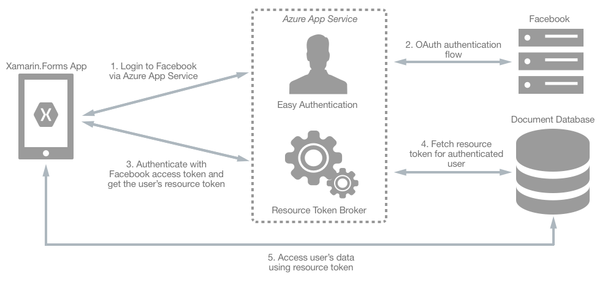
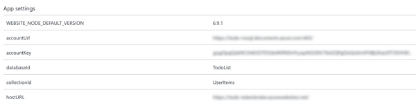
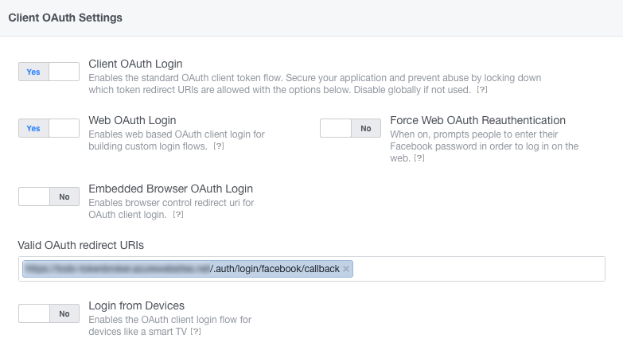
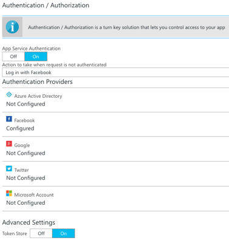
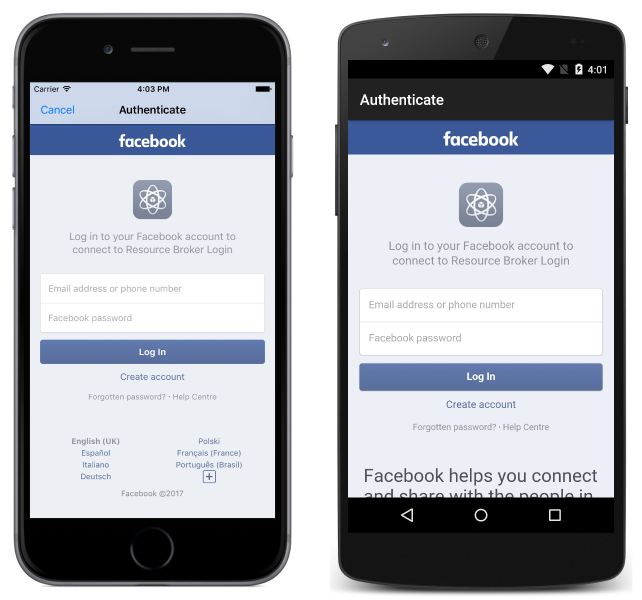

# Authenticate Users with an Azure Cosmos DB Document Database and Xamarin.Forms

[ Download the sample](/samples/xamarin/xamarin-forms-samples/webservices-tododocumentdbauth)

_Azure Cosmos DB document databases support partitioned collections, which can span multiple servers and partitions, while supporting unlimited storage and throughput. This article explains how to combine access control with partitioned collections, so that a user can only access their own documents in a Xamarin.Forms application._

## Overview

A partition key must be specified when creating a partitioned collection, and documents with the same partition key will be stored in the same partition. Therefore, specifying the user's identity as a partition key will result in a partitioned collection that will only store documents for that user. This also ensures that the Azure Cosmos DB document database will scale as the number of users and items increase.

Access must be granted to any collection, and the Azure Cosmos DB for NoSQL access control model defines two types of access constructs:

- **Master keys** enable full administrative access to all resources within an Azure Cosmos DB account, and are created when an Azure Cosmos DB account is created.
- **Resource tokens** capture the relationship between the user of a database and the permission the user has for a specific Azure Cosmos DB resource, such as a collection or a document.

Exposing a master key opens an Azure Cosmos DB account to the possibility of malicious or negligent use. However, Azure Cosmos DB resource tokens provide a safe mechanism for allowing clients to read, write, and delete specific resources in an Azure Cosmos DB account according to the granted permissions.

A typical approach to requesting, generating, and delivering resource tokens to a mobile application is to use a resource token broker. The following diagram shows a high-level overview of how the sample application uses a resource token broker to manage access to the document database data:



The resource token broker is a mid-tier Web API service, hosted in Azure App Service, which possesses the master key of the Azure Cosmos DB account. The sample application uses the resource token broker to manage access to the document database data as follows:

1. On login, the Xamarin.Forms application contacts Azure App Service to initiate an authentication flow.
1. Azure App Service performs an OAuth authentication flow with Facebook. After the authentication flow completes, the Xamarin.Forms application receives an access token.
1. The Xamarin.Forms application uses the access token to request a resource token from the resource token broker.
1. The resource token broker uses the access token to request the user's identity from Facebook. The user's identity is then used to request a resource token from Azure Cosmos DB, which is used to grant read/write access to the authenticated user's partitioned collection.
1. The Xamarin.Forms application uses the resource token to directly access Azure Cosmos DB resources with the permissions defined by the resource token.

> [!NOTE]
> When the resource token expires, subsequent document database requests will receive a 401 unauthorized exception. At this point, Xamarin.Forms applications should re-establish the identity and request a new resource token.

For more information about Azure Cosmos DB partitioning, see [How to partition and scale in Azure Cosmos DB](/azure/cosmos-db/partition-data/). For more information about Azure Cosmos DB access control, see [Securing access to Azure Cosmos DB data](/azure/cosmos-db/secure-access-to-data/) and [Access control in the Azure Cosmos DB for NoSQL](/rest/api/documentdb/access-control-on-documentdb-resources/).

## Setup

The process for integrating the resource token broker into a Xamarin.Forms application is as follows:

1. Create an Azure Cosmos DB account that will use access control. For more information, see [Azure Cosmos DB Configuration](#azure-cosmos-db-configuration).
1. Create an Azure App Service to host the resource token broker. For more information, see [Azure App Service Configuration](#azure-app-service-configuration).
1. Create a Facebook app to perform authentication. For more information, see [Facebook App Configuration](#facebook-app-configuration).
1. Configure the Azure App Service to perform easy authentication with Facebook. For more information, see [Azure App Service Authentication Configuration](#azure-app-service-authentication-configuration).
1. Configure the Xamarin.Forms sample application to communicate with Azure App Service and Azure Cosmos DB. For more information, see [Xamarin.Forms Application Configuration](#xamarinforms-application-configuration).

> [!NOTE]
> If you don't have an [Azure subscription](/azure/guides/developer/azure-developer-guide#understanding-accounts-subscriptions-and-billing), create a [free account](https://aka.ms/azfree-docs-mobileapps) before you begin.

### Azure Cosmos DB Configuration

The process for creating an Azure Cosmos DB account that will use access control is as follows:

1. Create an Azure Cosmos DB account. For more information, see [Create an Azure Cosmos DB account](/azure/cosmos-db/sql-api-dotnetcore-get-started#step-1-create-an-azure-cosmos-db-account).
1. In the Azure Cosmos DB account, create a new collection named `UserItems`, specifying a partition key of `/userid`.

### Azure App Service Configuration

The process for hosting the resource token broker in Azure App Service is as follows:

1. In the Azure portal, create a new App Service web app. For more information, see [Create a web app in an App Service Environment](/azure/app-service-web/app-service-web-how-to-create-a-web-app-in-an-ase/).
1. In the Azure portal, open the App Settings blade for the web app, and add the following settings:
    - `accountUrl` – the value should be the Azure Cosmos DB account URL from the Keys blade of the Azure Cosmos DB account.
    - `accountKey` – the value should be the Azure Cosmos DB master key (primary or secondary) from the Keys blade of the Azure Cosmos DB account.
    - `databaseId` – the value should be the name of the Azure Cosmos DB database.
    - `collectionId` – the value should be the name of the Azure Cosmos DB collection (in this case, `UserItems`).
    - `hostUrl` – the value should be the URL of the web app from the Overview blade of the App Service account.

    The following screenshot demonstrates this configuration:

    [](azure-cosmosdb-auth-images/azure-web-app-settings-large.png#lightbox "App Service Web App Settings")

1. Publish the resource token broker solution to the Azure App Service web app.

### Facebook App Configuration

The process for creating a Facebook app to perform authentication is as follows:

1. Create a Facebook app. For more information, see [Register and Configure an App](https://developers.facebook.com/docs/apps/register) on the Facebook Developer Center.
1. Add the Facebook Login product to the app. For more information, see [Add Facebook Login to Your App or Website](https://developers.facebook.com/docs/facebook-login) on the Facebook Developer Center.
1. Configure Facebook Login as follows:
   - Enable Client OAuth Login.
   - Enable Web OAuth Login.
   - Set the Valid OAuth redirect URI to the URI of the App Service web app, with `/.auth/login/facebook/callback` appended.

  The following screenshot demonstrates this configuration:

  

For more information, see [Register your application with Facebook](/azure/app-service-mobile/app-service-mobile-how-to-configure-facebook-authentication#a-nameregister-aregister-your-application-with-facebook).

### Azure App Service Authentication Configuration

The process for configuring App Service easy authentication is as follows:

1. In the Azure Portal, navigate to the App Service web app.
1. In the Azure Portal, open the Authentication / Authorization blade and perform the following configuration:
    - App Service Authentication should be turned on.
    - The action to take when a request is not authenticated should be set to **Login in with Facebook**.

    The following screenshot demonstrates this configuration:

    [](azure-cosmosdb-auth-images/app-service-authentication-settings-large.png#lightbox "App Service Web App Authentication Settings")

The App Service web app should also be configured to communicate with the Facebook app to enable the authentication flow. This can be accomplished by selecting the Facebook identity provider, and entering the **App ID** and **App Secret** values from the Facebook app settings on the Facebook Developer Center. For more information, see [Add Facebook information to your application](/azure/app-service-mobile/app-service-mobile-how-to-configure-facebook-authentication#a-namesecrets-aadd-facebook-information-to-your-application).

### Xamarin.Forms Application Configuration

The process for configuring the Xamarin.Forms sample application is as follows:

1. Open the Xamarin.Forms solution.
1. Open `Constants.cs` and update the values of the following constants:
    - `EndpointUri` – the value should be the Azure Cosmos DB account URL from the Keys blade of the Azure Cosmos DB account.
    - `DatabaseName` – the value should be the name of the document database.
    - `CollectionName` – the value should be the name of the document database collection (in this case, `UserItems`).
    - `ResourceTokenBrokerUrl` – the value should be the URL of the resource token broker web app from the Overview blade of the App Service account.

## Initiating Login

The sample application initiates the login process by redirecting a browser to an identity provider URL, as demonstrated in the following example code:

```csharp
var auth = new Xamarin.Auth.WebRedirectAuthenticator(
  new Uri(Constants.ResourceTokenBrokerUrl + "/.auth/login/facebook"),
  new Uri(Constants.ResourceTokenBrokerUrl + "/.auth/login/done"));
```

This causes an OAuth authentication flow to be initiated between Azure App Service and Facebook, which displays the Facebook login page:



The login can be cancelled by pressing the **Cancel** button on iOS or by pressing the **Back** button on Android, in which case the user remains unauthenticated and the identity provider user interface is removed from the screen.

## Obtaining a Resource Token

Following successful authentication, the `WebRedirectAuthenticator.Completed` event fires. The following code example demonstrates handling this event:

```csharp
auth.Completed += async (sender, e) =>
{
  if (e.IsAuthenticated && e.Account.Properties.ContainsKey("token"))
  {
    var easyAuthResponseJson = JsonConvert.DeserializeObject<JObject>(e.Account.Properties["token"]);
    var easyAuthToken = easyAuthResponseJson.GetValue("authenticationToken").ToString();

    // Call the ResourceBroker to get the resource token
    using (var httpClient = new HttpClient())
    {
      httpClient.DefaultRequestHeaders.Add("x-zumo-auth", easyAuthToken);
      var response = await httpClient.GetAsync(Constants.ResourceTokenBrokerUrl + "/api/resourcetoken/");
      var jsonString = await response.Content.ReadAsStringAsync();
      var tokenJson = JsonConvert.DeserializeObject<JObject>(jsonString);
      resourceToken = tokenJson.GetValue("token").ToString();
      UserId = tokenJson.GetValue("userid").ToString();

      if (!string.IsNullOrWhiteSpace(resourceToken))
      {
        client = new DocumentClient(new Uri(Constants.EndpointUri), resourceToken);
        ...
      }
      ...
    }
  }
};
```

The result of a successful authentication is an access token, which is available `AuthenticatorCompletedEventArgs.Account` property. The access token is extracted and used in a GET request to the resource token broker's `resourcetoken` API.

The `resourcetoken` API uses the access token to request the user's identity from Facebook, which in turn is used to request a resource token from Azure Cosmos DB. If a valid permission document already exists for the user in the document database, it's retrieved and a JSON document containing the resource token is returned to the Xamarin.Forms application. If a valid permission document doesn't exist for the user, a user and permission is created in the document database, and the resource token is extracted from the permission document and returned to the Xamarin.Forms application in a JSON document.

> [!NOTE]
> A document database user is a resource associated with a document database, and each database may contain zero or more users. A document database permission is a resource associated with a document database user, and each user may contain zero or more permissions. A permission resource provides access to a security token that the user requires when attempting to access a resource such as a document.

If the `resourcetoken` API successfully completes, it will send HTTP status code 200 (OK) in the response, along with a JSON document containing the resource token. The following JSON data shows a typical successful response message:

```csharp
{
  "id": "John Smithpermission",
  "token": "type=resource&ver=1&sig=zx6k2zzxqktzvuzuku4b7y==;a74aukk99qtwk8v5rxfrfz7ay7zzqfkbfkremrwtaapvavw2mrvia4umbi/7iiwkrrq+buqqrzkaq4pp15y6bki1u//zf7p9x/aefbvqvq3tjjqiffurfx+vexa1xarxkkv9rbua9ypfzr47xpp5vmxuvzbekkwq6txme0xxxbjhzaxbkvzaji+iru3xqjp05amvq1r1q2k+qrarurhmjzah/ha0evixazkve2xk1zu9u/jpyf1xrwbkxqpzebvqwma+hyyaazemr6qx9uz9be==;",
  "expires": 4035948,
  "userid": "John Smith"
}
```

The `WebRedirectAuthenticator.Completed` event handler reads the response from the `resourcetoken` API and extracts the resource token and the user id. The resource token is then passed as an argument to the `DocumentClient` constructor, which encapsulates the endpoint, credentials, and connection policy used to access Azure Cosmos DB, and is used to configure and execute requests against Azure Cosmos DB. The resource token is sent with each request to directly access a resource, and indicates that read/write access to the authenticated users' partitioned collection is granted.

## Retrieving Documents

Retrieving documents that only belong to the authenticated user can be achieved by creating a document query that includes the user's id as a partition key, and is demonstrated in the following code example:

```csharp
var query = client.CreateDocumentQuery<TodoItem>(collectionLink,
                        new FeedOptions
                        {
                          MaxItemCount = -1,
                          PartitionKey = new PartitionKey(UserId)
                        })
          .Where(item => !item.Id.Contains("permission"))
          .AsDocumentQuery();
while (query.HasMoreResults)
{
  Items.AddRange(await query.ExecuteNextAsync<TodoItem>());
}
```

The query asynchronously retrieves all the documents belonging to the authenticated user, from the specified collection, and places them in a `List<TodoItem>` collection for display.

The `CreateDocumentQuery<T>` method specifies a `Uri` argument that represents the collection that should be queried for documents, and a `FeedOptions` object. The `FeedOptions` object specifies that an unlimited number of items can be returned by the query, and the user's id as a partition key. This ensures that only documents in the user's partitioned collection are returned in the result.

> [!NOTE]
> Note that permission documents, which are created by the resource token broker, are stored in the same document collection as the documents created by the Xamarin.Forms application. Therefore, the document query contains a `Where` clause that applies a filtering predicate to the query against the document collection. This clause ensures that permission documents aren't returned from the document collection.

For more information about retrieving documents from a document collection, see [Retrieving Document Collection Documents](~/xamarin-forms/data-cloud/azure-services/azure-cosmosdb.md#retrieving-document-collection-documents).

## Inserting Documents

Prior to inserting a document into a document collection, the `TodoItem.UserId` property should be updated with the value being used as the partition key, as demonstrated in the following code example:

```csharp
item.UserId = UserId;
await client.CreateDocumentAsync(collectionLink, item);
```

This ensures that the document will be inserted into the user's partitioned collection.

For more information about inserting a document into a document collection, see [Inserting a Document into a Document Collection](~/xamarin-forms/data-cloud/azure-services/azure-cosmosdb.md#inserting-a-document-into-a-document-collection).

## Deleting Documents

The partition key value must be specified when deleting a document from a partitioned collection, as demonstrated in the following code example:

```csharp
await client.DeleteDocumentAsync(UriFactory.CreateDocumentUri(Constants.DatabaseName, Constants.CollectionName, id),
                 new RequestOptions
                 {
                   PartitionKey = new PartitionKey(UserId)
                 });
```

This ensures that Azure Cosmos DB knows which partitioned collection to delete the document from.

For more information about deleting a document from a document collection, see [Deleting a Document from a Document Collection](~/xamarin-forms/data-cloud/azure-services/azure-cosmosdb.md#deleting-a-document-from-a-document-collection).

## Summary

This article explained how to combine access control with partitioned collections, so that a user can only access their own document database documents in a Xamarin.Forms application. Specifying the user's identity as a partition key ensures that a partitioned collection can only store documents for that user.

## Related Links

- [Todo Azure Cosmos DB Auth (sample)](/samples/xamarin/xamarin-forms-samples/webservices-tododocumentdbauth)
- [Consuming an Azure Cosmos DB Document Database](~/xamarin-forms/data-cloud/azure-services/azure-cosmosdb.md)
- [Securing access to Azure Cosmos DB data](/azure/cosmos-db/secure-access-to-data/)
- [Access control in the Azure Cosmos DB for NoSQL](/rest/api/documentdb/access-control-on-documentdb-resources/).
- [How to partition and scale in Azure Cosmos DB](/azure/cosmos-db/partition-data/)
- [Azure Cosmos DB Client Library](https://www.nuget.org/packages/Microsoft.Azure.DocumentDB.Core)
- [Azure Cosmos DB API](/dotnet/api/overview/azure/cosmosdb/client)
