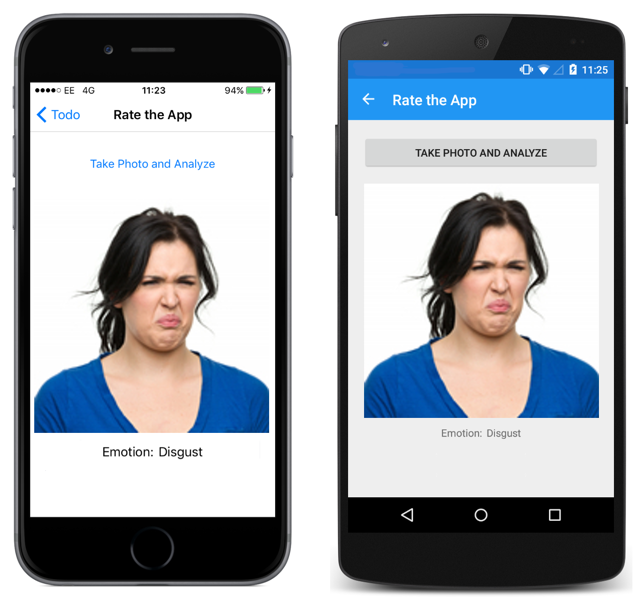

# Perceived Emotion Recognition Using the Face API

[ Download the sample](/samples/xamarin/xamarin-forms-samples/webservices-todocognitiveservices)

The Face API can perform emotion detection to detect anger, contempt, disgust, fear, happiness, neutral, sadness, and surprise, in a facial expression based on perceived annotations by human coders. It is important to note, however, that facial expressions alone may not necessarily represent the internal states of people.

In addition to returning an emotion result for a facial expression, the Face API can also returns a bounding box for detected faces.

Emotion recognition can be performed via a client library, and via a REST API. This article focuses on performing emotion recognition via the REST API. For more information about the REST API, see [Face REST API](https://westus.dev.cognitive.microsoft.com/docs/services/563879b61984550e40cbbe8d/operations/563879b61984550f30395236).

The Face API can also be used to recognize the facial expressions of people in video, and can return a summary of their emotions. For more information, see [How to Analyze Videos in Real-time](/azure/cognitive-services/face/face-api-how-to-topics/howtoanalyzevideo_face/).

> [!NOTE]
> If you don't have an [Azure subscription](/azure/guides/developer/azure-developer-guide#understanding-accounts-subscriptions-and-billing), create a [free account](https://aka.ms/azfree-docs-mobileapps) before you begin.

An API key must be obtained to use the Face API. This can be obtained at [Try Cognitive Services](https://azure.microsoft.com/try/cognitive-services/?api=face-api).

For more information about the Face API, see [Face API](/azure/cognitive-services/face/overview/).

## Authentication

Every request made to the Face API requires an API key that should be specified as the value of the `Ocp-Apim-Subscription-Key` header. The following code example shows how to add the API key to the `Ocp-Apim-Subscription-Key` header of a request:

```csharp
public FaceRecognitionService()
{
  _client = new HttpClient();
  _client.DefaultRequestHeaders.Add("ocp-apim-subscription-key", Constants.FaceApiKey);
}
```

Failure to pass a valid API key to the Face API will result in a 401 response error.

## Perform emotion recognition

Emotion recognition is performed by making a POST request containing an image to the `detect` API at `https://[location].api.cognitive.microsoft.com/face/v1.0`, where `[location]]` is the region you used to obtain your API key. The optional request parameters are:

- `returnFaceId` – whether to return faceIds of the detected faces. The default value is `true`.
- `returnFaceLandmarks` – whether to return face landmarks of the detected faces. The default value is `false`.
- `returnFaceAttributes` – whether to analyze and return one or more specified face attributes. Supported face attributes include `age`, `gender`, `headPose`, `smile`, `facialHair`, `glasses`, `emotion`, `hair`, `makeup`, `occlusion`, `accessories`, `blur`, `exposure`, and `noise`. Note that face attribute analysis has additional computational and time cost.

Image content must be placed in the body of the POST request as a URL, or binary data.

> [!NOTE]
> Supported image file formats are JPEG, PNG, GIF, and BMP, and the allowed file size is from 1KB to 4MB.

In the sample application, the emotion recognition process is invoked by calling the `DetectAsync` method:

```csharp
Face[] faces = await _faceRecognitionService.DetectAsync(photoStream, true, false, new FaceAttributeType[] { FaceAttributeType.Emotion });
```

This method call specifies the stream containing the image data, that faceIds should be returned, that face landmarks shouldn't be returned, and that the emotion of the image should be analyzed. It also specifies that the results will be returned as an array of `Face` objects. In turn, the `DetectAsync` method invokes the `detect` REST API that performs emotion recognition:

```csharp
public async Task<Face[]> DetectAsync(Stream imageStream, bool returnFaceId, bool returnFaceLandmarks, IEnumerable<FaceAttributeType> returnFaceAttributes)
{
  var requestUrl =
    $"{Constants.FaceEndpoint}/detect?returnFaceId={returnFaceId}" +
    "&returnFaceLandmarks={returnFaceLandmarks}" +
    "&returnFaceAttributes={GetAttributeString(returnFaceAttributes)}";
  return await SendRequestAsync<Stream, Face[]>(HttpMethod.Post, requestUrl, imageStream);
}
```

This method generates a request URI and then sends the request to the `detect` API via the `SendRequestAsync` method.

> [!NOTE]
> You must use the same region in your Face API calls as you used to obtain your subscription keys. For example, if you obtained your subscription keys from the `westus` region, the face detection endpoint will be `https://westus.api.cognitive.microsoft.com/face/v1.0/detect`.

### Send the request

The `SendRequestAsync` method makes the POST request to the Face API and returns the result as a `Face` array:

```csharp
async Task<TResponse> SendRequestAsync<TRequest, TResponse>(HttpMethod httpMethod, string requestUrl, TRequest requestBody)
{
  var request = new HttpRequestMessage(httpMethod, Constants.FaceEndpoint);
  request.RequestUri = new Uri(requestUrl);
  if (requestBody != null)
  {
    if (requestBody is Stream)
    {
      request.Content = new StreamContent(requestBody as Stream);
      request.Content.Headers.ContentType = new MediaTypeHeaderValue("application/octet-stream");
    }
    else
    {
      // If the image is supplied via a URL
      request.Content = new StringContent(JsonConvert.SerializeObject(requestBody, s_settings), Encoding.UTF8, "application/json");
    }
  }

  HttpResponseMessage responseMessage = await _client.SendAsync(request);
  if (responseMessage.IsSuccessStatusCode)
  {
    string responseContent = null;
    if (responseMessage.Content != null)
    {
      responseContent = await responseMessage.Content.ReadAsStringAsync();
    }
    if (!string.IsNullOrWhiteSpace(responseContent))
    {
      return JsonConvert.DeserializeObject<TResponse>(responseContent, s_settings);
    }
    return default(TResponse);
  }
  else
  {
    ...
  }
  return default(TResponse);
}
```

If the image is supplied via a stream, the method builds the POST request by wrapping the image stream in a `StreamContent` instance, which provides HTTP content based on a stream. Alternatively, if the image is supplied via a URL, the method builds the POST request by wrapping the URL in a `StringContent` instance, which provides HTTP content based on a string.

The POST request is then sent to `detect` API. The response is read, deserialized, and returned to the calling method.

The `detect` API will send HTTP status code 200 (OK) in the response, provided that the request is valid, which indicates that the request succeeded and that the requested information is in the response. For a list of possible error responses, see [Face REST API](https://westus.dev.cognitive.microsoft.com/docs/services/563879b61984550e40cbbe8d/operations/563879b61984550f30395236).

### Process the response

The API response is returned in JSON format. The following JSON data shows a typical successful response message that supplies the data requested by the sample application:

```json
[  
   {  
      "faceId":"8a1a80fe-1027-48cf-a7f0-e61c0f005051",
      "faceRectangle":{  
         "top":192,
         "left":164,
         "width":339,
         "height":339
      },
      "faceAttributes":{  
         "emotion":{  
            "anger":0.0,
            "contempt":0.0,
            "disgust":0.0,
            "fear":0.0,
            "happiness":1.0,
            "neutral":0.0,
            "sadness":0.0,
            "surprise":0.0
         }
      }
   }
]
```

A successful response message consists of an array of face entries ranked by face rectangle size in descending order, while an empty response indicates no faces detected. Each recognized face includes a series of optional face attributes, which are specified by the `returnFaceAttributes` argument to the `DetectAsync` method.

In the sample application, the JSON response is deserialized into an array of `Face` objects. When interpreting results from the Face API, the detected emotion should be interpreted as the emotion with the highest score, as scores are normalized to sum to one. Therefore, the sample application displays the recognized emotion with the highest score for the largest detected face in the image. This is achieved with the following code:

```csharp
emotionResultLabel.Text = faces.FirstOrDefault().FaceAttributes.Emotion.ToRankedList().FirstOrDefault().Key;
```

The following screenshot shows the result of the emotion recognition process in the sample application:



## Related links

- [Face API](/azure/cognitive-services/face/overview/).
- [Todo Cognitive Services (sample)](/samples/xamarin/xamarin-forms-samples/webservices-todocognitiveservices)
- [Face REST API](https://westus.dev.cognitive.microsoft.com/docs/services/563879b61984550e40cbbe8d/operations/563879b61984550f30395236)