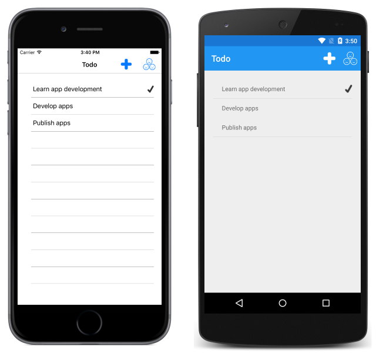
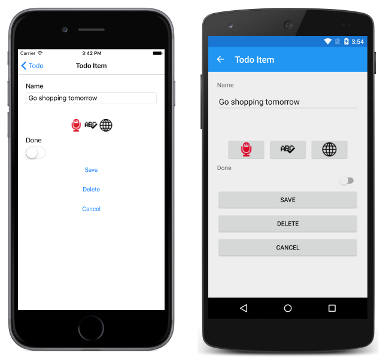
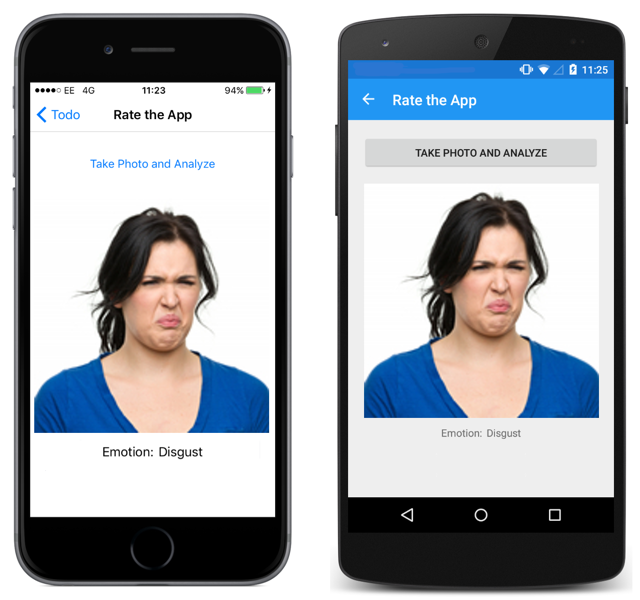

# Xamarin.Forms and Azure Cognitive Services Introduction

[ Download the sample](/samples/xamarin/xamarin-forms-samples/webservices-todocognitiveservices)

_Microsoft Cognitive Services are a set of APIs, SDKs, and services available to developers to make their applications more intelligent by adding features such as facial recognition, speech recognition, and language understanding. This article provides an introduction to the sample application that demonstrates how to invoke some of the Microsoft Cognitive Service APIs._

## Overview

The accompanying sample is a todo list application that provides functionality to:

- View a list of tasks.
- Add and edit tasks through the soft keyboard, or by performing speech recognition with the Microsoft Speech API.
- Spell check tasks using the Bing Spell Check API. For more information, see [Spell Checking using the Bing Spell Check API](spell-check.md).
- Translate tasks from English to German using the Translator API. For more information, see [Text Translation using the Translator API](text-translation.md).
- Delete tasks.
- Set a task's status to 'done'.
- Rate the application with emotion recognition, using the Face API. For more information, see [Emotion Recognition using the Face API](emotion-recognition.md).

> [!WARNING]
> The Bing Speech API has been deprecated in favor of the Azure Speech Service. For a sample dedicated to Azure Speech Service, see [Speech recognition with the Speech Service API](~/xamarin-forms/data-cloud/azure-cognitive-services/speech-recognition.md).

Tasks are stored in a local SQLite database. For more information about using a local SQLite database, see [Working with a Local Database](~/xamarin-forms/data-cloud/data/databases.md).

The `TodoListPage` is displayed when the application is launched. This page displays a list of any tasks stored in the local database, and allows the user to create a new task or to rate the application:



New items can be created by clicking on the *+* button, which navigates to the `TodoItemPage`. This page can also be navigated to by selecting a task:



The `TodoItemPage` allows tasks to be created, edited, spell-checked, translated, saved, and deleted. Speech recognition can be used to create or edit a task. This is achieved by pressing the microphone button to start recording, and by pressing the same button a second time to stop recording, which sends the recording to the Bing Speech Recognition API.

Clicking the smilies button on the `TodoListPage` navigates to the `RateAppPage`, which is used to perform emotion recognition on an image of a facial expression:



The `RateAppPage` allows the user to take a photo of their face, which is submitted to the Face API with the returned emotion being displayed.

## Understand the application anatomy

The shared code project for the sample application consists of five main folders:

|Folder|Purpose|
|--- |--- |
|Models|Contains the data model classes for the application. This includes the `TodoItem` class, which models a single item of data used by the application. The folder also includes classes used to model JSON responses returned from different Microsoft Cognitive Service APIs.|
|Repositories|Contains the `ITodoItemRepository` interface and `TodoItemRepository` class that are used to perform database operations.|
|Services|Contains the interfaces and classes that are used to access different Microsoft Cognitive Service APIs, along with interfaces that are used by the `DependencyService` class to locate the classes that implement the interfaces in platform projects.|
|Utils|Contains the `Timer` class, which is used by the `AuthenticationService` class to renew a JWT access token every 9 minutes.|
|Views|Contains the pages for the application.|

The shared code project also contains some important files:

|File|Purpose|
|--- |--- |
|Constants.cs|The `Constants` class, which specifies the API keys and endpoints for the Microsoft Cognitive Service APIs that are invoked. The API key constants require updating to access the different Cognitive Service APIs.|
|App.xaml.cs|The `App` class is responsible for instantiating both the first page that will be displayed by the application on each platform, and the `TodoManager` class that is used to invoke database operations.|

### NuGet packages

The sample application uses the following NuGet packages:

- `Newtonsoft.Json` – provides a JSON framework for .NET.
- `PCLStorage` – provides a set of cross-platform local file IO APIs.
- `sqlite-net-pcl` – provides SQLite database storage.
- `Xam.Plugin.Media` – provides cross-platform photo taking and picking APIs.

In addition, these NuGet packages also install their own dependencies.

### Model the data

The sample application uses the `TodoItem` class to model the data that is displayed and stored in the local SQLite database. The following code example shows the `TodoItem` class:

```csharp
public class TodoItem
{
  [PrimaryKey, AutoIncrement]
  public int ID { get; set; }
  public string Name { get; set; }
  public bool Done { get; set; }
}
```

The `ID` property is used to uniquely identify each `TodoItem` instance, and is decorated with SQLite attributes that make the property an auto-incrementing primary key in the database.

### Invoke database operations

The `TodoItemRepository` class implements database operations, and an instance of the class can be accessed through the `App.TodoManager` property. The `TodoItemRepository` class provides the following methods to invoke database operations:

- **GetAllItemsAsync** – retrieves all of the items from the local SQLite database.
- **GetItemAsync** – retrieves a specified item from the local SQLite database.
- **SaveItemAsync** – creates or updates an item in the local SQLite database.
- **DeleteItemAsync** – deletes the specified item from the local SQLite database.

### Platform project implementations

The `Services` folder in the shared code project contains the `IFileHelper` and `IAudioRecorderService` interfaces that are used by the `DependencyService` class to locate the classes that implement the interfaces in platform projects.

The `IFileHelper` interface is implemented by the `FileHelper` class in each platform project. This class consists of a single method, `GetLocalFilePath`, which returns a local file path for storing the SQLite database.

The `IAudioRecorderService` interface is implemented by the `AudioRecorderService` class in each platform project. This class consists of `StartRecording`, `StopRecording`, and supporting methods, which use platform APIs to record audio from the device's microphone and store it as a wav file. On iOS, the `AudioRecorderService` uses the `AVFoundation` API to record audio. On Android, the `AudioRecordService` uses the `AudioRecord` API to record audio. On the Universal Windows Platform (UWP), the `AudioRecorderService` uses the `AudioGraph` API to record audio.

### Invoke cognitive services

The sample application invokes the following Microsoft Cognitive Services:

- Microsoft Speech API. For more information, see [Speech Recognition using the Microsoft Speech API](speech-recognition.md).
- Bing Spell Check API. For more information, see [Spell Checking using the Bing Spell Check API](spell-check.md).
- Translate API. For more information, see [Text Translation using the Translator API](text-translation.md).
- Face API. For more information, see [Emotion Recognition using the Face API](emotion-recognition.md).

## Related links

- [Speech recognition with the Speech Service API](~/xamarin-forms/data-cloud/azure-cognitive-services/speech-recognition.md)
- [Microsoft Cognitive Services Documentation](https://www.microsoft.com/cognitive-services/documentation)
- [Todo Cognitive Services (sample)](/samples/xamarin/xamarin-forms-samples/webservices-todocognitiveservices)