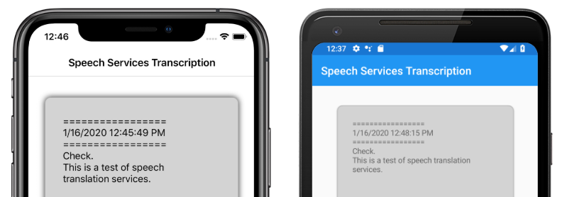
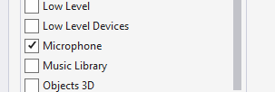

# Speech recognition using Azure Speech Service

[ Download the sample](/samples/xamarin/xamarin-forms-samples/webservices-cognitivespeechservice)

Azure Speech Service is a cloud-based API that offers the following functionality:

- **Speech-to-text** transcribes audio files or streams to text.
- **Text-to-speech** converts input text into human-like synthesized speech.
- **Speech translation** enables real-time, multi-language translation for both speech-to-text and speech-to-speech.
- **Voice assistants** can create human-like conversation interfaces for applications.

This article explains how speech-to-text is implemented in the sample Xamarin.Forms application using the Azure Speech Service. The following screenshots show the sample application on iOS and Android:

[](speech-recognition-images/speech-recognition.png#lightbox "Screenshots of the sample application on iOS and Android")

## Create an Azure Speech Service resource

Azure Speech Service is part of Azure Cognitive Services, which provides cloud-based APIs for tasks such as image recognition, speech recognition and translation, and Bing search. For more information, see [What are Azure Cognitive Services?](/azure/cognitive-services/welcome).

The sample project requires an Azure Cognitive Services resource to be created in your Azure portal. A Cognitive Services resource can be created for a single service, such as Speech Service, or as a multi-service resource. The steps to create a Speech Service resource are as follows:

1. Log into your [Azure portal](https://portal.azure.com).
1. Create a multi-service or single-service resource.
1. Obtain the API key and region information for your resource.
1. Update the sample **Constants.cs** file.

For a step-by-step guide to creating a resource, see [Create a Cognitive Services resource](/azure/cognitive-services/cognitive-services-apis-create-account).

> [!NOTE]
> If you don't have an [Azure subscription](/azure/guides/developer/azure-developer-guide#understanding-accounts-subscriptions-and-billing), create a [free account](https://aka.ms/azfree-docs-mobileapps) before you begin. Once you have an account, a single-service resource can be created at the free tier to try out the service.

## Configure your app with the Speech Service

After creating a Cognitive Services resource, the **Constants.cs** file can be updated with the region and API key from your Azure resource:

```csharp
public static class Constants
{
    public static string CognitiveServicesApiKey = "YOUR_KEY_GOES_HERE";
    public static string CognitiveServicesRegion = "westus";
}
```

## Install NuGet Speech Service package

The sample application uses the **Microsoft.CognitiveServices.Speech** NuGet package to connect to the Azure Speech Service. Install this NuGet package in the shared project and each platform project.

## Create an IMicrophoneService interface

Each platform requires permission to access to the microphone. The sample project provides an `IMicrophoneService` interface in the shared project, and uses the Xamarin.Forms `DependencyService` to obtain platform implementations of the interface.

```csharp
public interface IMicrophoneService
{
    Task<bool> GetPermissionAsync();
    void OnRequestPermissionResult(bool isGranted);
}
```

## Create the page layout

The sample project defines a basic page layout in the **MainPage.xaml** file. The key layout elements are a `Button` that starts the transcription process, a `Label` to contain the transcribed text, and an `ActivityIndicator` to show when transcription is in progress:

```xaml
<ContentPage ...>
    <StackLayout>
        <Frame ...>
            <ScrollView x:Name="scroll"
                        ...>
                <Label x:Name="transcribedText"
                       ... />
            </ScrollView>
        </Frame>

        <ActivityIndicator x:Name="transcribingIndicator"
                           IsRunning="False" />
        <Button x:Name="transcribeButton"
                ...
                Clicked="TranscribeClicked"/>
    </StackLayout>
</ContentPage>
```

## Implement the Speech Service

The **MainPage.xaml.cs** code-behind file contains all of the logic to send audio and receive transcribed text from the Azure Speech Service.

The `MainPage` constructor gets an instance of the `IMicrophoneService` interface from the `DependencyService`:

```csharp
public partial class MainPage : ContentPage
{
    SpeechRecognizer recognizer;
    IMicrophoneService micService;
    bool isTranscribing = false;

    public MainPage()
    {
        InitializeComponent();

        micService = DependencyService.Resolve<IMicrophoneService>();
    }

    // ...
}
```

The `TranscribeClicked` method is called when the `transcribeButton` instance is tapped:

```csharp
async void TranscribeClicked(object sender, EventArgs e)
{
    bool isMicEnabled = await micService.GetPermissionAsync();

    // EARLY OUT: make sure mic is accessible
    if (!isMicEnabled)
    {
        UpdateTranscription("Please grant access to the microphone!");
        return;
    }

    // initialize speech recognizer 
    if (recognizer == null)
    {
        var config = SpeechConfig.FromSubscription(Constants.CognitiveServicesApiKey, Constants.CognitiveServicesRegion);
        recognizer = new SpeechRecognizer(config);
        recognizer.Recognized += (obj, args) =>
        {
            UpdateTranscription(args.Result.Text);
        };
    }

    // if already transcribing, stop speech recognizer
    if (isTranscribing)
    {
        try
        {
            await recognizer.StopContinuousRecognitionAsync();
        }
        catch(Exception ex)
        {
            UpdateTranscription(ex.Message);
        }
        isTranscribing = false;
    }

    // if not transcribing, start speech recognizer
    else
    {
        Device.BeginInvokeOnMainThread(() =>
        {
            InsertDateTimeRecord();
        });
        try
        {
            await recognizer.StartContinuousRecognitionAsync();
        }
        catch(Exception ex)
        {
            UpdateTranscription(ex.Message);
        }
        isTranscribing = true;
    }
    UpdateDisplayState();
}
```

The `TranscribeClicked` method does the following:

1. Checks if the application has access to the microphone and exits early if it does not.
1. Creates an instance of `SpeechRecognizer` class if it doesn't already exist.
1. Stops continuous transcription if it is in progress.
1. Inserts a timestamp and starts continuous transcription if it is not in progress.
1. Notifies the application to update its appearance based on the new application state.

The remainder of the `MainPage` class methods are helpers for displaying the application state:

```csharp
void UpdateTranscription(string newText)
{
    Device.BeginInvokeOnMainThread(() =>
    {
        if (!string.IsNullOrWhiteSpace(newText))
        {
            transcribedText.Text += $"{newText}\n";
        }
    });
}

void InsertDateTimeRecord()
{
    var msg = $"=================\n{DateTime.Now.ToString()}\n=================";
    UpdateTranscription(msg);
}

void UpdateDisplayState()
{
    Device.BeginInvokeOnMainThread(() =>
    {
        if (isTranscribing)
        {
            transcribeButton.Text = "Stop";
            transcribeButton.BackgroundColor = Color.Red;
            transcribingIndicator.IsRunning = true;
        }
        else
        {
            transcribeButton.Text = "Transcribe";
            transcribeButton.BackgroundColor = Color.Green;
            transcribingIndicator.IsRunning = false;
        }
    });
}
```

The `UpdateTranscription` method writes the provided `newText` `string` to the `Label` element named `transcribedText`. It forces this update to happen on the UI thread so it can be called from any context without causing exceptions. The `InsertDateTimeRecord` writes the current date and time to the `transcribedText` instance to mark the start of a new transcription. Finally, the `UpdateDisplayState` method updates the `Button` and `ActivityIndicator` elements to reflect whether or not transcription is in progress.

## Create platform microphone services

The application must have microphone access to collect speech data. The `IMicrophoneService` interface must be implemented and registered with the `DependencyService` on each platform for the application to function.

### Android

The sample project defines an `IMicrophoneService` implementation for Android called `AndroidMicrophoneService`:

```csharp
[assembly: Dependency(typeof(AndroidMicrophoneService))]
namespace CognitiveSpeechService.Droid.Services
{
    public class AndroidMicrophoneService : IMicrophoneService
    {
        public const int RecordAudioPermissionCode = 1;
        private TaskCompletionSource<bool> tcsPermissions;
        string[] permissions = new string[] { Manifest.Permission.RecordAudio };

        public Task<bool> GetPermissionAsync()
        {
            tcsPermissions = new TaskCompletionSource<bool>();

            if ((int)Build.VERSION.SdkInt < 23)
            {
                tcsPermissions.TrySetResult(true);
            }
            else
            {
                var currentActivity = MainActivity.Instance;
                if (ActivityCompat.CheckSelfPermission(currentActivity, Manifest.Permission.RecordAudio) != (int)Permission.Granted)
                {
                    RequestMicPermissions();
                }
                else
                {
                    tcsPermissions.TrySetResult(true);
                }

            }

            return tcsPermissions.Task;
        }

        public void OnRequestPermissionResult(bool isGranted)
        {
            tcsPermissions.TrySetResult(isGranted);
        }

        void RequestMicPermissions()
        {
            if (ActivityCompat.ShouldShowRequestPermissionRationale(MainActivity.Instance, Manifest.Permission.RecordAudio))
            {
                Snackbar.Make(MainActivity.Instance.FindViewById(Android.Resource.Id.Content),
                        "Microphone permissions are required for speech transcription!",
                        Snackbar.LengthIndefinite)
                        .SetAction("Ok", v =>
                        {
                            ((Activity)MainActivity.Instance).RequestPermissions(permissions, RecordAudioPermissionCode);
                        })
                        .Show();
            }
            else
            {
                ActivityCompat.RequestPermissions((Activity)MainActivity.Instance, permissions, RecordAudioPermissionCode);
            }
        }
    }
}
```

The `AndroidMicrophoneService` has the following features:

1. The `Dependency` attribute registers the class with the `DependencyService`.
1. The `GetPermissionAsync` method checks if permissions are required based on the Android SDK version, and calls `RequestMicPermissions` if permission has not already been granted.
1. The `RequestMicPermissions` method uses the `Snackbar` class to request permissions from the user if a rationale is required, otherwise it directly requests audio recording permissions.
1. The `OnRequestPermissionResult` method is called with a `bool` result once the user has responded to the permissions request.

The `MainActivity` class is customized to update the `AndroidMicrophoneService` instance when permissions requests are complete:

```csharp
public class MainActivity : global::Xamarin.Forms.Platform.Android.FormsAppCompatActivity
{
    IMicrophoneService micService;
    internal static MainActivity Instance { get; private set; }
    
    protected override void OnCreate(Bundle savedInstanceState)
    {
        Instance = this;
        // ...
        micService = DependencyService.Resolve<IMicrophoneService>();
    }
    public override void OnRequestPermissionsResult(int requestCode, string[] permissions, [GeneratedEnum] Android.Content.PM.Permission[] grantResults)
    {
        // ...
        switch(requestCode)
        {
            case AndroidMicrophoneService.RecordAudioPermissionCode:
                if (grantResults[0] == Permission.Granted)
                {
                    micService.OnRequestPermissionResult(true);
                }
                else
                {
                    micService.OnRequestPermissionResult(false);
                }
                break;
        }
    }
}
```

The `MainActivity` class defines a static reference called `Instance`, which is required by the `AndroidMicrophoneService` object when requesting permissions. It overrides the `OnRequestPermissionsResult` method to update the `AndroidMicrophoneService` object when the permissions request is approved or denied by the user.

Finally, the Android application must include the permission to record audio in the **AndroidManifest.xml** file:

```xml
<manifest ...>
    ...
    <uses-permission android:name="android.permission.RECORD_AUDIO" />
</manifest>
```

### iOS

The sample project defines an `IMicrophoneService` implementation for iOS called `iOSMicrophoneService`:

```csharp
[assembly: Dependency(typeof(iOSMicrophoneService))]
namespace CognitiveSpeechService.iOS.Services
{
    public class iOSMicrophoneService : IMicrophoneService
    {
        TaskCompletionSource<bool> tcsPermissions;

        public Task<bool> GetPermissionAsync()
        {
            tcsPermissions = new TaskCompletionSource<bool>();
            RequestMicPermission();
            return tcsPermissions.Task;
        }

        public void OnRequestPermissionResult(bool isGranted)
        {
            tcsPermissions.TrySetResult(isGranted);
        }

        void RequestMicPermission()
        {
            var session = AVAudioSession.SharedInstance();
            session.RequestRecordPermission((granted) =>
            {
                tcsPermissions.TrySetResult(granted);
            });
        }
    }
}
```

The `iOSMicrophoneService` has the following features:

1. The `Dependency` attribute registers the class with the `DependencyService`.
1. The `GetPermissionAsync` method calls `RequestMicPermissions` to request permissions from the device user.
1. The `RequestMicPermissions` method uses the shared `AVAudioSession` instance to request recording permissions.
1. The `OnRequestPermissionResult` method updates the `TaskCompletionSource` instance with the provided `bool` value.

Finally, the iOS app **Info.plist** must include a message that tells the user why the app is requesting access to the microphone. Edit the Info.plist file to include the following tags within the `<dict>` element:

```xml
<plist>
    <dict>
        ...
        <key>NSMicrophoneUsageDescription</key>
        <string>Voice transcription requires microphone access</string>
    </dict>
</plist>
```

### UWP

The sample project defines an `IMicrophoneService` implementation for UWP called `UWPMicrophoneService`:

```csharp
[assembly: Dependency(typeof(UWPMicrophoneService))]
namespace CognitiveSpeechService.UWP.Services
{
    public class UWPMicrophoneService : IMicrophoneService
    {
        public async Task<bool> GetPermissionAsync()
        {
            bool isMicAvailable = true;
            try
            {
                var mediaCapture = new MediaCapture();
                var settings = new MediaCaptureInitializationSettings();
                settings.StreamingCaptureMode = StreamingCaptureMode.Audio;
                await mediaCapture.InitializeAsync(settings);
            }
            catch(Exception ex)
            {
                isMicAvailable = false;
            }

            if(!isMicAvailable)
            {
                await Windows.System.Launcher.LaunchUriAsync(new Uri("ms-settings:privacy-microphone"));
            }

            return isMicAvailable;
        }

        public void OnRequestPermissionResult(bool isGranted)
        {
            // intentionally does nothing
        }
    }
}
```

The `UWPMicrophoneService` has the following features:

1. The `Dependency` attribute registers the class with the `DependencyService`.
1. The `GetPermissionAsync` method attempts to initialize a `MediaCapture` instance. If that fails, it launches a user request to enable the microphone.
1. The `OnRequestPermissionResult` method exists to satisfy the interface but is not required for the UWP implementation.

Finally, the UWP **Package.appxmanifest** must specify that the application uses the microphone. Double-click the Package.appxmanifest file and select the **Microphone** option on the **Capabilities** tab in Visual Studio 2019:

[](speech-recognition-images/package-manifest.png#lightbox "Screenshot of the manifest in Visual Studio 2019")

## Test the application

Run the app and click the **Transcribe** button. The app should request microphone access and begin the transcription process. The `ActivityIndicator` will animate, showing that transcription is active. As you speak, the app will stream audio data to the Azure Speech Services resource, which will respond with transcribed text. The transcribed text will appear in the `Label` element as it is received.

> [!NOTE]
> Android emulators fail to load and initialize the Speech Service libraries. Testing on a physical device is recommended for the Android platform.

## Related links

- [Azure Speech Service sample](/samples/xamarin/xamarin-forms-samples/webservices-cognitivespeechservice)
- [Azure Speech Service overview](/azure/cognitive-services/speech-service/overview)
- [Create a Cognitive Services resource](/azure/cognitive-services/cognitive-services-apis-create-account)
- [Quickstart: Recognize speech from a microphone](/azure/cognitive-services/speech-service/quickstarts/speech-to-text-from-microphone)