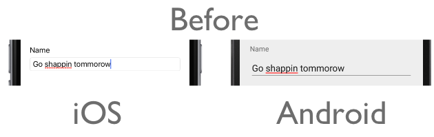
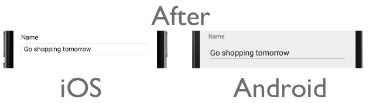

# Spell Checking Using the Bing Spell Check API

[ Download the sample](/samples/xamarin/xamarin-forms-samples/webservices-todocognitiveservices)

_Bing Spell Check performs contextual spell checking for text, providing inline suggestions for misspelled words. This article explains how to use the Bing Spell Check REST API to correct spelling errors in a Xamarin.Forms application._

## Overview

The Bing Spell Check REST API has two operating modes, and a mode must be specified when making a request to the API:

- `Spell` corrects short text (up to 9 words) without any casing changes.
- `Proof` corrects long text, provides casing corrections and basic punctuation, and suppresses aggressive corrections.

> [!NOTE]
> If you don't have an [Azure subscription](/azure/guides/developer/azure-developer-guide#understanding-accounts-subscriptions-and-billing), create a [free account](https://aka.ms/azfree-docs-mobileapps) before you begin.

An API key must be obtained to use the Bing Spell Check API. This can be obtained at [Try Cognitive Services](https://azure.microsoft.com/try/cognitive-services/)

For a list of the languages supported by the Bing Spell Check API, see [Supported languages](/azure/cognitive-services/bing-spell-check/bing-spell-check-supported-languages/). For more information about the Bing Spell Check API, see [Bing Spell Check Documentation](/azure/cognitive-services/bing-spell-check/).

## Authentication

Every request made to the Bing Spell Check API requires an API key that should be specified as the value of the `Ocp-Apim-Subscription-Key` header. The following code example shows how to add the API key to the `Ocp-Apim-Subscription-Key` header of a request:

```csharp
public BingSpellCheckService()
{
    httpClient = new HttpClient();
    httpClient.DefaultRequestHeaders.Add("Ocp-Apim-Subscription-Key", Constants.BingSpellCheckApiKey);
}
```

Failure to pass a valid API key to the Bing Spell Check API will result in a 401 response error.

## Performing Spell Checking

Spell checking can be achieved by making a GET or POST request to the `SpellCheck` API at `https://api.cognitive.microsoft.com/bing/v7.0/SpellCheck`. When making a GET request, the text to be spell checked is sent as a query parameter. When making a POST request, the text to be spell checked is sent in the request body. GET requests are limited to spell checking 1500 characters due to the query parameter string length limitation. Therefore, POST requests should typically be made unless short strings are being spell checked.

In the sample application, the `SpellCheckTextAsync` method invokes the spell checking process:

```csharp
public async Task<SpellCheckResult> SpellCheckTextAsync(string text)
{
    string requestUri = GenerateRequestUri(Constants.BingSpellCheckEndpoint, text, SpellCheckMode.Spell);
    var response = await SendRequestAsync(requestUri);
    var spellCheckResults = JsonConvert.DeserializeObject<SpellCheckResult>(response);
    return spellCheckResults;
}
```

The `SpellCheckTextAsync` method generates a request URI and then sends the request to the `SpellCheck` API, which returns a JSON response containing the result. The JSON response is deserialized, with the result being returned to the calling method for display.

### Configuring Spell Checking

The spell checking process can be configured by specifying HTTP query parameters:

```csharp
string GenerateRequestUri(string spellCheckEndpoint, string text, SpellCheckMode mode)
{
  string requestUri = spellCheckEndpoint;
  requestUri += string.Format("?text={0}", text);                         // text to spell check
  requestUri += string.Format("&mode={0}", mode.ToString().ToLower());    // spellcheck mode - proof or spell
  return requestUri;
}
```

This method sets the text to be spell checked, and the spell check mode.

For more information about the Bing Spell Check REST API, see [Spell Check API v7 reference](/rest/api/cognitiveservices/bing-spell-check-api-v7-reference/).

### Sending the Request

The `SendRequestAsync` method makes the GET request to the Bing Spell Check REST API and returns the response:

```csharp
async Task<string> SendRequestAsync(string url)
{
    var response = await httpClient.GetAsync(url);
    return await response.Content.ReadAsStringAsync();
}
```

This method sends the GET request to the `SpellCheck` API, with the request URL specifying the text to be translated, and the spell check mode. The response is then read and returned to the calling method.

The `SpellCheck` API will send HTTP status code 200 (OK) in the response, provided that the request is valid, which indicates that the request succeeded and that the requested information is in the response. For a list of response objects, see [Response objects](/rest/api/cognitiveservices/bing-spell-check-api-v7-reference#response-objects).

### Processing the Response

The API response is returned in JSON format. The following JSON data shows the response message for the misspelled text `Go shappin tommorow`:

```json
{  
   "_type":"SpellCheck",
   "flaggedTokens":[  
      {  
         "offset":3,
         "token":"shappin",
         "type":"UnknownToken",
         "suggestions":[  
            {  
               "suggestion":"shopping",
               "score":1
            }
         ]
      },
      {  
         "offset":11,
         "token":"tommorow",
         "type":"UnknownToken",
         "suggestions":[  
            {  
               "suggestion":"tomorrow",
               "score":1
            }
         ]
      }
   ],
   "correctionType":"High"
}
```

The `flaggedTokens` array contains an array of words in the text that were flagged as not being spelled correctly or are grammatically incorrect. The array will be empty if no spelling or grammar errors are found. The tags within the array are:

- `offset` – a zero-based offset from the beginning of the text string to the word that was flagged.
- `token` – the word in the text string that is not spelled correctly or is grammatically incorrect.
- `type` – the type of the error that caused the word to be flagged. There are two possible values – `RepeatedToken` and `UnknownToken`.
- `suggestions` – an array of words that will correct the spelling or grammar error. The array is made up of a `suggestion` and a `score`, which indicates the level of confidence that the suggested correction is correct.

In the sample application, the JSON response is deserialized into a `SpellCheckResult` instance, with the result being returned to the calling method for display. The following code example shows how the `SpellCheckResult` instance is processed for display:

```csharp
var spellCheckResult = await bingSpellCheckService.SpellCheckTextAsync(TodoItem.Name);
foreach (var flaggedToken in spellCheckResult.FlaggedTokens)
{
  TodoItem.Name = TodoItem.Name.Replace(flaggedToken.Token, flaggedToken.Suggestions.FirstOrDefault().Suggestion);
}
```

This code iterates through the `FlaggedTokens` collection and replaces any misspelled or grammatically incorrect words in the source text with the first suggestion. The following screenshots show before and after the spell check:





> [!NOTE]
> The example above uses `Replace` for simplicity, but across a large amount of text it
> could replace the wrong token. The API provides the `offset` value which should be
> used in production apps to identify the correct location in the source text to perform an update.

## Summary

This article explained how to use the Bing Spell Check REST API to correct spelling errors in a Xamarin.Forms application. Bing Spell Check performs contextual spell checking for text, providing inline suggestions for misspelled words.

## Related Links

- [Bing Spell Check Documentation](/azure/cognitive-services/bing-spell-check/)
- [Consume a RESTful Web Service](~/xamarin-forms/data-cloud/web-services/rest.md)
- [Todo Cognitive Services (sample)](/samples/xamarin/xamarin-forms-samples/webservices-todocognitiveservices)
- [Bing Spell Check API v7 reference](/rest/api/cognitiveservices/bing-spell-check-api-v7-reference/)