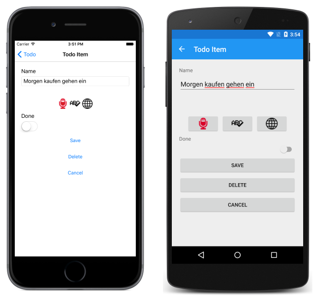

# Text Translation Using the Translator API

[ Download the sample](/samples/xamarin/xamarin-forms-samples/webservices-todocognitiveservices)

_The Microsoft Translator API can be used to translate speech and text through a REST API. This article explains how to use the Microsoft Translator Text API to translate text from one language to another in a Xamarin.Forms application._

## Overview

The Translator API has two components:

- A text translation REST API to translate text from one language into text of another language. The API automatically detects the language of the text that was sent before translating it.
- A speech translation REST API to transcribe speech from one language into text of another language. The API also integrates text-to-speech capabilities to speak the translated text back.

This article focuses on translating text from one language to another using the Translator Text API.

> [!NOTE]
> If you don't have an [Azure subscription](/azure/guides/developer/azure-developer-guide#understanding-accounts-subscriptions-and-billing), create a [free account](https://aka.ms/azfree-docs-mobileapps) before you begin.

An API key must be obtained to use the Translator Text API. This can be obtained at [How to sign up for the Microsoft Translator Text API](/azure/cognitive-services/translator/translator-text-how-to-signup/).

For more information about the Microsoft Translator Text API, see [Translator Text API Documentation](/azure/cognitive-services/translator/).

## Authentication

Every request made to the Translator Text API requires a JSON Web Token (JWT) access token, which can be obtained from the cognitive services token service at `https://api.cognitive.microsoft.com/sts/v1.0/issueToken`. A token can be obtained by making a POST request to the token service, specifying an `Ocp-Apim-Subscription-Key` header that contains the API key as its value.

The following code example shows how to request an access token from the token service:

```csharp
public AuthenticationService(string apiKey)
{
    subscriptionKey = apiKey;
    httpClient = new HttpClient();
    httpClient.DefaultRequestHeaders.Add("Ocp-Apim-Subscription-Key", apiKey);
}
...
async Task<string> FetchTokenAsync(string fetchUri)
{
    UriBuilder uriBuilder = new UriBuilder(fetchUri);
    uriBuilder.Path += "/issueToken";
    var result = await httpClient.PostAsync(uriBuilder.Uri.AbsoluteUri, null);
    return await result.Content.ReadAsStringAsync();
}
```

The returned access token, which is Base64 text, has an expiry time of 10 minutes. Therefore, the sample application renews the access token every 9 minutes.

The access token must be specified in each Translator Text API call as an `Authorization` header prefixed with the string `Bearer`, as shown in the following code example:

```csharp
httpClient.DefaultRequestHeaders.Authorization = new AuthenticationHeaderValue("Bearer", bearerToken);
```

For more information about the cognitive services token service, see [Authentication](/azure/cognitive-services/translator/reference/v3-0-reference#authentication).

## Performing Text Translation

Text translation can be achieved by making a GET request to the `translate` API at `https://api.microsofttranslator.com/v2/http.svc/translate`. In the sample application, the `TranslateTextAsync` method invokes the text translation process:

```csharp
public async Task<string> TranslateTextAsync(string text)
{
  ...
  string requestUri = GenerateRequestUri(Constants.TextTranslatorEndpoint, text, "en", "de");
  string accessToken = authenticationService.GetAccessToken();
  var response = await SendRequestAsync(requestUri, accessToken);
  var xml = XDocument.Parse(response);
  return xml.Root.Value;
}
```

The `TranslateTextAsync` method generates a request URI and retrieves an access token from the token service. The text translation request is then sent to the `translate` API, which returns an XML response containing the result. The XML response is parsed, and the translation result is returned to the calling method for display.

For more information about the Text Translation REST APIs, see [Translator Text API](/azure/cognitive-services/translator/reference/v3-0-reference).

### Configuring Text Translation

The text translation process can be configured by specifying HTTP query parameters:

```csharp
string GenerateRequestUri(string endpoint, string text, string to)
{
  string requestUri = endpoint;
  requestUri += string.Format("?text={0}", Uri.EscapeUriString(text));
  requestUri += string.Format("&to={0}", to);
  return requestUri;
}
```

This method sets the text to be translated, and the language to translate the text to. For a list of the languages supported by Microsoft Translator, see [Supported languages in the Microsoft Translator Text API](/azure/cognitive-services/translator/languages/).

> [!NOTE]
> If an application needs to know what language the text is in, the `Detect` API can be called to detect the language of the text string.

### Sending the Request

The `SendRequestAsync` method makes the GET request to the Text Translation REST API and returns the response:

```csharp
async Task<string> SendRequestAsync(string url, string bearerToken)
{
    if (httpClient == null)
    {
        httpClient = new HttpClient();
    }
    httpClient.DefaultRequestHeaders.Authorization = new AuthenticationHeaderValue("Bearer", bearerToken);

    var response = await httpClient.GetAsync(url);
    return await response.Content.ReadAsStringAsync();
}
```

This method builds the GET request by adding the access token to the `Authorization` header, prefixed with the string `Bearer`. The GET request is then sent to the `translate` API, with the request URL specifying the text to be translated, and the language to translate the text to. The response is then read and returned to the calling method.

The `translate` API will send HTTP status code 200 (OK) in the response, provided that the request is valid, which indicates that the request succeeded and that the requested information is in the response. For a list of possible error responses, see Response Messages at [GET Translate](/azure/cognitive-services/translator/reference/v3-0-translate).

### Processing the Response

The API response is returned in XML format. The following XML data shows a typical successful response message:

```xml
<string xmlns="http://schemas.microsoft.com/2003/10/Serialization/">Morgen kaufen gehen ein</string>
```

In the sample application, the XML response is parsed into a `XDocument` instance, with the XML root value being returned to the calling method for display as shown in the following screenshots:



## Summary

This article explained how to use the Microsoft Translator Text API to translate text from one language into text of another language in a Xamarin.Forms application. In addition to translating text, the Microsoft Translator API can also transcribe speech from one language into text of another language.

## Related Links

- [Translator Text API Documentation](/azure/cognitive-services/translator/)
- [Consume a RESTful Web Service](~/xamarin-forms/data-cloud/web-services/rest.md)
- [Todo Cognitive Services (sample)](/samples/xamarin/xamarin-forms-samples/webservices-todocognitiveservices)
- [Translator Text API](/azure/cognitive-services/translator/reference/v3-0-reference)