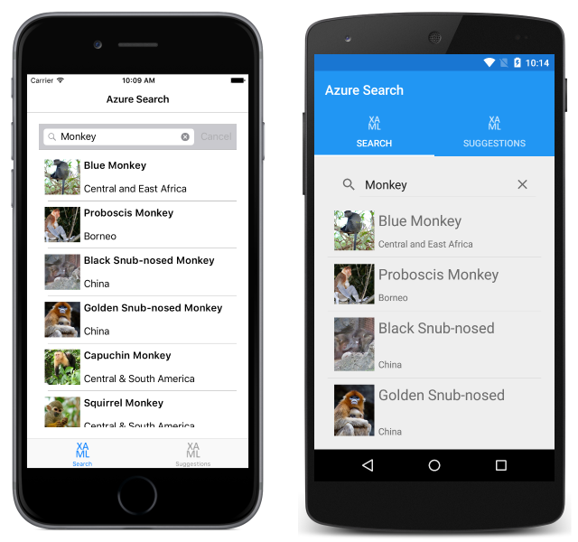
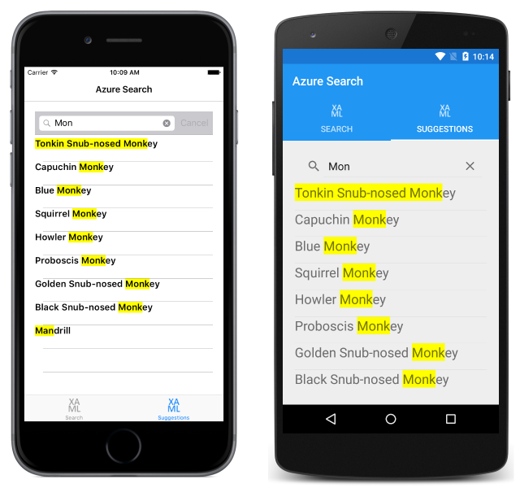

# Search Data with Azure Search and Xamarin.Forms

[ Download the sample](/samples/xamarin/xamarin-forms-samples/webservices-azuresearch)

_Azure Search is a cloud service that provides indexing and querying capabilities for uploaded data. This removes the infrastructure requirements and search algorithm complexities traditionally associated with implementing search functionality in an application. This article demonstrates how to use the Microsoft Azure Search Library to integrate Azure Search into a Xamarin.Forms application._

## Overview

Data is stored in Azure Search as indexes and documents. An *index* is a store of data that can be searched by the Azure Search service, and is conceptually similar to a database table. A *document* is a single unit of searchable data in an index, and is conceptually similar to a database row. When uploading documents and submitting search queries to Azure Search, requests are made to a specific index in the search service.

Each request made to Azure Search  must include the name of the service, and an API key. There are two types of API key:

- *Admin keys* grant full rights to all operations. This includes managing the service, creating and deleting indexes, and data sources.
- *Query keys* grant read-only access to indexes and documents, and should be used by applications that issue search requests.

The most common request to Azure Search is to execute a query. There are two types of query that can be submitted:

- A *search* query searches for one or more items in all searchable fields in an index. Search queries are built using the simplified syntax, or the Lucene query syntax. For more information, see [Simple query syntax in Azure Search](/rest/api/searchservice/Simple-query-syntax-in-Azure-Search/), and [Lucene query syntax in Azure Search](/rest/api/searchservice/Lucene-query-syntax-in-Azure-Search/).
- A *filter* query evaluates a boolean expression over all filterable fields in an index. Filter queries are built using a subset of the OData filter language. For more information, see [OData Expression Syntax for Azure Search](/rest/api/searchservice/OData-Expression-Syntax-for-Azure-Search/).

Search queries and filter queries can be used separately or together. When used together, the filter query is applied first to the entire index, and then the search query is performed on the results of the filter query.

Azure Search also supports retrieving suggestions based on search input. For more information, see [Suggestion Queries](#suggestion-queries).

> [!NOTE]
> If you don't have an [Azure subscription](/azure/guides/developer/azure-developer-guide#understanding-accounts-subscriptions-and-billing), create a [free account](https://aka.ms/azfree-docs-mobileapps) before you begin.

## Setup

The process for integrating Azure Search into a Xamarin.Forms application is as follows:

1. Create an Azure Search service. For more information, see [Create an Azure Search service using the Azure Portal](/azure/search/search-create-service-portal/).
1. Remove Silverlight as a target framework from the Xamarin.Forms solution Portable Class Library (PCL). This can be accomplished by changing the PCL profile to any profile that supports cross-platform development, but doesn't support Silverlight, such as profile 151 or profile 92.
1. Add the [Microsoft Azure Search Library](https://www.nuget.org/packages/Microsoft.Azure.Search) NuGet package to the PCL project in the Xamarin.Forms solution.

After performing these steps, the Microsoft Search Library API can be used to manage search indexes and data sources, upload and manage documents, and execute queries.

## Creating the Azure Search Index

An index schema must be defined that maps to the structure of the data to be searched. This can be accomplished in the Azure Portal, or programmatically using the `SearchServiceClient` class. This class manages connections to Azure Search, and can be used to create an index. The following code example demonstrates how to create an instance of this class:

```csharp
var searchClient =
  new SearchServiceClient(Constants.SearchServiceName, new SearchCredentials(Constants.AdminApiKey));
```

The `SearchServiceClient` constructor overload takes a search service name and a `SearchCredentials` object as arguments, with the `SearchCredentials` object wrapping the *admin key* for the Azure Search service. The *admin key* is required to create an index.

> [!NOTE]
> A single `SearchServiceClient` instance should be used in an application to avoid opening too many connections to Azure Search.

An index is defined by the `Index` object, as demonstrated in the following code example:

```csharp
static void CreateSearchIndex()
{
  var index = new Index()
  {
    Name = Constants.Index,
    Fields = new[]
    {
      new Field("id", DataType.String) { IsKey = true, IsRetrievable = true },
      new Field("name", DataType.String) { IsRetrievable = true, IsFilterable = true, IsSortable = true, IsSearchable = true },
      new Field("location", DataType.String) { IsRetrievable = true, IsFilterable = true, IsSortable = true, IsSearchable = true },
      new Field("details", DataType.String) { IsRetrievable = true, IsFilterable = true, IsSearchable = true },
      new Field("imageUrl", DataType.String) { IsRetrievable = true }
    },
    Suggesters = new[]
    {
      new Suggester("nameSuggester", SuggesterSearchMode.AnalyzingInfixMatching, new[] { "name" })
    }
  };

  searchClient.Indexes.Create(index);
}
```

The `Index.Name` property should be set to the name of the index, and the `Index.Fields` property should be set to an array of `Field` objects. Each `Field` instance specifies a name, a type, and any properties, which specify how the field is used. These properties include:

- `IsKey` – indicates whether the field is the key of the index. Only one field in the index, of type `DataType.String`, must be designated as the key field.
- `IsFacetable` – indicates whether it's possible to perform faceted navigation on this field. The default value is `false`.
- `IsFilterable` – indicates whether the field can be used in filter queries. The default value is `false`.
- `IsRetrievable` – indicates whether the field can be retrieved in search results. The default value is `true`.
- `IsSearchable` – indicates whether the field is included in full-text searches. The default value is `false`.
- `IsSortable` – indicates whether the field can be used in `OrderBy` expressions. The default value is `false`.

> [!NOTE]
> Changing an index after it's deployed involves rebuilding and reloading the data.

An `Index` object can optionally specify a `Suggesters` property, which defines the fields in the index to be used to support auto-complete or search suggestion queries. The `Suggesters` property should be set to an array of `Suggester` objects that define the fields that are used to build the search suggestion results.

After creating the `Index` object, the index is created by calling `Indexes.Create` on the `SearchServiceClient` instance.

> [!NOTE]
> When creating an index from an application that must be kept responsive, use the `Indexes.CreateAsync` method.

For more information, see [Create an Azure Search index using the .NET SDK](/azure/search/search-create-index-dotnet/).

## Deleting the Azure Search Index

An index can be deleted by calling `Indexes.Delete` on the `SearchServiceClient` instance:

```csharp
searchClient.Indexes.Delete(Constants.Index);
```

## Uploading Data to the Azure Search Index

After defining the index, data can be uploaded to it using one of two models:

- **Pull model** – data is periodically ingested from Azure Cosmos DB, Azure SQL Database, Azure Blob Storage, or SQL Server hosted in an Azure Virtual Machine.
- **Push model** – data is programmatically sent to the index. This is the model adopted in this article.

A `SearchIndexClient` instance must be created to import data into the index. This can be accomplished by calling the `SearchServiceClient.Indexes.GetClient` method, as demonstrated in the following code example:

```csharp
static void UploadDataToSearchIndex()
{
  var indexClient = searchClient.Indexes.GetClient(Constants.Index);

  var monkeyList = MonkeyData.Monkeys.Select(m => new
  {
    id = Guid.NewGuid().ToString(),
    name = m.Name,
    location = m.Location,
    details = m.Details,
    imageUrl = m.ImageUrl
  });

  var batch = IndexBatch.New(monkeyList.Select(IndexAction.Upload));
  try
  {
    indexClient.Documents.Index(batch);
  }
  catch (IndexBatchException ex)
  {
    // Sometimes when the Search service is under load, indexing will fail for some
    // documents in the batch. Compensating actions like delaying and retrying should be taken.
    // Here, the failed document keys are logged.
    Console.WriteLine("Failed to index some documents: {0}",
      string.Join(", ", ex.IndexingResults.Where(r => !r.Succeeded).Select(r => r.Key)));
  }
}
```

Data to be imported into the index is packaged as an `IndexBatch` object, which encapsulates a collection of `IndexAction` objects. Each `IndexAction` instance contains a document, and a property that tells Azure Search which action to perform on the document. In the code example above, the `IndexAction.Upload` action is specified, which results in the document being inserted into the index if it's new, or replaced if it already exists. The `IndexBatch` object is then sent to the index by calling the `Documents.Index` method on the `SearchIndexClient` object. For information about other indexing actions, see [Decide which indexing action to use](/azure/search/search-import-data-dotnet#decide-which-indexing-action-to-use).

> [!NOTE]
> Only 1000 documents can be included in a single indexing request.

Note that in the code example above, the `monkeyList` collection is created as an anonymous object from a collection of `Monkey` objects. This creates data for the `id` field, and resolves the mapping of Pascal case `Monkey` property names to camel case search index field names. Alternatively, this mapping can also be accomplished by adding the `[SerializePropertyNamesAsCamelCase]` attribute to the `Monkey` class.

For more information, see [Upload data to Azure Search using the .NET SDK](/azure/search/search-import-data-dotnet/).

## Querying the Azure Search Index

A `SearchIndexClient` instance must be created to query an index. When an application executes queries, it's advisable to follow the principle of least privilege and create a `SearchIndexClient` directly, passing the *query key* as an argument. This ensures that users have read-only access to indexes and documents. This approach is demonstrated in the following code example:

```csharp
SearchIndexClient indexClient =
  new SearchIndexClient(Constants.SearchServiceName, Constants.Index, new SearchCredentials(Constants.QueryApiKey));
```

The `SearchIndexClient` constructor overload takes a search service name, index name, and a `SearchCredentials` object as arguments, with the `SearchCredentials` object wrapping the *query key* for the Azure Search service.

### Search Queries

The index can be queried by calling the `Documents.SearchAsync` method on the `SearchIndexClient` instance, as demonstrated in the following code example:

```csharp
async Task AzureSearch(string text)
{
  Monkeys.Clear();

  var searchResults = await indexClient.Documents.SearchAsync<Monkey>(text);
  foreach (SearchResult<Monkey> result in searchResults.Results)
  {
    Monkeys.Add(new Monkey
    {
      Name = result.Document.Name,
      Location = result.Document.Location,
      Details = result.Document.Details,
      ImageUrl = result.Document.ImageUrl
    });
  }
}
```

The `SearchAsync` method takes a search text argument, and an optional `SearchParameters` object that can be used to further refine the query. A search query is specified as the search text argument, while a filter query can be specified by setting the `Filter` property of the `SearchParameters` argument. The following code example demonstrates both query types:

```csharp
var parameters = new SearchParameters
{
  Filter = "location ne 'China' and location ne 'Vietnam'"
};
var searchResults = await indexClient.Documents.SearchAsync<Monkey>(text, parameters);
```

This filter query is applied to the entire index and removes documents from the results where the `location` field is not equal to China and not equal to Vietnam. After filtering, the search query is performed on the results of the filter query.

> [!NOTE]
> To filter without searching, pass `*` as the search text argument.

The `SearchAsync` method returns a `DocumentSearchResult` object that contains the query results. This object is enumerated, with each `Document` object being created as a `Monkey` object and added to the `Monkeys` `ObservableCollection` for display. The following screenshots show search query results returned from Azure Search:



For more information about searching and filtering, see [Query your Azure Search index using the .NET SDK](/azure/search/search-query-dotnet/).

### Suggestion Queries

Azure Search allows suggestions to be requested based on a search query, by calling the `Documents.SuggestAsync` method on the `SearchIndexClient` instance. This is demonstrated in the following code example:

```csharp
async Task AzureSuggestions(string text)
{
  Suggestions.Clear();

  var parameters = new SuggestParameters()
  {
    UseFuzzyMatching = true,
    HighlightPreTag = "[",
    HighlightPostTag = "]",
    MinimumCoverage = 100,
    Top = 10
  };

  var suggestionResults =
    await indexClient.Documents.SuggestAsync<Monkey>(text, "nameSuggester", parameters);

  foreach (var result in suggestionResults.Results)
  {
    Suggestions.Add(new Monkey
    {
      Name = result.Text,
      Location = result.Document.Location,
      Details = result.Document.Details,
      ImageUrl = result.Document.ImageUrl
    });
  }
}
```

The `SuggestAsync` method takes a search text argument, the name of the suggester to use (that's defined in the index), and an optional `SuggestParameters` object that can be used to further refine the query. The `SuggestParameters` instance sets the following properties:

- `UseFuzzyMatching` – when set to `true`, Azure Search will find suggestions even if there's a substituted or missing character in the search text.
- `HighlightPreTag` – the tag that is prepended to suggestion hits.
- `HighlightPostTag` – the tag that is appended to suggestion hits.
- `MinimumCoverage` – represents the percentage of the index that must be covered by a suggestion query for the query to be reported a success. The default is 80.
- `Top` – the number of suggestions to retrieve. It must be an integer between 1 and 100, with a default value of 5.

The overall effect is that the top 10 results from the index will be returned with hit highlighting, and the results will include documents that include similarly spelled search terms.

The `SuggestAsync` method returns a `DocumentSuggestResult` object that contains the query results. This object is enumerated, with each `Document` object being created as a `Monkey` object and added to the `Monkeys` `ObservableCollection` for display. The following screenshots show the suggestion results returned from Azure Search:



Note that in the sample application, the `SuggestAsync` method is only invoked when the user finishes inputting a search term. However, it can also be used to support auto-complete search queries by executing on each keypress.

## Summary

This article demonstrated how to use the Microsoft Azure Search Library to integrate Azure Search into a Xamarin.Forms application. Azure Search is a cloud service that provides indexing and querying capabilities for uploaded data. This removes the infrastructure requirements and search algorithm complexities traditionally associated with implementing search functionality in an application.

## Related Links

- [Azure Search (sample)](/samples/xamarin/xamarin-forms-samples/webservices-azuresearch)
- [Azure Search Documentation](/azure/search/)
- [Microsoft Azure Search Library](https://www.nuget.org/packages/Microsoft.Azure.Search/)