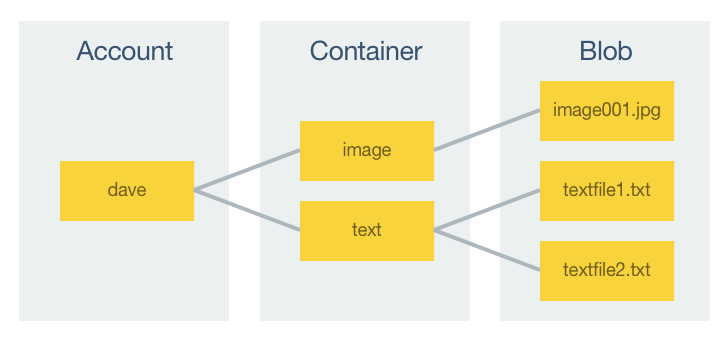

# Store and Access Data in Azure Storage from Xamarin.Forms

[ Download the sample](/samples/xamarin/xamarin-forms-samples/webservices-azurestorage)

_Azure Storage is a scalable cloud storage solution that can be used to store unstructured, and structured data. This article demonstrates how to use Xamarin.Forms to store text and binary data in Azure Storage, and how to access the data._

Azure Storage provides four storage services:

- Blob Storage. A blob can be text or binary data, such as backups, virtual machines, media files, or documents.
- Table Storage is a NoSQL key-attribute store.
- Queue Storage is a messaging service for workflow processing and communication between cloud services.
- File Storage provides shared storage using the SMB protocol.

There are two types of storage accounts:

- A general-purpose storage accounts provides access to Azure Storage services from a single account.
- A Blob storage account is a specialized storage account for storing blobs. This account type is recommended when you only need to store blob data.

This article, and accompanying sample application, demonstrates uploading image and text files to blob storage, and downloading them. In addition, it also demonstrates retrieving a list of files from blob storage, and deleting files.

For more information about Azure Storage, see [Introduction to Storage](/azure/storage/common/storage-introduction).

> [!NOTE]
> If you don't have an [Azure subscription](/azure/guides/developer/azure-developer-guide#understanding-accounts-subscriptions-and-billing), create a [free account](https://aka.ms/azfree-docs-mobileapps) before you begin.

## Introduction to Blob Storage

Blob storage consists of three components, which are shown in the following diagram:



All access to Azure Storage is through a storage account. A storage account can contain an unlimited number of containers, and a container can store an unlimited number of blobs, up to the capacity limit of the storage account.

A blob is a file of any type and size. Azure Storage supports three different blob types:

- Block blobs are optimized for streaming and storing cloud objects, and are a good choice for storing backups, media files, documents etc. Block blobs can be up to 195Gb in size.
- Append blobs are similar to block blobs but are optimized for append operations, such as logging. Append blobs can be up to 195Gb in size.
- Page blobs are optimized for frequent read/write operations and are typically used for storing virtual machines, and their disks. Page blobs can be up to 1Tb in size.

> [!NOTE]
> Note that blob storage accounts support block and append blobs, but not page blobs.

A blob is uploaded to Azure Storage, and downloaded from Azure Storage, as a stream of bytes. Therefore, files must be converted to a stream of bytes prior to upload, and converted back to their original representation after download.

Every object that's stored in Azure Storage has a unique URL address. The storage account name forms the subdomain of that address, and the combination of subdomain and domain name forms an *endpoint* for the storage account. For example, if your storage account is named *mystorageaccount*, the default blob endpoint for the storage account is `https://mystorageaccount.blob.core.windows.net`.

The URL for accessing an object in a storage account is built by appending the object's location in the storage account to the endpoint. For example, a blob address will have the format `https://mystorageaccount.blob.core.windows.net/mycontainer/myblob`.

## Setup

The process for integrating an Azure Storage account into a Xamarin.Forms application is as follows:

1. Create a storage account. For more information, see [Create a storage account](/azure/storage/common/storage-account-create#create-a-storage-account).
1. Add the [Azure Storage Client Library](https://www.nuget.org/packages/WindowsAzure.Storage/) to the Xamarin.Forms application.
1. Configure the storage connection string. For more information, see [Connecting to Azure Storage](#connecting-to-azure-storage).
1. Add `using` directives for the `Microsoft.WindowsAzure.Storage` and `Microsoft.WindowsAzure.Storage.Blob` namespaces to classes that will access Azure Storage.

## Connecting to Azure Storage

Every request made against storage account resources must be authenticated. While blobs can be configured to support anonymous authentication, there are two main approaches an application can use to authenticate with a storage account:

- Shared Key. This approach uses the Azure Storage account name and account key to access storage services. A storage account is assigned two private keys on creation that can be used for shared key authentication.
- Shared Access Signature. This is a token that can be appended to a URL that enables delegated access to a storage resource, with the permissions it specifies, for the period of time that it's valid.

Connection strings can be specified that include the authentication information required to access Azure Storage resources from an application. In addition, a connection string can be configured to connect to the Azure storage emulator from Visual Studio.

> [!NOTE]
> Azure Storage supports HTTP and HTTPS in a connection string. However, using HTTPS is recommended.

### Connecting to the Azure Storage Emulator

The Azure storage emulator provides a local environment that emulates the Azure blob, queue, and table services for development purposes.

The following connection string should be used to connect to the Azure storage emulator:

```csharp
UseDevelopmentStorage=true
```

For more information about the Azure storage emulator, see [Use the Azure storage emulator for Development and testing](/azure/storage/common/storage-use-emulator).

### Connecting to Azure Storage Using a Shared Key

The following connection string format should be used to connect to Azure Storage with a shared key:

```csharp
DefaultEndpointsProtocol=[http|https];AccountName=myAccountName;AccountKey=myAccountKey
```

`myAccountName` should be replaced with the name of your storage account, and `myAccountKey` should be replaced with one of your two account access keys.

> [!NOTE]
> When using shared key authentication, your account name and account key will be distributed to each person that uses your application, which will provide full read/write access to the storage account. Therefore, use shared key authentication for testing purposes only, and never distribute keys to other users.

### Connecting to Azure Storage using a Shared Access Signature

The following connection string format should be used to connect to Azure Storage with an SAS:

`BlobEndpoint=myBlobEndpoint;SharedAccessSignature=mySharedAccessSignature`

`myBlobEndpoint` should be replaced with the URL of your blob endpoint, and `mySharedAccessSignature` should be replaced with your SAS. The SAS provides the protocol, the service endpoint, and the credentials to access the resource.

> [!NOTE]
> SAS authentication is recommended for production applications. However, in a production application the SAS should be retrieved from a backend service on-demand, rather than being bundled with the application.

For more information about Shared Access Signatures, see [Using Shared Access Signatures (SAS)](/azure/storage/common/storage-sas-overview).

## Creating a Container

The `GetContainer` method is used to retrieve a reference to a named container, which can then be used to retrieve blobs from the container or to add blobs to the container. The following code example shows the `GetContainer` method:

```csharp
static CloudBlobContainer GetContainer(ContainerType containerType)
{
  var account = CloudStorageAccount.Parse(Constants.StorageConnection);
  var client = account.CreateCloudBlobClient();
  return client.GetContainerReference(containerType.ToString().ToLower());
}
```

The `CloudStorageAccount.Parse` method parses a connection string and returns a `CloudStorageAccount` instance that represents the storage account. A `CloudBlobClient` instance, which is used to retrieve containers and blobs, is then created by the `CreateCloudBlobClient` method. The `GetContainerReference` method retrieves the specified container as a `CloudBlobContainer` instance, before it's returned to the calling method. In this example, the container name is the `ContainerType` enumeration value, converted to a lowercase string.

> [!NOTE]
> Container names must be lowercase, and must start with a letter or number. In addition, they can only contain letters, numbers, and the dash character, and must be between 3 and 63 characters long.

The `GetContainer` method is invoked as follows:

```csharp
var container = GetContainer(containerType);
```

The `CloudBlobContainer` instance can then be used to create a container if it doesn't already exist:

```csharp
await container.CreateIfNotExistsAsync();
```

By default, a newly created container is private. This means that a storage access key must be specified to retrieve blobs from the container. For information about making blobs within a container public, see [Create a container](/azure/storage/blobs/storage-quickstart-blobs-dotnet#create-a-container).

## Uploading Data to a Container

The `UploadFileAsync` method is used to upload a stream of byte data to blob storage, and is shown in the following code example:

```csharp
public static async Task<string> UploadFileAsync(ContainerType containerType, Stream stream)
{
  var container = GetContainer(containerType);
  await container.CreateIfNotExistsAsync();

  var name = Guid.NewGuid().ToString();
  var fileBlob = container.GetBlockBlobReference(name);
  await fileBlob.UploadFromStreamAsync(stream);

  return name;
}
```

After retrieving a container reference, the method creates the container if it doesn't already exist. A new `Guid` is then created to act as a unique blob name, and a blob block reference is retrieved as an `CloudBlockBlob` instance. The stream of data is then uploaded to the blob using the `UploadFromStreamAsync` method, which creates the blob if it doesn't already exist, or overwrites it if it does exist.

Before a file can be uploaded to blob storage using this method, it must first be converted to a byte stream. This is demonstrated in the following code example:

```csharp
var byteData = Encoding.UTF8.GetBytes(text);
uploadedFilename = await AzureStorage.UploadFileAsync(ContainerType.Text, new MemoryStream(byteData));
```

The `text` data is converted to a byte array, which is then wrapped as a stream that's passed to the `UploadFileAsync` method.

## Downloading Data from a Container

The `GetFileAsync` method is used to download blob data from Azure Storage, and is shown in the following code example:

```csharp
public static async Task<byte[]> GetFileAsync(ContainerType containerType, string name)
{
  var container = GetContainer(containerType);

  var blob = container.GetBlobReference(name);
  if (await blob.ExistsAsync())
  {
    await blob.FetchAttributesAsync();
    byte[] blobBytes = new byte[blob.Properties.Length];

    await blob.DownloadToByteArrayAsync(blobBytes, 0);
    return blobBytes;
  }
  return null;
}
```

After retrieving a container reference, the method retrieves a blob reference for the stored data. If the blob exists, its properties are retrieved by the `FetchAttributesAsync` method. A byte array of the correct size is created, and the blob is downloaded as an array of bytes that gets returned to the calling method.

After downloading the blob byte data, it must be converted to its original representation. This is demonstrated in the following code example:

```csharp
var byteData = await AzureStorage.GetFileAsync(ContainerType.Text, uploadedFilename);
string text = Encoding.UTF8.GetString(byteData);
```

The array of bytes is retrieved from Azure Storage by the `GetFileAsync` method, before it's converted back to a UTF8 encoded string.

## Listing Data in a Container

The `GetFilesListAsync` method is used to retrieve a list of blobs stored in a container, and is shown in the following code example:

```csharp
public static async Task<IList<string>> GetFilesListAsync(ContainerType containerType)
{
  var container = GetContainer(containerType);

  var allBlobsList = new List<string>();
  BlobContinuationToken token = null;

  do
  {
    var result = await container.ListBlobsSegmentedAsync(token);
    if (result.Results.Count() > 0)
    {
      var blobs = result.Results.Cast<CloudBlockBlob>().Select(b => b.Name);
      allBlobsList.AddRange(blobs);
    }
    token = result.ContinuationToken;
  } while (token != null);

  return allBlobsList;
}
```

After retrieving a container reference, the method uses the container's `ListBlobsSegmentedAsync` method to retrieve references to the blobs within the container. The results returned by the `ListBlobsSegmentedAsync` method are enumerated while the `BlobContinuationToken` instance is not `null`. Each blob is cast from the returned `IListBlobItem` to a `CloudBlockBlob` in order access the `Name` property of the blob, before it's value is added to the `allBlobsList` collection. Once the `BlobContinuationToken` instance is `null`, the last blob name has been returned, and execution exits the loop.

## Deleting Data from a Container

The `DeleteFileAsync` method is used to delete a blob from a container, and is shown in the following code example:

```csharp
public static async Task<bool> DeleteFileAsync(ContainerType containerType, string name)
{
  var container = GetContainer(containerType);
  var blob = container.GetBlobReference(name);
  return await blob.DeleteIfExistsAsync();
}
```

After retrieving a container reference, the method retrieves a blob reference for the specified blob. The blob is then deleted with the `DeleteIfExistsAsync` method.

## Related Links

- [Azure Storage (sample)](/samples/xamarin/xamarin-forms-samples/webservices-azurestorage)
- [Introduction to Storage](/azure/storage/common/storage-introduction).
- [How to use Blob Storage from Xamarin](/azure/storage/blobs/storage-quickstart-blobs-xamarin)
- [Using Shared Access Signatures (SAS)](/azure/storage/common/storage-sas-overview)
- [Windows Azure Storage (NuGet)](https://www.nuget.org/packages/WindowsAzure.Storage/)