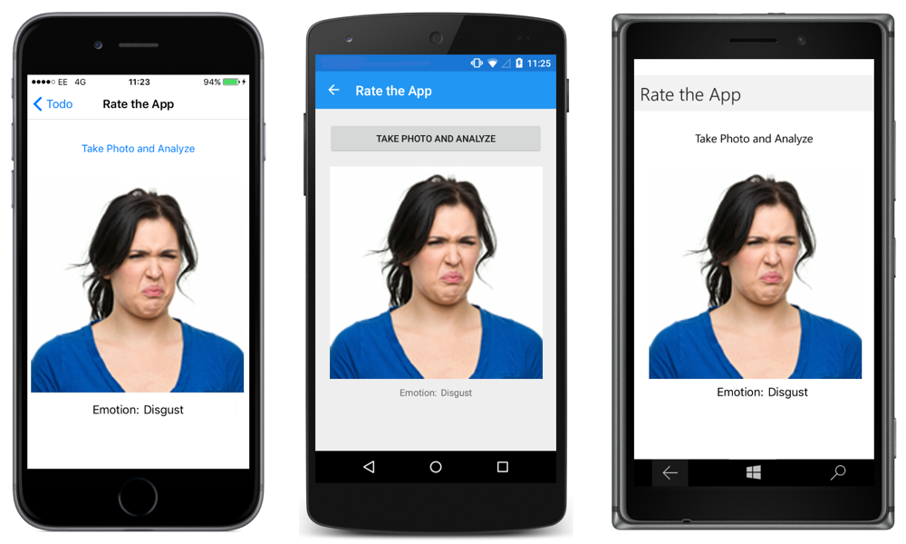

# Emotion Recognition Using the Emotion API

_The Emotion API takes a facial expression in an image as an input, and returns confidence levels across a set of emotions for each face in the image. This article explains how to use the Emotion API to recognize emotion, to rate a Xamarin.Forms application._


> [!NOTE]
> The Emotion API is still in preview. There may be breaking changes to the API before the final release.

## Overview

The Emotion API can detect anger, contempt, disgust, fear, happiness, neutral, sadness, and surprise, in a facial expression. These emotions are universally and cross-culturally communicated via the same basic facial expressions. As well as returning an emotion result for a facial expression, the Emotion API also returns a bounding box for detected faces using the Face API. If a user has already called the Face API, they can submit the face rectangle as an optional input. Note that an API key must be obtained to use the Emotion API. This can be obtained at [Getting started for free](https://www.microsoft.com/cognitive-services/en-US/sign-up) on microsoft.com.

Emotion recognition can be performed via a client library, and via a REST API. This article focuses on performing emotion recognition via the [Microsoft.ProjectOxford.Emotion](https://www.nuget.org/packages/Microsoft.ProjectOxford.Emotion/) client library, which can be downloaded from NuGet.

The Emotion API can also be used to recognize the facial expressions of people in video, and returns a summary of their emotions. For more information, see [Emotion in Video](https://www.microsoft.com/cognitive-services/en-us/emotion-api/documentation#emotion-in-video) on microsoft.com.

For more information about the Emotion API, see [Emotion API Documentation](https://www.microsoft.com/cognitive-services/en-us/emotion-api/documentation) on microsoft.com.

## Performing Emotion Recognition

Emotion recognition is achieved by uploading an image stream to the Emotion API. The image file size shouldn't be larger than 4MB, and supported file formats are JPEG, PNG, GIF, and BMP. Within the image, the detectable face size range is 36x36 to 4096x4096 pixels. Any faces outside of this range won't be detected.

The following code example shows the emotion recognition process:

```csharp
using Microsoft.ProjectOxford.Emotion;
using Microsoft.ProjectOxford.Emotion.Contract;

var	emotionClient = new EmotionServiceClient(Constants.EmotionApiKey);

using (var photoStream = photo.GetStream())
{
  Emotion[] emotionResult = await emotionClient.RecognizeAsync(photoStream);
  if (emotionResult.Any())
  {
    // Emotions detected are happiness, sadness, surprise, anger, fear, contempt, disgust, or neutral.
    emotionResultLabel.Text = emotionResult.FirstOrDefault().Scores.ToRankedList().FirstOrDefault().Key;
  }
  // Store emotion as app rating
  ...
}
```

An `EmotionServiceClient` instance must be created to perform emotion recognition, with the Emotion API key being passed as an argument to the `EmotionServiceClient` constructor.

The `RecognizeAsync` method, which is invoked on the `EmotionServiceClient` instance, uploads an image to the Emotion API, as a `Stream`. The API key will be submitted to the Emotion API when this operation is invoked. Failure to submit a valid API key will result in a `Microsoft.ProjectOxford.Common.ClientException` being thrown, with the exception message indicating that an invalid API key was submitted.

The `RecognizeAsync` method will return an `Emotion` array, provided that a face has been recognized. For each image, the maximum number of faces that can be detected is 64, and the faces are ranked by face rectangle size in descending order. If no face is detected, an empty `Emotion` array will be returned.

When interpreting results from the Emotion API, the detected emotion should be interpreted as the emotion with the highest score, as scores are normalized to sum to one. Therefore, the sample application displays the recognized emotion with the highest score for the largest detected face in the image, as shown in the following screenshots:



## Summary

This article explained how to use the Emotion API to recognize emotion, to rate a Xamarin.Forms application. The Emotion API takes a facial expression in an image as an input, and returns the confidence across a set of emotions for each face in the image.


## Related Links

- [Emotion API Documentation](https://www.microsoft.com/cognitive-services/en-us/emotion-api/documentation)
- [Todo Cognitive Services (sample)](https://developer.xamarin.com/samples/xamarin-forms/WebServices/TodoCognitiveServices/)
- [Microsoft.ProjectOxford.Emotion](https://www.nuget.org/packages/Microsoft.ProjectOxford.Emotion/)
- [Emotion API](https://dev.projectoxford.ai/docs/services/5639d931ca73072154c1ce89/operations/563b31ea778daf121cc3a5fa)
