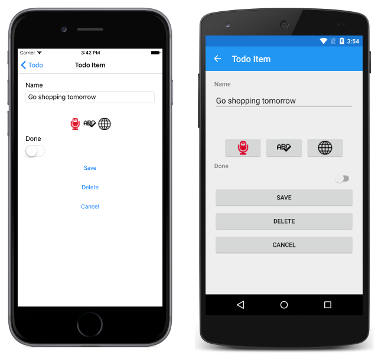

# Speech Recognition Using the Microsoft Speech API

[ Download the sample](https://developer.xamarin.com/samples/xamarin-forms/WebServices/TodoCognitiveServices/)

_The Microsoft Speech API is a cloud-based API that provides algorithms to process spoken language. This article explains how to use the Microsoft Speech Recognition REST API to convert audio to text in a Xamarin.Forms application._

## Overview

The Microsoft Speech API has two components:

- A speech recognition API for converting spoken words to text. Speech recognition can be performed via a REST API, client library, or service library.
- A text to speech API for converting text into spoken words. Text to speech conversion is performed via a REST API.

This article focuses on performing speech recognition via the REST API. While the client and service libraries support returning partial results, the REST API can only return a single recognition result, without any partial results.

An API key must be obtained to use the Microsoft Speech API. This can be obtained from the Azure [portal](https://portal.azure.com/). For more information, see [Create a Cognitive Services account in the Azure portal](/azure/cognitive-services/cognitive-services-apis-create-account).

For more information about the Microsoft Speech API, see [Microsoft Speech API Documentation](/azure/cognitive-services/speech/home/).

## Authentication

Every request made to the Microsoft Speech REST API requires a JSON Web Token (JWT) access token, which can be obtained from the cognitive services token service at `https://api.cognitive.microsoft.com/sts/v1.0/issueToken`. A token can be obtained by making a POST request to the token service, specifying an `Ocp-Apim-Subscription-Key` header that contains the API key as its value.

The following code example shows how to request an access token from the token service:

```csharp
public AuthenticationService(string apiKey)
{
    subscriptionKey = apiKey;
    httpClient = new HttpClient();
    httpClient.DefaultRequestHeaders.Add("Ocp-Apim-Subscription-Key", apiKey);
}
...
async Task<string> FetchTokenAsync(string fetchUri)
{
    UriBuilder uriBuilder = new UriBuilder(fetchUri);
    uriBuilder.Path += "/issueToken";
    var result = await httpClient.PostAsync(uriBuilder.Uri.AbsoluteUri, null);
    return await result.Content.ReadAsStringAsync();
}
```

The returned access token, which is Base64 text, has an expiry time of 10 minutes. Therefore, the sample application renews the access token every 9 minutes.

The access token must be specified in each Microsoft Speech REST API call as an `Authorization` header prefixed with the string `Bearer`, as shown in the following code example:

```csharp
httpClient.DefaultRequestHeaders.Authorization = new AuthenticationHeaderValue("Bearer", bearerToken);
```

Failure to pass a valid access token to the Microsoft Speech REST API will result in a 403 response error.

## Performing Speech Recognition

Speech recognition is achieved by making a POST request to the `recognition` API at `https://speech.platform.bing.com/speech/recognition/`. A single request can't contain more than 10 seconds of audio, and the total request duration can't exceed 14 seconds.

Audio content must be placed in the POST body of the request in wav format.

In the sample application, the `RecognizeSpeechAsync` method invokes the speech recognition process:

```csharp
public async Task<SpeechResult> RecognizeSpeechAsync(string filename)
{
    ...

    // Read audio file to a stream
    var file = await PCLStorage.FileSystem.Current.LocalStorage.GetFileAsync(filename);
    var fileStream = await file.OpenAsync(PCLStorage.FileAccess.Read);

    // Send audio stream to Bing and deserialize the response
    string requestUri = GenerateRequestUri(Constants.SpeechRecognitionEndpoint);
    string accessToken = authenticationService.GetAccessToken();
    var response = await SendRequestAsync(fileStream, requestUri, accessToken, Constants.AudioContentType);
    var speechResult = JsonConvert.DeserializeObject<SpeechResult>(response);

    fileStream.Dispose();
    return speechResult;
}
```

Audio is recorded in each platform-specific project as PCM wav data, and the `RecognizeSpeechAsync` method uses the `PCLStorage` NuGet package to open the audio file as a stream. The speech recognition request URI is generated and an access token is retrieved from the token service. The speech recognition request is posted to the `recognition` API, which returns a JSON response containing the result. The JSON response is deserialized, with the result being returned to the calling method for display.

### Configuring Speech Recognition

The speech recognition process can be configured by specifying HTTP query parameters:

```csharp
string GenerateRequestUri(string speechEndpoint)
{
    // To build a request URL, you should follow:
    // https://docs.microsoft.com/azure/cognitive-services/speech/getstarted/getstartedrest
    string requestUri = speechEndpoint;
    requestUri += @"dictation/cognitiveservices/v1?";
    requestUri += @"language=en-us";
    requestUri += @"&format=simple";
    System.Diagnostics.Debug.WriteLine(requestUri.ToString());
    return requestUri;
}
```

The main configuration performed by the `GenerateRequestUri` method is to set the locale of the audio content. For a list of the supported locales, see [Supported languages ](/azure/cognitive-services/speech/api-reference-rest/supportedlanguages/).

### Sending the Request

The `SendRequestAsync` method makes the POST request to the Microsoft Speech REST API and returns the response:

```csharp
async Task<string> SendRequestAsync(Stream fileStream, string url, string bearerToken, string contentType)
{
    if (httpClient == null)
    {
        httpClient = new HttpClient();
    }
    httpClient.DefaultRequestHeaders.Authorization = new AuthenticationHeaderValue("Bearer", bearerToken);

    var content = new StreamContent(fileStream);
    content.Headers.TryAddWithoutValidation("Content-Type", contentType);
    var response = await httpClient.PostAsync(url, content);
    return await response.Content.ReadAsStringAsync();
}
```

This method builds the POST request by:

- Wrapping the audio stream in a `StreamContent` instance, which provides HTTP content based on a stream.
- Setting the `Content-Type` header of the request to `audio/wav; codec="audio/pcm"; samplerate=16000`.
- Adding the access token to the `Authorization` header, prefixed with the string `Bearer`.

The POST request is then sent to `recognition` API. The response is then read and returned to the calling method.

The `recognition` API will send HTTP status code 200 (OK) in the response, provided that the request is valid, which indicates that the request succeeded and that the requested information is in the response. For a list of possible error responses, see [Troubleshooting](/azure/cognitive-services/speech/troubleshooting).

### Processing the Response

The API response is returned in JSON format, with the recognized text being contained in the `name` tag. The following JSON data shows a typical successful response message:

```json
{  
   "RecognitionStatus":"Success",
   "DisplayText":"Go shopping tomorrow.",
   "Offset":16000000,
   "Duration":17100000
}
```

In the sample application, the JSON response is deserialized into a `SpeechResult` instance, with the result being returned to the calling method for display, as shown in the following screenshots:



## Summary

This article explained how to use the Microsoft Speech REST API to convert audio to text in a Xamarin.Forms application. In addition to performing speech recognition, the Microsoft Speech API can also convert text into spoken words.

## Related Links

- [Microsoft Speech API Documentation](/azure/cognitive-services/speech/home/).
- [Consuming a RESTful Web Service](~/xamarin-forms/data-cloud/consuming/rest.md)
- [Todo Cognitive Services (sample)](https://developer.xamarin.com/samples/xamarin-forms/WebServices/TodoCognitiveServices/)
