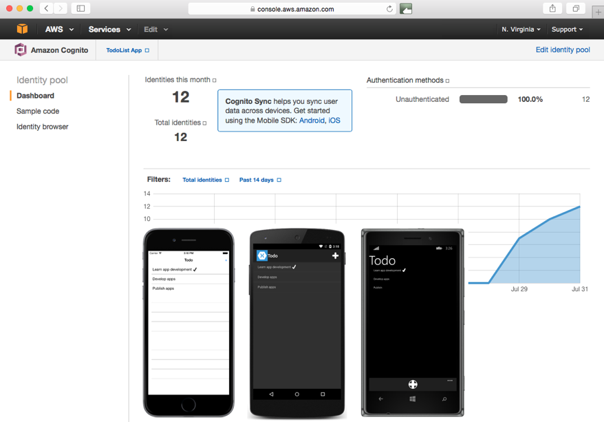

# Consuming an Amazon SimpleDB Service

_Amazon SimpleDB is a web service that provides the ability to store and query data in Amazon's cloud. This article explains how to use the AWS SDK for .NET to query, create, replace, and delete data stored in a SimpleDB service._

SimpleDB services use a request and response model familiar to consumers of REST services. Operations are invoked on the SimpleDB service by sending a request, which may contain data. After processing the request, the SimpleDB service returns a response containing any results. A SimpleDB service must be created programmatically and cannot be created through the [AWS Console](https://aws.amazon.com). However, an AWS account is required to create and access any Amazon web service.

In a SimpleDB service, data is organized into domains, within which data can be placed and queries run against the data. Domains consist of items that are described by attribute name-value pairs. Domains can be thought of as being similar to tables, with attributes being similar to columns, and items being similar to rows. For more information about the SimpleDB data model, see [Data Model](http://docs.aws.amazon.com/AmazonSimpleDB/latest/DeveloperGuide/DataModel.html) on Amazon's website.

Instructions on setting up the required Amazon services can be found in the readme file that accompanies the sample application. When the sample application is run, it will connect to an Amazon Cognito identity pool to authorize access to the SimpleDB service, as shown in the following screenshot:



> [!NOTE]
> In iOS 9 and greater, App Transport Security (ATS) enforces secure connections between internet resources (such as the app's back-end server) and the app, thereby preventing accidental disclosure of sensitive information. Since ATS is enabled by default in apps built for iOS 9, all connections will be subject to ATS security requirements. If connections do not meet these requirements, they will fail with an exception.
> ATS can be opted out of if it is not possible to use the `HTTPS` protocol and secure communication for internet resources. This can be achieved by updating the app's **Info.plist** file. For more information see [App Transport Security](~/ios/app-fundamentals/ats.md).

## Consuming a SimpleDB Service

Amazon Cognito Identity allows AWS services, such as SimpleDB, to be invoked from an application without hard-coding AWS credentials into the application. Instead, a unique identity pool is created in the [Amazon Cognito Console](https://console.aws.amazon.com/cognito/home). The identity pool contains identities that use roles to specify resources, such as SimpleDB, that the identity can access.

The [AWS SDK for .NET](https://www.nuget.org/packages?q=Tags%3A%22aws-sdk-v3%22) provides the `CognitoAWSCredentials` and `AmazonSimpleDBClient` classes, which are used by a Xamarin.Forms application to access the SimpleDB service, as shown in the following code example:

```csharp
AmazonSimpleDBClient client;
...

public SimpleDBStorage ()
{
  var credentials = new CognitoAWSCredentials (
                      Constants.CognitoIdentityPoolId,
                      RegionEndpoint.USEast1);
  var config = new AmazonSimpleDBConfig ();
  config.RegionEndpoint = RegionEndpoint.USWest2;
  client = new AmazonSimpleDBClient (credentials, config);
  ...
}
```

A new instance of the `CognitoAWSCredentials` class is created by providing the unique identity pool id and the region of the Cognito Identity account. At the time of writing, Cognito Identity is only available in the USEast1 and EUWest1 regions. However, it can communicate with Amazon services outside those regions.

When the `AmazonSimpleDBClient` instance is created, the `CognitoAWSCredentials` instance must be provided, along with an `AmazonSimpleDBConfig` instance that specifies the geographical region where the SimpleDB service resides. The `CognitoAWSCredentials` instance ensures that the SimpleDB service that's accessed is the one associated with the AWS account in which the identity pool was created, while avoiding the need to embed an AWS access key and secret key in the application.

A SimpleDB service domain is created by calling the `AmazonSimpleDBClient.CreateDomainAsync` method, as shown in the following code example:

```csharp
string tableName = "Todo";
...

async Task CreateDomain ()
{
  ...
  await client.CreateDomainAsync (new CreateDomainRequest { DomainName = tableName });
  ...
}
```

The `CreateDomainAsync` method requires a `CreateDomainRequest` instance as a parameter. The `CreateDomainRequest` instance initializes the `DomainName` property to the value to be used to identify the domain. To create the domain, this value must be unique amongst the domains associated with the AWS account. Otherwise, the domain will not be created and no error response will be sent to indicate that. Any operations against the domain name will then occur against the existing domain, rather than a newly created domain.

### Creating SimpleDB Objects

The sample application uses the `TodoItem` class to model data. To store a `TodoItem` instance in a SimpleDB service it must first be converted into a `List` of `ReplaceableAttribute` objects. This is accomplished by the `ToSimpleDBReplaceableAttributes` method, as shown in the following code example:

```csharp
List<ReplaceableAttribute> ToSimpleDBReplaceableAttributes (TodoItem item)
{
  return new List<ReplaceableAttribute> () {
    new ReplaceableAttribute () {
      Name = "Name",
      Value = item.Name,
      Replace = true
    },
    new ReplaceableAttribute () {
      Name = "Notes",
      Value = item.Notes,
      Replace = true
    },
    new ReplaceableAttribute () {
      Name = "Done",
      Value = item.Done.ToString (),
      Replace = true
    }
  };
}
```

This method creates a `List` of new `ReplaceableAttribute` instances, with the `List` representing a single `TodoItem` instance. Each `ReplaceableAttribute` instance represents a single property from the `TodoItem` instance. For more information about the `ReplaceableAttribute` class, see [ReplaceableAttribute Class](http://docs.aws.amazon.com/sdkfornet1/latest/apidocs/html/T_Amazon_SimpleDB_Model_ReplaceableAttribute.htm) on Amazon's website.

Similarly, when data is retrieved from the SimpleDB service, it must be converted from a `List` of `Attribute` instances to a `TodoItem` instance. This is accomplished with the `FromSimpleDBAttributes` method, as shown in the following code example:

```csharp
TodoItem FromSimpleDBAttributes (List<Amazon.SimpleDB.Model.Attribute> attributeList, string id)
{
  var todoItem = new TodoItem ();
  todoItem.ID = id;
  todoItem.Name = attributeList.Where (attr => attr.Name == "Name").FirstOrDefault ().Value;
  todoItem.Notes = attributeList.Where (attr => attr.Name == "Notes").FirstOrDefault ().Value;
  todoItem.Done = Convert.ToBoolean (attributeList.Where (attr => attr.Name == "Done").FirstOrDefault ().Value);
  return todoItem;
}
```

This method simply retrieves each `Attribute` instance from the `List` and sets it in the newly created `TodoItem` instance.

For more information about the `Attribute` class, see [Attribute Class](http://docs.aws.amazon.com/sdkfornet1/latest/apidocs/html/T_Amazon_SimpleDB_Model_Attribute.htm) on Amazon's website.

### Querying Data

The contents of a domain can be retrieved by calling the `AmazonSimpleDBClient.SelectAsync` method, as shown in the following code example:

```csharp
public async Task<List<TodoItem>> RefreshDataAsync ()
{
  ...
  var request = new SelectRequest () {
      SelectExpression = string.Format ("SELECT * from {0}", tableName)
  };
  var response = await client.SelectAsync (request);
  foreach (var item in response.Items) {
    Items.Add (FromSimpleDBAttributes (item.Attributes, item.Name));
  }
  ...
}
```

The `SelectAsync` method accepts a `SelectRequest` instance as a parameter, which specifies a `Select` query expression in it's `SelectExpression` property. The format of the query expression is similar to the format of the standard SQL `SELECT` statement. For more information about the query expression, see [Using Select to Create Amazon SimpleDB Queries](http://docs.aws.amazon.com/AmazonSimpleDB/latest/DeveloperGuide/UsingSelect.html) on Amazon's website.

> [!NOTE]
> **Note**: Be careful to follow the quoting rules when constructing the query expression. For more information, see [Select Quoting Rules](http://docs.aws.amazon.com/AmazonSimpleDB/latest/DeveloperGuide/QuotingRulesSelect.html) on Amazon's website.

The `SelectAsync` method returns a response containing a collection of items and associated attributes that match the query expression. This collection is then converted to a `List` of `TodoItem` instances for display.

### Creating and Replacing Data

The `AmazonSimpleDBClient.PutAttributesAsync` method is used to create and replace data in the SimpleDB service domain, as shown in the following code example:

```csharp
public async Task SaveTodoItemAsync (TodoItem todoItem)
{
  ...
  var attributeList = ToSimpleDBReplaceableAttributes (todoItem);
  var request = new PutAttributesRequest () {
      DomainName = tableName,
      ItemName = todoItem.ID,
      Attributes = attributeList
  };
  await client.PutAttributesAsync (request);
  ...
}
```

The `PutAttributesAsync` method accepts a `PutAttributesRequest` instance as a parameter. The `PutAttributesRequest` instance specifies the attribute name-value pairs that are to be created as a new item, or replaced in an existing item. The `List` of `ReplaceableAttribute` instances is built by the `ToSimpleDBReplaceableAttributes` method. This method also sets the `Replace` property of each `ReplaceableAttribute` to `true`. This will cause the new attribute value to replace an existing attribute value if data is being replaced. However, attempting to replace attribute values that do not exist will not result in an error response.

The value of the `PutAttributesRequest.ItemName` property controls whether a new item will be added to the domain, or whether an existing item will be replaced. When the application creates a new item, it sets the `TodoItem.ID` property to a new `Guid`. This ensures that each `TodoItem` instance has a unique identifier. Therefore, if the `PutAttributesRequest.ItemName` property is set to a value that does not exist in the domain, the SimpleDB service will create a new item containing the specified attribute name-value pairs. If the `PutAttributesRequest.ItemName` property is set to a value that already exists in the domain, the SimpleDB service will update the item with the specified attribute name-value pairs.

### Deleting Data

The `AmazonSimpleDBClient.DeleteAttributesAsync` method is used to delete data from the SimpleDB service domain, as shown in the following code example:

```csharp
public async Task DeleteTodoItemAsync (TodoItem todoItem)
{
  ...
  var attributeList = ToSimpleDBAttributes (todoItem);
  var request = new DeleteAttributesRequest () {
      DomainName = tableName,
      ItemName = todoItem.ID,
      Attributes = attributeList
  };
  await client.DeleteAttributesAsync (request);
  ...
}
```

The `DeleteAttributesAsync` method accepts a `DeleteAttributesRequest` instance as a parameter.  The `DeleteAttributesRequest` instance specifies the attributes that are to be deleted from the item, with the `List` of `Attribute` instances to be deleted being built by the `ToSimpleDBAttributes` method. The item is deleted provided that all the attributes of the item are deleted.

## Summary

This article explained how to use the AWS SDK for .NET to query, create and replace, and delete data stored in a SimpleDB service. This SDK provides the `CognitoAWSCredentials` and `AmazonSimpleDBClient` classes that are used by a Xamarin.Forms application to access the SimpleDB service.


## Related Links

- [TodoAWS (sample)](https://developer.xamarin.com/samples/xamarin-forms/WebServices/TodoAWS/)
- [Amazon Web Services SDK Xamarin Developer Guide](http://docs.aws.amazon.com/mobile/sdkforxamarin/developerguide/)
- [Amazon Cognito Identity](http://docs.aws.amazon.com/cognito/devguide/identity/)
- [Amazon SimpleDB Developer Documentation](http://docs.aws.amazon.com/AmazonSimpleDB/latest/DeveloperGuide/Welcome.html)
- [AmazonSimpleDBClient Class](http://docs.aws.amazon.com/sdkfornet1/latest/apidocs/html/T_Amazon_SimpleDB_AmazonSimpleDBClient.htm)
- [Amazon Web Services SDK for .NET](https://www.nuget.org/packages?q=Tags%3A%22aws-sdk-v3%22)
