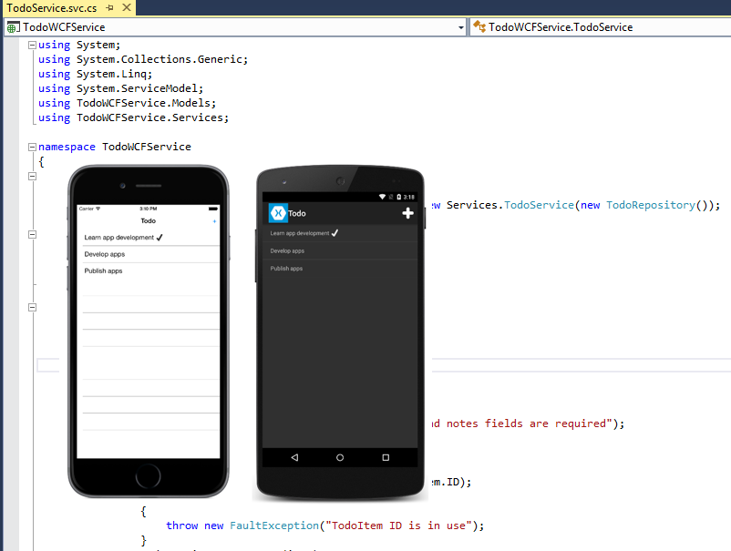

# Consuming a Windows Communication Foundation (WCF) Web Service

[ Download the sample](https://developer.xamarin.com/samples/xamarin-forms/WebServices/TodoWCF/)

_WCF is Microsoft's unified framework for building service-oriented applications. It enables developers to build secure, reliable, transacted, and interoperable distributed applications. This article demonstrates how to consume an WCF Simple Object Access Protocol (SOAP) service from a Xamarin.Forms application._

WCF describes a service with a variety of different contracts which include the following:

- **Data contracts** – define the data structures that form the basis for the content within a message.
- **Message contracts** – compose messages from existing data contracts.
- **Fault contracts** – allow custom SOAP faults to be specified.
- **Service contracts** – specify the operations that services support and the messages required for interacting with each operation. They also specify any custom fault behavior that can be associated with operations on each service.

There are differences between ASP.NET Web Services (ASMX) and WCF, but it is important to understand that WCF supports the same capabilities that ASMX provides – SOAP messages over HTTP. For more information about consuming an ASMX service, see [Consuming ASP.NET Web Services (ASMX)](~/xamarin-forms/data-cloud/consuming/asmx.md).

In general, the Xamarin platform supports the same client-side subset of WCF that ships with the Silverlight runtime. This includes the most common encoding and protocol implementations of WCF — text-encoded SOAP messages over the HTTP transport protocol using the `BasicHttpBinding` class. In addition, WCF support requires the use of tools only available in a Windows environment to generate the proxy.

Instructions on setting up the WCF service can be found in the readme file that accompanies the sample application. However, when the sample application is run it will connect to a Xamarin-hosted WCF service that provides read-only access to data, as shown in the following screenshot:



> [!NOTE]
> In iOS 9 and greater, App Transport Security (ATS) enforces secure connections between internet resources (such as the app's back-end server) and the app, thereby preventing accidental disclosure of sensitive information. Since ATS is enabled by default in apps built for iOS 9, all connections will be subject to ATS security requirements. If connections do not meet these requirements, they will fail with an exception.
> ATS can be opted out of if it is not possible to use the `HTTPS` protocol and secure communication for internet resources. This can be achieved by updating the app's **Info.plist** file. For more information see [App Transport Security](~/ios/app-fundamentals/ats.md).

## Consuming the Web Service

The WCF service provides the following operations:

|Operation|Description|Parameters|
|--- |--- |--- |
|GetTodoItems|Get a list of to-do items|
|CreateTodoItem|Create a new to-do item|An XML serialized TodoItem|
|EditTodoItem|Update a to-do item|An XML serialized TodoItem|
|DeleteTodoItem|Delete a to-do item|An XML serialized TodoItem|

For more information about the data model used in the application, see [Modeling the data](~/xamarin-forms/data-cloud/walkthrough.md).

> [!NOTE]
> The sample application consumes the Xamarin-hosted WCF service that provides read-only access to the web service. Therefore, the operations that create, update, and delete data will not alter the data consumed in the application. However, a hostable version of the ASMX service is available in the **TodoWCFService** folder in the accompanying sample application. This hostable version of the WCF service permits full create, update, read, and delete access to the data.

A *proxy* must be generated to consume a WCF service, which allows the application to connect to the service. The proxy is constructed by consuming service metadata that define the methods and associated service configuration. This metadata is exposed in the form of a Web Services Description Language (WSDL) document that is generated by the web service. The proxy can be built by using the Microsoft WCF Web Service Reference Provider in Visual Studio 2017 to add a service reference for the web service to a .NET Standard library. An alternative to creating the proxy using the Microsoft WCF Web Service Reference Provider in Visual Studio 2017 is to use the ServiceModel Metadata Utility Tool (svcutil.exe). For more information, see [ServiceModel Metadata Utility Tool (Svcutil.exe)](/dotnet/framework/wcf/servicemodel-metadata-utility-tool-svcutil-exe/).

The generated proxy classes provide methods for consuming the web services that use the Asynchronous Programming Model (APM) design pattern. In this pattern, an asynchronous operation is implemented as two methods named *BeginOperationName* and *EndOperationName*, which begin and end the asynchronous operation.

The *BeginOperationName* method begins the asynchronous operation and returns an object that implements the `IAsyncResult` interface. After calling *BeginOperationName*, an application can continue executing instructions on the calling thread, while the asynchronous operation takes place on a thread pool thread.

For each call to *BeginOperationName*, the application should also call *EndOperationName* to get the results of the operation. The return value of *EndOperationName* is the same type returned by the synchronous web service method. For example, the `EndGetTodoItems` method returns a collection of `TodoItem` instances. The *EndOperationName* method also includes an `IAsyncResult` parameter that should be set to the instance returned by the corresponding call to the *BeginOperationName* method.

The Task Parallel Library (TPL) can simplify the process of consuming an APM begin/end method pair by encapsulating the asynchronous operations in the same `Task` object. This encapsulation is provided by multiple overloads of the `TaskFactory.FromAsync` method.

For more information about APM see [Asynchronous Programming Model](https://msdn.microsoft.com/library/ms228963(v=vs.110).aspx) and [TPL and Traditional .NET Framework Asynchronous Programming](https://msdn.microsoft.com/library/dd997423(v=vs.110).aspx) on MSDN.

### Creating the TodoServiceClient Object

The generated proxy class provides the `TodoServiceClient` class, which is used to communicate with the WCF service over HTTP. It provides functionality for invoking web service methods as asynchronous operations from a URI identified service instance. For more information about asynchronous operations, see [Async Support Overview](~/cross-platform/platform/async.md).

The `TodoServiceClient` instance is declared at the class-level so that the object lives for as long as the application needs to consume the WCF service, as shown in the following code example:

```csharp
public class SoapService : ISoapService
{
  ITodoService todoService;
  ...

  public SoapService ()
  {
    todoService = new TodoServiceClient (
      new BasicHttpBinding (),
      new EndpointAddress (Constants.SoapUrl));
  }
  ...
}
```

The `TodoServiceClient` instance is configured with binding information and an endpoint address. A binding is used to specify the transport, encoding, and protocol details required for applications and services to communicate with each other. The `BasicHttpBinding` specifies that text-encoded SOAP messages will be sent over the HTTP transport protocol. Specifying an endpoint address enables the application to connect to different instances of the WCF service, provided that there are multiple published instances.

For more information about configuring the service reference, see [Configuring the Service Reference](~/cross-platform/data-cloud/web-services/index.md#wcf).

### Creating Data Transfer Objects

The sample application uses the `TodoItem` class to model data. To store a `TodoItem` item in the web service it must first be converted to the proxy generated `TodoItem` type. This is accomplished by the `ToWCFServiceTodoItem` method, as shown in the following code example:

```csharp
TodoWCFService.TodoItem ToWCFServiceTodoItem (TodoItem item)
{
  return new TodoWCFService.TodoItem {
    ID = item.ID,
    Name = item.Name,
    Notes = item.Notes,
    Done = item.Done
  };
}
```

This method simply creates a new `TodoWCFService.TodoItem` instance, and sets each property to the identical property from the `TodoItem` instance.

Similarly, when data is retrieved from the web service, it must be converted from the proxy generated `TodoItem` type to a `TodoItem` instance. This is accomplished with the `FromWCFServiceTodoItem` method, as shown in the following code example:

```csharp
static TodoItem FromWCFServiceTodoItem (TodoWCFService.TodoItem item)
{
  return new TodoItem {
    ID = item.ID,
    Name = item.Name,
    Notes = item.Notes,
    Done = item.Done
  };
}

```

This method simply retrieves the data from the proxy generated `TodoItem` type and sets it in the newly created `TodoItem` instance.

### Retrieving Data

The `TodoServiceClient.BeginGetTodoItems` and `TodoServiceClient.EndGetTodoItems` methods are used to call the `GetTodoItems` operation provided by the web service. These asynchronous methods are encapsulated in a `Task` object, as shown in the following code example:

```csharp
public async Task<List<TodoItem>> RefreshDataAsync ()
{
  ...
  var todoItems = await Task.Factory.FromAsync <ObservableCollection<TodoWCFService.TodoItem>> (
    todoService.BeginGetTodoItems,
    todoService.EndGetTodoItems,
    null,
    TaskCreationOptions.None);

  foreach (var item in todoItems) {
    Items.Add (FromWCFServiceTodoItem (item));
  }
  ...
}
```

The `Task.Factory.FromAsync` method creates a `Task` that executes the `TodoServiceClient.EndGetTodoItems` method once the `TodoServiceClient.BeginGetTodoItems` method completes, with the `null` parameter indicating that no data is being passed into the `BeginGetTodoItems` delegate. Finally, the value of the `TaskCreationOptions` enumeration specifies that the default behavior for the creation and execution of tasks should be used.

The `TodoServiceClient.EndGetTodoItems` method returns an `ObservableCollection` of `TodoWCFService.TodoItem` instances, which is then converted to a `List` of `TodoItem` instances for display.

### Creating Data

The `TodoServiceClient.BeginCreateTodoItem` and `TodoServiceClient.EndCreateTodoItem` methods are used to call the `CreateTodoItem` operation provided by the web service. These asynchronous methods are encapsulated in a `Task` object, as shown in the following code example:

```csharp
public async Task SaveTodoItemAsync (TodoItem item, bool isNewItem = false)
{
  ...
  var todoItem = ToWCFServiceTodoItem (item);
  ...
  await Task.Factory.FromAsync (
    todoService.BeginCreateTodoItem,
    todoService.EndCreateTodoItem,
    todoItem,
    TaskCreationOptions.None);
  ...
}
```

The `Task.Factory.FromAsync` method creates a `Task` that executes the `TodoServiceClient.EndCreateTodoItem` method once the `TodoServiceClient.BeginCreateTodoItem` method completes, with the `todoItem` parameter being the data that's passed into the `BeginCreateTodoItem` delegate to specify the `TodoItem` to be created by the web service. Finally, the value of the `TaskCreationOptions` enumeration specifies that the default behavior for the creation and execution of tasks should be used.

The web service throws a `FaultException` if it fails to create the `TodoItem`, which is handled by the application.

### Updating Data

The `TodoServiceClient.BeginEditTodoItem` and `TodoServiceClient.EndEditTodoItem` methods are used to call the `EditTodoItem` operation provided by the web service. These asynchronous methods are encapsulated in a `Task` object, as shown in the following code example:

```csharp
public async Task SaveTodoItemAsync (TodoItem item, bool isNewItem = false)
{
  ...
  var todoItem = ToWCFServiceTodoItem (item);
  ...
  await Task.Factory.FromAsync (
    todoService.BeginEditTodoItem,
    todoService.EndEditTodoItem,
    todoItem,
    TaskCreationOptions.None);
  ...
}
```

The `Task.Factory.FromAsync` method creates a `Task` that executes the `TodoServiceClient.EndEditTodoItem` method once the `TodoServiceClient.BeginCreateTodoItem` method completes, with the `todoItem` parameter being the data that's passed into the `BeginEditTodoItem` delegate to specify the `TodoItem` to be updated by the web service. Finally, the value of the `TaskCreationOptions` enumeration specifies that the default behavior for the creation and execution of tasks should be used.

The web service throws a `FaultException` if it fails to locate or update the `TodoItem`, which is handled by the application.

### Deleting Data

The `TodoServiceClient.BeginDeleteTodoItem` and `TodoServiceClient.EndDeleteTodoItem` methods are used to call the `DeleteTodoItem` operation provided by the web service. These asynchronous methods are encapsulated in a `Task` object, as shown in the following code example:

```csharp
public async Task DeleteTodoItemAsync (string id)
{
  ...
  await Task.Factory.FromAsync (
    todoService.BeginDeleteTodoItem,
    todoService.EndDeleteTodoItem,
    id,
    TaskCreationOptions.None);
  ...
}
```

The `Task.Factory.FromAsync` method creates a `Task` that executes the `TodoServiceClient.EndDeleteTodoItem` method once the `TodoServiceClient.BeginDeleteTodoItem` method completes, with the `id` parameter being the data that's passed into the `BeginDeleteTodoItem` delegate to specify the `TodoItem` to be deleted by the web service. Finally, the value of the `TaskCreationOptions` enumeration specifies that the default behavior for the creation and execution of tasks should be used.

The web service throws a `FaultException` if it fails to locate or delete the `TodoItem`, which is handled by the application.

## Summary

This article demonstrated how to consume an WCF SOAP service from a Xamarin.Forms application. In general, the Xamarin platform supports the same client-side subset of WCF that ships with the Silverlight runtime. This includes the most common encoding and protocol implementations of WCF — text-encoded SOAP messages over the HTTP transport protocol using the `BasicHttpBinding` class. In addition, WCF support requires the use of tools only available in a Windows environment to generate the proxy.


## Related Links

- [TodoWCF (sample)](https://developer.xamarin.com/samples/xamarin-forms/WebServices/TodoWCF/)
- [IAsyncResult](https://msdn.microsoft.com/library/system.iasyncresult(v=vs.110).aspx)
