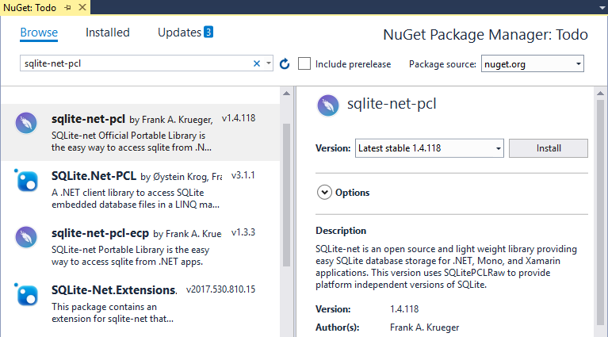

# Xamarin.Forms Local Databases

[ Download the sample](https://docs.microsoft.com/samples/xamarin/xamarin-forms-samples/todo)

The SQLite database engine allows Xamarin.Forms applications to load and save objects in shared code. The sample application uses a SQLite database table to store todo items. This article describes how to use SQLite.Net in shared code to store and retrieve information in a local database.

[](databases-images/todo-list.png#lightbox "Todolist app on iOS and Android")

Integrate SQLite.NEt into mobile apps by following these steps:

1. Install the **sqlite-net-pcl** Nuget package
1. Create a database access class
1. Store and retrieve data
1. Configure advanced features

## Install SQLite Nuget packages

## Create a database access class

## Store and retrieve data in Xamarin.Forms

## Configure advanced features

### ConfigureAwait

### Copy or backup a database

### Use Polly


## Overview

Xamarin.Forms applications can use the [SQLite.NET PCL NuGet](https://www.nuget.org/packages/sqlite-net-pcl/) package to incorporate database operations into shared code by referencing the `SQLite` classes that ship in the NuGet. Database operations can be defined in the .NET Standard library project of the Xamarin.Forms solution.

The accompanying [sample application](https://docs.microsoft.com/samples/xamarin/xamarin-forms-samples/todo) is a simple Todo-list application. The following screenshots show how the sample appears on each platform:

[](databases-images/todo-list.png#lightbox "TodoList First Page Screenshots") [](databases-images/todo-list.png#lightbox "TodoList First Page Screenshots")

<a name="Using_SQLite_with_PCL" />

## Using SQLite

To add SQLite support to a Xamarin.Forms .NET Standard library, use NuGet's search function to find **sqlite-net-pcl** and install the latest package:



There are a number of NuGet packages with similar names, the correct package has these attributes:

- **Created by:** Frank A. Krueger
- **Id:** sqlite-net-pcl
- **NuGet link:** [sqlite-net-pcl](https://www.nuget.org/packages/sqlite-net-pcl/)

> [!NOTE]
> Despite the package name, use the **sqlite-net-pcl** NuGet package even in .NET Standard projects.

Once the reference has been added, add a property to the `App` class that returns a local file path for storing the database:

```csharp
static TodoItemDatabase database;

public static TodoItemDatabase Database
{
  get
  {
    if (database == null)
    {
      database = new TodoItemDatabase(
        Path.Combine(Environment.GetFolderPath(Environment.SpecialFolder.LocalApplicationData), "TodoSQLite.db3"));
    }
    return database;
  }
}
```

The `TodoItemDatabase` constructor, which takes the path for the database file as an argument, is shown below:

```csharp
public TodoItemDatabase(string dbPath)
{
  database = new SQLiteAsyncConnection(dbPath);
  database.CreateTableAsync<TodoItem>().Wait();
}
```

The advantage of exposing the database as a singleton is that a single database connection is created that's kept open while the application runs, therefore avoiding the expense of opening and closing the database file each time a database operation is performed.

The remainder of the `TodoItemDatabase` class contains SQLite queries that run cross-platform. Example query code is shown below (more details on the syntax can be found in [Using SQLite.NET with Xamarin.iOS](~/ios/data-cloud/data/using-sqlite-orm.md).

```csharp
public Task<List<TodoItem>> GetItemsAsync()
{
  return database.Table<TodoItem>().ToListAsync();
}

public Task<List<TodoItem>> GetItemsNotDoneAsync()
{
  return database.QueryAsync<TodoItem>("SELECT * FROM [TodoItem] WHERE [Done] = 0");
}

public Task<TodoItem> GetItemAsync(int id)
{
  return database.Table<TodoItem>().Where(i => i.ID == id).FirstOrDefaultAsync();
}

public Task<int> SaveItemAsync(TodoItem item)
{
  if (item.ID != 0)
  {
    return database.UpdateAsync(item);
  }
  else {
    return database.InsertAsync(item);
  }
}

public Task<int> DeleteItemAsync(TodoItem item)
{
  return database.DeleteAsync(item);
}
```

> [!NOTE]
> The advantage of using the asynchronous SQLite.Net API is that database operations are moved to background threads. In addition, there's no need to write additional concurrency handling code because the API takes care of it.

## Summary

Xamarin.Forms supports database-driven applications using the SQLite database engine, which makes it possible to load and save objects in shared code.

This article focused on **accessing** a SQLite database using Xamarin.Forms. For more information on working with SQLite.Net itself, refer to the [SQLite.NET on Android](~/android/data-cloud/data-access/using-sqlite-orm.md) or [SQLite.NET on iOS](~/ios/data-cloud/data/using-sqlite-orm.md) documentation.

## Related Links

- [Todo Sample](https://docs.microsoft.com/samples/xamarin/xamarin-forms-samples/todo)
- [Xamarin.Forms Samples](https://docs.microsoft.com/samples/browse/?products=xamarin&term=Xamarin.Forms)
