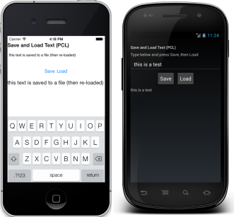
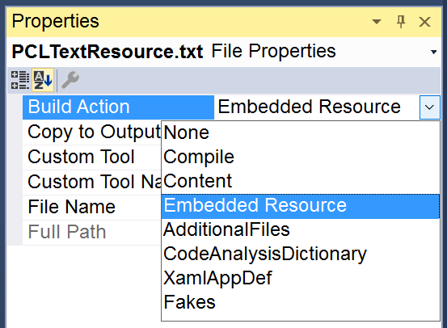
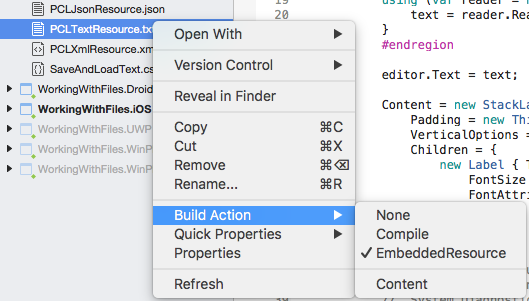
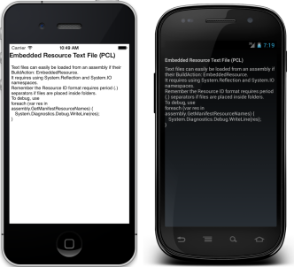

# File Handling in Xamarin.Forms

[ Download the sample](/samples/xamarin/xamarin-forms-samples/workingwithfiles)

_File handling with Xamarin.Forms can be achieved using code in a .NET Standard library, or by using embedded resources._

## Overview

Xamarin.Forms code runs on multiple platforms - each of which has its own filesystem. Previously, this meant that reading and writing files was most easily performed using the native file APIs on each platform. Alternatively, embedded resources are a simpler solution to distribute data files with an app. However, with .NET Standard 2.0 it's possible to share file access code in .NET Standard libraries.

For information on handling image files, refer to the [Working with Images](~/xamarin-forms/user-interface/images.md) page.

## Saving and Loading Files

The `System.IO` classes can be used to access the file system on each platform. The `File` class lets you create, delete, and read files, and the `Directory` class allows you to create, delete, or enumerate the contents of directories. You can also use the `Stream` subclasses, which can provide a greater degree of control over file operations (such as compression or position search within a file).

A text file can be written using the `File.WriteAllText` method:

```csharp
File.WriteAllText(fileName, text);
```

A text file can be read using the `File.ReadAllText` method:

```csharp
string text = File.ReadAllText(fileName);
```

In addition, the `File.Exists` method determines whether the specified file exists:

```csharp
bool doesExist = File.Exists(fileName);
```

The path of the file on each platform can be determined from a .NET Standard library by using a value of the [`Environment.SpecialFolder`](xref:System.Environment.SpecialFolder) enumeration as the first argument to the `Environment.GetFolderPath` method. This can then be combined with a filename with the `Path.Combine` method:

```csharp
string fileName = Path.Combine(Environment.GetFolderPath(Environment.SpecialFolder.LocalApplicationData), "temp.txt");
```

These operations are demonstrated in the sample app, which includes a page that saves and loads text:

[](files-images/saveandload.png#lightbox "Saving and Loading Files in App")

## Loading Files Embedded as Resources

To embed a file into a **.NET Standard** assembly, create or add a file and ensure that **Build Action: EmbeddedResource**.

# [Visual Studio](#tab/windows)

[](files-images/vs-embeddedresource.png#lightbox "Setting EmbeddedResource BuildAction")

# [Visual Studio for Mac](#tab/macos)

[](files-images/xs-embeddedresource.png#lightbox "Setting EmbeddedResource BuildAction")

-----

`GetManifestResourceStream` is used to access the embedded file using its **Resource ID**. By default the resource ID is the filename prefixed with the default namespace for the project it is embedded in - in this case the assembly is **WorkingWithFiles** and the filename is **LibTextResource.txt**, so the resource ID is `WorkingWithFiles.LibTextResource.txt`.

```csharp
var assembly = IntrospectionExtensions.GetTypeInfo(typeof(LoadResourceText)).Assembly;
Stream stream = assembly.GetManifestResourceStream("WorkingWithFiles.LibTextResource.txt");
string text = "";
using (var reader = new System.IO.StreamReader (stream))
{  
    text = reader.ReadToEnd ();
}
```

The `text` variable can then be used to display the text or otherwise use it in code. This screenshot of the [sample app](/samples/xamarin/xamarin-forms-samples/workingwithfiles) shows the text rendered in a `Label` control.

 [](files-images/pcltext.png#lightbox "Embedded Text File in .NET Standard Library Displayed in App")

Loading and deserializing an XML is equally simple. The following code shows an XML file being loaded and deserialized from a resource, then bound to a `ListView` for display. The XML file contains an array of `Monkey` objects (the class is defined in the sample code).

```csharp
var assembly = IntrospectionExtensions.GetTypeInfo(typeof(LoadResourceText)).Assembly;
Stream stream = assembly.GetManifestResourceStream("WorkingWithFiles.LibXmlResource.xml");
List<Monkey> monkeys;
using (var reader = new System.IO.StreamReader (stream)) {
    var serializer = new XmlSerializer(typeof(List<Monkey>));
    monkeys = (List<Monkey>)serializer.Deserialize(reader);
}
var listView = new ListView ();
listView.ItemsSource = monkeys;
```

 [](files-images/pclxml.png#lightbox "Embedded XML File in .NET standard library Displayed in ListView")

## Embedding in Shared Projects

Shared Projects can also contain files as embedded resources, however because the contents of a Shared Project are compiled into the referencing projects, the prefix used for embedded file resource IDs can change. This means the resource ID for each embedded file may be different for each platform.

There are two solutions to this issue with Shared Projects:

- **Synchronize the Projects** - Edit the project properties for each platform to use the  **same** assembly name and default namespace. This value can then be "hardcoded" as the prefix for embedded resource IDs in the Shared Project.
- **#if compiler directives** - Use compiler directives to set the correct resource ID prefix and use that value to dynamically construct the correct resource ID.

Code illustrating the second option is shown below. Compiler directives are used to select the hardcoded resource prefix (which is normally the same as the default namespace for the referencing project). The `resourcePrefix` variable is then used to create a valid resource ID by concatenating it with the embedded resource filename.

```csharp
#if __IOS__
var resourcePrefix = "WorkingWithFiles.iOS.";
#endif
#if __ANDROID__
var resourcePrefix = "WorkingWithFiles.Droid.";
#endif

Debug.WriteLine("Using this resource prefix: " + resourcePrefix);
// note that the prefix includes the trailing period '.' that is required
var assembly = IntrospectionExtensions.GetTypeInfo(typeof(SharedPage)).Assembly;
Stream stream = assembly.GetManifestResourceStream
    (resourcePrefix + "SharedTextResource.txt");
```

### Organizing Resources

The above examples assume that the file is embedded in the root of the .NET Standard library project, in which case the resource ID is of the form **Namespace.Filename.Extension**, such as `WorkingWithFiles.LibTextResource.txt` and `WorkingWithFiles.iOS.SharedTextResource.txt`.

It is possible to organize embedded resources in folders. When an embedded resource is placed in a folder, the folder name becomes part of the resource ID (separated by periods), so that the resource ID format becomes **Namespace.Folder.Filename.Extension**. Placing the files used in the sample app into a folder **MyFolder** would make the corresponding resource IDs `WorkingWithFiles.MyFolder.LibTextResource.txt` and `WorkingWithFiles.iOS.MyFolder.SharedTextResource.txt`.

### Debugging Embedded Resources

Because it is sometimes difficult to understand why a particular resource isn't being loaded, the following debug code can be added temporarily to an application to help confirm the resources are correctly configured. It will output all known resources embedded in the given assembly to the **Errors** pad to help debug resource loading issues.

```csharp
using System.Reflection;
// ...
// use for debugging, not in released app code!
var assembly = IntrospectionExtensions.GetTypeInfo(typeof(SharedPage)).Assembly;
foreach (var res in assembly.GetManifestResourceNames()) {
    System.Diagnostics.Debug.WriteLine("found resource: " + res);
}
```

## Summary

This article has shown some simple file operations for saving and loading text on the device, and for loading embedded resources. With .NET Standard 2.0 it's possible to share file access code in .NET Standard libraries.

## Related Links

- [FilesSample](/samples/xamarin/xamarin-forms-samples/workingwithfiles)
- [Xamarin.Forms Samples](https://github.com/xamarin/xamarin-forms-samples)
- [Working with the File System in Xamarin.iOS](~/ios/app-fundamentals/file-system.md)