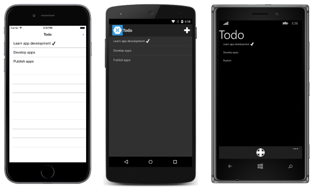
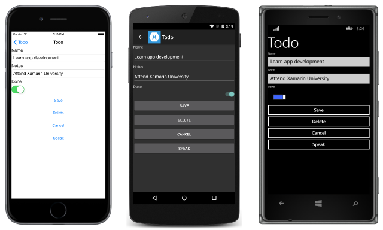

# Understanding the Sample

_This topic provides a walkthrough of the Xamarin.Forms sample application that demonstrates how to communicate with different web services. While each web service uses a separate sample application, they are functionally similar and share common classes._

The sample to-do list application described below is used to demonstrate how to access different types of web service backends with Xamarin.Forms. It provides functionality to:

- View a list of tasks.
- Add, edit, and delete tasks.
- Set a task's status to 'done'.
- Speak the task's name and notes fields.

In all cases, the tasks are stored in a backend that's accessed through a web service.

When the application is launched, a page is displayed that lists any tasks retrieved from the web service, and allows the user to create a new task. Clicking on a task navigates the application to a second page where the task can be edited, saved, deleted, and spoken. The final application is shown below:




Each topic in this guide provides a download link to a *different* version of the
application that demonstrates a specific type of web service backend. Download
the relevant sample code on the page relating to each web-service style.

## Understanding the Application Anatomy

The PCL project for each sample application consists of three main folders:

<table>
    <thead>
        <tr><td><strong>Folder</strong></td><td><strong>Purpose</strong></td></tr>
    </thead>
    <tbody>
        <tr>
            <td><strong>Data</strong></td>
						<td>Contains the classes and interfaces used to manage data items, and communicate with the web service. At a minimum, this includes the <code>TodoItemManager</code> class, which is exposed through a property in the <code>App</code> class to invoke web service operations.</td>
        </tr>
        <tr>
            <td><strong>Models</strong></td>
						<td>Contains the data model classes for the application. At a minimum, this includes the <code>TodoItem</code> class, which models a single item of data used by the application. The folder can also include any additional classes used to model user data.</td>
        </tr>
        <tr>
            <td><strong>Views</strong></td>
						<td>Contains the pages for the application. This usually consists of the <code>TodoListPage</code> and <code>TodoItemPage</code> classes, and any additional classes used for authentication purposes.</td>
				</tr>
    </tbody>
</table>

The PCL project for each application also consists of a number of important files:

<table>
    <thead>
      <tr><td><strong>File</strong></td><td><strong>Purpose</strong></td></tr>
    <thead>
    <tbody>
        <tr>
            <td><strong>Constants.cs</strong></td>
            <td>The <code>Constants</code> class, which specifies any constants used by the application to communicate with the web service. These constants require updating to access your personal backend service created on a provider.
        </tr>
        <tr>
            <td><strong>ITextToSpeech.cs</strong></td>
            <td>The <code>ITextToSpeech</code> interface, which specifies that the <code>Speak</code> method must be provided by any implementing classes.</td>
        </tr>
        <tr>
          <td><strong>Todo.cs</strong></td>
          <td>The <code>App</code> class that is responsible for instantiating both the first page that will be displayed by the application on each platform, and the <code>TodoItemManager</code> class that is used to invoke web service operations.</td>
        </tr>
    </tbody>
</table>

### Viewing Pages

The majority of the sample applications contain at least two pages:

- **TodoListPage** – this page displays a list of `TodoItem` instances, and a tick icon if the `TodoItem.Done` property is `true`. Clicking on an item navigates to the `TodoItemPage`. In addition, new items can be created by clicking on the *+* symbol.
- **TodoItemPage** – this page displays the details for the selected `TodoItem`, and allows it to be edited, saved, deleted, and spoken.

In addition, some sample applications contain additional pages that are used to manage the user authentication process.

### Modeling the Data

Each sample application uses the `TodoItem` class to model the data that is displayed and sent to the web service for storage. The following code example shows the `TodoItem` class:

```csharp
public class TodoItem
{
	public string ID { get; set; }
	public string Name { get; set; }
	public string Notes { get; set; }
	public bool Done { get; set; }
}
```

The `ID` property is used to uniquely identify each `TodoItem` instance, and is used by each web service to identify data to be updated or deleted.

### Invoking Web Service Operations

Web service operations are accessed through the `TodoItemManager` class, and an instance of the class can be accessed through the `App.TodoManager` property. The `TodoItemManager` class provides the following methods to invoke web service operations:

- **GetTasksAsync** – this method is used to populate the `ListView` control on the `TodoListPage` with the `TodoItem` instances retrieved from the web service.
- **SaveTaskAsync** – this method is used to create or update a `TodoItem` instance on the web service.
- **DeleteTaskAsync** – this method is used to delete a `TodoItem` instance on the web service.

In addition, some sample applications contain additional methods in the `TodoItemManager` class, which are used to manage the user authentication process.

Rather than invoke the web service operations directly, the `TodoItemManager` methods invoke methods on a dependent class that is injected into the `TodoItemManager` constructor. For example, one sample application injects the `SimpleDBStorage` class into the `TodoItemManager` constructor to provide the implementation that invokes operations against Amazon's SimpleDB service.

### Translating Text to Speech

The majority of the sample applications contain text-to-speech (TTS) functionality to speak the values of the `TodoItem.Name` and `TodoItem.Notes` properties. This is accomplished by the `OnSpeakActivated` event handler in the `TodoItemPage` class, as shown in the following code example:

```csharp
void OnSpeakActivated (object sender, EventArgs e)
{
	var todoItem = (TodoItem)BindingContext;
	App.Speech.Speak(todoItem.Name + " " + todoItem.Notes);
}
```

This method simply invokes the `Speak` method that is implemented by a platform-specific `Speech` class. Each `Speech` class implements the `ITextToSpeech` interface, and platform-specific startup code creates an instance of the `Speech` class that can be accessed through the `App.Speech` property.

## Summary

This topic provided a walkthrough of the Xamarin.Forms sample application that's used to demonstrate how to communicate with different web services. While each web service uses a separate sample application, they are all based on the same user-interface and business logic as described above - only the web service data storage mechanism is different.


## Related Links

- [ASMX version (sample)](https://developer.xamarin.com/samples/xamarin-forms/WebServices/TodoASMX)
- [WCF version (sample)](https://developer.xamarin.com/samples/xamarin-forms/WebServices/TodoWCF)
- [REST version (sample)](https://developer.xamarin.com/samples/xamarin-forms/WebServices/TodoREST)
- [Azure version (sample)](https://developer.xamarin.com/samples/xamarin-forms/WebServices/TodoAzure)
- [Amazon Web Services version (sample)](https://developer.xamarin.com/samples/xamarin-forms/WebServices/TodoAWS)
