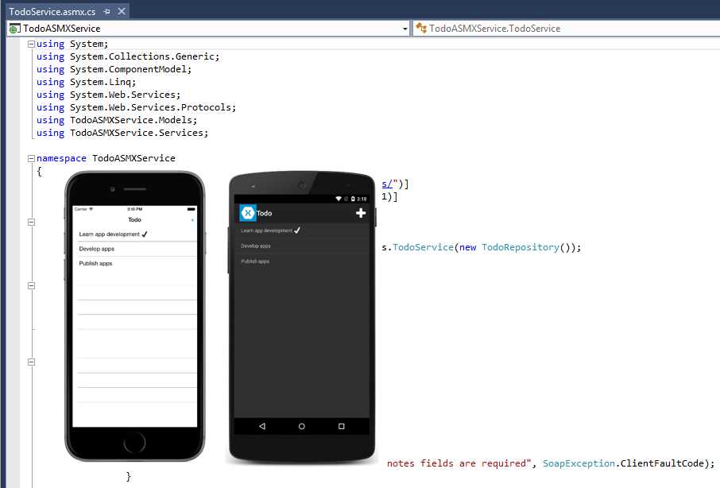

# Consume an ASP.NET Web Service (ASMX)

[ Download the sample](/samples/xamarin/xamarin-forms-samples/webservices-todoasmx)

_ASMX provides the ability to build web services that send messages using the Simple Object Access Protocol (SOAP). SOAP is a platform-independent and language-independent protocol for building and accessing web services. Consumers of an ASMX service do not need to know anything about the platform, object model, or programming language used to implement the service. They only need to understand how to send and receive SOAP messages. This article demonstrates how to consume an ASMX SOAP service from a Xamarin.Forms application._

A SOAP message is an XML document containing the following elements:

- A root element named *Envelope* that identifies the XML document as a SOAP message.
- An optional *Header* element that contains application-specific information such as authentication data. If the *Header* element is present it must be the first child element of the *Envelope* element.
- A required *Body* element that contains the SOAP message intended for the recipient.
- An optional *Fault* element that's used to indicate error messages. If the *Fault* element is present, it must be a child element of the *Body* element.

SOAP can operate over many transport protocols, including HTTP, SMTP, TCP, and UDP. However, an ASMX service can only operate over HTTP. The Xamarin platform supports standard SOAP 1.1 implementations over HTTP, and this includes support for many of the standard ASMX service configurations.

This sample includes the mobile applications that run on physical or emulated devices, and an ASMX service that provides methods to get, add, edit, and delete data. When the mobile applications are run, they connect to the locally-hosted ASMX service as shown in the following screenshot:



> [!NOTE]
> In iOS 9 and greater, App Transport Security (ATS) enforces secure connections between internet resources (such as the app's back-end server) and the app, thereby preventing accidental disclosure of sensitive information. Since ATS is enabled by default in apps built for iOS 9, all connections will be subject to ATS security requirements. If connections do not meet these requirements, they will fail with an exception.
> ATS can be opted out of if it is not possible to use the `HTTPS` protocol and secure communication for internet resources. This can be achieved by updating the app's **Info.plist** file. For more information see [App Transport Security](~/ios/app-fundamentals/ats.md).

## Consume the web service

The ASMX service provides the following operations:

|Operation|Description|Parameters|
|--- |--- |--- |
|GetTodoItems|Get a list of to-do items|
|CreateTodoItem|Create a new to-do item|An XML serialized TodoItem|
|EditTodoItem|Update a to-do item|An XML serialized TodoItem|
|DeleteTodoItem|Delete a to-do item|An XML serialized TodoItem|

For more information about the data model used in the application, see [Modeling the data](~/xamarin-forms/data-cloud/web-services/introduction.md).

## Create the TodoService proxy

A proxy class, called `TodoService`, extends `SoapHttpClientProtocol` and provides methods for communicating with the ASMX service over HTTP. The proxy is generated by adding a web reference to each platform-specific project in Visual Studio 2019 or Visual Studio 2017. The web reference generates methods and events for each action defined in the service's Web Services Description Language (WSDL) document.

For example, the `GetTodoItems` service action results in a `GetTodoItemsAsync` method and a `GetTodoItemsCompleted` event in the proxy. The generated method has a void return type and invokes the `GetTodoItems` action on the parent `SoapHttpClientProtocol` class. When the invoked method receives a response from the service, it fires the `GetTodoItemsCompleted` event and provides the response data within the event's `Result` property.

## Create the ISoapService implementation

To enable the shared, cross-platform project to work with the service, the sample defines the `ISoapService` interface, which follows the [Task asynchronous programming model in C#](/dotnet/csharp/programming-guide/concepts/async/). Each platform implements the `ISoapService` to expose the platform-specific proxy. The sample uses `TaskCompletionSource` objects to expose the proxy as a task asynchronous interface. Details on using `TaskCompletionSource` are found in the implementations of each action type in the sections below.

The sample `SoapService`:

1. Instantiates the `TodoService` as a class-level instance
1. Creates a collection called `Items` to store `TodoItem` objects
1. Specifies a custom endpoint for the optional `Url` property on the `TodoService`

```csharp
public class SoapService : ISoapService
{
    ASMXService.TodoService todoService;
    public List<TodoItem> Items { get; private set; } = new List<TodoItem>();

    public SoapService ()
    {
        todoService = new ASMXService.TodoService ();
        todoService.Url = Constants.SoapUrl;
        ...
    }
}
```

### Create data transfer objects

The sample application uses the `TodoItem` class to model data. To store a `TodoItem` item in the web service it must first be converted to the proxy generated `TodoItem` type. This is accomplished by the `ToASMXServiceTodoItem` method, as shown in the following code example:

```csharp
ASMXService.TodoItem ToASMXServiceTodoItem (TodoItem item)
{
    return new ASMXService.TodoItem {
        ID = item.ID,
        Name = item.Name,
        Notes = item.Notes,
        Done = item.Done
    };
}
```

This method creates a new `ASMService.TodoItem` instance, and sets each property to the identical property from the `TodoItem` instance.

Similarly, when data is retrieved from the web service, it must be converted from the proxy generated `TodoItem` type to a `TodoItem` instance. This is accomplished with the `FromASMXServiceTodoItem` method, as shown in the following code example:

```csharp
static TodoItem FromASMXServiceTodoItem (ASMXService.TodoItem item)
{
    return new TodoItem {
        ID = item.ID,
        Name = item.Name,
        Notes = item.Notes,
        Done = item.Done
    };
}
```

This method retrieves the data from the proxy generated `TodoItem` type and sets it in the newly created `TodoItem` instance.

### Retrieve data

The `ISoapService` interface expects the `RefreshDataAsync` method to return a `Task` with the item collection. However, the `TodoService.GetTodoItemsAsync` method returns void. To satisfy the interface pattern, you must call `GetTodoItemsAsync`, wait for the `GetTodoItemsCompleted` event to fire, and populate the collection. This allows you to return a valid collection to the UI.

The example below creates a new `TaskCompletionSource`, begins the async call in the `RefreshDataAsync` method, and awaits the `Task` provided by the `TaskCompletionSource`. When the `TodoService_GetTodoItemsCompleted` event handler is invoked it populates the `Items` collection and updates the `TaskCompletionSource`:

```csharp
public class SoapService : ISoapService
{
    TaskCompletionSource<bool> getRequestComplete = null;
    ...

    public SoapService()
    {
        ...
        todoService.GetTodoItemsCompleted += TodoService_GetTodoItemsCompleted;
    }

    public async Task<List<TodoItem>> RefreshDataAsync()
    {
        getRequestComplete = new TaskCompletionSource<bool>();
        todoService.GetTodoItemsAsync();
        await getRequestComplete.Task;
        return Items;
    }

    private void TodoService_GetTodoItemsCompleted(object sender, ASMXService.GetTodoItemsCompletedEventArgs e)
    {
        try
        {
            getRequestComplete = getRequestComplete ?? new TaskCompletionSource<bool>();

            Items = new List<TodoItem>();
            foreach (var item in e.Result)
            {
                Items.Add(FromASMXServiceTodoItem(item));
            }
            getRequestComplete?.TrySetResult(true);
        }
        catch (Exception ex)
        {
            Debug.WriteLine(@"\t\tERROR {0}", ex.Message);
        }
    }

    ...
}
```

For more information, see [Asynchronous Programming Model](/dotnet/standard/asynchronous-programming-patterns/asynchronous-programming-model-apm) and [TPL and Traditional .NET Framework Asynchronous Programming](/dotnet/standard/parallel-programming/tpl-and-traditional-async-programming).

### Create or edit data

When you create or edit data, you must implement the `ISoapService.SaveTodoItemAsync` method. This method detects whether the `TodoItem` is a new or updated item and calls the appropriate method on the `todoService` object. The `CreateTodoItemCompleted` and `EditTodoItemCompleted` event handlers should also be implemented so you know when the `todoService` has received a response from the ASMX service (these can be combined into a single handler because they perform the same operation). The following example demonstrates the interface and event handler implementations, as well as the `TaskCompletionSource` object used to operate asynchronously:

```csharp
public class SoapService : ISoapService
{
    TaskCompletionSource<bool> saveRequestComplete = null;
    ...

    public SoapService()
    {
        ...
        todoService.CreateTodoItemCompleted += TodoService_SaveTodoItemCompleted;
        todoService.EditTodoItemCompleted += TodoService_SaveTodoItemCompleted;
    }

    public async Task SaveTodoItemAsync (TodoItem item, bool isNewItem = false)
    {
        try
        {
            var todoItem = ToASMXServiceTodoItem(item);
            saveRequestComplete = new TaskCompletionSource<bool>();
            if (isNewItem)
            {
                todoService.CreateTodoItemAsync(todoItem);
            }
            else
            {
                todoService.EditTodoItemAsync(todoItem);
            }
            await saveRequestComplete.Task;
        }
        catch (SoapException se)
        {
            Debug.WriteLine("\t\t{0}", se.Message);
        }
        catch (Exception ex)
        {
            Debug.WriteLine("\t\tERROR {0}", ex.Message);
        }
    }

    private void TodoService_SaveTodoItemCompleted(object sender, System.ComponentModel.AsyncCompletedEventArgs e)
    {
        saveRequestComplete?.TrySetResult(true);
    }

    ...
}
```

### Delete data

Deleting data requires a similar implementation. Define a `TaskCompletionSource`, implement an event handler, and the `ISoapService.DeleteTodoItemAsync` method:

```csharp
public class SoapService : ISoapService
{
    TaskCompletionSource<bool> deleteRequestComplete = null;
    ...

    public SoapService()
    {
        ...
        todoService.DeleteTodoItemCompleted += TodoService_DeleteTodoItemCompleted;
    }

    public async Task DeleteTodoItemAsync (string id)
    {
        try
        {
            deleteRequestComplete = new TaskCompletionSource<bool>();
            todoService.DeleteTodoItemAsync(id);
            await deleteRequestComplete.Task;
        }
        catch (SoapException se)
        {
            Debug.WriteLine("\t\t{0}", se.Message);
        }
        catch (Exception ex)
        {
            Debug.WriteLine("\t\tERROR {0}", ex.Message);
        }
    }

    private void TodoService_DeleteTodoItemCompleted(object sender, System.ComponentModel.AsyncCompletedEventArgs e)
    {
        deleteRequestComplete?.TrySetResult(true);
    }

    ...
}
```

## Test the web service

Testing physical or emulated devices with a locally-hosted service requires custom IIS Configuration, endpoint addresses, and firewall rules to be in place. For more detail on how to set up your environment for testing, see the [Configure remote access to IIS Express](wcf.md#configure-remote-access-to-iis-express). The only difference between testing WCF and ASMX is the port number of the TodoService.

## Related links

- [TodoASMX (sample)](/samples/xamarin/xamarin-forms-samples/webservices-todoasmx)
- [IAsyncResult](/dotnet/api/system.iasyncresult)