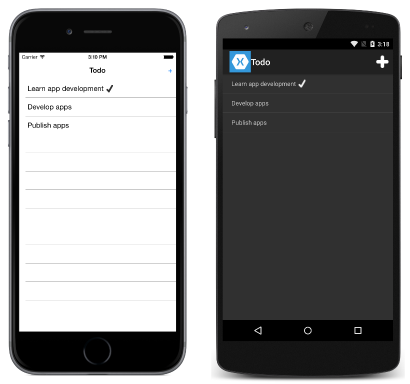
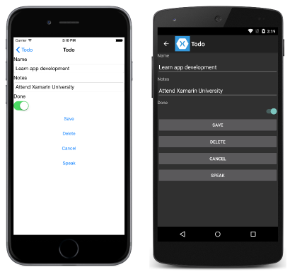

# Xamarin.Forms Web Services Introduction

[ Download the sample](/samples/xamarin/xamarin-forms-samples/webservices-todorest)

_This topic provides a walkthrough of the Xamarin.Forms sample application that demonstrates how to communicate with different web services. While each web service uses a separate sample application, they are functionally similar and share common classes._

The sample to-do list application described below is used to demonstrate how to access different types of web service backends with Xamarin.Forms. It provides functionality to:

- View a list of tasks.
- Add, edit, and delete tasks.
- Set a task's status to 'done'.
- Speak the task's name and notes fields.

In all cases, the tasks are stored in a backend that's accessed through a web service.

When the application is launched, a page is displayed that lists any tasks retrieved from the web service, and allows the user to create a new task. Clicking on a task navigates the application to a second page where the task can be edited, saved, deleted, and spoken. The final application is shown below:




Each topic in this guide provides a download link to a *different* version of the
application that demonstrates a specific type of web service backend. Download
the relevant sample code on the page relating to each web-service style.

## Understand the application anatomy

The shared code project for each sample application consists of three main folders:

|Folder|Purpose|
|--- |--- |
|Data|Contains the classes and interfaces used to manage data items, and communicate with the web service. At a minimum, this includes the `TodoItemManager` class, which is exposed through a property in the `App` class to invoke web service operations.|
|Models|Contains the data model classes for the application. At a minimum, this includes the `TodoItem` class, which models a single item of data used by the application. The folder can also include any additional classes used to model user data.|
|Views|Contains the pages for the application. This usually consists of the `TodoListPage` and `TodoItemPage` classes, and any additional classes used for authentication purposes.|

The shared code project for each application also consists of a number of important files:

|File|Purpose|
|--- |--- |
|Constants.cs|The `Constants` class, which specifies any constants used by the application to communicate with the web service. These constants require updating to access your personal backend service created on a provider.|
|ITextToSpeech.cs|The `ITextToSpeech` interface, which specifies that the `Speak` method must be provided by any implementing classes.|
|Todo.cs|The `App` class that is responsible for instantiating both the first page that will be displayed by the application on each platform, and the `TodoItemManager` class that is used to invoke web service operations.|

### View pages

The majority of the sample applications contain at least two pages:

- **TodoListPage** – this page displays a list of `TodoItem` instances, and a tick icon if the `TodoItem.Done` property is `true`. Clicking on an item navigates to the `TodoItemPage`. In addition, new items can be created by clicking on the *+* symbol.
- **TodoItemPage** – this page displays the details for the selected `TodoItem`, and allows it to be edited, saved, deleted, and spoken.

In addition, some sample applications contain additional pages that are used to manage the user authentication process.

### Model the data

Each sample application uses the `TodoItem` class to model the data that is displayed and sent to the web service for storage. The following code example shows the `TodoItem` class:

```csharp
public class TodoItem
{
    public string ID { get; set; }
    public string Name { get; set; }
    public string Notes { get; set; }
    public bool Done { get; set; }
}
```

The `ID` property is used to uniquely identify each `TodoItem` instance, and is used by each web service to identify data to be updated or deleted.

### Invoke web service operations

Web service operations are accessed through the `TodoItemManager` class, and an instance of the class can be accessed through the `App.TodoManager` property. The `TodoItemManager` class provides the following methods to invoke web service operations:

- **GetTasksAsync** – this method is used to populate the `ListView` control on the `TodoListPage` with the `TodoItem` instances retrieved from the web service.
- **SaveTaskAsync** – this method is used to create or update a `TodoItem` instance on the web service.
- **DeleteTaskAsync** – this method is used to delete a `TodoItem` instance on the web service.

In addition, some sample applications contain additional methods in the `TodoItemManager` class, which are used to manage the user authentication process.

Rather than invoke the web service operations directly, the `TodoItemManager` methods invoke methods on a dependent class that is injected into the `TodoItemManager` constructor. For example, one sample application injects the `RestService` class into the `TodoItemManager` constructor to provide the implementation that uses REST APIs to access data.

## Related links

- [ASMX (sample)](/samples/xamarin/xamarin-forms-samples/webservices-todoasmx)
- [WCF (sample)](/samples/xamarin/xamarin-forms-samples/webservices-todowcf)
- [REST (sample)](/samples/xamarin/xamarin-forms-samples/webservices-todorest)