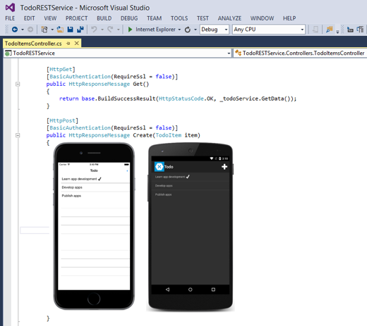

# Consume a RESTful web service

[ Download the sample](/samples/xamarin/xamarin-forms-samples/webservices-todorest)

_Integrating a web service into an application is a common scenario. This article demonstrates how to consume a RESTful web service from a Xamarin.Forms application._

Representational State Transfer (REST) is an architectural style for building web services. REST requests are made over HTTP using the same HTTP verbs that web browsers use to retrieve web pages and to send data to servers. The verbs are:

- **GET** – this operation is used to retrieve data from the web service.
- **POST** – this operation is used to create a new item of data on the web service.
- **PUT** – this operation is used to update an item of data on the web service.
- **PATCH** – this operation is used to update an item of data on the web service by describing a set of instructions about how the item should be modified. This verb is not used in the sample application.
- **DELETE** – this operation is used to delete an item of data on the web service.

Web service APIs that adhere to REST are called RESTful APIs, and are defined using:

- A base URI.
- HTTP methods, such as GET, POST, PUT, PATCH, or DELETE.
- A media type for the data, such as JavaScript Object Notation (JSON).

RESTful web services typically use JSON messages to return data to the client. JSON is a text-based data-interchange format that produces compact payloads, which results in reduced bandwidth requirements when sending data. The sample application uses the open source [NewtonSoft JSON.NET library](https://www.newtonsoft.com/json) to serialize and deserialize messages.

The simplicity of REST has helped make it the primary method for accessing web services in mobile applications.

When the sample application is run, it will connect to a locally hosted REST service, as shown in the following screenshot:



> [!NOTE]
> In iOS 9 and greater, App Transport Security (ATS) enforces secure connections between internet resources (such as the app's back-end server) and the app, thereby preventing accidental disclosure of sensitive information. Since ATS is enabled by default in apps built for iOS 9, all connections will be subject to ATS security requirements. If connections do not meet these requirements, they will fail with an exception.
>
>ATS can be opted out of if it is not possible to use the **HTTPS** protocol and secure communication for internet resources. This can be achieved by updating the app's **Info.plist** file. For more information see [App Transport Security](~/ios/app-fundamentals/ats.md).

## Consume the web service

The REST service is written using ASP.NET Core and provides the following operations:

|Operation|HTTP method|Relative URI|Parameters|
|--- |--- |--- |--- |
|Get a list of to-do items|GET|/api/todoitems/|
|Create a new to-do item|POST|/api/todoitems/|A JSON formatted TodoItem|
|Update a to-do item|PUT|/api/todoitems/|A JSON formatted TodoItem|
|Delete a to-do item|DELETE|/api/todoitems/{id}|

The majority of the URIs include the `TodoItem` ID in the path. For example, to delete the `TodoItem` whose ID is `6bb8a868-dba1-4f1a-93b7-24ebce87e243`, the client sends a DELETE request to `http://hostname/api/todoitems/6bb8a868-dba1-4f1a-93b7-24ebce87e243`. For more information about the data model used in the sample application, see [Modeling the data](~/xamarin-forms/data-cloud/web-services/introduction.md).

When the Web API framework receives a request it routes the request to an action. These actions are simply public methods in the `TodoItemsController` class. The framework use routing middleware to match the URLs of incoming requests and map them to actions. REST APIs should use attribute routing the model the app's functionality as a set of resources whose operations are represented by HTTP verbs. Attribute routing uses a set of attributes to map actions directly to route templates. For more information about attribute routing, see [Attribute routing for REST APIs](/aspnet/core/mvc/controllers/routing?view=aspnetcore-5.0#ar&preserve-view=true). For more information about building the REST service using ASP.NET Core, see [Creating Backend Services for Native Mobile Applications](/aspnet/core/mobile/native-mobile-backend/).

The `HttpClient` class is used to send and receive requests over HTTP. It provides functionality for sending HTTP requests and receiving HTTP responses from a URI identified resource. Each request is sent as an asynchronous operation. For more information about asynchronous operations, see [Async Support Overview](~/cross-platform/platform/async.md).

The `HttpResponseMessage` class represents an HTTP response message received from the web service after an HTTP request has been made. It contains information about the response, including the status code, headers, and any body. The `HttpContent` class represents the HTTP body and content headers, such as `Content-Type` and `Content-Encoding`. The content can be read using any of the `ReadAs` methods, such as `ReadAsStringAsync` and `ReadAsByteArrayAsync`, depending upon the format of the data.

### Create the HTTPClient object

The `HttpClient` instance is declared at the class-level so that the object lives for as long as the application needs to make HTTP requests, as shown in the following code example:

```csharp
public class RestService : IRestService
{
  HttpClient client;
  ...

  public RestService ()
  {
    client = new HttpClient ();
    ...
  }
  ...
}
```

### Retrieve data

The `HttpClient.GetAsync` method is used to send the GET request to the web service specified by the URI, and then receive the response from the web service, as shown in the following code example:

```csharp
public async Task<List<TodoItem>> RefreshDataAsync ()
{
  ...
  Uri uri = new Uri (string.Format (Constants.TodoItemsUrl, string.Empty));
  ...
  HttpResponseMessage response = await client.GetAsync (uri);
  if (response.IsSuccessStatusCode)
  {
      string content = await response.Content.ReadAsStringAsync ();
      Items = JsonSerializer.Deserialize<List<TodoItem>>(content, serializerOptions);
  }
  ...
}
```

The REST service sends an HTTP status code in the `HttpResponseMessage.IsSuccessStatusCode` property, to indicate whether the HTTP request succeeded or failed. For this operation the REST service sends HTTP status code 200 (OK) in the response, which indicates that the request succeeded and that the requested information is in the response.

If the HTTP operation was successful, the content of the response is read, for display. The `HttpResponseMessage.Content` property represents the content of the HTTP response, and the `HttpContent.ReadAsStringAsync` method asynchronously writes the HTTP content to a string. This content is then deserialized from JSON to a `List` of `TodoItem` instances.

> [!WARNING]
> Using the `ReadAsStringAsync` method to retrieve a large response can have a negative performance impact. In such circumstances the response should be directly deserialized to avoid having to fully buffer it.

### Create data

The `HttpClient.PostAsync` method is used to send the POST request to the web service specified by the URI, and then to receive the response from the web service, as shown in the following code example:

```csharp
public async Task SaveTodoItemAsync (TodoItem item, bool isNewItem = false)
{
  Uri uri = new Uri (string.Format (Constants.TodoItemsUrl, string.Empty));

  ...
  string json = JsonSerializer.Serialize<TodoItem>(item, serializerOptions);
  StringContent content = new StringContent (json, Encoding.UTF8, "application/json");

  HttpResponseMessage response = null;
  if (isNewItem)
  {
    response = await client.PostAsync (uri, content);
  }
  ...

  if (response.IsSuccessStatusCode)
  {
    Debug.WriteLine (@"\tTodoItem successfully saved.");
  }
  ...
}
```

The `TodoItem` instance is serialized to a JSON payload for sending to the web service. This payload is then embedded in the body of the HTTP content that will be sent to the web service before the request is made with the `PostAsync` method.

The REST service sends an HTTP status code in the `HttpResponseMessage.IsSuccessStatusCode` property, to indicate whether the HTTP request succeeded or failed. The common responses for this operation are:

- **201 (CREATED)** – the request resulted in a new resource being created before the response was sent.
- **400 (BAD REQUEST)** – the request is not understood by the server.
- **409 (CONFLICT)** – the request could not be carried out because of a conflict on the server.

### Update data

The `HttpClient.PutAsync` method is used to send the PUT request to the web service specified by the URI, and then receive the response from the web service, as shown in the following code example:

```csharp
public async Task SaveTodoItemAsync (TodoItem item, bool isNewItem = false)
{
  ...
  response = await client.PutAsync (uri, content);
  ...
}
```

The operation of the `PutAsync` method is identical to the `PostAsync` method that's used for creating data in the web service. However, the possible responses sent from the web service differ.

The REST service sends an HTTP status code in the `HttpResponseMessage.IsSuccessStatusCode` property, to indicate whether the HTTP request succeeded or failed. The common responses for this operation are:

- **204 (NO CONTENT)** – the request has been successfully processed and the response is intentionally blank.
- **400 (BAD REQUEST)** – the request is not understood by the server.
- **404 (NOT FOUND)** – the requested resource does not exist on the server.

### Delete data

The `HttpClient.DeleteAsync` method is used to send the DELETE request to the web service specified by the URI, and then receive the response from the web service, as shown in the following code example:

```csharp
public async Task DeleteTodoItemAsync (string id)
{
  Uri uri = new Uri (string.Format (Constants.TodoItemsUrl, id));
  ...
  HttpResponseMessage response = await client.DeleteAsync (uri);
  if (response.IsSuccessStatusCode)
  {
    Debug.WriteLine (@"\tTodoItem successfully deleted.");
  }
  ...
}
```

The REST service sends an HTTP status code in the `HttpResponseMessage.IsSuccessStatusCode` property, to indicate whether the HTTP request succeeded or failed. The common responses for this operation are:

- **204 (NO CONTENT)** – the request has been successfully processed and the response is intentionally blank.
- **400 (BAD REQUEST)** – the request is not understood by the server.
- **404 (NOT FOUND)** – the requested resource does not exist on the server.

### Local development

If you are developing your REST web service locally with a framework such as ASP.NET Core Web API, you can debug your web service and mobile app at the same time. In this scenario you must enable clear-text HTTP traffic for the iOS simulator and Android emulator. For information about configuration your project to allow communication, see [Connect to local web services](~/cross-platform/deploy-test/connect-to-local-web-services.md).

## Related links

- [Create a web API with ASP.NET Core](/training/modules/build-web-api-aspnet-core/)
- [Creating Backend Services for Native Mobile Applications](/aspnet/core/mobile/native-mobile-backend/)
- [Attribute routing for REST APIs](/aspnet/core/mvc/controllers/routing?view=aspnetcore-5.0#ar&preserve-view=true)
- [TodoREST (sample)](/samples/xamarin/xamarin-forms-samples/webservices-todorest)
- [HttpClient API](xref:System.Net.Http.HttpClient)
- [Android Network Security Configuration](https://devblogs.microsoft.com/xamarin/cleartext-http-android-network-security/)
- [iOS App Transport Security](~/ios/app-fundamentals/ats.md)
- [Connect to local web services](~/cross-platform/deploy-test/connect-to-local-web-services.md)
