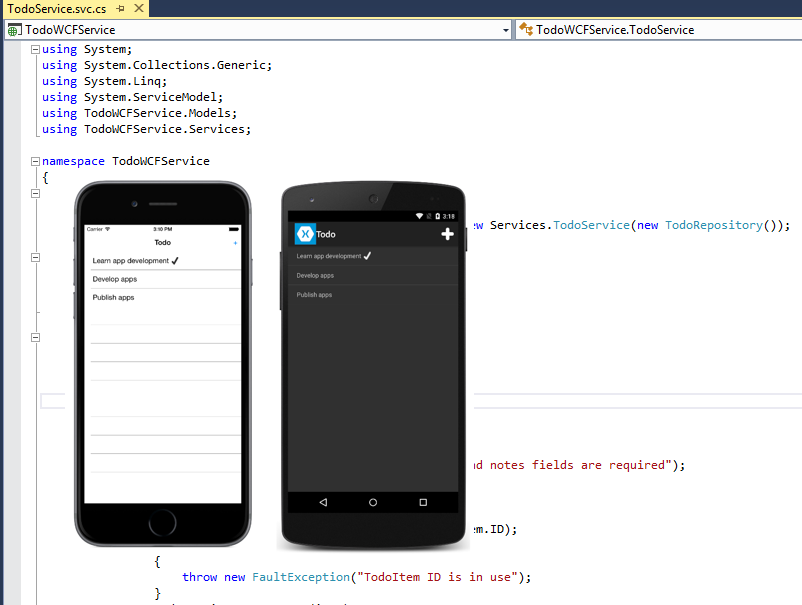

# Consume a Windows Communication Foundation (WCF) Web Service

[ Download the sample](/samples/xamarin/xamarin-forms-samples/webservices-todowcf)

_WCF is Microsoft's unified framework for building service-oriented applications. It enables developers to build secure, reliable, transacted, and interoperable distributed applications. This article demonstrates how to consume an WCF Simple Object Access Protocol (SOAP) service from a Xamarin.Forms application._

WCF describes a service with a variety of different contracts including:

- **Data contracts** – define the data structures that form the basis for the content within a message.
- **Message contracts** – compose messages from existing data contracts.
- **Fault contracts** – allow custom SOAP faults to be specified.
- **Service contracts** – specify the operations that services support and the messages required for interacting with each operation. They also specify any custom fault behavior that can be associated with operations on each service.

There are differences between ASP.NET Web Services (ASMX) and WCF, but WCF supports the same capabilities that ASMX provides – SOAP messages over HTTP. For more information about consuming an ASMX service, see [Consume ASP.NET Web Services (ASMX)](~/xamarin-forms/data-cloud/web-services/asmx.md).

> [!IMPORTANT]
> The Xamarin platform support for WCF is limited to text-encoded SOAP messages over HTTP/HTTPS using the `BasicHttpBinding` class.
>
> WCF support requires the use of tools only available in a Windows environment to generate the proxy and host the TodoWCFService. Building and testing the iOS app will require deploying the TodoWCFService on a Windows computer, or as an Azure web service.
>
> Xamarin Forms native apps typically share code with a .NET Standard Class Library. However, .NET Core does not currently support WCF so the shared project must be a legacy Portable Class Library. For information about WCF support in .NET Core, see [Choosing between .NET Core and .NET Framework for server apps](/dotnet/standard/choosing-core-framework-server).

The sample application solution includes a WCF service which can be run locally, and is shown in the following screenshot:



> [!NOTE]
> In iOS 9 and greater, App Transport Security (ATS) enforces secure connections between internet resources (such as the app's back-end server) and the app, thereby preventing accidental disclosure of sensitive information. Since ATS is enabled by default in apps built for iOS 9, all connections will be subject to ATS security requirements. If connections do not meet these requirements, they will fail with an exception.
>
> ATS can be opted out of if it is not possible to use the `HTTPS` protocol and secure communication for internet resources. This can be achieved by updating the app's **Info.plist** file. For more information see [App Transport Security](~/ios/app-fundamentals/ats.md).

## Consume the web service

The WCF service provides the following operations:

|Operation|Description|Parameters|
|--- |--- |--- |
|GetTodoItems|Get a list of to-do items|
|CreateTodoItem|Create a new to-do item|An XML serialized TodoItem|
|EditTodoItem|Update a to-do item|An XML serialized TodoItem|
|DeleteTodoItem|Delete a to-do item|An XML serialized TodoItem|

For more information about the data model used in the application, see [Modeling the data](~/xamarin-forms/data-cloud/web-services/introduction.md).

A *proxy* must be generated to consume a WCF service, which allows the application to connect to the service. The proxy is constructed by consuming service metadata that define the methods and associated service configuration. This metadata is exposed in the form of a Web Services Description Language (WSDL) document that is generated by the web service. The proxy can be built by using the Microsoft WCF Web Service Reference Provider in Visual Studio 2017 to add a service reference for the web service to a .NET Standard library. An alternative to creating the proxy using the Microsoft WCF Web Service Reference Provider in Visual Studio 2017 is to use the ServiceModel Metadata Utility Tool (svcutil.exe). For more information, see [ServiceModel Metadata Utility Tool (Svcutil.exe)](/dotnet/framework/wcf/servicemodel-metadata-utility-tool-svcutil-exe/).

The generated proxy classes provide methods for consuming the web services that use the Asynchronous Programming Model (APM) design pattern. In this pattern, an asynchronous operation is implemented as two methods named *BeginOperationName* and *EndOperationName*, which begin and end the asynchronous operation.

The *BeginOperationName* method begins the asynchronous operation and returns an object that implements the `IAsyncResult` interface. After calling *BeginOperationName*, an application can continue executing instructions on the calling thread, while the asynchronous operation takes place on a thread pool thread.

For each call to *BeginOperationName*, the application should also call *EndOperationName* to get the results of the operation. The return value of *EndOperationName* is the same type returned by the synchronous web service method. For example, the `EndGetTodoItems` method returns a collection of `TodoItem` instances. The *EndOperationName* method also includes an `IAsyncResult` parameter that should be set to the instance returned by the corresponding call to the *BeginOperationName* method.

The Task Parallel Library (TPL) can simplify the process of consuming an APM begin/end method pair by encapsulating the asynchronous operations in the same `Task` object. This encapsulation is provided by multiple overloads of the `TaskFactory.FromAsync` method.

For more information about APM see [Asynchronous Programming Model](/dotnet/standard/asynchronous-programming-patterns/asynchronous-programming-model-apm) and [TPL and Traditional .NET Framework Asynchronous Programming](/dotnet/standard/parallel-programming/tpl-and-traditional-async-programming) on MSDN.

### Create the TodoServiceClient object

The generated proxy class provides the `TodoServiceClient` class, which is used to communicate with the WCF service over HTTP. It provides functionality for invoking web service methods as asynchronous operations from a URI identified service instance. For more information about asynchronous operations, see [Async Support Overview](~/cross-platform/platform/async.md).

The `TodoServiceClient` instance is declared at the class-level so that the object lives for as long as the application needs to consume the WCF service, as shown in the following code example:

```csharp
public class SoapService : ISoapService
{
  ITodoService todoService;
  ...

  public SoapService ()
  {
    todoService = new TodoServiceClient (
      new BasicHttpBinding (),
      new EndpointAddress (Constants.SoapUrl));
  }
  ...
}
```

The `TodoServiceClient` instance is configured with binding information and an endpoint address. A binding is used to specify the transport, encoding, and protocol details required for applications and services to communicate with each other. The `BasicHttpBinding` specifies that text-encoded SOAP messages will be sent over the HTTP transport protocol. Specifying an endpoint address enables the application to connect to different instances of the WCF service, provided that there are multiple published instances.

For more information about configuring the service reference, see [Configuring the Service Reference](~/cross-platform/data-cloud/web-services/index.md#wcf).

### Create data transfer objects

The sample application uses the `TodoItem` class to model data. To store a `TodoItem` item in the web service it must first be converted to the proxy generated `TodoItem` type. This is accomplished by the `ToWCFServiceTodoItem` method, as shown in the following code example:

```csharp
TodoWCFService.TodoItem ToWCFServiceTodoItem (TodoItem item)
{
  return new TodoWCFService.TodoItem
  {
    ID = item.ID,
    Name = item.Name,
    Notes = item.Notes,
    Done = item.Done
  };
}
```

This method simply creates a new `TodoWCFService.TodoItem` instance, and sets each property to the identical property from the `TodoItem` instance.

Similarly, when data is retrieved from the web service, it must be converted from the proxy generated `TodoItem` type to a `TodoItem` instance. This is accomplished with the `FromWCFServiceTodoItem` method, as shown in the following code example:

```csharp
static TodoItem FromWCFServiceTodoItem (TodoWCFService.TodoItem item)
{
  return new TodoItem
  {
    ID = item.ID,
    Name = item.Name,
    Notes = item.Notes,
    Done = item.Done
  };
}

```

This method simply retrieves the data from the proxy generated `TodoItem` type and sets it in the newly created `TodoItem` instance.

### Retrieve data

The `TodoServiceClient.BeginGetTodoItems` and `TodoServiceClient.EndGetTodoItems` methods are used to call the `GetTodoItems` operation provided by the web service. These asynchronous methods are encapsulated in a `Task` object, as shown in the following code example:

```csharp
public async Task<List<TodoItem>> RefreshDataAsync ()
{
  ...
  var todoItems = await Task.Factory.FromAsync <ObservableCollection<TodoWCFService.TodoItem>> (
    todoService.BeginGetTodoItems,
    todoService.EndGetTodoItems,
    null,
    TaskCreationOptions.None);

  foreach (var item in todoItems)
  {
    Items.Add (FromWCFServiceTodoItem (item));
  }
  ...
}
```

The `Task.Factory.FromAsync` method creates a `Task` that executes the `TodoServiceClient.EndGetTodoItems` method once the `TodoServiceClient.BeginGetTodoItems` method completes, with the `null` parameter indicating that no data is being passed into the `BeginGetTodoItems` delegate. Finally, the value of the `TaskCreationOptions` enumeration specifies that the default behavior for the creation and execution of tasks should be used.

The `TodoServiceClient.EndGetTodoItems` method returns an `ObservableCollection` of `TodoWCFService.TodoItem` instances, which is then converted to a `List` of `TodoItem` instances for display.

### Create data

The `TodoServiceClient.BeginCreateTodoItem` and `TodoServiceClient.EndCreateTodoItem` methods are used to call the `CreateTodoItem` operation provided by the web service. These asynchronous methods are encapsulated in a `Task` object, as shown in the following code example:

```csharp
public async Task SaveTodoItemAsync (TodoItem item, bool isNewItem = false)
{
  ...
  var todoItem = ToWCFServiceTodoItem (item);
  ...
  await Task.Factory.FromAsync (
    todoService.BeginCreateTodoItem,
    todoService.EndCreateTodoItem,
    todoItem,
    TaskCreationOptions.None);
  ...
}
```

The `Task.Factory.FromAsync` method creates a `Task` that executes the `TodoServiceClient.EndCreateTodoItem` method once the `TodoServiceClient.BeginCreateTodoItem` method completes, with the `todoItem` parameter being the data that's passed into the `BeginCreateTodoItem` delegate to specify the `TodoItem` to be created by the web service. Finally, the value of the `TaskCreationOptions` enumeration specifies that the default behavior for the creation and execution of tasks should be used.

The web service throws a `FaultException` if it fails to create the `TodoItem`, which is handled by the application.

### Update data

The `TodoServiceClient.BeginEditTodoItem` and `TodoServiceClient.EndEditTodoItem` methods are used to call the `EditTodoItem` operation provided by the web service. These asynchronous methods are encapsulated in a `Task` object, as shown in the following code example:

```csharp
public async Task SaveTodoItemAsync (TodoItem item, bool isNewItem = false)
{
  ...
  var todoItem = ToWCFServiceTodoItem (item);
  ...
  await Task.Factory.FromAsync (
    todoService.BeginEditTodoItem,
    todoService.EndEditTodoItem,
    todoItem,
    TaskCreationOptions.None);
  ...
}
```

The `Task.Factory.FromAsync` method creates a `Task` that executes the `TodoServiceClient.EndEditTodoItem` method once the `TodoServiceClient.BeginCreateTodoItem` method completes, with the `todoItem` parameter being the data that's passed into the `BeginEditTodoItem` delegate to specify the `TodoItem` to be updated by the web service. Finally, the value of the `TaskCreationOptions` enumeration specifies that the default behavior for the creation and execution of tasks should be used.

The web service throws a `FaultException` if it fails to locate or update the `TodoItem`, which is handled by the application.

### Delete data

The `TodoServiceClient.BeginDeleteTodoItem` and `TodoServiceClient.EndDeleteTodoItem` methods are used to call the `DeleteTodoItem` operation provided by the web service. These asynchronous methods are encapsulated in a `Task` object, as shown in the following code example:

```csharp
public async Task DeleteTodoItemAsync (string id)
{
  ...
  await Task.Factory.FromAsync (
    todoService.BeginDeleteTodoItem,
    todoService.EndDeleteTodoItem,
    id,
    TaskCreationOptions.None);
  ...
}
```

The `Task.Factory.FromAsync` method creates a `Task` that executes the `TodoServiceClient.EndDeleteTodoItem` method once the `TodoServiceClient.BeginDeleteTodoItem` method completes, with the `id` parameter being the data that's passed into the `BeginDeleteTodoItem` delegate to specify the `TodoItem` to be deleted by the web service. Finally, the value of the `TaskCreationOptions` enumeration specifies that the default behavior for the creation and execution of tasks should be used.

The web service throws a `FaultException` if it fails to locate or delete the `TodoItem`, which is handled by the application.

## Configure remote access to IIS Express
In Visual Studio 2017 or Visual Studio 2019, you should be able to test the UWP application on a PC with no additional configuration. Testing Android and iOS clients may require the additional steps in this section. See [Connect to Local Web Services from iOS Simulators and Android Emulators](~/cross-platform/deploy-test/connect-to-local-web-services.md) for more information.

By default, IIS Express will only respond to requests to `localhost`. Remote devices (such as an Android device, an iPhone or even a simulator) will not have access to your local WCF service. You will need to know your Windows 10 workstation IP address on the local network. For the purpose of this example, assume that your workstation has the IP address `192.168.1.143`. The following steps explain how to configure Windows 10 and IIS Express to accept remote connections and connect to the service from a physical or virtual device:

1. **Add an exception to Windows Firewall**. You must open a port through Windows Firewall that applications on your subnet can use to communicate with the WCF service. Create an inbound rule opening port 49393 in the firewall. From an administrative command prompt, run this command:

    ```
    netsh advfirewall firewall add rule name="TodoWCFService" dir=in protocol=tcp localport=49393 profile=private remoteip=localsubnet action=allow
    ```

1. **Configure IIS Express to Accept Remote connections**. You can configure IIS Express by editing the configuration file for IIS Express at **[solution directory]\.vs\config\applicationhost.config**. Find the `site` element with the name `TodoWCFService`. It should look similar to the following XML:

    ```xml
    <site name="TodoWCFService" id="2">
        <application path="/" applicationPool="Clr4IntegratedAppPool">
            <virtualDirectory path="/" physicalPath="C:\Users\tom\TodoWCF\TodoWCFService\TodoWCFService" />
        </application>
        <bindings>
            <binding protocol="http" bindingInformation="*:49393:localhost" />
        </bindings>
    </site>
    ```

    You will need to add two `binding` elements to open up port 49393 to outside traffic and the Android emulator. The binding uses a `[IP address]:[port]:[hostname]` format that specifies how IIS Express will respond to requests. External requests will have hostnames that must be specified as a `binding`. Add the following XML to the `bindings` element, replacing the IP address with your own IP address:

    ```xml
    <binding protocol="http" bindingInformation="*:49393:192.168.1.143" />
    <binding protocol="http" bindingInformation="*:49393:127.0.0.1" />
    ```

    After your changes the `bindings` element should look like the following:

    ```xml
    <site name="TodoWCFService" id="2">
        <application path="/" applicationPool="Clr4IntegratedAppPool">
            <virtualDirectory path="/" physicalPath="C:\Users\tom\TodoWCF\TodoWCFService\TodoWCFService" />
        </application>
        <bindings>
            <binding protocol="http" bindingInformation="*:49393:localhost" />
            <binding protocol="http" bindingInformation="*:49393:192.168.1.143" />
            <binding protocol="http" bindingInformation="*:49393:127.0.0.1" />
        </bindings>
    </site>
    ```

    >[!IMPORTANT]
    >By default, IIS Express will not accept connections from external sources for security reasons. To enable connections from remote devices you must run IIS Express with Administrative permissions. The easiest way to do this is to run Visual Studio 2017 with Administrative permissions. This will launch IIS Express with Administrative permissions when running the TodoWCFService.

    With these steps complete, you should be able to run the TodoWCFService and connect from other devices on your subnet. You can test this by running your application and visiting `http://localhost:49393/TodoService.svc`. If you get a **Bad Request** error when visiting that URL, your `bindings` may be incorrect in the IIS Express configuration (the request is reaching IIS Express but is being rejected). If you get a different error it may be that your application is not running or your firewall is incorrectly configured.

    To allow IIS Express to keep running and serving the service, turn off the **Edit and Continue** option in **Project Properties > Web > Debuggers**.

1. **Customize the endpoint devices use to access the service**. This step involves configuring the client application, running on a physical or emulated device, to access the WCF service.

    The Android emulator utilizes an internal proxy that prevents the emulator from directly accessing the host machine's `localhost` address. Instead, the address `10.0.2.2` on the emulator is routed to `localhost` on the host machine through an internal proxy. These proxied requests will have `127.0.0.1` as the hostname in the request header, which is why you created the IIS Express binding for this hostname in the steps above.

    The iOS Simulator runs on a Mac build host, even if you are using the [Remoted iOS Simulator for Windows](~/tools/ios-simulator/index.md). Network requests from the simulator will have your workstation IP on the local network as the hostname (in this example it's `192.168.1.143`, but your actual IP address will likely be different). This is why you created the IIS Express binding for this hostname in the steps above.

    Ensure the `SoapUrl` property in the **Constants.cs** file in the TodoWCF (Portable) project have values that are correct for your network:

    ```csharp
    public static string SoapUrl
    {
        get
        {
            var defaultUrl = "http://localhost:49393/TodoService.svc";

            if (Device.RuntimePlatform == Device.Android)
            {
                defaultUrl = "http://10.0.2.2:49393/TodoService.svc";
            }
            else if (Device.RuntimePlatform == Device.iOS)
            {
                defaultUrl = "http://192.168.1.143:49393/TodoService.svc";
            }

            return defaultUrl;
        }
    }
    ```

    Once you have configured the **Constants.cs** with the appropriate endpoints, you should be able to connect to the TodoWCFService running on your Windows 10 workstation from physical or virtual devices.

## Related links

- [TodoWCF (sample)](/samples/xamarin/xamarin-forms-samples/webservices-todowcf)
- [How to: Create a Windows Communication Foundation Client](/dotnet/framework/wcf/how-to-create-a-wcf-client)
- [ServiceModel Metadata Utility Tool (svcutil.exe)](/dotnet/framework/wcf/servicemodel-metadata-utility-tool-svcutil-exe)