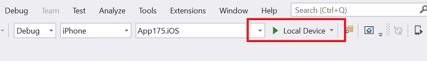
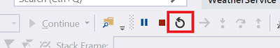

# Xamarin Hot Restart (Preview)

Xamarin Hot Restart enables you to quickly test changes to your app during development, including multi-file code edits, resources, and references. It pushes the new changes to the existing app bundle on the debug target which results in a much faster build and deploy cycle.

> [!IMPORTANT]
> Xamarin Hot Restart is currently available in Visual Studio 2019 version 16.5 stable and supports iOS apps using Xamarin.Forms. Support for Visual Studio for Mac and non-Xamarin.Forms apps is on the roadmap.

## Requirements

- Visual Studio 2019 version 16.5
- iTunes (64-bit)
- Apple Developer account and paid [Apple Developer Program](https://developer.apple.com/programs) enrollment

## Initial setup

> [!NOTE]
> Xamarin Hot Restart is disabled by default while it is in preview. You can enable it under **Tools > Options > Environment > Preview Features > Enable Xamarin Hot Restart**.

1. Ensure the iOS project is set as the startup project and the build configuration is set to **Debug|iPhone**.

   1. If this is an existing project, go to **Build > Configuration Manager…** and ensure **Deploy** is enabled for the iOS project.

2. Select and click **Local Device** in the toolbar to launch the setup wizard:

    

3. If iTunes is not installed, click **Download iTunes** to download the installer. Click **Next** when the iTunes installation is complete.

4. Connect an iOS device to your machine. If a device was already plugged in, unplug then reconnect it. The device name will appear in the wizard once it is detected. Click **Next**.

5. Enter your Apple Developer account credentials and click **Next**.

6. Select a development team using the dropdown menu in order to enable [automatic provisioning](~/ios/get-started/installation/device-provisioning/automatic-provisioning.md) in the project. Click **Finish**.

> [!NOTE]
> Using automatic provisioning is recommended so additional iOS devices can be easily configured for deployment. However, you can disable it and continue using manual provisioning if the correct provisioning profiles are present.

## Use Xamarin Hot Restart
After the initial setup, your connected device will appear in the debug target dropdown menu. To debug your app, select your device in the dropdown and click the **Run** button. You may see a message in Visual Studio asking you to manually launch the app on the device in order to start the debug session.

You can make edits to your code files while debugging, then press the **Restart** button in the debug toolbar or use **Ctrl+Shift+F5** to restart the debug session with your new changes applied:

You can also use the `HOTRESTART` preprocessor symbol to prevent certain code from executing when debugging with Xamarin Hot Restart.

## Limitations

- Only iOS apps built with Xamarin.Forms and iOS devices are currently supported.
- Only 64-bit iOS devices are supported. As of iOS 11, Apple no longer allows running iOS apps on the 32-bit architecture (devices earlier than iPhone 5s).
- Storyboard and XIB files are not supported and the app may crash if it attempts to load these at runtime. Use the `HOTRESTART` preprocessor symbol to prevent this code from executing.
- Static iOS libraries and frameworks are not supported and you may see runtime errors or crashes if your app attempts to load these. Use the `HOTRESTART` preprocessor symbol to prevent this code from executing. Dynamic iOS libraries are supported.
- You cannot use Xamarin Hot Restart to create app bundles for publishing. You will still need a Mac machine to do a full compilation, signing, and deployment for your application to production.
- Asset Catalogs are currently not supported. When using Hot Restart, your app will show the default icon and launch screen for Xamarin apps. When paired to a Mac, or developing on a Mac, your Asset Catalogs will work.

## Troubleshoot

- There is a known issue where having device-specific builds enabled prevents the app from entering debug mode. Workaround is to disable this under **Properties > iOS Build** and retry debugging. This will be fixed in a future release.
- If the app is already present on the device, trying to deploy with Hot Restart may fail with a `AMDeviceStartHouseArrestService` error. The workaround is to uninstall the app on the device then deploy again.
- Entering an Apple ID that is not part of the Apple Developer Program might result in the following error: `Authentication Error. Xcode 7.3 or later is required to continue developing with your Apple ID`. You must have a valid Apple Developer account to use Xamarin Hot Restart on iOS devices. 

To report additional issues, please use the feedback tool at [Help > Send Feedback > Report a Problem](/visualstudio/ide/feedback-options?view=vs-2019#report-a-problem).
