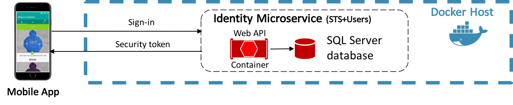
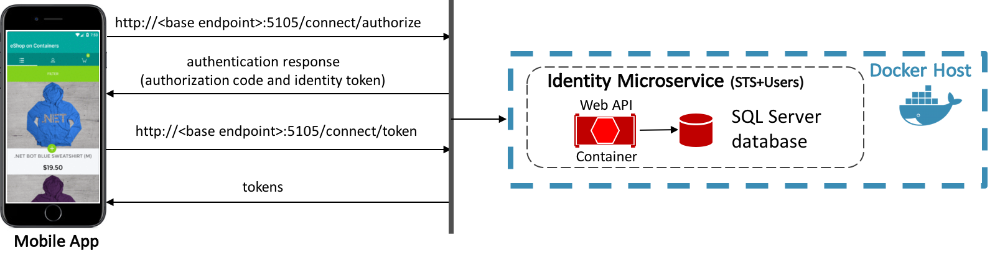
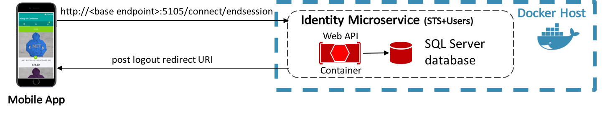
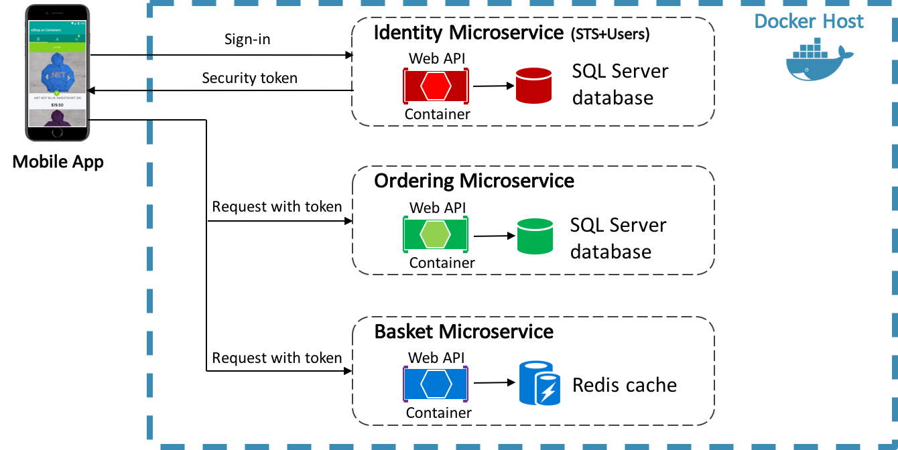

# Authentication and Authorization

Authentication is the process of obtaining identification credentials such as name and password from a user, and validating those credentials against an authority. If the credentials are valid, the entity that submitted the credentials is considered an authenticated identity. Once an identity has been authenticated, an authorization process determines whether that identity has access to a given resource.

There are many approaches to integrating authentication and authorization into a Xamarin.Forms app that communicates with an ASP.NET MVC web application, including using ASP.NET Core Identity, external authentication providers such as Microsoft, Google, Facebook, or Twitter, and authentication middleware. The eShopOnContainers mobile app performs authentication and authorization with a containerized identity microservice that uses IdentityServer 4. The mobile app requests security tokens from IdentityServer, either for authenticating a user or for accessing a resource. For IdentityServer to issue tokens on behalf of a user, the user must sign-in to IdentityServer. However, IdentityServer doesn't provide a user interface or database for authentication. Therefore, in the eShopOnContainers reference application, ASP.NET Core Identity is used for this purpose.

## Authentication

Authentication is required when an application needs to know the identity of the current user. ASP.NET Core's primary mechanism for identifying users is the ASP.NET Core Identity membership system, which stores user information in a data store configured by the developer. Typically, this data store will be an EntityFramework store, though custom stores or third party packages can be used to store identity information in Azure storage, Azure Cosmos DB, or other locations.

For authentication scenarios that make use of a local user data store, and that persist identity information between requests via cookies (as is typical in ASP.NET MVC web applications), ASP.NET Core Identity is a suitable solution. However, cookies are not always a natural means of persisting and transmitting data. For example, an ASP.NET Core web application that exposes RESTful endpoints that are accessed from a mobile app will typically need to use bearer token authentication, since cookies can't be used in this scenario. However, bearer tokens can easily be retrieved and included in the authorization header of web requests made from the mobile app.

### Issuing Bearer Tokens using IdentityServer 4

[IdentityServer 4](https://github.com/IdentityServer/IdentityServer4) is an open source OpenID Connect and OAuth 2.0 framework for ASP.NET Core, which can be used for many authentication and authorization scenarios including issuing security tokens for local ASP.NET Core Identity users.

> [!NOTE]
> OpenID Connect and OAuth 2.0 are very similar, while having different responsibilities.

OpenID Connect is an authentication layer on top of the OAuth 2.0 protocol. OAuth 2 is a protocol that allows applications to request access tokens from a security token service and use them to communicate with APIs. This delegation reduces complexity in both client applications and APIs since authentication and authorization can be centralized.

The combination of OpenID Connect and OAuth 2.0 combine the two fundamental security concerns of authentication and API access, and IdentityServer 4 is an implementation of these protocols.

In applications that use direct client-to-microservice communication, such as the eShopOnContainers reference application, a dedicated authentication microservice acting as a Security Token Service (STS) can be used to authenticate users, as shown in Figure 9-1. For more information about direct client-to-microservice communication, see [Communication Between Client and Microservices](~/xamarin-forms/enterprise-application-patterns/containerized-microservices.md#communication_between_client_and_microservices).



**Figure 9-1:** Authentication by a dedicated authentication microservice

The eShopOnContainers mobile app communicates with the identity microservice, which uses IdentityServer 4 to perform authentication, and access control for APIs. Therefore, the mobile app requests tokens from IdentityServer, either for authenticating a user or for accessing a resource:

-   Authenticating users with IdentityServer is achieved by the mobile app requesting an *identity* token, which represents the outcome of an authentication process. At a bare minimum, it contains an identifier for the user, and information about how and when the user authenticated. It can also contain additional identity data.
-   Accessing a resource with IdentityServer is achieved by the mobile app requesting an *access* token, which allows access to an API resource. Clients request access tokens and forward them to the API. Access tokens contain information about the client, and the user (if present). APIs then use that information to authorize access to their data.

> [!NOTE]
> A client must be registered with IdentityServer before it can request tokens.

### Adding IdentityServer to a Web Application

In order for an ASP.NET Core web application to use IdentityServer 4, it must be added to the web application's Visual Studio solution. For more information, see [Overview](https://identityserver4.readthedocs.io/en/latest/quickstarts/0_overview.html) in the IdentityServer documentation.

Once IdentityServer is included in the web application's Visual Studio solution, it must be added to the web application's HTTP request processing pipeline, so that it can serve requests to OpenID Connect and OAuth 2.0 endpoints. This is achieved in the `Configure` method in the web application's `Startup` class, as demonstrated in the following code example:

```csharp
public void Configure(  
    IApplicationBuilder app, IHostingEnvironment env, ILoggerFactory loggerFactory)  
{  
    ...  
    app.UseIdentity();  
    ...  
}
```

Order matters in the web application's HTTP request processing pipeline. Therefore, IdentityServer must be added to the pipeline before the UI framework that implements the login screen.

### Configuring IdentityServer

IdentityServer should be configured in the `ConfigureServices` method in the web application's `Startup` class by calling the `services.AddIdentityServer` method, as demonstrated in the following code example from the eShopOnContainers reference application:

```csharp
public void ConfigureServices(IServiceCollection services)  
{  
    ...  
    services.AddIdentityServer(x => x.IssuerUri = "null")  
        .AddSigningCredential(Certificate.Get())                 
        .AddAspNetIdentity<ApplicationUser>()  
        .AddConfigurationStore(builder =>  
            builder.UseSqlServer(connectionString, options =>  
                options.MigrationsAssembly(migrationsAssembly)))  
        .AddOperationalStore(builder =>  
            builder.UseSqlServer(connectionString, options =>  
                options.MigrationsAssembly(migrationsAssembly)))  
        .Services.AddTransient<IProfileService, ProfileService>();  
}
```

After calling the `services.AddIdentityServer` method, additional fluent APIs are called to configure the following:

-   Credentials used for signing.
-   API and identity resources that users might request access to.
-   Clients that will be connecting to request tokens.
-   ASP.NET Core Identity.

>💡 **Tip**: Dynamically load the IdentityServer 4 configuration. IdentityServer 4's APIs allow for configuring IdentityServer from an in-memory list of configuration objects. In the eShopOnContainers reference application, these in-memory collections are hard-coded into the application. However, in production scenarios they can be loaded dynamically from a configuration file or from a database.

For information about configuring IdentityServer to use ASP.NET Core Identity, see [Using ASP.NET Core Identity](https://identityserver4.readthedocs.io/en/latest/quickstarts/8_aspnet_identity.html) in the IdentityServer documentation.

#### Configuring API Resources

When configuring API resources, the `AddInMemoryApiResources` method expects an `IEnumerable<ApiResource>` collection. The following code example shows the `GetApis` method that provides this collection in the eShopOnContainers reference application:

```csharp
public static IEnumerable<ApiResource> GetApis()  
{  
    return new List<ApiResource>  
    {  
        new ApiResource("orders", "Orders Service"),  
        new ApiResource("basket", "Basket Service")  
    };  
}
```

This method specifies that IdentityServer should protect the orders and basket APIs. Therefore, IdentityServer managed access tokens will be required when making calls to these APIs. For more information about the `ApiResource` type, see [API Resource](https://identityserver4.readthedocs.io/en/latest/reference/api_resource.html) in the IdentityServer 4 documentation.

#### Configuring Identity Resources

When configuring identity resources, the `AddInMemoryIdentityResources` method expects an `IEnumerable<IdentityResource>` collection. Identity resources are data such as user ID, name, or email address. Each identity resource has a unique name, and arbitrary claim types can be assigned to it, which will then be included in the identity token for the user. The following code example shows the `GetResources` method that provides this collection in the eShopOnContainers reference application:

```csharp
public static IEnumerable<IdentityResource> GetResources()  
{  
    return new List<IdentityResource>  
    {  
        new IdentityResources.OpenId(),  
        new IdentityResources.Profile()  
    };  
}
```

The OpenID Connect specification specifies some [standard identity resources](https://openid.net/specs/openid-connect-core-1_0.html#ScopeClaims). The minimum requirement is that support is provided for emitting a unique ID for users. This is achieved by exposing the `IdentityResources.OpenId` identity resource.

> [!NOTE]
> The `IdentityResources` class supports all of the scopes defined in the OpenID Connect specification (openid, email, profile, telephone, and address).

IdentityServer also supports defining custom identity resources. For more information, see [Defining custom identity resources](http://docs.identityserver.io/en/latest/topics/resources.html#defining-custom-identity-resources) in the IdentityServer documentation. For more information about the `IdentityResource` type, see [Identity Resource](https://identityserver4.readthedocs.io/en/latest/reference/identity_resource.html) in the IdentityServer 4 documentation.

#### Configuring Clients

Clients are applications that can request tokens from IdentityServer. Typically, the following settings must be defined for each client as a minimum:

-   A unique client ID.
-   The allowed interactions with the token service (known as the grant type).
-   The location where identity and access tokens are sent to (known as a redirect URI).
-   A list of resources that the client is allowed access to (known as scopes).

When configuring clients, the `AddInMemoryClients` method expects an `IEnumerable<Client>` collection. The following code example shows the configuration for the eShopOnContainers mobile app in the `GetClients` method that provides this collection in the eShopOnContainers reference application:

```csharp
public static IEnumerable<Client> GetClients(Dictionary<string,string> clientsUrl)
{
    return new List<Client>
    {
        ...
        new Client
        {
            ClientId = "xamarin",
            ClientName = "eShop Xamarin OpenId Client",
            AllowedGrantTypes = GrantTypes.Hybrid,
            ClientSecrets =
            {
                new Secret("secret".Sha256())
            },
            RedirectUris = { clientsUrl["Xamarin"] },
            RequireConsent = false,
            RequirePkce = true,
            PostLogoutRedirectUris = { $"{clientsUrl["Xamarin"]}/Account/Redirecting" },
            AllowedCorsOrigins = { "http://eshopxamarin" },
            AllowedScopes = new List<string>
            {
                IdentityServerConstants.StandardScopes.OpenId,
                IdentityServerConstants.StandardScopes.Profile,
                IdentityServerConstants.StandardScopes.OfflineAccess,
                "orders",
                "basket"
            },
            AllowOfflineAccess = true,
            AllowAccessTokensViaBrowser = true
        },
        ...
    };
}
```

This configuration specifies data for the following properties:

-   `ClientId`: A unique ID for the client.
-   `ClientName`: The client display name, which is used for logging and the consent screen.
-   `AllowedGrantTypes`: Specifies how a client wants to interact with IdentityServer. For more information see [Configuring the Authentication Flow](#configuring_the_authentication_flow).
-   `ClientSecrets`: Specifies the client secret credentials that are used when requesting tokens from the token endpoint.
-   `RedirectUris`: Specifies the allowed URIs to which to return tokens or authorization codes.
-   `RequireConsent`: Specifies whether a consent screen is required.
-   `RequirePkce`: Specifies whether clients using an authorization code must send a proof key.
-   `PostLogoutRedirectUris`: Specifies the allowed URIs to redirect to after logout.
-   `AllowedCorsOrigins`: Specifies the origin of the client so that IdentityServer can allow cross-origin calls from the origin.
-   `AllowedScopes`: Specifies the resources the client has access to. By default, a client has no access to any resources.
-   `AllowOfflineAccess`: Specifies whether the client can request refresh tokens.

<a name="configuring_the_authentication_flow" />

#### Configuring the Authentication Flow

The authentication flow between a client and IdentityServer can be configured by specifying the grant types in the `Client.AllowedGrantTypes` property. The OpenID Connect and OAuth 2.0 specifications define a number of authentication flows, including:

-   Implicit. This flow is optimized for browser-based applications and should be used either for user authentication-only, or authentication and access token requests. All tokens are transmitted via the browser, and therefore advanced features like refresh tokens are not permitted.
-   Authorization code. This flow provides the ability to retrieve tokens on a back channel, as opposed to the browser front channel, while also supporting client authentication.
-   Hybrid. This flow is a combination of the implicit and authorization code grant types. The identity token is transmitted via the browser channel and contains the signed protocol response along with other artifacts such as the authorization code. After successful validation of the response, the back channel should be used to retrieve the access and refresh token.

> [!TIP]
> Use the hybrid authentication flow. The hybrid authentication flow mitigates a number of attacks that apply to the browser channel, and is the recommended flow for native applications that want to retrieve access tokens (and possibly refresh tokens).

For more information about authentication flows, see [Grant Types](https://identityserver4.readthedocs.io/en/latest/topics/grant_types.html) in the IdentityServer 4 documentation.

### Performing Authentication

For IdentityServer to issue tokens on behalf of a user, the user must sign-in to IdentityServer. However, IdentityServer doesn't provide a user interface or database for authentication. Therefore, in the eShopOnContainers reference application, ASP.NET Core Identity is used for this purpose.

The eShopOnContainers mobile app authenticates with IdentityServer with the hybrid authentication flow, which is illustrated in Figure 9-2.



**Figure 9-2:** High-level overview of the sign-in process

A sign-in request is made to `<base endpoint>:5105/connect/authorize`. Following successful authentication, IdentityServer returns an authentication response containing an authorization code and an identity token. The authorization code is then sent to `<base endpoint>:5105/connect/token`, which responds with access, identity, and refresh tokens.

The eShopOnContainers mobile app signs-out of IdentityServer by sending a request to `<base endpoint>:5105/connect/endsession`, with additional parameters. After sign-out occurs, IdentityServer responds by sending a post logout redirect URI back to the mobile app. Figure 9-3 illustrates this process.



**Figure 9-3:** High-level overview of the sign-out process

In the eShopOnContainers mobile app, communication with IdentityServer is performed by the `IdentityService` class, which implements the `IIdentityService` interface. This interface specifies that the implementing class must provide `CreateAuthorizationRequest`, `CreateLogoutRequest`, and `GetTokenAsync` methods.

#### Signing-in

When the user taps the **LOGIN** button on the `LoginView`, the `SignInCommand` in the `LoginViewModel` class is executed, which in turn executes the `SignInAsync` method. The following code example shows this method:

```csharp
private async Task SignInAsync()  
{  
    ...  
    LoginUrl = _identityService.CreateAuthorizationRequest();  
    IsLogin = true;  
    ...  
}
```

This method invokes the `CreateAuthorizationRequest` method in the `IdentityService` class, which is shown in the following code example:

```csharp
public string CreateAuthorizationRequest()
{
    // Create URI to authorization endpoint
    var authorizeRequest = new AuthorizeRequest(GlobalSetting.Instance.IdentityEndpoint);

    // Dictionary with values for the authorize request
    var dic = new Dictionary<string, string>();
    dic.Add("client_id", GlobalSetting.Instance.ClientId);
    dic.Add("client_secret", GlobalSetting.Instance.ClientSecret); 
    dic.Add("response_type", "code id_token");
    dic.Add("scope", "openid profile basket orders locations marketing offline_access");
    dic.Add("redirect_uri", GlobalSetting.Instance.IdentityCallback);
    dic.Add("nonce", Guid.NewGuid().ToString("N"));
    dic.Add("code_challenge", CreateCodeChallenge());
    dic.Add("code_challenge_method", "S256");

    // Add CSRF token to protect against cross-site request forgery attacks.
    var currentCSRFToken = Guid.NewGuid().ToString("N");
    dic.Add("state", currentCSRFToken);

    var authorizeUri = authorizeRequest.Create(dic); 
    return authorizeUri;
}

```

This method creates the URI for IdentityServer's [authorization endpoint](https://identityserver4.readthedocs.io/en/latest/endpoints/authorize.html), with the required parameters. The authorization endpoint is at `/connect/authorize` on port 5105 of the base endpoint exposed as a user setting. For more information about user settings, see [Configuration Management](~/xamarin-forms/enterprise-application-patterns/configuration-management.md).

> [!NOTE]
> The attack surface of the eShopOnContainers mobile app is reduced by implementing the Proof Key for Code Exchange (PKCE) extension to OAuth. PKCE protects the authorization code from being used if it’s intercepted. This is achieved by the client generating a secret verifier, a hash of which is passed in the authorization request, and which is presented unhashed when redeeming the authorization code. For more information about PKCE, see [Proof Key for Code Exchange by OAuth Public Clients](https://tools.ietf.org/html/rfc7636) on the Internet Engineering Task Force web site.

The returned URI is stored in the `LoginUrl` property of the `LoginViewModel` class. When the `IsLogin` property becomes `true`, the [`WebView`](xref:Xamarin.Forms.WebView) in the `LoginView` becomes visible. The `WebView` data binds its [`Source`](xref:Xamarin.Forms.WebView.Source) property to the `LoginUrl` property of the `LoginViewModel` class, and so makes a sign-in request to IdentityServer when the `LoginUrl` property is set to IdentityServer's authorization endpoint. When IdentityServer receives this request and the user isn't authenticated, the `WebView` will be redirected to the configured login page, which is shown in Figure 9-4.


**Figure 9-4:** Login page displayed by the WebView

Once login is completed, the [`WebView`](xref:Xamarin.Forms.WebView) will be redirected to a return URI. This `WebView` navigation will cause the `NavigateAsync` method in the `LoginViewModel` class to be executed, which is shown in the following code example:

```csharp
private async Task NavigateAsync(string url)  
{  
    ...  
    var authResponse = new AuthorizeResponse(url);  
    if (!string.IsNullOrWhiteSpace(authResponse.Code))  
    {  
        var userToken = await _identityService.GetTokenAsync(authResponse.Code);  
        string accessToken = userToken.AccessToken;  

        if (!string.IsNullOrWhiteSpace(accessToken))  
        {  
            Settings.AuthAccessToken = accessToken;  
            Settings.AuthIdToken = authResponse.IdentityToken;  

            await NavigationService.NavigateToAsync<MainViewModel>();  
            await NavigationService.RemoveLastFromBackStackAsync();  
        }  
    }  
    ...  
}
```

This method parses the authentication response that's contained in the return URI, and provided that a valid authorization code is present, it makes a request to IdentityServer's [token endpoint](https://identityserver4.readthedocs.io/en/latest/endpoints/token.html), passing the authorization code, the PKCE secret verifier, and other required parameters. The token endpoint is at `/connect/token` on port 5105 of the base endpoint exposed as a user setting. For more information about user settings, see [Configuration Management](~/xamarin-forms/enterprise-application-patterns/configuration-management.md).

>💡 **Tip**: Validate return URIs. Although the eShopOnContainers mobile app doesn't validate the return URI, the best practice is to validate that the return URI refers to a known location , to prevent open-redirect attacks.

If the token endpoint receives a valid authorization code and PKCE secret verifier, it responds with an access token, identity token, and refresh token. The access token (which allows access to API resources) and identity token are then stored as application settings, and page navigation is performed. Therefore, the overall effect in the eShopOnContainers mobile app is this: provided that users are able to successfully authenticate with IdentityServer, they are navigated to the `MainView` page, which is a [`TabbedPage`](xref:Xamarin.Forms.TabbedPage) that displays the `CatalogView` as its selected tab.

For information about page navigation, see [Navigation](~/xamarin-forms/enterprise-application-patterns/navigation.md). For information about how [`WebView`](xref:Xamarin.Forms.WebView) navigation causes a view model method to be executed, see [Invoking Navigation using Behaviors](~/xamarin-forms/enterprise-application-patterns/navigation.md#invoking_navigation_using_behaviors). For information about application settings, see [Configuration Management](~/xamarin-forms/enterprise-application-patterns/configuration-management.md).

> [!NOTE]
> The eShopOnContainers also allows a mock sign-in when the app is configured to use mock services in the `SettingsView`. In this mode, the app doesn't communicate with IdentityServer, instead allowing the user to sign-in using any credentials.

#### Signing-out

When the user taps the **LOG OUT** button in the `ProfileView`, the `LogoutCommand` in the `ProfileViewModel` class is executed, which in turn executes the `LogoutAsync` method. This method performs page navigation to the `LoginView` page, passing a `LogoutParameter` instance set to `true` as a parameter. For more information about passing parameters during page navigation, see [Passing Parameters During Navigation](~/xamarin-forms/enterprise-application-patterns/navigation.md#passing_parameters_during_navigation).

When a view is created and navigated to, the `InitializeAsync` method of the view's associated view model is executed, which then executes the `Logout` method of the `LoginViewModel` class, which is shown in the following code example:

```csharp
private void Logout()  
{  
    var authIdToken = Settings.AuthIdToken;  
    var logoutRequest = _identityService.CreateLogoutRequest(authIdToken);  

    if (!string.IsNullOrEmpty(logoutRequest))  
    {  
        // Logout  
        LoginUrl = logoutRequest;  
    }  
    ...  
}
```

This method invokes the `CreateLogoutRequest` method in the `IdentityService` class, passing the identity token retrieved from application settings as a parameter. For more information about application settings, see [Configuration Management](~/xamarin-forms/enterprise-application-patterns/configuration-management.md). The following code example shows the `CreateLogoutRequest` method:

```csharp
public string CreateLogoutRequest(string token)  
{  
    ...  
    return string.Format("{0}?id_token_hint={1}&post_logout_redirect_uri={2}",   
        GlobalSetting.Instance.LogoutEndpoint,  
        token,  
        GlobalSetting.Instance.LogoutCallback);  
}
```

This method creates the URI to IdentityServer's [end session endpoint](https://identityserver4.readthedocs.io/en/latest/endpoints/endsession.html#refendsession), with the required parameters. The end session endpoint is at `/connect/endsession` on port 5105 of the base endpoint exposed as a user setting. For more information about user settings, see [Configuration Management](~/xamarin-forms/enterprise-application-patterns/configuration-management.md).

The returned URI is stored in the `LoginUrl` property of the `LoginViewModel` class. While the `IsLogin` property is `true`, the [`WebView`](xref:Xamarin.Forms.WebView) in the `LoginView` is visible. The `WebView` data binds its [`Source`](xref:Xamarin.Forms.WebView.Source) property to the `LoginUrl` property of the `LoginViewModel` class, and so makes a sign-out request to IdentityServer when the `LoginUrl` property is set to IdentityServer's end session endpoint. When IdentityServer receives this request, provided that the user is signed-in, sign-out occurs. Authentication is tracked with a cookie managed by the cookie authentication middleware from ASP.NET Core. Therefore, signing out of IdentityServer removes the authentication cookie and sends a post logout redirect URI back to the client.

In the mobile app, the [`WebView`](xref:Xamarin.Forms.WebView) will be redirected to the post logout redirect URI. This `WebView` navigation will cause the `NavigateAsync` method in the `LoginViewModel` class to be executed, which is shown in the following code example:

```csharp
private async Task NavigateAsync(string url)  
{  
    ...  
    Settings.AuthAccessToken = string.Empty;  
    Settings.AuthIdToken = string.Empty;  
    IsLogin = false;  
    LoginUrl = _identityService.CreateAuthorizationRequest();  
    ...  
}
```

This method clears both the identity token and the access token from application settings, and sets the `IsLogin` property to `false`, which causes the [`WebView`](xref:Xamarin.Forms.WebView) on the `LoginView` page to become invisible. Finally, the `LoginUrl` property is set to the URI of IdentityServer's [authorization endpoint](https://identityserver4.readthedocs.io/en/latest/endpoints/authorize.html), with the required parameters, in preparation for the next time the user initiates a sign-in.

For information about page navigation, see [Navigation](~/xamarin-forms/enterprise-application-patterns/navigation.md). For information about how [`WebView`](xref:Xamarin.Forms.WebView) navigation causes a view model method to be executed, see [Invoking Navigation using Behaviors](~/xamarin-forms/enterprise-application-patterns/navigation.md#invoking_navigation_using_behaviors). For information about application settings, see [Configuration Management](~/xamarin-forms/enterprise-application-patterns/configuration-management.md).

> [!NOTE]
> The eShopOnContainers also allows a mock sign-out when the app is configured to use mock services in the SettingsView. In this mode, the app doesn't communicate with IdentityServer, and instead clears any stored tokens from application settings.

<a name="authorization" />

## Authorization

After authentication, ASP.NET Core web APIs often need to authorize access, which allows a service to make APIs available to some authenticated users, but not to all.

Restricting access to an ASP.NET Core MVC route can be achieved by applying an Authorize attribute to a controller or action, which limits access to the controller or action to authenticated users, as shown in the following code example:

```csharp
[Authorize]  
public class BasketController : Controller  
{  
    ...  
}
```

If an unauthorized user attempts to access a controller or action that's marked with the `Authorize` attribute, the MVC framework returns a 401 (unauthorized) HTTP status code.

> [!NOTE]
> Parameters can be specified on the `Authorize` attribute to restrict an API to specific users. For more information, see [Authorization](/aspnet/core/security/authorization/introduction/).

IdentityServer can be integrated into the authorization workflow so that the access tokens it provides control authorization. This approach is shown in Figure 9-5.



**Figure 9-5:** Authorization by access token

The eShopOnContainers mobile app communicates with the identity microservice and requests an access token as part of the authentication process. The access token is then forwarded to the APIs exposed by the ordering and basket microservices as part of the access requests. Access tokens contain information about the client, and the user. APIs then use that information to authorize access to their data. For information about how to configure IdentityServer to protect APIs, see [Configuring API Resources](#configuring-api-resources).

### Configuring IdentityServer to Perform Authorization

To perform authorization with IdentityServer, its authorization middleware must be added to the web application's HTTP request pipeline. The middleware is added in the `ConfigureAuth` method in the web application's `Startup` class, which is invoked from the `Configure` method, and is demonstrated in the following code example from the eShopOnContainers reference application:

```csharp
protected virtual void ConfigureAuth(IApplicationBuilder app)  
{  
    var identityUrl = Configuration.GetValue<string>("IdentityUrl");  
    app.UseIdentityServerAuthentication(new IdentityServerAuthenticationOptions  
    {  
        Authority = identityUrl.ToString(),  
        ScopeName = "basket",  
        RequireHttpsMetadata = false  
    });  
} 
```

This method ensures that the API can only be accessed with a valid access token. The middleware validates the incoming token to ensure that it's sent from a trusted issuer, and validates that the token is valid to be used with the API that receives it. Therefore, browsing to the ordering or basket controller will return a 401 (unauthorized) HTTP status code, indicating that an access token is required.

> [!NOTE]
> IdentityServer's authorization middleware must be added to the web application's HTTP request pipeline before adding MVC with `app.UseMvc()` or `app.UseMvcWithDefaultRoute()`.

### Making Access Requests to APIs

When making requests to the ordering and basket microservices, the access token, obtained from IdentityServer during the authentication process, must be included in the request, as shown in the following code example:

```csharp
var authToken = Settings.AuthAccessToken;  
Order = await _ordersService.GetOrderAsync(Convert.ToInt32(order.OrderNumber), authToken);
```

The access token is stored as an application setting, and is retrieved from platform-specific storage and included in the call to the `GetOrderAsync` method in the `OrderService` class.

Similarly, the access token must be included when sending data to an IdentityServer protected API, as shown in the following code example:

```csharp
var authToken = Settings.AuthAccessToken;  
await _basketService.UpdateBasketAsync(new CustomerBasket  
{  
    BuyerId = userInfo.UserId,   
    Items = BasketItems.ToList()  
}, authToken);
```

The access token is retrieved from platform-specific storage and included in the call to the `UpdateBasketAsync` method in the `BasketService` class.

The `RequestProvider` class, in the eShopOnContainers mobile app, uses the `HttpClient` class to make requests to the RESTful APIs exposed by the eShopOnContainers reference application. When making requests to the ordering and basket APIs, which require authorization, a valid access token must be included with the request. This is achieved by adding the access token to the headers of the `HttpClient` instance, as demonstrated in the following code example:

```csharp
httpClient.DefaultRequestHeaders.Authorization = new AuthenticationHeaderValue("Bearer", token);
```

The `DefaultRequestHeaders` property of the `HttpClient` class exposes the headers that are sent with each request, and the access token is added to the `Authorization` header prefixed with the string `Bearer`. When the request is sent to a RESTful API, the value of the `Authorization` header is extracted and validated to ensure that it's sent from a trusted issuer, and used to determine whether the user has permission to invoke the API that receives it.

For more information about how the eShopOnContainers mobile app makes web requests, see [Accessing Remote Data](~/xamarin-forms/enterprise-application-patterns/accessing-remote-data.md).

## Summary

There are many approaches to integrating authentication and authorization into a Xamarin.Forms app that communicates with an ASP.NET MVC web application. The eShopOnContainers mobile app performs authentication and authorization with a containerized identity microservice that uses IdentityServer 4. IdentityServer is an open source OpenID Connect and OAuth 2.0 framework for ASP.NET Core that integrates with ASP.NET Core Identity to perform bearer token authentication.

The mobile app requests security tokens from IdentityServer, either for authenticating a user or for accessing a resource. When accessing a resource, an access token must be included in the request to APIs that require authorization. IdentityServer's middleware validates incoming access tokens to ensure that they are sent from a trusted issuer, and that they are valid to be used with the API that receives them.


## Related Links

- [Download eBook (2Mb PDF)](https://aka.ms/xamarinpatternsebook)
- [eShopOnContainers (GitHub) (sample)](https://github.com/dotnet-architecture/eShopOnContainers)
