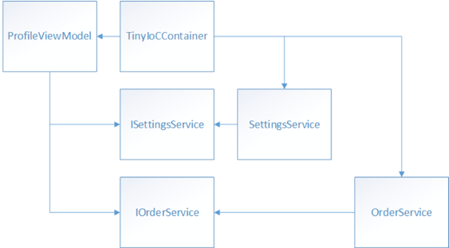

# Dependency Injection

> [!NOTE]
> This eBook was published in the spring of 2017, and has not been updated since then. There is much in the book that remains valuable, but some of the material is outdated.

Typically, a class constructor is invoked when instantiating an object, and any values that the object needs are passed as arguments to the constructor. This is an example of dependency injection, and specifically is known as *constructor injection*. The dependencies the object needs are injected into the constructor.

By specifying dependencies as interface types, dependency injection enables decoupling of the concrete types from the code that depends on these types. It generally uses a container that holds a list of registrations and mappings between interfaces and abstract types, and the concrete types that implement or extend these types.

There are also other types of dependency injection, such as *property setter injection*, and *method call injection*, but they are less commonly seen. Therefore, this chapter will focus solely on performing constructor injection with a dependency injection container.

## Introduction to Dependency Injection

Dependency injection is a specialized version of the Inversion of Control (IoC) pattern, where the concern being inverted is the process of obtaining the required dependency. With dependency injection, another class is responsible for injecting dependencies into an object at runtime. The following code example shows how the `ProfileViewModel` class is structured when using dependency injection:

```csharp
public class ProfileViewModel : ViewModelBase  
{  
    private IOrderService _orderService;  

    public ProfileViewModel(IOrderService orderService)  
    {  
        _orderService = orderService;  
    }  
    ...  
}
```

The `ProfileViewModel` constructor receives an `IOrderService` instance as an argument, injected by another class. The only dependency in the `ProfileViewModel` class is on the interface type. Therefore, the `ProfileViewModel` class doesn't have any knowledge of the class that's responsible for instantiating the `IOrderService` object. The class that's responsible for instantiating the `IOrderService` object, and inserting it into the `ProfileViewModel` class, is known as the *dependency injection container*.

Dependency injection containers reduce the coupling between objects by providing a facility to instantiate class instances and manage their lifetime based on the configuration of the container. During the objects creation, the container injects any dependencies that the object requires into it. If those dependencies have not yet been created, the container creates and resolves their dependencies first.

> [!NOTE]
> Dependency injection can also be implemented manually using factories. However, using a container provides additional capabilities such as lifetime management, and registration through assembly scanning.

There are several advantages to using a dependency injection container:

- A container removes the need for a class to locate its dependencies and manage their lifetimes.
- A container allows mapping of implemented dependencies without affecting the class.
- A container facilitates testability by allowing dependencies to be mocked.
- A container increases maintainability by allowing new classes to be easily added to the app.

In the context of a Xamarin.Forms app that uses MVVM, a dependency injection container will typically be used for registering and resolving view models, and for registering services and injecting them into view models.

There are many dependency injection containers available, with the eShopOnContainers mobile app using TinyIoC to manage the instantiation of view model and service classes in the app. TinyIoC was chosen after evaluating a number of different containers, and features superior performance on mobile platforms when compared to the majority of the well-known containers. It facilitates building loosely coupled apps, and provides all of the features commonly found in dependency injection containers, including methods to register type mappings, resolve objects, manage object lifetimes, and inject dependent objects into constructors of objects that it resolves. For more information about TinyIoC, see [TinyIoC](https://github.com/grumpydev/TinyIoC/wiki) on github.com.

In TinyIoC, the `TinyIoCContainer` type provides the dependency injection container. Figure 3-1 shows the dependencies when using this container, which instantiates an `IOrderService` object and injects it into the `ProfileViewModel` class.



**Figure 3-1:** Dependencies when using dependency injection

At runtime, the container must know which implementation of the `IOrderService` interface it should instantiate, before it can instantiate a `ProfileViewModel` object. This involves:

- The container deciding how to instantiate an object that implements the `IOrderService` interface. This is known as *registration*.
- The container instantiating the object that implements the `IOrderService` interface, and the `ProfileViewModel` object. This is known as *resolution*.

Eventually, the app will finish using the `ProfileViewModel` object and it will become available for garbage collection. At this point, the garbage collector should dispose of the `IOrderService` instance if other classes do not share the same instance.

> [!TIP]
> Write container-agnostic code. Always try to write container-agnostic code to decouple the app from the specific dependency container being used.

## Registration

Before dependencies can be injected into an object, the types of the dependencies must first be registered with the container. Registering a type typically involves passing the container an interface and a concrete type that implements the interface.

There are two ways of registering types and objects in the container through code:

- Register a type or mapping with the container. When required, the container will build an instance of the specified type.
- Register an existing object in the container as a singleton. When required, the container will return a reference to the existing object.

> [!TIP]
> Dependency injection containers are not always suitable. Dependency injection introduces additional complexity and requirements that might not be appropriate or useful to small apps. If a class does not have any dependencies, or is not a dependency for other types, it might not make sense to put it in the container. In addition, if a class has a single set of dependencies that are integral to the type and will never change, it might not make sense to put it in the container.

The registration of types that require dependency injection should be performed in a single method in an app, and this method should be invoked early in the app's lifecycle to ensure that the app is aware of the dependencies between its classes. In the eShopOnContainers mobile app this is performed by the `ViewModelLocator` class, which builds the `TinyIoCContainer` object and is the only class in the app that holds a reference to that object. The following code example shows how the eShopOnContainers mobile app declares the `TinyIoCContainer` object in the `ViewModelLocator` class:

```csharp
private static TinyIoCContainer _container;
```

Types are registered in the `ViewModelLocator` constructor. This is achieved by first creating a `TinyIoCContainer` instance, which is demonstrated in the following code example:

```csharp
_container = new TinyIoCContainer();
```

Types are then registered with the `TinyIoCContainer` object, and the following code example demonstrates the most common form of type registration:

```csharp
_container.Register<IRequestProvider, RequestProvider>();
```

The `Register` method shown here maps an interface type to a concrete type. By default, each interface registration is configured as a singleton so that every dependent object receives the same shared instance. Therefore, only a single `RequestProvider` instance will exist in the container, which is shared by objects that require an injection of an `IRequestProvider` through a constructor.

Concrete types can also be registered directly without a mapping from an interface type, as shown in the following code example:

```csharp
_container.Register<ProfileViewModel>();
```

By default, each concrete class registration is configured as a multi-instance so that every dependent object receives a new instance. Therefore, when the `ProfileViewModel` is resolved, a new instance will be created and the container will inject its required dependencies.

## Resolution

After a type is registered, it can be resolved or injected as a dependency. When a type is being resolved and the container needs to create a new instance, it injects any dependencies into the instance.

Generally, when a type is resolved, one of three things happens:

1. If the type hasn't been registered, the container throws an exception.
1. If the type has been registered as a singleton, the container returns the singleton instance. If this is the first time the type is called for, the container creates it if required, and maintains a reference to it.
1. If the type hasn't been registered as a singleton, the container returns a new instance, and doesn't maintain a reference to it.

The following code example shows how the `RequestProvider` type that was previously registered with TinyIoC can be resolved:

```csharp
var requestProvider = _container.Resolve<IRequestProvider>();
```

In this example, TinyIoC is asked to resolve the concrete type for the `IRequestProvider` type, along with any dependencies. Typically, the `Resolve` method is called when an instance of a specific type is required. For information about controlling the lifetime of resolved objects, see [Managing the Lifetime of Resolved Objects](#managing-the-lifetime-of-resolved-objects).

The following code example shows how the eShopOnContainers mobile app instantiates view model types and their dependencies:

```csharp
var viewModel = _container.Resolve(viewModelType);
```

In this example, TinyIoC is asked to resolve the view model type for a requested view model, and the container will also resolve any dependencies. When resolving the `ProfileViewModel` type, the dependencies to resolve are an `ISettingsService` object and an `IOrderService` object. Because interface registrations were used when registering the `SettingsService` and `OrderService` classes, TinyIoC returns singleton instances for the `SettingsService` and `OrderService` classes and then passes them to the constructor of the `ProfileViewModel` class. For more information about how the eShopOnContainers mobile app constructs view models and associates them to views, see [Automatically Creating a View Model with a View Model Locator](~/xamarin-forms/enterprise-application-patterns/mvvm.md#automatically-creating-a-view-model-with-a-view-model-locator).

> [!NOTE]
> Registering and resolving types with a container has a performance cost because of the container's use of reflection for creating each type, especially if dependencies are being reconstructed for each page navigation in the app. If there are many or deep dependencies, the cost of creation can increase significantly.

## Managing the Lifetime of Resolved Objects

After registering a type using a concrete class registration, the default behavior for TinyIoC is to create a new instance of the registered type each time the type is resolved, or when the dependency mechanism injects instances into other classes. In this scenario, the container doesn't hold a reference to the resolved object. However, when registering a type using interface registration, the default behavior for TinyIoC is to manage the lifetime of the object as a singleton. Therefore, the instance remains in scope while the container is in scope, and is disposed when the container goes out of scope and is garbage collected, or when code explicitly disposes the container.

The default TinyIoC registration behavior can be overridden using the fluent `AsSingleton` and `AsMultiInstance` API methods. For example, the `AsSingleton` method can be used with the `Register` method, so that the container creates or returns a singleton instance of a type when calling the `Resolve` method. The following code example shows how TinyIoC is instructed to create a singleton instance of the `LoginViewModel` class:

```csharp
_container.Register<LoginViewModel>().AsSingleton();
```

The first time the `LoginViewModel` type is resolved, the container creates a new `LoginViewModel` object and maintains a reference to it. On any subsequent resolutions of the `LoginViewModel`, the container returns a reference to the `LoginViewModel` object that was previously created.

> [!NOTE]
> Types that are registered as singletons are disposed when the container is disposed.

## Summary

Dependency injection enables decoupling of concrete types from the code that depends on these types. It typically uses a container that holds a list of registrations and mappings between interfaces and abstract types, and the concrete types that implement or extend these types.

TinyIoC is a lightweight container that features superior performance on mobile platforms when compared to the majority of the well-known containers. It facilitates building loosely coupled apps, and provides all of the features commonly found in dependency injection containers, including methods to register type mappings, resolve objects, manage object lifetimes, and inject dependent objects into constructors of objects it resolves.

## Related Links

- [Download eBook (2Mb PDF)](https://aka.ms/xamarinpatternsebook)
- [eShopOnContainers (GitHub) (sample)](https://github.com/dotnet-architecture/eShopOnContainers)
