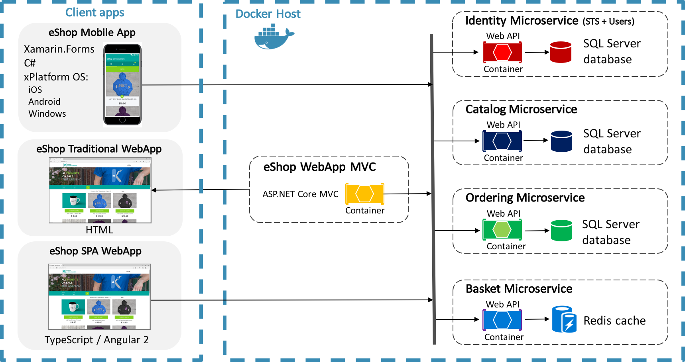

# Introduction to Enterprise App Development

> [!NOTE]
> This eBook was published in the spring of 2017, and has not been updated since then. There is much in the book that remains valuable, but some of the material is outdated.

Regardless of platform, developers of enterprise apps face several challenges:

- App requirements that can change over time.
- New business opportunities and challenges.
- Ongoing feedback during development that can significantly affect the scope and requirements of the app.

With these in mind, it's important to build apps that can be easily modified or extended over time. Designing for such adaptability can be difficult as it requires an architecture that allows individual parts of the app to be independently developed and tested in isolation without affecting the rest of the app.

Many enterprise apps are sufficiently complex to require more than one developer. It can be a significant challenge to decide how to design an app so that multiple developers can work effectively on different pieces of the app independently, while ensuring that the pieces come together seamlessly when integrated into the app.

The traditional approach to designing and building an app results in what is referred to as a *monolithic* app, where components are tightly coupled with no clear separation between them. Typically, this monolithic approach leads to apps that are difficult and inefficient to maintain, because it can be difficult to resolve bugs without breaking other components in the app, and it can be difficult to add new features or to replace existing features.

An effective remedy for these challenges is to partition an app into discrete, loosely coupled components that can be easily integrated together into an app. Such an approach offers several benefits:

- It allows individual functionality to be developed, tested, extended, and maintained by different individuals or teams.
- It promotes reuse and a clean separation of concerns between the app's horizontal capabilities, such as authentication and data access, and the vertical capabilities, such as app specific business functionality. This allows the dependencies and interactions between app components to be more easily managed.
- It helps maintain a separation of roles by allowing different individuals, or teams, to focus on a specific task or piece of functionality according to their expertise. In particular, it provides a cleaner separation between the user interface and the app's business logic.

However, there are many issues that must be resolved when partitioning an app into discrete, loosely coupled components. These include:

- Deciding how to provide a clean separation of concerns between the user interface controls and their logic. One of the most important decisions when creating a Xamarin.Forms enterprise app is whether to place business logic in code-behind files, or whether to create a clean separation of concerns between the user interface controls and their logic, to make the app more maintainable and testable. For more information, see [Model-View-ViewModel](~/xamarin-forms/enterprise-application-patterns/mvvm.md).
- Determining whether to use a dependency injection container. Dependency injection containers reduce the dependency coupling between objects by providing a facility to construct instances of classes with their dependencies injected, and manage their lifetime based on the configuration of the container. For more information, see [Dependency Injection](~/xamarin-forms/enterprise-application-patterns/dependency-injection.md).
- Choosing between platform provided eventing and loosely coupled message-based communication between components that are inconvenient to link by object and type references. For more information, see Introduction to [Communicating Between Loosely Coupled Components](~/xamarin-forms/enterprise-application-patterns/communicating-between-loosely-coupled-components.md).
- Deciding how to navigate between pages, including how to invoke navigation, and where navigation logic should reside. For more information, see [Navigation](~/xamarin-forms/enterprise-application-patterns/navigation.md).
- Determining how to validate user input for correctness. The decision must include how to validate user input, and how to notify the user about validation errors. For more information, see [Validation](~/xamarin-forms/enterprise-application-patterns/validation.md).
- Deciding how to perform authentication, and how to protect resources with authorization. For more information, see [Authentication and Authorization](~/xamarin-forms/enterprise-application-patterns/authentication-and-authorization.md).
- Determining how to access remote data from web services, including how to reliably retrieve data, and how to cache data. For more information, see [Accessing Remote Data](~/xamarin-forms/enterprise-application-patterns/accessing-remote-data.md).
- Deciding how to test the app. For more information, see [Unit Testing](~/xamarin-forms/enterprise-application-patterns/unit-testing.md).

This guide provides guidance on these issues, and focuses on the core patterns and architecture for building a cross-platform enterprise app using Xamarin.Forms. The guidance aims to help to produce adaptable, maintainable, and testable code, by addressing common Xamarin.Forms enterprise app development scenarios, and by separating the concerns of presentation, presentation logic, and entities through support for the Model-View-ViewModel (MVVM) pattern.

## Sample Application

This guide includes a sample application, eShopOnContainers, that's an online store that includes the following functionality:

- Authenticating and authorizing against a backend service.
- Browsing a catalog of shirts, coffee mugs, and other marketing items.
- Filtering the catalog.
- Ordering items from the catalog.
- Viewing the user's order history.
- Configuration of settings.

### Sample Application Architecture

Figure 1-1 provides a high-level overview of the architecture of the sample application.

**Figure 1-1**: eShopOnContainers high-level architecture

The sample application ships with three client apps:

- An MVC application developed with ASP.NET Core.
- A Single Page Application (SPA) developed with Angular 2 and Typescript. This approach for web applications avoids performing a round-trip to the server with each operation.
- A mobile app developed with Xamarin.Forms, which supports iOS, Android, and the Universal Windows Platform (UWP).

For information about the web applications, see [Architecting and Developing Modern Web Applications with ASP.NET Core and Microsoft Azure](https://aka.ms/WebAppEbook).

The sample application includes the following backend services:

- An identity microservice, which uses ASP.NET Core Identity and IdentityServer.
- A catalog microservice, which is a data-driven create, read, update, delete (CRUD) service that consumes an SQL Server database using EntityFramework Core.
- An ordering microservice, which is a domain-driven service that uses domain-driven design patterns.
- A basket microservice, which is a data-driven CRUD service that uses Redis Cache.

These backend services are implemented as microservices using ASP.NET Core MVC, and are deployed as unique containers within a single Docker host. Collectively, these backend services are referred to as the eShopOnContainers reference application. Client apps communicate with the backend services through a Representational State Transfer (REST) web interface. For more information about microservices and Docker, see [Containerized Microservices](~/xamarin-forms/enterprise-application-patterns/containerized-microservices.md).

For information about the implementation of the backend services, see [.NET Microservices: Architecture for Containerized .NET Applications](https://aka.ms/microservicesebook).

### Mobile App

This guide focuses on building cross-platform enterprise apps using Xamarin.Forms, and uses the eShopOnContainers mobile app as an example. Figure 1-2 shows the pages from the eShopOnContainers mobile app that provide the functionality outlined earlier.

**Figure 1-2**: The eShopOnContainers mobile app

The mobile app consumes the backend services provided by the eShopOnContainers reference application. However, it can be configured to consume data from mock services for those who wish to avoid deploying the backend services.

The eShopOnContainers mobile app exercises the following Xamarin.Forms functionality:

- XAML
- Controls
- Bindings
- Converters
- Styles
- Animations
- Commands
- Behaviors
- Triggers
- Effects
- Custom Renderers
- MessagingCenter
- Custom Controls

For more information about this functionality, see the [Xamarin.Forms documentation](~/xamarin-forms/index.yml), and [Creating Mobile Apps with Xamarin.Forms](https://aka.ms/xamformsebook).

In addition, unit tests are provided for some of the classes in the eShopOnContainers mobile app.

#### Mobile App Solution

The eShopOnContainers mobile app solution organizes the source code and other resources into projects. All of the projects use folders to organize the source code and other resources into categories. The following table outlines the projects that make up the eShopOnContainers mobile app:

|Project|Description|
|--- |--- |
|eShopOnContainers.Core|This project is the portable class library (PCL) project that contains the shared code and shared UI.|
|eShopOnContainers.Droid|This project holds Android specific code and is the entry point for the Android app.|
|eShopOnContainers.iOS|This project holds iOS specific code and is the entry point for the iOS app.|
|eShopOnContainers.UWP|This project holds Universal Windows Platform (UWP) specific code and is the entry point for the Windows app.|
|eShopOnContainers.TestRunner.Droid|This project is the Android test runner for the eShopOnContainers.UnitTests project.|
|eShopOnContainers.TestRunner.iOS|This project is the iOS test runner for the eShopOnContainers.UnitTests project.|
|eShopOnContainers.TestRunner.Windows|This project is the Universal Windows Platform test runner for the eShopOnContainers.UnitTests project.|
|eShopOnContainers.UnitTests|This project contains unit tests for the eShopOnContainers.Core project.|

The classes from the eShopOnContainers mobile app can be re-used in any Xamarin.Forms app with little or no modification.

##### eShopOnContainers.Core Project

The eShopOnContainers.Core PCL project contains the following folders:

|Folder|Description|
|--- |--- |
|Animations|Contains classes that enable animations to be consumed in XAML.|
|Behaviors|Contains behaviors that are exposed to view classes.|
|Controls|Contains custom controls used by the app.|
|Converters|Contains value converters that apply custom logic to a binding.|
|Effects|Contains the `EntryLineColorEffect` class, which is used to change the border color of specific `Entry` controls.|
|Exceptions|Contains the custom `ServiceAuthenticationException`.|
|Extensions|Contains extension methods for the `VisualElement` and `IEnumerable` classes.|
|Helpers|Contains helper classes for the app.|
|Models|Contains the model classes for the app.|
|Properties|Contains `AssemblyInfo.cs`, a .NET assembly metadata file.|
|Services|Contains interfaces and classes that implement services that are provided to the app.|
|Triggers|Contains the `BeginAnimation` trigger, which is used to invoke an animation in XAML.|
|Validations|Contains classes involved in validating data input.|
|ViewModels|Contains the application logic that's exposed to pages.|
|Views|Contains the pages for the app.|

##### Platform Projects

The platform projects contain effect implementations, custom renderer implementations, and other platform-specific resources.

## Summary

Xamarin's cross-platform mobile app development tools and platforms provide a comprehensive solution for B2E, B2B, and B2C mobile client apps, providing the ability to share code across all target platforms (iOS, Android, and Windows) and helping to lower the total cost of ownership. Apps can share their user interface and app logic code, while retaining the native platform look and feel.

Developers of enterprise apps face several challenges that can alter the architecture of the app during development. Therefore, it's important to build an app so that it can be modified or extended over time. Designing for such adaptability can be difficult, but typically involves partitioning an app into discrete, loosely coupled components that can be easily integrated together into an app.

## Related Links

- [Download eBook (2Mb PDF)](https://aka.ms/xamarinpatternsebook)
- [eShopOnContainers (GitHub) (sample)](https://github.com/dotnet-architecture/eShopOnContainers)
