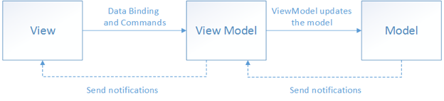

# MVVM

The Xamarin.Forms developer experience typically involves creating a user interface in XAML, and then adding code-behind that operates on the user interface. As apps are modified, and grow in size and scope, complex maintenance issues can arise. These issues include the tight coupling between the UI controls and the business logic, which increases the cost of making UI modifications, and the difficulty of unit testing such code.

The Model-View-ViewModel (MVVM) pattern helps to cleanly separate the business and presentation logic of an application from its user interface (UI). Maintaining a clean separation between application logic and the UI helps to address numerous development issues and can make an application easier to test, maintain, and evolve. It can also greatly improve code re-use opportunities and allows developers and UI designers to more easily collaborate when developing their respective parts of an app.

## The MVVM Pattern

There are three core components in the MVVM pattern: the model, the view, and the view model. Each serves a distinct purpose. Figure 2-1 shows the relationships between the three components.



**Figure 2-1**: The MVVM pattern

In addition to understanding the responsibilities of each components, it's also important to understand how they interact with each other. At a high level, the view "knows about" the view model, and the view model "knows about" the model, but the model is unaware of the view model, and the view model is unaware of the view. Therefore, the view model isolates the view from the model, and allows the model to evolve independently of the view.

The benefits of using the MVVM pattern are as follows:

-   If there's an existing model implementation that encapsulates existing business logic, it can be difficult or risky to change it. In this scenario, the view model acts as an adapter for the model classes and enables you to avoid making any major changes to the model code.
-   Developers can create unit tests for the view model and the model, without using the view. The unit tests for the view model can exercise exactly the same functionality as used by the view.
-   The app UI can be redesigned without touching the code, provided that the view is implemented entirely in XAML. Therefore, a new version of the view should work with the existing view model.
-   Designers and developers can work independently and concurrently on their components during the development process. Designers can focus on the view, while developers can work on the view model and model components.

The key to using MVVM effectively lies in understanding how to factor app code into the correct classes, and in understanding how the classes interact. The following sections discuss the responsibilities of each of the classes in the MVVM pattern.

### View

The view is responsible for defining the structure, layout, and appearance of what the user sees on screen. Ideally, each view is defined in XAML, with a limited code-behind that does not contain business logic. However, in some cases, the code-behind might contain UI logic that implements visual behavior that is difficult to express in XAML, such as animations.

In a Xamarin.Forms application, a view is typically a [`Page`](https://developer.xamarin.com/api/type/Xamarin.Forms.Page/)-derived or [`ContentView`](https://developer.xamarin.com/api/type/Xamarin.Forms.ContentView/)-derived class. However, views can also be represented by a data template, which specifies the UI elements to be used to visually represent an object when it's displayed. A data template as a view does not have any code-behind, and is designed to bind to a specific view model type.

>💡 **Tip:** Avoid enabling and disabling UI elements in the code-behind. Ensure that view models are responsible for defining logical state changes that affect some aspects of the view's display, such as whether a command is available, or an indication that an operation is pending. Therefore, enable and disable UI elements by binding to view model properties, rather than enabling and disabling them in code-behind.

There are several options for executing code on the view model in response to interactions on the view, such as a button click or item selection. If a control supports commands, the control's `Command` property can be data-bound to an `ICommand` property on the view model. When the control's command is invoked, the code in the view model will be executed. In addition to commands, behaviors can be attached to an object in the view and can listen for either a command to be invoked or event to be raised. In response, the behavior can then invoke an `ICommand` on the view model or a method on the view model.

### ViewModel

The view model implements properties and commands to which the view can data bind to, and notifies the view of any state changes through change notification events. The properties and commands that the view model provides define the functionality to be offered by the UI, but the view determines how that functionality is to be displayed.

>💡 **Tip:** Keep the UI responsive with asynchronous operations. Mobile apps should keep the UI thread unblocked to improve the user's perception of performance. Therefore, in the view model, use asynchronous methods for I/O operations and raise events to asynchronously notify views of property changes.

The view model is also responsible for coordinating the view's interactions with any model classes that are required. There's typically a one-to-many relationship between the view model and the model classes. The view model might choose to expose model classes directly to the view so that controls in the view can data bind directly to them. In this case, the model classes will need to be designed to support data binding and change notification events.

Each view model provides data from a model in a form that the view can easily consume. To accomplish this, the view model sometimes performs data conversion. Placing this data conversion in the view model is a good idea because it provides properties that the view can bind to. For example, the view model might combine the values of two properties to make it easier for display by the view.

>💡 **Tip:** Centralize data conversions in a conversion layer. It's also possible to use converters as a separate data conversion layer that sits between the view model and the view. This can be necessary, for example, when data requires special formatting that the view model doesn't provide.

In order for the view model to participate in two-way data binding with the view, its properties must raise the `PropertyChanged` event. View models satisfy this requirement by implementing the `INotifyPropertyChanged` interface, and raising the `PropertyChanged` event when a property is changed.

For collections, the view-friendly `ObservableCollection<T>` is provided. This collection implements collection changed notification, relieving the developer from having to implement the `INotifyCollectionChanged` interface on collections.

### Model

Model classes are non-visual classes that encapsulate the app's data. Therefore, the model can be thought of as representing the app's domain model, which usually includes a data model along with business and validation logic. Examples of model objects include data transfer objects (DTOs), Plain Old CLR Objects (POCOs), and generated entity and proxy objects.

Model classes are typically used in conjunction with services or repositories that encapsulate data access and caching.

## Connecting View Models to Views

View models can be connected to views by using the data-binding capabilities of Xamarin.Forms. There are many approaches that can be used to construct views and view models and associate them at runtime. These approaches fall into two categories, known as view first composition, and view model first composition. Choosing between view first composition and view model first composition is an issue of preference and complexity. However, all approaches share the same aim, which is for the view to have a view model assigned to its BindingContext property.

With view first composition the app is conceptually composed of views that connect to the view models they depend on. The primary benefit of this approach is that it makes it easy to construct loosely coupled, unit testable apps because the view models have no dependence on the views themselves. It's also easy to understand the structure of the app by following its visual structure, rather than having to track code execution to understand how classes are created and associated. In addition, view first construction aligns with the Xamarin.Forms navigation system that's responsible for constructing pages when navigation occurs, which makes a view model first composition complex and misaligned with the platform.

With view model first composition the app is conceptually composed of view models, with a service being responsible for locating the view for a view model. View model first composition feels more natural to some developers, since the view creation can be abstracted away, allowing them to focus on the logical non-UI structure of the app. In addition, it allows view models to be created by other view models. However, this approach is often complex and it can become difficult to understand how the various parts of the app are created and associated.

>💡 **Tip:** Keep view models and views independent. The binding of views to a property in a data source should be the view's principal dependency on its corresponding view model. Specifically, don't reference view types, such as [`Button`](https://developer.xamarin.com/api/type/Xamarin.Forms.Button/) and [`ListView`](https://developer.xamarin.com/api/type/Xamarin.Forms.ListView/), from view models. By following the principles outlined here, view models can be tested in isolation, therefore reducing the likelihood of software defects by limiting scope.

The following sections discuss the main approaches to connecting view models to views.

### Creating a View Model Declaratively

The simplest approach is for the view to declaratively instantiate its corresponding view model in XAML. When the view is constructed, the corresponding view model object will also be constructed. This approach is demonstrated in the following code example:

```csharp
&lt;ContentPage ... xmlns:local="clr-namespace:eShop"&gt;  
    &lt;ContentPage.BindingContext&gt;  
        &lt;local:LoginViewModel /&gt;  
    &lt;/ContentPage.BindingContext&gt;  
    ...  
&lt;/ContentPage&gt;
```

When the [`ContentPage`](https://developer.xamarin.com/api/type/Xamarin.Forms.ContentPage/) is created, an instance of the `LoginViewModel` is automatically constructed and set as the view's [`BindingContext`](https://developer.xamarin.com/api/property/Xamarin.Forms.BindableObject.BindingContext/).

This declarative construction and assignment of the view model by the view has the advantage that it's simple, but has the disadvantage that it requires a default (parameter-less) constructor in the view model.

### Creating a View Model Programmatically

A view can have code in the code-behind file that results in the view model being assigned to its [`BindingContext`](https://developer.xamarin.com/api/property/Xamarin.Forms.BindableObject.BindingContext/) property. This is often accomplished in the view's constructor, as shown in the following code example:

```csharp
public LoginView()  
{  
    InitializeComponent();  
    BindingContext = new LoginViewModel(navigationService);  
}
```

The programmatic construction and assignment of the view model within the view's code-behind has the advantage that it's simple. However, the main disadvantage of this approach is that the view needs to provide the view model with any required dependencies. Using a dependency injection container can help to maintain loose coupling between the view and view model. For more information, see [Dependency Injection](~/xamarin-forms/enterprise-application-patterns/dependency-injection.md).

### Creating a View Defined as a Data Template

A view can be defined as a data template and associated with a view model type. Data templates can be defined as resources, or they can be defined inline within the control that will display the view model. The content of the control is the view model instance, and the data template is used to visually represent it. This technique is an example of a situation in which the view model is instantiated first, followed by the creation of the view.

<a name="automatically_creating_a_view_model_with_a_view_model_locator" />

### Automatically Creating a View Model with a View Model Locator

A view model locator is a custom class that manages the instantiation of view models and their association to views. In the eShopOnContainers mobile app, the `ViewModelLocator` class has an attached property, `AutoWireViewModel`, that's used to associate view models with views. In the view's XAML, this attached property is set to true to indicate that the view model should be automatically connected to the view, as shown in the following code example:

```csharp
viewModelBase:ViewModelLocator.AutoWireViewModel="true"
```

The `AutoWireViewModel` property is a bindable property that's initialized to false, and when its value changes the `OnAutoWireViewModelChanged` event handler is called. This method resolves the view model for the view. The following code example shows how this is achieved:

```csharp
private static void OnAutoWireViewModelChanged(BindableObject bindable, object oldValue, object newValue)  
{  
    var view = bindable as Element;  
    if (view == null)  
    {  
        return;  
    }  

    var viewType = view.GetType();  
    var viewName = viewType.FullName.Replace(".Views.", ".ViewModels.");  
    var viewAssemblyName = viewType.GetTypeInfo().Assembly.FullName;  
    var viewModelName = string.Format(  
        CultureInfo.InvariantCulture, "{0}Model, {1}", viewName, viewAssemblyName);  

    var viewModelType = Type.GetType(viewModelName);  
    if (viewModelType == null)  
    {  
        return;  
    }  
    var viewModel = _container.Resolve(viewModelType);  
    view.BindingContext = viewModel;  
}
```

The `OnAutoWireViewModelChanged` method attempts to resolve the view model using a convention-based approach. This convention assumes that:

-   View models are in the same assembly as view types.
-   Views are in a .Views child namespace.
-   View models are in a .ViewModels child namespace.
-   View model names correspond with view names and end with "ViewModel".

Finally, the `OnAutoWireViewModelChanged` method sets the [`BindingContext`](https://developer.xamarin.com/api/property/Xamarin.Forms.BindableObject.BindingContext/) of the view type to the resolved view model type. For more information about resolving the view model type, see [Resolution](~/xamarin-forms/enterprise-application-patterns/dependency-injection.md#resolution).

This approach has the advantage that an app has a single class that is responsible for the instantiation of view models and their connection to views.

>💡 **Tip:** Use a view model locator for ease of substitution. A view model locator can also be used as a point of substitution for alternate implementations of dependencies, such as for unit testing or design time data.

## Updating Views in Response to Changes in the Underlying View Model or Model

All view model and model classes that are accessible to a view should implement the `INotifyPropertyChanged` interface. Implementing this interface in a view model or model class allows the class to provide change notifications to any data-bound controls in the view when the underlying property value changes.

App's should be architected for the correct use of property change notification, by meeting the following requirements:

-   Always raising a `PropertyChanged` event if a public property's value changes. Do not assume that raising the `PropertyChanged` event can be ignored because of knowledge of how XAML binding occurs.
-   Always raising a `PropertyChanged` event for any calculated properties whose values are used by other properties in the view model or model.
-   Always raising the `PropertyChanged` event at the end of the method that makes a property change, or when the object is known to be in a safe state. Raising the event interrupts the operation by invoking the event's handlers synchronously. If this happens in the middle of an operation, it might expose the object to callback functions when it is in an unsafe, partially updated state. In addition, it's possible for cascading changes to be triggered by `PropertyChanged` events. Cascading changes generally require updates to be complete before the cascading change is safe to execute.
-   Never raising a `PropertyChanged` event if the property does not change. This means that you must compare the old and new values before raising the `PropertyChanged` event.
-   Never raising the `PropertyChanged` event during a view model's constructor if you are initializing a property. Data-bound controls in the view will not have subscribed to receive change notifications at this point.
-   Never raising more than one `PropertyChanged` event with the same property name argument within a single synchronous invocation of a public method of a class. For example, given a `NumberOfItems` property whose backing store is the `_numberOfItems` field, if a method increments `_numberOfItems` fifty times during the execution of a loop, it should only raise property change notification on the `NumberOfItems` property once, after all the work is complete. For asynchronous methods, raise the `PropertyChanged` event for a given property name in each synchronous segment of an asynchronous continuation chain.

The eShopOnContainers mobile app uses the `ExtendedBindableObject` class to provide change notifications, which is shown in the following code example:

```csharp
public abstract class ExtendedBindableObject : BindableObject  
{  
    public void RaisePropertyChanged&lt;T&gt;(Expression&lt;Func&lt;T&gt;&gt; property)  
    {  
        var name = GetMemberInfo(property).Name;  
        OnPropertyChanged(name);  
    }  

    private MemberInfo GetMemberInfo(Expression expression)  
    {  
        ...  
    }  
}
```

Xamarin.Form's [`BindableObject`](https://developer.xamarin.com/api/type/Xamarin.Forms.BindableObject/) class implements the `INotifyPropertyChanged` interface, and provides an [`OnPropertyChanged`](https://developer.xamarin.com/api/member/Xamarin.Forms.BindableObject.OnPropertyChanged/p/System.String/) method. The `ExtendedBindableObject` class provides the `RaisePropertyChanged` method to invoke property change notification, and in doing so uses the functionality provided by the `BindableObject` class.

Each view model class in the eShopOnContainers mobile app derives from the `ViewModelBase` class, which in turn derives from the `ExtendedBindableObject` class. Therefore, each view model class uses the `RaisePropertyChanged` method in the `ExtendedBindableObject` class to provide property change notification. The following code example shows how the eShopOnContainers mobile app invokes property change notification by using a lambda expression:

```csharp
public bool IsLogin  
{  
    get  
    {  
        return _isLogin;  
    }  
    set  
    {  
        _isLogin = value;  
        RaisePropertyChanged(() =&gt; IsLogin);  
    }  
}
```

Note that using a lambda expression in this way involves a small performance cost because the lambda expression has to be evaluated for each call. Although the performance cost is small and would not normally impact an app, the costs can accrue when there are many change notifications. However, the benefit of this approach is that it provides compile-time type safety and refactoring support when renaming properties.

## UI Interaction using Commands and Behaviors

In mobile apps, actions are typically invoked in response to a user action, such as a button click, that can be implemented by creating an event handler in the code-behind file. However, in the MVVM pattern, the responsibility for implementing the action lies with the view model, and placing code in the code-behind should be avoided.

Commands provide a convenient way to represent actions that can be bound to controls in the UI. They encapsulate the code that implements the action, and help to keep it decoupled from its visual representation in the view. Xamarin.Forms includes controls that can be declaratively connected to a command, and these controls will invoke the command when the user interacts with the control.

Behaviors also allow controls to be declaratively connected to a command. However, behaviors can be used to invoke an action that's associated with a range of events raised by a control. Therefore, behaviors address many of the same scenarios as command-enabled controls, while providing a greater degree of flexibility and control. In addition, behaviors can also be used to associate command objects or methods with controls that were not specifically designed to interact with commands.

### Implementing Commands

View models typically expose command properties, for binding from the view, that are object instances that implement the `ICommand` interface. A number of Xamarin.Forms controls provide a `Command` property, which can be data bound to an `ICommand` object provided by the view model. The `ICommand` interface defines an `Execute` method, which encapsulates the operation itself, a `CanExecute` method, which indicates whether the command can be invoked, and a `CanExecuteChanged` event that occurs when changes occur that affect whether the command should execute. The [`Command`](https://developer.xamarin.com/api/type/Xamarin.Forms.Command/) and [`Command<T>`](https://developer.xamarin.com/api/type/Xamarin.Forms.Command/) classes, provided by Xamarin.Forms, implement the `ICommand` interface, where `T` is the type of the arguments to `Execute` and `CanExecute`.

Within a view model, there should be an object of type [`Command`](https://developer.xamarin.com/api/type/Xamarin.Forms.Command/) or [`Command<T>`](https://developer.xamarin.com/api/type/Xamarin.Forms.Command/) for each public property in the view model of type `ICommand`. The `Command` or `Command<T>` constructor requires an `Action` callback object that's called when the `ICommand.Execute` method is invoked. The `CanExecute` method is an optional constructor parameter, and is a `Func` that returns a `bool`.

The following code shows how a [`Command`](https://developer.xamarin.com/api/type/Xamarin.Forms.Command/) instance, which represents a register command, is constructed by specifying a delegate to the `Register` view model method:

```csharp
public ICommand RegisterCommand =&gt; new Command(Register);
```

The command is exposed to the view through a property that returns a reference to an `ICommand`. When the `Execute` method is called on the [`Command`](https://developer.xamarin.com/api/type/Xamarin.Forms.Command/) object, it simply forwards the call to the method in the view model via the delegate that was specified in the `Command` constructor.

An asynchronous method can be invoked by a command by using the `async` and `await` keywords when specifying the command's `Execute` delegate. This indicates that the callback is a `Task` and should be awaited. For example, the following code shows how a [`Command`](https://developer.xamarin.com/api/type/Xamarin.Forms.Command/) instance, which represents a sign-in command, is constructed by specifying a delegate to the `SignInAsync` view model method:

```csharp
public ICommand SignInCommand =&gt; new Command(async () =&gt; await SignInAsync());
```

Parameters can be passed to the `Execute` and `CanExecute` actions by using the [`Command<T>`](https://developer.xamarin.com/api/type/Xamarin.Forms.Command/) class to instantiate the command. For example, the following code shows how a `Command<T>` instance is used to indicate that the `NavigateAsync` method will require an argument of type `string`:

```csharp
public ICommand NavigateCommand =&gt; new Command&lt;string&gt;(NavigateAsync);
```

In both the [`Command`](https://developer.xamarin.com/api/type/Xamarin.Forms.Command/) and [`Command<T>`](https://developer.xamarin.com/api/type/Xamarin.Forms.Command/) classes, the delegate to the `CanExecute` method in each constructor is optional. If a delegate isn't specified, the `Command` will return `true` for `CanExecute`. However, the view model can indicate a change in the command's `CanExecute` status by calling the `ChangeCanExecute` method on the `Command` object. This causes the `CanExecuteChanged` event to be raised. Any controls in the UI that are bound to the command will then update their enabled status to reflect the availability of the data-bound command.

#### Invoking Commands from a View

The following code example shows how a [`Grid`](https://developer.xamarin.com/api/type/Xamarin.Forms.Grid/) in the `LoginView` binds to the `RegisterCommand` in the `LoginViewModel` class by using a [`TapGestureRecognizer`](https://developer.xamarin.com/api/type/Xamarin.Forms.TapGestureRecognizer/) instance:

```csharp
&lt;Grid Grid.Column="1" HorizontalOptions="Center"&gt;  
    &lt;Label Text="REGISTER" TextColor="Gray"/&gt;  
    &lt;Grid.GestureRecognizers&gt;  
        &lt;TapGestureRecognizer Command="{Binding RegisterCommand}" NumberOfTapsRequired="1" /&gt;  
    &lt;/Grid.GestureRecognizers&gt;  
&lt;/Grid&gt;
```

A command parameter can also be optionally defined using the [`CommandParameter`](https://developer.xamarin.com/api/property/Xamarin.Forms.TapGestureRecognizer.CommandParameter/) property. The type of the expected argument is specified in the `Execute` and `CanExecute` target methods. The [`TapGestureRecognizer`](https://developer.xamarin.com/api/type/Xamarin.Forms.TapGestureRecognizer/) will automatically invoke the target command when the user interacts with the attached control. The command parameter, if provided, will be passed as the argument to the command's `Execute` delegate.

<a name="implementing_behaviors" />

### Implementing Behaviors

Behaviors allow functionality to be added to UI controls without having to subclass them. Instead, the functionality is implemented in a behavior class and attached to the control as if it was part of the control itself. Behaviors enable you to implement code that you would normally have to write as code-behind, because it directly interacts with the API of the control, in such a way that it can be concisely attached to the control, and packaged for reuse across more than one view or app. In the context of MVVM, behaviors are a useful approach for connecting controls to commands.

A behavior that's attached to a control through attached properties is known as an *attached behavior*. The behavior can then use the exposed API of the element to which it is attached to add functionality to that control, or other controls, in the visual tree of the view. The eShopOnContainers mobile app contains the `LineColorBehavior` class, which is an attached behavior. For more information about this behavior, see [Displaying Validation Errors](~/xamarin-forms/enterprise-application-patterns/validation.md#displaying_validation_errors).

A Xamarin.Forms behavior is a class that derives from the [`Behavior`](https://developer.xamarin.com/api/type/Xamarin.Forms.Behavior/) or [`Behavior<T>`](https://developer.xamarin.com/api/type/Xamarin.Forms.Behavior%3CT%3E/) class, where `T `is the type of the control to which the behavior should apply. These classes provide `OnAttachedTo` and `OnDetachingFrom` methods, which should be overridden to provide logic that will be executed when the behavior is attached to and detached from controls.

In the eShopOnContainers mobile app, the `BindableBehavior<T>` class derives from the [`Behavior<T>`](https://developer.xamarin.com/api/type/Xamarin.Forms.Behavior%3CT%3E/) class. The purpose of the `BindableBehavior<T>` class is to provide a base class for Xamarin.Forms behaviors that require the [`BindingContext`](https://developer.xamarin.com/api/property/Xamarin.Forms.BindableObject.BindingContext/) of the behavior to be set to the attached control.

The `BindableBehavior<T>` class provides an overridable `OnAttachedTo` method that sets the [`BindingContext`](https://developer.xamarin.com/api/property/Xamarin.Forms.BindableObject.BindingContext/) of the behavior, and an overridable `OnDetachingFrom` method that cleans up the `BindingContext`. In addition, the class stores a reference to the attached control in the `AssociatedObject` property.

The eShopOnContainers mobile app includes an `EventToCommandBehavior` class, which executes a command in response to an event occurring. This class derives from the `BindableBehavior<T>` class so that the behavior can bind to and execute an `ICommand` specified by a `Command` property when the behavior is consumed. The following code example shows the `EventToCommandBehavior` class:

```csharp
public class EventToCommandBehavior : BindableBehavior&lt;View&gt;  
{  
    ...  
    protected override void OnAttachedTo(View visualElement)  
    {  
        base.OnAttachedTo(visualElement);  

        var events = AssociatedObject.GetType().GetRuntimeEvents().ToArray();  
        if (events.Any())  
        {  
            _eventInfo = events.FirstOrDefault(e =&gt; e.Name == EventName);  
            if (_eventInfo == null)  
                throw new ArgumentException(string.Format(  
                        "EventToCommand: Can't find any event named '{0}' on attached type",   
                        EventName));  

            AddEventHandler(_eventInfo, AssociatedObject, OnFired);  
        }  
    }  

    protected override void OnDetachingFrom(View view)  
    {  
        if (_handler != null)  
            _eventInfo.RemoveEventHandler(AssociatedObject, _handler);  

        base.OnDetachingFrom(view);  
    }  

    private void AddEventHandler(  
            EventInfo eventInfo, object item, Action&lt;object, EventArgs&gt; action)  
    {  
        ...  
    }  

    private void OnFired(object sender, EventArgs eventArgs)  
    {  
        ...  
    }  
}
```

The `OnAttachedTo` and `OnDetachingFrom` methods are used to register and deregister an event handler for the event defined in the `EventName` property. Then, when the event fires, the `OnFired` method is invoked, which executes the command.

The advantage of using the `EventToCommandBehavior` to execute a command when an event fires, is that commands can be associated with controls that weren't designed to interact with commands. In addition, this moves event-handling code to view models, where it can be unit tested.

#### Invoking Behaviors from a View

The `EventToCommandBehavior` is particularly useful for attaching a command to a control that doesn't support commands. For example, the `ProfileView` uses the `EventToCommandBehavior` to execute the `OrderDetailCommand` when the [`ItemTapped`](https://developer.xamarin.com/api/event/Xamarin.Forms.ListView.ItemTapped/) event fires on the [`ListView`](https://developer.xamarin.com/api/type/Xamarin.Forms.ListView/) that lists the user's orders, as shown in the following code:

```csharp
&lt;ListView&gt;  
    &lt;ListView.Behaviors&gt;  
        &lt;behaviors:EventToCommandBehavior             
            EventName="ItemTapped"  
            Command="{Binding OrderDetailCommand}"  
            EventArgsConverter="{StaticResource ItemTappedEventArgsConverter}" /&gt;  
    &lt;/ListView.Behaviors&gt;  
    ...  
&lt;/ListView&gt;
```

At runtime, the `EventToCommandBehavior` will respond to interaction with the [`ListView`](https://developer.xamarin.com/api/type/Xamarin.Forms.ListView/). When an item is selected in the `ListView`, the [`ItemTapped`](https://developer.xamarin.com/api/event/Xamarin.Forms.ListView.ItemTapped/) event will fire, which will execute the `OrderDetailCommand` in the `ProfileViewModel`. By default, the event arguments for the event are passed to the command. This data is converted as it's passed between source and target by the converter specified in the `EventArgsConverter` property, which returns the [`Item`](https://developer.xamarin.com/api/property/Xamarin.Forms.ItemTappedEventArgs.Item/) of the `ListView` from the [`ItemTappedEventArgs`](https://developer.xamarin.com/api/type/Xamarin.Forms.ItemTappedEventArgs/). Therefore, when the `OrderDetailCommand` is executed, the selected `Order` is passed as a parameter to the registered Action.

For more information about behaviors, see [Behaviors](https://developer.xamarin.com/guides/xamarin-forms/application-fundamentals/behaviors/) on the Xamarin Developer Center.

## Summary

The Model-View-ViewModel (MVVM) pattern helps to cleanly separate the business and presentation logic of an application from its user interface (UI). Maintaining a clean separation between application logic and the UI helps to address numerous development issues and can make an application easier to test, maintain, and evolve. It can also greatly improve code re-use opportunities and allows developers and UI designers to more easily collaborate when developing their respective parts of an app.

Using the MVVM pattern, the UI of the app and the underlying presentation and business logic is separated into three separate classes: the view, which encapsulates the UI and UI logic; the view model, which encapsulates presentation logic and state; and the model, which encapsulates the app's business logic and data.


## Related Links

- [Download eBook (2Mb PDF)](https://aka.ms/xamarinpatternsebook)
- [eShopOnContainers (GitHub) (sample)](https://github.com/dotnet-architecture/eShopOnContainers)
