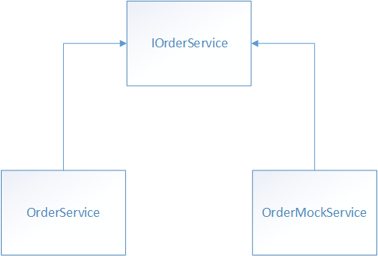

# Unit Testing Enterprise Apps

> [!NOTE]
> This eBook was published in the spring of 2017, and has not been updated since then. There is much in the book that remains valuable, but some of the material is outdated.

Mobile apps have unique problems that desktop and web-based applications don't have to worry about. Mobile users will differ by the devices that they use, by network connectivity, by the availability of services, and a range of other factors. Therefore, mobile apps should be tested as they will be used in the real world to improve their quality, reliability, and performance. There are many types of testing that should be performed on an app, including unit testing, integration testing, and user interface testing, with unit testing being the most common form of testing.

A unit test takes a small unit of the app, typically a method, isolates it from the remainder of the code, and verifies that it behaves as expected. Its goal is to check that each unit of functionality performs as expected, so that errors don't propagate throughout the app. Detecting a bug where it occurs is more efficient that observing the effect of a bug indirectly at a secondary point of failure.

Unit testing has the greatest effect on code quality when it's an integral part of the software development workflow. As soon as a method has been written, unit tests should be written that verify the behavior of the method in response to standard, boundary, and incorrect cases of input data, and that check any explicit or implicit assumptions made by the code. Alternatively, with test driven development, unit tests are written before the code. In this scenario, unit tests act as both design documentation and functional specifications.

> [!NOTE]
> Unit tests are very effective against regression – that is, functionality that used to work but has been disturbed by a faulty update.

Unit tests typically use the arrange-act-assert pattern:

- The *arrange* section of the unit test method initializes objects and sets the value of the data that is passed to the method under test.
- The *act* section invokes the method under test with the required arguments.
- The *assert* section verifies that the action of the method under test behaves as expected.

Following this pattern ensures that unit tests are readable and consistent.

## Dependency Injection and Unit Testing

One of the motivations for adopting a loosely-coupled architecture is that it facilitates unit testing. One of the types registered with Autofac is the `OrderService` class. The following code example shows an outline of this class:

```csharp
public class OrderDetailViewModel : ViewModelBase  
{  
    private IOrderService _ordersService;  

    public OrderDetailViewModel(IOrderService ordersService)  
    {  
        _ordersService = ordersService;  
    }  
    ...  
}
```

The `OrderDetailViewModel` class has a dependency on the `IOrderService` type which the container resolves when it instantiates a `OrderDetailViewModel` object. However, rather than create an `OrderService` object to unit test the `OrderDetailViewModel` class, instead, replace the `OrderService` object with a mock for the purpose of the tests. Figure 10-1 illustrates this relationship.



**Figure 10-1:** Classes that implement the IOrderService interface

This approach allows the `OrderService` object to be passed into the `OrderDetailViewModel` class at runtime, and in the interests of testability, it allows the `OrderMockService` class to be passed into the `OrderDetailViewModel` class at test time. The main advantage of this approach is that it enables unit tests to be executed without requiring unwieldy resources such as web services, or databases.

## Testing MVVM Applications

Testing models and view models from MVVM applications is identical to testing any other classes, and the same tools and techniques – such as unit testing and mocking, can be used. However, there are some patterns that are typical to model and view model classes, that can benefit from specific unit testing techniques.

> [!TIP]
> Test one thing with each unit test. Don't be tempted to make a unit test exercise more than one aspect of the unit's behavior. Doing so leads to tests that are difficult to read and update. It can also lead to confusion when interpreting a failure.

The eShopOnContainers mobile app uses [xUnit](https://xunit.github.io/) to perform unit testing, which supports two different types of unit tests:

- Facts are tests that are always true, which test invariant conditions.
- Theories are tests that are only true for a particular set of data.

The unit tests included with the eShopOnContainers mobile app are fact tests, and so each unit test method is decorated with the `[Fact]` attribute.

> [!NOTE]
> xUnit tests are executed by a test runner. To execute the test runner, run the eShopOnContainers.TestRunner project for the required platform.

### Testing Asynchronous Functionality

When implementing the MVVM pattern, view models usually invoke operations on services, often asynchronously. Tests for code that invokes these operations typically use mocks as replacements for the actual services. The following code example demonstrates testing asynchronous functionality by passing a mock service into a view model:

```csharp
[Fact]  
public async Task OrderPropertyIsNotNullAfterViewModelInitializationTest()  
{  
    var orderService = new OrderMockService();  
    var orderViewModel = new OrderDetailViewModel(orderService);  

    var order = await orderService.GetOrderAsync(1, GlobalSetting.Instance.AuthToken);  
    await orderViewModel.InitializeAsync(order);  

    Assert.NotNull(orderViewModel.Order);  
}
```

This unit test checks that the `Order` property of the `OrderDetailViewModel` instance will have a value after the `InitializeAsync` method has been invoked. The `InitializeAsync` method is invoked when the view model's corresponding view is navigated to. For more information about navigation, see [Navigation](~/xamarin-forms/enterprise-application-patterns/navigation.md).

When the `OrderDetailViewModel` instance is created, it expects an `OrderService` instance to be specified as an argument. However, the `OrderService` retrieves data from a web service. Therefore, an `OrderMockService` instance, which is a mock version of the `OrderService` class, is specified as the argument to the `OrderDetailViewModel` constructor. Then, when the view model's `InitializeAsync` method is invoked, which invokes `IOrderService` operations, mock data is retrieved rather than communicating with a web service.

### Testing INotifyPropertyChanged Implementations

Implementing the `INotifyPropertyChanged` interface allows views to react to changes that originate from view models and models. These changes are not limited to data shown in controls – they are also used to control the view, such as view model states that cause animations to be started or controls to be disabled.

Properties that can be updated directly by the unit test can be tested by attaching an event handler to the `PropertyChanged` event and checking whether the event is raised after setting a new value for the property. The following code example shows such a test:

```csharp
[Fact]  
public async Task SettingOrderPropertyShouldRaisePropertyChanged()  
{  
    bool invoked = false;  
    var orderService = new OrderMockService();  
    var orderViewModel = new OrderDetailViewModel(orderService);  

    orderViewModel.PropertyChanged += (sender, e) =>  
    {  
        if (e.PropertyName.Equals("Order"))  
            invoked = true;  
    };  
    var order = await orderService.GetOrderAsync(1, GlobalSetting.Instance.AuthToken);  
    await orderViewModel.InitializeAsync(order);  

    Assert.True(invoked);  
}
```

This unit test invokes the `InitializeAsync` method of the `OrderViewModel` class, which causes its `Order` property to be updated. The unit test will pass, provided that the `PropertyChanged` event is raised for the `Order` property.

### Testing Message-based Communication

View models that use the [`MessagingCenter`](xref:Xamarin.Forms.MessagingCenter) class to communicate between loosely-coupled classes can be unit tested by subscribing to the message being sent by the code under test, as demonstrated in the following code example:

```csharp
[Fact]  
public void AddCatalogItemCommandSendsAddProductMessageTest()  
{  
    bool messageReceived = false;  
    var catalogService = new CatalogMockService();  
    var catalogViewModel = new CatalogViewModel(catalogService);  

    Xamarin.Forms.MessagingCenter.Subscribe<CatalogViewModel, CatalogItem>(  
        this, MessageKeys.AddProduct, (sender, arg) =>  
    {  
        messageReceived = true;  
    });  
    catalogViewModel.AddCatalogItemCommand.Execute(null);  

    Assert.True(messageReceived);  
}
```

This unit test checks that the `CatalogViewModel` publishes the `AddProduct` message in response to its `AddCatalogItemCommand` being executed. Because the [`MessagingCenter`](xref:Xamarin.Forms.MessagingCenter) class supports multicast message subscriptions, the unit test can subscribe to the `AddProduct` message and execute a callback delegate in response to receiving it. This callback delegate, specified as a lambda expression, sets a `boolean` field that's used by the `Assert` statement to verify the behavior of the test.

### Testing Exception Handling

Unit tests can also be written that check that specific exceptions are thrown for invalid actions or inputs, as demonstrated in the following code example:

```csharp
[Fact]  
public void InvalidEventNameShouldThrowArgumentExceptionText()  
{  
    var behavior = new MockEventToCommandBehavior  
    {  
        EventName = "OnItemTapped"  
    };  
    var listView = new ListView();  

    Assert.Throws<ArgumentException>(() => listView.Behaviors.Add(behavior));  
}
```

This unit test will throw an exception, because the [`ListView`](xref:Xamarin.Forms.ListView) control does not have an event named `OnItemTapped`. The `Assert.Throws<T>` method is a generic method where `T` is the type of the expected exception. The argument passed to the `Assert.Throws<T>` method is a lambda expression that will throw the exception. Therefore, the unit test will pass provided that the lambda expression throws an `ArgumentException`.

> [!TIP]
> Avoid writing unit tests that examine exception message strings. Exception message strings might change over time, and so unit tests that rely on their presence are regarded as brittle.

### Testing Validation

There are two aspects to testing the validation implementation: testing that any validation rules are correctly implemented, and testing that the `ValidatableObject<T>` class performs as expected.

Validation logic is usually simple to test, because it is typically a self-contained process where the output depends on the input. There should be tests on the results of invoking the `Validate` method on each property that has at least one associated validation rule, as demonstrated in the following code example:

```csharp
[Fact]  
public void CheckValidationPassesWhenBothPropertiesHaveDataTest()  
{  
    var mockViewModel = new MockViewModel();  
    mockViewModel.Forename.Value = "John";  
    mockViewModel.Surname.Value = "Smith";  

    bool isValid = mockViewModel.Validate();  

    Assert.True(isValid);  
}
```

This unit test checks that validation succeeds when the two `ValidatableObject<T>` properties in the `MockViewModel` instance both have data.

As well as checking that validation succeeds, validation unit tests should also check the values of the `Value`, `IsValid`, and `Errors` property of each `ValidatableObject<T>` instance, to verify that the class performs as expected. The following code example demonstrates a unit test that does this:

```csharp
[Fact]  
public void CheckValidationFailsWhenOnlyForenameHasDataTest()  
{  
    var mockViewModel = new MockViewModel();  
    mockViewModel.Forename.Value = "John";  

    bool isValid = mockViewModel.Validate();  

    Assert.False(isValid);  
    Assert.NotNull(mockViewModel.Forename.Value);  
    Assert.Null(mockViewModel.Surname.Value);  
    Assert.True(mockViewModel.Forename.IsValid);  
    Assert.False(mockViewModel.Surname.IsValid);  
    Assert.Empty(mockViewModel.Forename.Errors);  
    Assert.NotEmpty(mockViewModel.Surname.Errors);  
}
```

This unit test checks that validation fails when the `Surname` property of the `MockViewModel` doesn't have any data, and the `Value`, `IsValid`, and `Errors` property of each `ValidatableObject<T>` instance are correctly set.

## Summary

A unit test takes a small unit of the app, typically a method, isolates it from the remainder of the code, and verifies that it behaves as expected. Its goal is to check that each unit of functionality performs as expected, so that errors don't propagate throughout the app.

The behavior of an object under test can be isolated by replacing dependent objects with mock objects that simulate the behavior of the dependent objects. This enables unit tests to be executed without requiring unwieldy resources such as web services, or databases.

Testing models and view models from MVVM applications is identical to testing any other classes, and the same tools and techniques can be used.

## Related Links

- [Download eBook (2Mb PDF)](https://aka.ms/xamarinpatternsebook)
- [eShopOnContainers (GitHub) (sample)](https://github.com/dotnet-architecture/eShopOnContainers)
