# Xamarin.Forms Multiscreen Quickstart

This quickstart demonstrates how to extend the Phoneword application by adding a second screen to keep track of the call history for the application. The final application is shown below:

[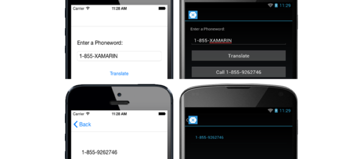](quickstart-images/intro-app-examples.png#lightbox "Phoneword Application")

Extend the Phoneword application as follows:

# [Visual Studio](#tab/vswin)

1. Launch Visual Studio. On the start page click **Open Project...**, and in the **Open Project** dialog select the solution file for the Phoneword project:

    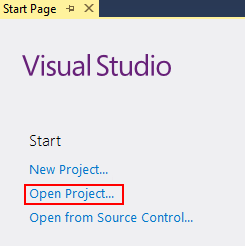

2. In **Solution Explorer**, right click on the **Phoneword** project and select **Add > New Item...**:

    

3. In the **Add New Item** dialog, select **Visual C# Items > Xamarin.Forms > Content Page**, name the new item **CallHistoryPage**, and click the **Add** button. This will add a page named **CallHistoryPage** to the project:

    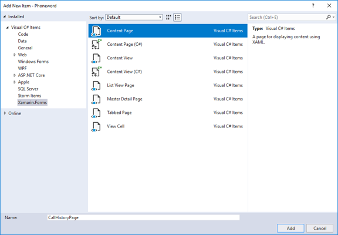

4. In **CallHistoryPage.xaml**, remove all of the template code and replace it with the following code. This code declaratively defines the user interface for the page:

    ```xaml
    <?xml version="1.0" encoding="UTF-8"?>
    <ContentPage xmlns="http://xamarin.com/schemas/2014/forms"
                       xmlns:local="clr-namespace:Phoneword;assembly=Phoneword"
                       xmlns:x="http://schemas.microsoft.com/winfx/2009/xaml"
                       x:Class="Phoneword.CallHistoryPage"
                       Title="Call History">
        <ContentPage.Padding>
            <OnPlatform x:TypeArguments="Thickness">
                <On Platform="iOS" Value="20, 40, 20, 20" />
                <On Platform="Android, UWP" Value="20" />
            </OnPlatform>
        </ContentPage.Padding>
        <StackLayout>
          <ListView ItemsSource="{x:Static local:App.PhoneNumbers}" />
        </StackLayout>
    </ContentPage>
    ```

    Save the changes to **CallHistoryPage.xaml** by pressing **CTRL+S**, and close the file.

5. In **Solution Explorer**, double-click the **App.xaml.cs** file in the shared **Phoneword** project to open it:

    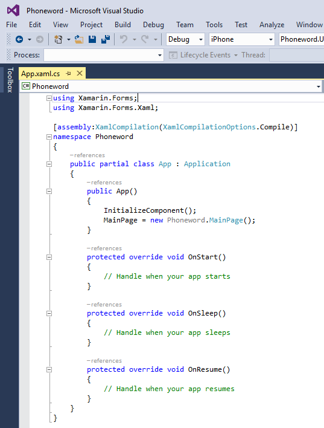

6. In **App.xaml.cs**, import the `System.Collections.Generic` namespace, add the declaration of the `PhoneNumbers` property, initialize the property in the `App` constructor, and initialize the [`MainPage`](https://developer.xamarin.com/api/property/Xamarin.Forms.Application.MainPage/) property to be a [`NavigationPage`](https://developer.xamarin.com/api/type/Xamarin.Forms.NavigationPage/). The `PhoneNumbers` collection will be used to store a list of each translated phone number called by the application:

    ```csharp
    using System.Collections.Generic;
    using Xamarin.Forms;
    using Xamarin.Forms.Xaml;

    [assembly: XamlCompilation(XamlCompilationOptions.Compile)]
    namespace Phoneword
    {
        public partial class App : Application
        {
            public static IList<string> PhoneNumbers { get; set; }

            public App()
            {
                InitializeComponent();
                PhoneNumbers = new List<string>();
                MainPage = new NavigationPage(new MainPage());
            }
            ...
        }
    }
    ```

    Save the changes to **App.xaml.cs** by pressing **CTRL+S**, and close the file.

7. In **Solution Explorer**, double-click the **MainPage.xaml** file in the shared **Phoneword** project to open it:

    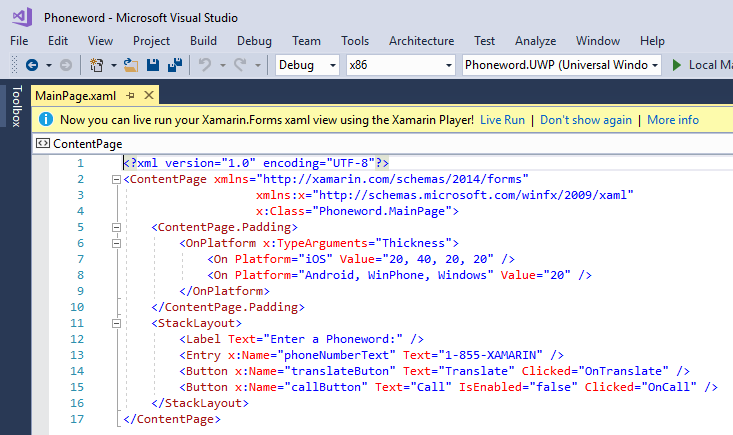

8. In **MainPage.xaml**, add a [`Button`](https://developer.xamarin.com/api/type/Xamarin.Forms.Button/) control at the end of the [`StackLayout`](https://developer.xamarin.com/api/type/Xamarin.Forms.StackLayout/) control. The button will be used to navigate to the call history page:

    ```xaml
    <StackLayout VerticalOptions="FillAndExpand"
                 HorizontalOptions="FillAndExpand"
                 Orientation="Vertical"
                 Spacing="15">
      ...
      <Button x:Name="callButton" Text="Call" IsEnabled="false" Clicked="OnCall" />
      <Button x:Name="callHistoryButton" Text="Call History" IsEnabled="false"
              Clicked="OnCallHistory" />
    </StackLayout>
    ```

    Save the changes to **MainPage.xaml** by pressing **CTRL+S**, and close the file.

9. In **Solution Explorer**, double-click **MainPage.xaml.cs** to open it:

    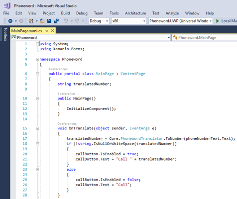

10. In **MainPage.xaml.cs**, add the `OnCallHistory` event handler method, and modify the `OnCall` event handler method to add the translated phone number to the `App.PhoneNumbers` collection and enable the `callHistoryButton`, provided that the `dialer` variable is not `null`:

    ```csharp
    using System;
    using Xamarin.Forms;

    namespace Phoneword
    {
        public partial class MainPage : ContentPage
        {
            ...

            async void OnCall(object sender, EventArgs e)
            {
                ...
                if (dialer != null) {
                    App.PhoneNumbers.Add (translatedNumber);
                    callHistoryButton.IsEnabled = true;
                    dialer.Dial (translatedNumber);
                }
                ...
            }

            async void OnCallHistory(object sender, EventArgs e)
            {
                await Navigation.PushAsync (new CallHistoryPage ());
            }
        }
    }
    ```

    Save the changes to **MainPage.xaml.cs** by pressing **CTRL+S**, and close the file.

11. In Visual Studio, select the **Build > Build Solution** menu item (or press **CTRL+SHIFT+B**). The application will build and a success message will appear in the Visual Studio status bar:

    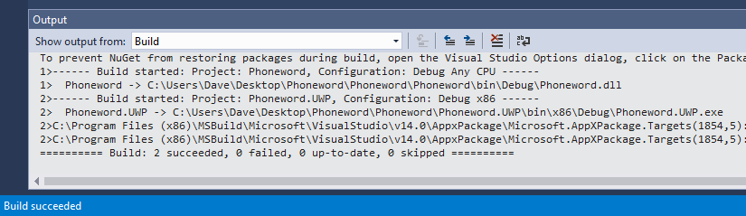

    If there are errors, repeat the previous steps and correct any mistakes until the application builds successfully.

12. In the Visual Studio toolbar, press the **Start** button (the triangular button that resembles a Play button) to launch the application:

    
    

13. In **Solution Explorer**, right click on the **Phoneword.Droid** project and select **Set as StartUp Project**.
14. In the Visual Studio toolbar, press the **Start** button (the triangular button that resembles a Play button) to launch the application inside an Android emulator.
15. If you have an iOS device and meet the Mac system requirements for Xamarin.Forms development, use a similar technique to deploy the app to the iOS device. Alternatively, deploy the app to the [iOS remote simulator](~/tools/ios-simulator.md).

    Note: phone calls are not supported on all the simulators.

# [Visual Studio for Mac](#tab/vsmac)

1. Launch Visual Studio for Mac. On the start page click **Open...**, and in the dialog select the solution file for the Phoneword project:

    

2. In the **Solution Pad**, select the **Phoneword** project, right-click and select **Add > New File...**:

    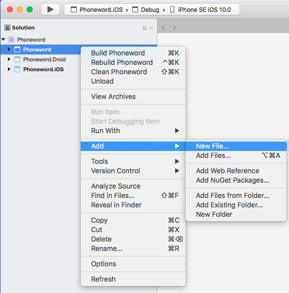

3. In the **New File** dialog, select **Forms > Forms ContentPage Xaml**, name the new file **CallHistoryPage**, and click the **New** button. This will add a page named **CallHistoryPage** to the project:

    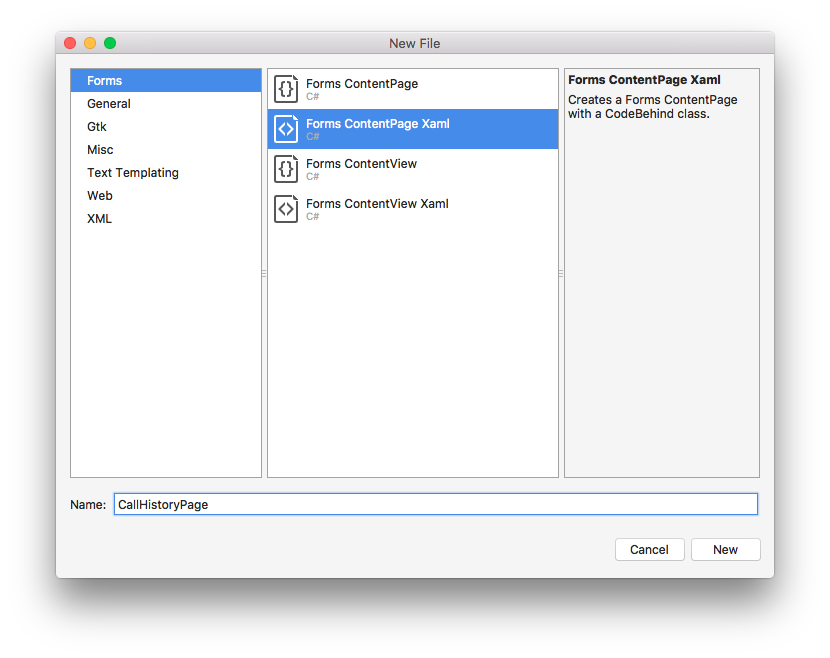

4. In the **Solution Pad**, double-click **CallHistoryPage.xaml** to open it:

    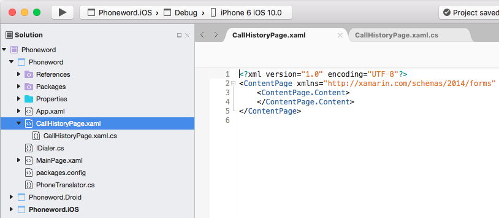

5. In **CallHistoryPage.xaml**, remove all of the template code and replace it with the following code. This code declaratively defines the user interface for the page:

    ```xaml
    <?xml version="1.0" encoding="UTF-8"?>
    <ContentPage xmlns="http://xamarin.com/schemas/2014/forms"
                       xmlns:local="clr-namespace:Phoneword;assembly=Phoneword"
                       xmlns:x="http://schemas.microsoft.com/winfx/2009/xaml"
                       x:Class="Phoneword.CallHistoryPage"
                       Title="Call History">
        <ContentPage.Padding>
            <OnPlatform x:TypeArguments="Thickness">
                <On Platform="iOS" Value="20, 40, 20, 20" />
                <On Platform="Android, UWP" Value="20" />
            </OnPlatform>
        </ContentPage.Padding>
        <StackLayout>
          <ListView ItemsSource="{x:Static local:App.PhoneNumbers}" />
        </StackLayout>
    </ContentPage>      
    ```

    Save the changes to **CallHistoryPage.xaml** by choosing **File > Save** (or by pressing **&#8984; + S**), and close the file.

6. In the **Solution Pad**, double-click **App.xaml.cs** to open it:

    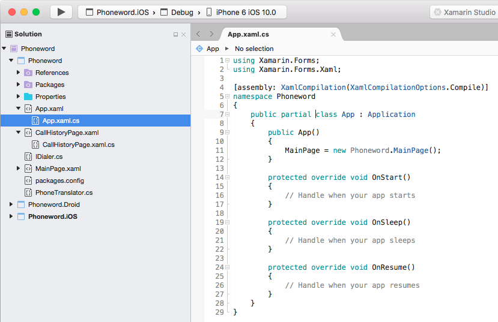

7. In **App.xaml.cs**, import the `System.Collections.Generic` namespace, add the declaration of the `PhoneNumbers` property, initialize the property in the `App` constructor, and initialize the [`MainPage`](https://developer.xamarin.com/api/property/Xamarin.Forms.Application.MainPage/) property to be a [`NavigationPage`](https://developer.xamarin.com/api/type/Xamarin.Forms.NavigationPage/). The `PhoneNumbers` collection will be used to store a list of each translated phone number called by the application:

    ```csharp
    using System.Collections.Generic;
    using Xamarin.Forms;
    using Xamarin.Forms.Xaml;

    [assembly: XamlCompilation(XamlCompilationOptions.Compile)]
    namespace Phoneword
    {
        public partial class App : Application
        {
            public static IList<string> PhoneNumbers { get; set; }

            public App()
            {
                InitializeComponent();
                PhoneNumbers = new List<string>();
                MainPage = new NavigationPage(new MainPage());
            }
            ...
        }
    }
    ```

    Save the changes to **App.xaml.cs** by choosing **File > Save** (or by pressing **&#8984; + S**), and close the file.

8. In the **Solution Pad**, double-click **MainPage.xaml** to open it:

    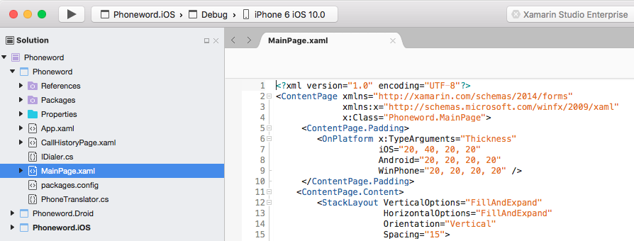

9. In **MainPage.xaml**, add a [`Button`](https://developer.xamarin.com/api/type/Xamarin.Forms.Button/) control at the end of the [`StackLayout`](https://developer.xamarin.com/api/type/Xamarin.Forms.StackLayout/) control. The button will be used to navigate to the call history page:

    ```xaml
    <StackLayout VerticalOptions="FillAndExpand"
                 HorizontalOptions="FillAndExpand"
                 Orientation="Vertical"
                 Spacing="15">
      ...
      <Button x:Name="callButton" Text="Call" IsEnabled="false" Clicked="OnCall" />
      <Button x:Name="callHistoryButton" Text="Call History" IsEnabled="false"
              Clicked="OnCallHistory" />
    </StackLayout>
    ```

    Save the changes to **MainPage.xaml** by choosing **File > Save** (or by pressing **&#8984; + S**), and close the file.

10. In the **Solution Pad**, double-click **MainPage.xaml.cs** to open it:

    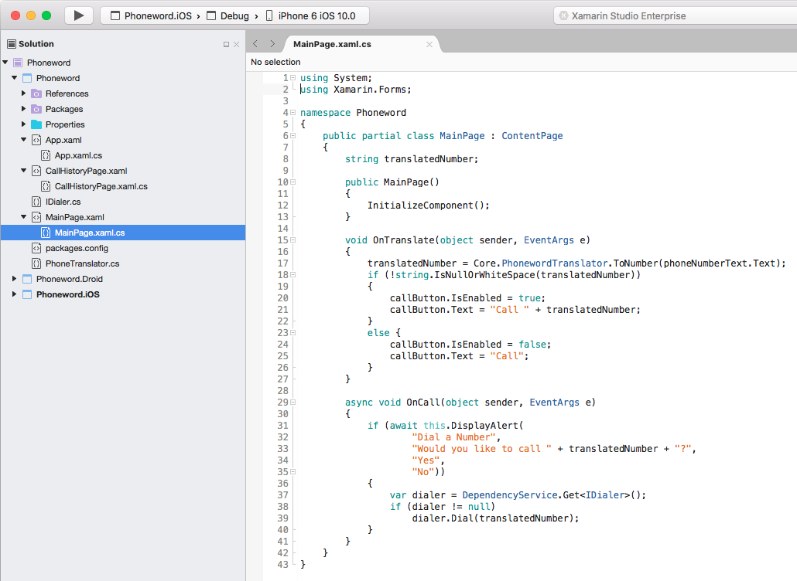

11. In **MainPage.xaml.cs**, add the `OnCallHistory` event handler method, and modify the `OnCall` event handler method to add the translated phone number to the `App.PhoneNumbers` collection and enable the `callHistoryButton`, provided that the `dialer` variable is not `null`:

    ```csharp
    using System;
    using Xamarin.Forms;

    namespace Phoneword
    {
        public partial class MainPage : ContentPage
        {
            ...

            async void OnCall(object sender, EventArgs e)
            {
                ...
                if (dialer != null) {
                    App.PhoneNumbers.Add (translatedNumber);
                    callHistoryButton.IsEnabled = true;
                    dialer.Dial (translatedNumber);
                }
                ...
            }

            async void OnCallHistory(object sender, EventArgs e)
            {
                await Navigation.PushAsync (new CallHistoryPage ());
            }
        }
    }
    ```

    Save the changes to **MainPage.xaml.cs** by choosing **File > Save** (or by pressing **&#8984; + S**), and close the file.

12. In Visual Studio for Mac, select the **Build > Build All** menu item (or press **&#8984; + B**). The application will build and a success message will appear in the Visual Studio for Mac toolbar:

    

    If there are errors, repeat the previous steps and correct any mistakes until the application builds successfully.

13. In the Visual Studio for Mac toolbar, press the **Start** button (the triangular button that resembles a Play button) to launch the application inside the iOS Simulator:

    
    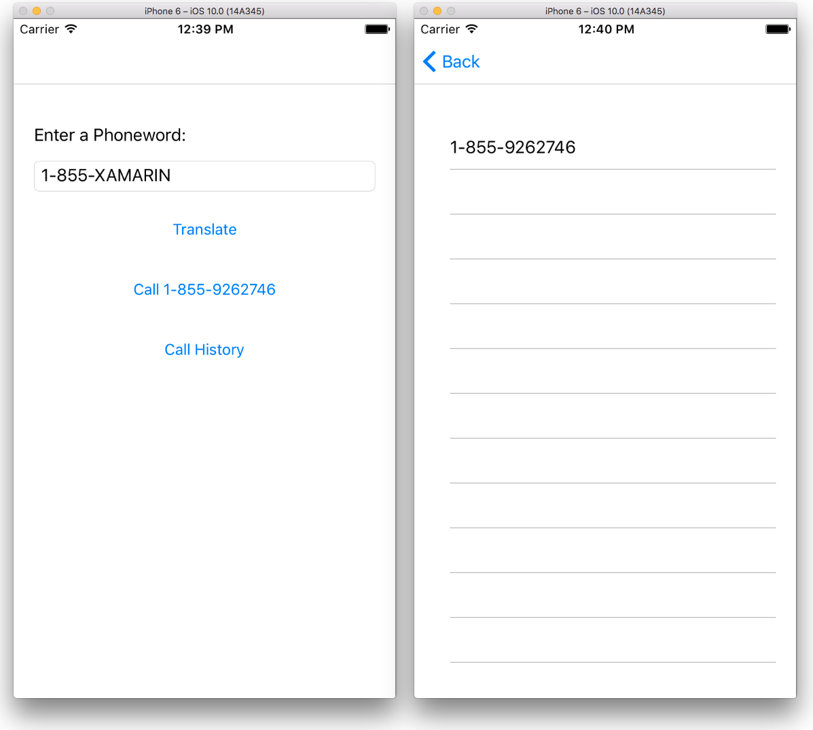

    Note: phone calls are not supported in the iOS Simulator.

14. In the **Solution Pad**, select the **Phoneword.Droid** project, right-click and select **Set As Startup Project**:

    

15. In the Visual Studio for Mac toolbar, press the **Start** button (the triangular button that resembles a Play button) to launch the application inside an Android emulator:

    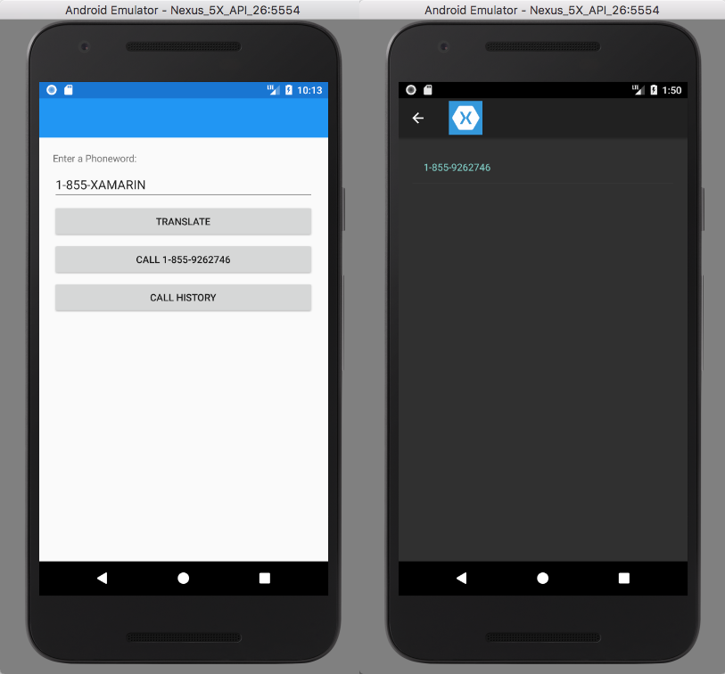

    Note: phone calls are not supported in Android emulators.

-----

Congratulations on completing a multiscreen Xamarin.Forms application. The [next topic](~/xamarin-forms/get-started/hello-xamarin-forms-multiscreen/deepdive.md) in this guide reviews the steps that were taken in this walkthrough to develop an understanding of page navigation and data binding using Xamarin.Forms.


## Related Links

- [Phoneword (sample)](https://developer.xamarin.com/samples/xamarin-forms/Phoneword/)
- [PhonewordMultiscreen (sample)](https://developer.xamarin.com/samples/xamarin-forms/PhonewordMultiscreen/)
