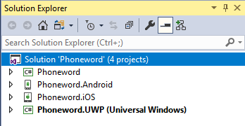
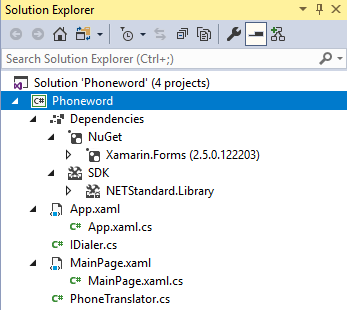
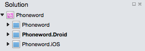
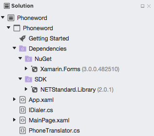
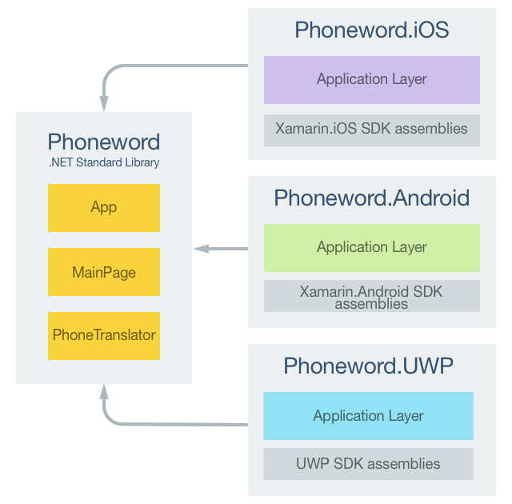
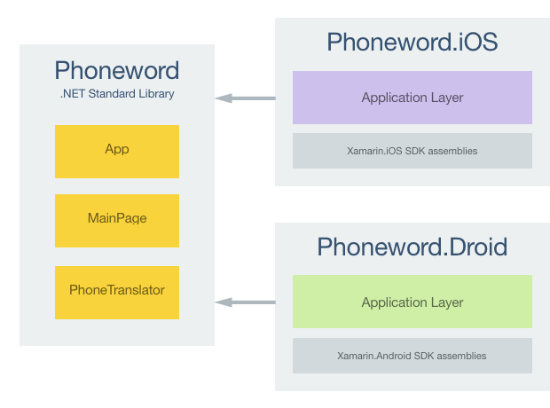

# Xamarin.Forms Deep Dive

In the [Xamarin.Forms Quickstart](~/xamarin-forms/get-started/hello-xamarin-forms/quickstart.md), the Phoneword application was built. This article reviews what has been built to gain an understanding of the fundamentals of how Xamarin.Forms applications work.

::: zone pivot="windows"

## Introduction to Visual Studio

Visual Studio organizes code into *Solutions* and *Projects*. A solution is a container that can hold one or more projects. A project can be an application, a supporting library, a test application, and more. The Phoneword application consists of one solution containing four projects, as shown in the following screenshot:



The projects are:

- Phoneword – This project is the .NET Standard library project that holds all of the shared code and shared UI.
- Phoneword.Android – This project holds Android-specific code and is the entry point for the Android application.
- Phoneword.iOS – This project holds iOS specific code and is the entry point for the iOS application.
- Phoneword.UWP – This project holds Universal Windows Platform (UWP) specific code and is the entry point for the UWP application.

## Anatomy of a Xamarin.Forms Application

The following screenshot shows the contents of the Phoneword .NET Standard library project in Visual Studio:



The project has a **Dependencies** node that contains **NuGet** and **SDK** nodes:

- **NuGet** &ndash; the Xamarin.Forms NuGet package that has been added to the project.
- **SDK** &ndash; the `NETStandard.Library` metapackage that references the complete set of NuGet packages that define .NET Standard.

::: zone-end
::: zone pivot="macos"

## Introduction to Visual Studio for Mac

[Visual Studio for Mac](/visualstudio/mac/) follows the Visual Studio practice of organizing code into *Solutions* and *Projects*. A solution is a container that can hold one or more projects. A project can be an application, a supporting library, a test application, and more. The Phoneword application consists of one solution containing three projects, as shown in the following screenshot:



The projects are:

- Phoneword – This project is the .NET Standard library project that holds all of the shared code and shared UI.
- Phoneword.Droid – This project holds Android specific code and is the entry point for Android applications.
- Phoneword.iOS – This project holds iOS specific code and is the entry point for iOS applications.

## Anatomy of a Xamarin.Forms Application

The following screenshot shows the contents of the Phoneword .NET Standard library project in Visual Studio for Mac:



The project has a **Dependencies** node that contains **NuGet** and **SDK** nodes:

- **NuGet** &ndash; the Xamarin.Forms NuGet package that has been added to the project.
- **SDK** &ndash; the `NETStandard.Library` metapackage that references the complete set of NuGet packages that define .NET Standard.

::: zone-end

The project also consists of a number of files:

- **App.xaml** – The XAML markup for the `App` class, which defines a resource dictionary for the application.
- **App.xaml.cs** – The code-behind for the `App` class, which is responsible for instantiating the first page that will be displayed by the application on each platform, and for handling application lifecycle events.
- **IDialer.cs** – The `IDialer` interface, which specifies that the `Dial` method must be provided by any implementing classes.
- **MainPage.xaml** – The XAML markup for the `MainPage` class, which defines the UI for the page shown when the application launches.
- **MainPage.xaml.cs** – The code-behind for the `MainPage` class, which contains the business logic that is executed when the user interacts with the page.
- **PhoneTranslator.cs** – The business logic that is responsible for converting a phone word to a phone number, which is invoked from **MainPage.xaml.cs**.

For more information about the anatomy of a Xamarin.iOS application, see [Anatomy of a Xamarin.iOS Application](~/ios/get-started/hello-ios/hello-ios-deepdive.md#anatomy-of-a-xamarinios-application). For more information about the anatomy of a Xamarin.Android application, see [Anatomy of a Xamarin.Android Application](~/android/get-started/hello-android/hello-android-deepdive.md#anatomy).

## Architecture and Application Fundamentals

::: zone pivot="windows"

A Xamarin.Forms application is architected in the same way as a traditional cross-platform application. Shared code is typically placed in a .NET Standard library, and platform-specific applications consume the shared code. The following diagram shows an overview of this relationship for the Phoneword application:



::: zone-end
::: zone pivot="macos"

A Xamarin.Forms application is architected in the same way as a traditional cross-platform application. Shared code is typically placed in a .NET Standard library, and platform-specific applications consume the shared code. The following diagram shows an overview of this relationship for the Phoneword application:



::: zone-end

To maximize the reuse of startup code, Xamarin.Forms applications have a single class named `App` that is responsible for instantiating the first page that will be displayed by the application on each platform, as shown in the following code example:

```csharp
using Xamarin.Forms;
using Xamarin.Forms.Xaml;

[assembly: XamlCompilation(XamlCompilationOptions.Compile)]
namespace Phoneword
{
    public partial class App : Application
    {
        public App()
        {
            InitializeComponent();
            MainPage = new MainPage();
        }
        ...
    }
}
```

This code sets the `MainPage` property of the `App` class to a new instance of the [`MainPage`](xref:Xamarin.Forms.Application.MainPage) class. In addition, the [`XamlCompilation`](xref:Xamarin.Forms.Xaml.XamlCompilationAttribute) attribute turns on the XAML compiler, so that XAML is compiled directly into intermediate language. For more information, see [XAML Compilation](~/xamarin-forms/xaml/xamlc.md).

## Launching the Application on Each Platform

### iOS

To launch the initial Xamarin.Forms page in iOS, the Phoneword.iOS project includes the `AppDelegate` class that inherits from the `FormsApplicationDelegate` class, as shown in the following code example:

```csharp
namespace Phoneword.iOS
{
    [Register ("AppDelegate")]
    public partial class AppDelegate : global::Xamarin.Forms.Platform.iOS.FormsApplicationDelegate
    {
        public override bool FinishedLaunching (UIApplication app, NSDictionary options)
        {
            global::Xamarin.Forms.Forms.Init ();
            LoadApplication (new App ());
            return base.FinishedLaunching (app, options);
        }
    }
}
```

The `FinishedLaunching` override initializes the Xamarin.Forms framework by calling the `Init` method. This causes the iOS-specific implementation of Xamarin.Forms to be loaded in the application before the root view controller is set by the call to the `LoadApplication` method.

### Android

To launch the initial Xamarin.Forms page in Android, the Phoneword.Droid project includes code that creates an `Activity` with the `MainLauncher` attribute, with the activity inheriting from the `FormsAppCompatActivity` class, as shown in the following code example:

```csharp
namespace Phoneword.Droid
{
    [Activity(Label = "Phoneword", 
              Icon = "@mipmap/icon", 
              Theme = "@style/MainTheme", 
              MainLauncher = true,
              ConfigurationChanges = ConfigChanges.ScreenSize | ConfigChanges.Orientation)]
    public class MainActivity : global::Xamarin.Forms.Platform.Android.FormsAppCompatActivity
    {
        internal static MainActivity Instance { get; private set; }

        protected override void OnCreate(Bundle bundle)
        {
            TabLayoutResource = Resource.Layout.Tabbar;
            ToolbarResource = Resource.Layout.Toolbar;

            base.OnCreate(bundle);
            Instance = this;
            global::Xamarin.Forms.Forms.Init(this, bundle);
            LoadApplication(new App());
        }
    }
}
```

The `OnCreate` override initializes the Xamarin.Forms framework by calling the `Init` method. This causes the Android-specific implementation of Xamarin.Forms to be loaded in the application before the Xamarin.Forms application is loaded. In addition, the `MainActivity` class stores a reference to itself in the `Instance` property. The `Instance` property is known as the local context, and is referenced from the `PhoneDialer` class.

::: zone pivot="windows"

## Universal Windows Platform

In Universal Windows Platform (UWP) applications, the `Init` method that initializes the Xamarin.Forms framework is invoked from the `App` class:

```csharp
Xamarin.Forms.Forms.Init (e);

if (e.PreviousExecutionState == ApplicationExecutionState.Terminated)
{
  ...
}
```

This causes the UWP-specific implementation of Xamarin.Forms to be loaded in the application. The initial Xamarin.Forms page is launched by the `MainPage` class, as demonstrated in the following code example:

```csharp
namespace Phoneword.UWP
{
    public sealed partial class MainPage
    {
        public MainPage()
        {
            this.InitializeComponent();
            this.LoadApplication(new Phoneword.App());
        }
    }
}
```

The Xamarin.Forms application is loaded with the `LoadApplication` method.

> [!NOTE]
> Universal Windows Platform (UWP) apps can be built with Xamarin.Forms, but only using Visual Studio on Windows.

::: zone-end

## User Interface

There are four main control groups used to create the user interface of a Xamarin.Forms application.

1. **Pages** – Xamarin.Forms pages represent cross-platform mobile application screens. The Phoneword application uses the [`ContentPage`](xref:Xamarin.Forms.ContentPage) class to display a single screen. For more information about pages, see [Xamarin.Forms Pages](~/xamarin-forms/user-interface/controls/pages.md).
1. **Layouts** – Xamarin.Forms layouts are containers used to compose views into logical structures. The Phoneword application uses the [`StackLayout`](xref:Xamarin.Forms.StackLayout) class to arrange controls in a horizontal stack. For more information about layouts, see [Xamarin.Forms Layouts](~/xamarin-forms/user-interface/controls/layouts.md).
1. **Views** – Xamarin.Forms views are the controls displayed on the user interface, such as labels, buttons, and text entry boxes. The Phoneword application uses the [`Label`](xref:Xamarin.Forms.Label), [`Entry`](xref:Xamarin.Forms.Entry), and [`Button`](xref:Xamarin.Forms.Button) controls. For more information about views, see [Xamarin.Forms Views](~/xamarin-forms/user-interface/controls/views.md).
1. **Cells** – Xamarin.Forms cells are specialized elements used for items in a list, and describe how each item in a list should be drawn. The Phoneword application does not make use of any cells. For more information about cells, see [Xamarin.Forms Cells](~/xamarin-forms/user-interface/controls/cells.md).

At runtime, each control will be mapped to its native equivalent, which is what will be rendered.

When the Phoneword application is run on any platform, it displays a single screen that corresponds to a [`Page`](xref:Xamarin.Forms.Page) in Xamarin.Forms. A `Page` represents a *ViewGroup* in Android, a *View Controller* in iOS, or a *Page* on the Universal Windows Platform. The Phoneword application also instantiates a [`ContentPage`](xref:Xamarin.Forms.ContentPage) object that represents the `MainPage` class, whose XAML markup is shown in the following code example:

```xaml
<?xml version="1.0" encoding="UTF-8"?>
<ContentPage xmlns="http://xamarin.com/schemas/2014/forms"
                         xmlns:x="http://schemas.microsoft.com/winfx/2009/xaml"
                         x:Class="Phoneword.MainPage">
        ...
        <StackLayout>
            <Label Text="Enter a Phoneword:" />
            <Entry x:Name="phoneNumberText" Text="1-855-XAMARIN" />
            <Button x:Name="translateButon" Text="Translate" Clicked="OnTranslate" />
            <Button x:Name="callButton" Text="Call" IsEnabled="false" Clicked="OnCall" />
        </StackLayout>
</ContentPage>
```

The `MainPage` class uses a [`StackLayout`](xref:Xamarin.Forms.StackLayout) control to automatically arrange controls on the screen regardless of the screen size. Each child element is positioned one after the other, vertically in the order in which they are added. The `StackLayout` control contains a [`Label`](xref:Xamarin.Forms.Label) control to display text on the page, an [`Entry`](xref:Xamarin.Forms.Entry) control to accept textual user input, and two [`Button`](xref:Xamarin.Forms.Button) controls used to execute code in response to touch events.

For more information about XAML in Xamarin.Forms, see [Xamarin.Forms XAML Basics](~/xamarin-forms/xaml/xaml-basics/index.md).

### Responding to User Interaction

An object defined in XAML can fire an event that is handled in the code-behind file. The following code example shows the `OnTranslate` method in the code-behind for the `MainPage` class, which is executed in response to the [`Clicked`](xref:Xamarin.Forms.Button.Clicked) event firing on the *Translate* button.

```csharp
void OnTranslate(object sender, EventArgs e)
{
    translatedNumber = Core.PhonewordTranslator.ToNumber (phoneNumberText.Text);
    if (!string.IsNullOrWhiteSpace (translatedNumber)) {
        callButton.IsEnabled = true;
        callButton.Text = "Call " + translatedNumber;
    } else {
        callButton.IsEnabled = false;
        callButton.Text = "Call";
    }
}
```

The `OnTranslate` method translates the phoneword into its corresponding phone number, and in response, sets properties on the call button. The code-behind file for a XAML class can access an object defined in XAML using the name assigned to it with the `x:Name` attribute. The value assigned to this attribute has the same rules as C# variables, in that it must begin with a letter or underscore and contain no embedded spaces.

The wiring of the translate button to the `OnTranslate` method occurs in the XAML markup for the `MainPage` class:

```xaml
<Button x:Name="translateButon" Text="Translate" Clicked="OnTranslate" />
```

## Additional Concepts Introduced in Phoneword

The Phoneword application for Xamarin.Forms has introduced several concepts not covered in this article. These concepts include:

- Enabling and disabling buttons. A [`Button`](xref:Xamarin.Forms.Button) can be toggled on or off by changing its [`IsEnabled`](xref:Xamarin.Forms.VisualElement.IsEnabled) property. For example, the following code example disables the `callButton`:

    ```csharp
    callButton.IsEnabled = false;
    ```

- Displaying an alert dialog. When the user presses the call **Button** the Phoneword application shows an *Alert Dialog* with the option to place or cancel a call. The [`DisplayAlert`](xref:Xamarin.Forms.Page.DisplayAlert(System.String,System.String,System.String,System.String)) method is used to create the dialog, as shown in the following code example:

    ```csharp
    await this.DisplayAlert (
            "Dial a Number",
            "Would you like to call " + translatedNumber + "?",
            "Yes",
            "No");
    ```

- Accessing native features via the [`DependencyService`](xref:Xamarin.Forms.DependencyService) class. The Phoneword application uses the `DependencyService` class to resolve the `IDialer` interface to platform-specific phone dialing implementations, as shown in the following code example from the Phoneword project:

    ```csharp
    async void OnCall (object sender, EventArgs e)
    {
        ...
        var dialer = DependencyService.Get<IDialer> ();
        ...
    }
    ```

  For more information about the [`DependencyService`](xref:Xamarin.Forms.DependencyService) class, see [Accessing Native Features via the DependencyService](~/xamarin-forms/app-fundamentals/dependency-service/index.md).

- Placing a phone call with a URL. The Phoneword application uses `OpenURL` to launch the system phone app. The URL consists of a `tel:` prefix followed by the phone number to be called, as shown in the following code example from the iOS project:

    ```csharp
    return UIApplication.SharedApplication.OpenUrl (new NSUrl ("tel:" + number));
    ```

- Tweaking the platform layout. The [`Device`](xref:Xamarin.Forms.Device) class enables developers to customize the application layout and functionality on a per-platform basis, as shown in the following code example that uses different [`Padding`](xref:Xamarin.Forms.Layout.Padding) values on different platforms to correctly display each page:

    ```xaml
    <ContentPage xmlns="http://xamarin.com/schemas/2014/forms" ... >
        <ContentPage.Padding>
            <OnPlatform x:TypeArguments="Thickness">
                <On Platform="iOS" Value="20, 40, 20, 20" />
                <On Platform="Android, UWP" Value="20" />
            </OnPlatform>
        </ContentPage.Padding>
        ...
    </ContentPage>
    ```

  For more information about platform tweaks, see [Device Class](~/xamarin-forms/platform/device.md).

## Testing and Deployment

Visual Studio for Mac and Visual Studio both provide many options for testing and deploying an application. Debugging applications is a common part of the application development lifecycle and helps to diagnose code issues. For more information, see [Set a Breakpoint](https://github.com/xamarin/recipes/tree/master/Recipes/cross-platform/ide/debugging/set_a_breakpoint), [Step Through Code](https://github.com/xamarin/recipes/tree/master/Recipes/cross-platform/ide/debugging/step_through_code), and [Output Information to the Log Window](https://github.com/xamarin/recipes/tree/master/Recipes/cross-platform/ide/debugging/output_information_to_log_window).

Simulators are a good place to start deploying and testing an application, and feature useful functionality for testing applications. However, users will not consume the final application in a simulator, so applications should be tested on real devices early and often. For more information about iOS device provisioning, see [Device Provisioning](~/ios/get-started/installation/device-provisioning/index.md). For more information about Android device provisioning, see [Set Up Device for Development](~/android/get-started/installation/set-up-device-for-development.md).

## Summary

This article has examined the fundamentals of application development using Xamarin.Forms. Topics covered included the anatomy of a Xamarin.Forms application, architecture and application fundamentals, and the user interface.

In the next section of this guide the application will be extended to include multiple screens, to explore more advanced Xamarin.Forms architecture and concepts.
