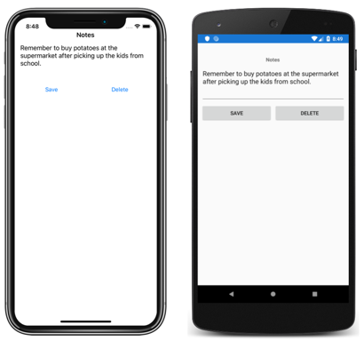
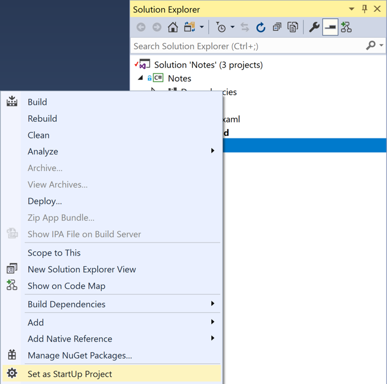
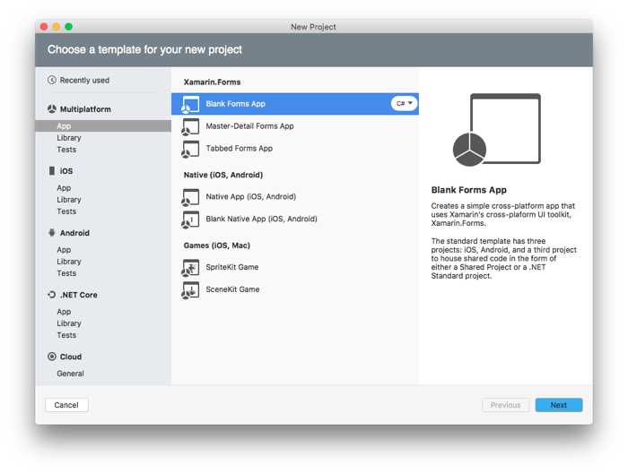
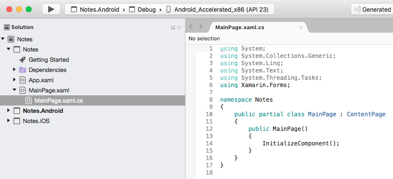
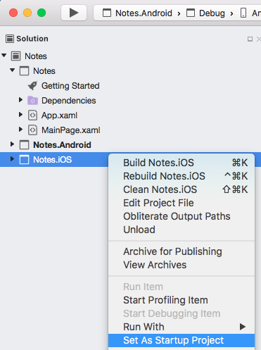

# Xamarin.Forms Quickstart

[ Download the sample](https://developer.xamarin.com/samples/xamarin-forms/GetStarted/Notes/SinglePage/)

This quickstart walks through how to create a simple cross-platform Notes application, using Xamarin.Forms, that allows you to enter a note and persist it to device storage. The final application is shown below:

[](quickstart-experimental-images/screenshots.png#lightbox "Notes Application")

::: zone pivot="windows"

## Get started with Visual Studio

1. In the **Start** screen, launch Visual Studio. This opens the start page:

    

2. In Visual Studio, click **Create new project...** to create a new project:

    

3. In the **New Project** dialog, click **Cross-Platform**, select the **Mobile App (Xamarin.Forms)** template, set the Name to **Notes**, choose a suitable location for the project and click the **OK** button:

    

    > [!IMPORTANT]
    > The C# and XAML snippets in this quickstart requires that the solution is named **Notes**. Using a different name will result in build errors when you copy code from this quickstart into the solution.

4. In the **New Cross Platform App** dialog, click **Blank App**, select **.NET Standard** as the Code Sharing Strategy, and click the **OK** button:

    

5. In **Solution Explorer**, in the **Notes** project, double-click **MainPage.xaml** to open it:

    

6. In **MainPage.xaml**, remove all of the template code and replace it with the following code:

    ```xaml
    <?xml version="1.0" encoding="utf-8"?>
    <ContentPage xmlns="http://xamarin.com/schemas/2014/forms"
                 xmlns:x="http://schemas.microsoft.com/winfx/2009/xaml"
                 x:Class="Notes.MainPage">
        <StackLayout Margin="10,35,10,10">
            <Label Text="Notes"
                   HorizontalOptions="Center"
                   FontAttributes="Bold" />
            <Editor x:Name="_editor"
                    Placeholder="Enter your note"
                    HeightRequest="100" />
            <Grid>
                <Grid.ColumnDefinitions>
                    <ColumnDefinition Width="*" />
                    <ColumnDefinition Width="*" />
                </Grid.ColumnDefinitions>
                <Button Text="Save"
                        Clicked="OnSaveButtonClicked" />
                <Button Grid.Column="1"
                        Text="Delete"
                        Clicked="OnDeleteButtonClicked"/>
            </Grid>
        </StackLayout>
    </ContentPage>
    ```

    This code declaratively defines the user interface for the page, which consists of a [`Label`](xref:Xamarin.Forms.Label) to display text, a [`Editor`](xref:Xamarin.Forms.Editor) for text input, and two [`Button`](xref:Xamarin.Forms.Button) instances that direct the application to save or delete a file. The two `Button` instances are horizontally laid out in a [`Grid`](xref:Xamarin.Forms.Grid), with the `Label`, `Editor`, and `Grid` being vertically laid out in a [`StackLayout`](xref:Xamarin.Forms.StackLayout).

    Save the changes to **MainPage.xaml** by pressing **CTRL+S**, and close the file.

7. In **Solution Explorer**, in the **Notes** project, expand **MainPage.xaml** and double-click **MainPage.xaml.cs** to open it:

    

8. In **MainPage.xaml.cs**, remove all of the template code and replace it with the following code:

    ```csharp
    using System;
    using System.IO;
    using Xamarin.Forms;

    namespace Notes
    {
        public partial class MainPage : ContentPage
        {
            string _fileName = Path.Combine(Environment.GetFolderPath(Environment.SpecialFolder.LocalApplicationData), "notes.txt");

            public MainPage()
            {
                InitializeComponent();

                if (File.Exists(_fileName))
                {
                    _editor.Text = File.ReadAllText(_fileName);
                }
            }

            void OnSaveButtonClicked(object sender, EventArgs e)
            {
                File.WriteAllText(_fileName, _editor.Text);
            }

            void OnDeleteButtonClicked(object sender, EventArgs e)
            {
                if (File.Exists(_fileName))
                {
                    File.Delete(_fileName);
                }
                _editor.Text = string.Empty;
            }
        }
    }
    ```

    This code defines a `_fileName` field, which references a file named `notes.txt` that will store note data in the local application data folder for the application. When the page constructor is executed the file is read, if it exists, and displayed in the [`Editor`](xref:Xamarin.Forms.Editor). When the **Save** [`Button`](xref:Xamarin.Forms.Button) is pressed the `OnSaveButtonClicked` event handler is executed, which saves the content of the `Editor` to the file. When the **Delete** `Button` is pressed the `OnDeleteButtonClicked` event handler is executed, which deletes the file, provided that it exists, and removes any text from the `Editor`.

    Save the changes to **MainPage.xaml.cs** by pressing **CTRL+S**, and close the file.

### Building the quickstart

1. In Visual Studio, select the **Build > Build Solution** menu item (or press F6). The solution will build and a success message will appear in the Visual Studio status bar:

      

    If there are errors, repeat the previous steps and correct any mistakes until the solution builds successfully.

2. In the Visual Studio toolbar, press the **Start** button (the triangular button that resembles a Play button) to launch the application in your chosen Android emulator:

    

    

    Enter a note and press the **Save** button.

    > [!NOTE]
    > The following steps should only be carried out if you have a [paired Mac](~/ios/get-started/installation/windows/connecting-to-mac/index.md) that meets the system requirements for Xamarin.Forms development.

3. In the Visual Studio toolbar, right-click on the **Notes.iOS** project, and select **Set as StartUp Project**.

      

4. In the Visual Studio toolbar, press the **Start** button (the triangular button that resembles a Play button) to launch the application in your chosen [iOS remote simulator](~/tools/ios-simulator/index.md):

    

    

    Enter a note and press the **Save** button.

::: zone-end
::: zone pivot="macos"

## Get started with Visual Studio for Mac

1. Launch Visual Studio for Mac, and on the start page click **New Project...** to create a new project:

    

2. In the **Choose a template for your new project** dialog, click **Multiplatform > App**, select the **Blank Forms App** template, and click the **Next** button:

    

3. In the **Configure your Blank Forms app** dialog, name the new app **Notes**, ensure that the **Use .NET Standard** radio button is selected, and click the **Next** button:    

    

4. In the **Configure your new Blank Forms app** dialog, leave the Solution and Project names set to **Notes**, choose a suitable location for the project, and click the **Create** button to create the project:

    

    > [!IMPORTANT]
    > The C# and XAML snippets in this quickstart requires that the solution and project are both named **Notes**. Using a different name will result in build errors when you copy code from this quickstart into the project.

5. In the **Solution Pad**, in the **Notes** project, double-click **MainPage.xaml** to open it:

    

6. In **MainPage.xaml**, remove all of the template code and replace it with the following code:

    ```xaml
    <?xml version="1.0" encoding="utf-8"?>
    <ContentPage xmlns="http://xamarin.com/schemas/2014/forms"
                 xmlns:x="http://schemas.microsoft.com/winfx/2009/xaml"
                 x:Class="Notes.MainPage">
        <StackLayout Margin="10,35,10,10">
            <Label Text="Notes"
                   HorizontalOptions="Center"
                   FontAttributes="Bold" />
            <Editor x:Name="_editor"
                    Placeholder="Enter your note"
                    HeightRequest="100" />
            <Grid>
                <Grid.ColumnDefinitions>
                    <ColumnDefinition Width="*" />
                    <ColumnDefinition Width="*" />
                </Grid.ColumnDefinitions>
                <Button Text="Save"
                        Clicked="OnSaveButtonClicked" />
                <Button Grid.Column="1"
                        Text="Delete"
                        Clicked="OnDeleteButtonClicked"/>
            </Grid>
        </StackLayout>
    </ContentPage>
    ```

    This code declaratively defines the user interface for the page, which consists of a [`Label`](xref:Xamarin.Forms.Label) to display text, a [`Editor`](xref:Xamarin.Forms.Editor) for text input, and two [`Button`](xref:Xamarin.Forms.Button) instances that direct the application to save or delete a file. The two `Button` instances are horizontally laid out in a [`Grid`](xref:Xamarin.Forms.Grid), with the `Label`, `Editor`, and `Grid` being vertically laid out in a [`StackLayout`](xref:Xamarin.Forms.StackLayout).

    Save the changes to **MainPage.xaml** by choosing **File > Save** (or by pressing **&#8984; + S**), and close the file.

7. In the **Solution Pad**, in the **Notes** project, expand **MainPage.xaml** and double-click **MainPage.xaml.cs** to open it:

    

8. In **MainPage.xaml.cs**, remove all of the template code and replace it with the following code:

    ```csharp
    using System;
    using System.IO;
    using Xamarin.Forms;

    namespace Notes
    {
        public partial class MainPage : ContentPage
        {
            string _fileName = Path.Combine(Environment.GetFolderPath(Environment.SpecialFolder.LocalApplicationData), "notes.txt");

            public MainPage()
            {
                InitializeComponent();

                if (File.Exists(_fileName))
                {
                    _editor.Text = File.ReadAllText(_fileName);
                }
            }

            void OnSaveButtonClicked(object sender, EventArgs e)
            {
                File.WriteAllText(_fileName, _editor.Text);
            }

            void OnDeleteButtonClicked(object sender, EventArgs e)
            {
                if (File.Exists(_fileName))
                {
                    File.Delete(_fileName);
                }
                _editor.Text = string.Empty;
            }
        }
    }
    ```

    This code defines a `_fileName` field, which references a file named `notes.txt` that will store note data in the local application data folder for the application. When the page constructor is executed the file is read, if it exists, and displayed in the [`Editor`](xref:Xamarin.Forms.Editor). When the **Save** [`Button`](xref:Xamarin.Forms.Button) is pressed the `OnSaveButtonClicked` event handler is executed, which saves the content of the `Editor` to the file. When the **Delete** `Button` is pressed the `OnDeleteButtonClicked` event handler is executed, which deletes the file, provided that it exists, and removes any text from the `Editor`.

    Save the changes to **MainPage.xaml.cs** by choosing **File > Save** (or by pressing **&#8984; + S**), and close the file.

### Building the quickstart

1. In Visual Studio for Mac, select the **Build > Build All** menu item (or press **&#8984; + B**). The projects will build and a success message will appear in the Visual Studio for Mac toolbar.

      

    If there are errors, repeat the previous steps and correct any mistakes until the projects build successfully.

2. In the **Solution Pad**, select the **Notes.iOS** project, right-click and select **Set As Startup Project**:

      

3. In the Visual Studio for Mac toolbar, press the **Start** button (the triangular button that resembles a Play button) to launch the application inside your chosen iOS Simulator:

      

      

    Enter a note and press the **Save** button.

4. In the **Solution Pad**, select the **Notes.Droid** project, right-click and select **Set As Startup Project**:

      

5. In the Visual Studio for Mac toolbar, press the **Start** button (the triangular button that resembles a Play button) to launch the application inside your chosen Android emulator:

      

    Enter a note and press the **Save** button.

::: zone-end

## Related Links

- [Notes (sample)](https://developer.xamarin.com/samples/xamarin-forms/GetStarted/Notes/SinglePage/)
